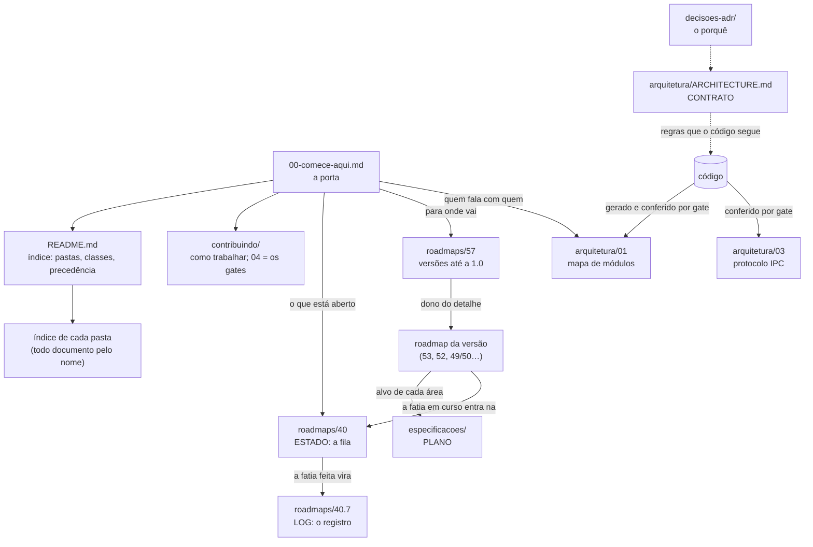

# 00 — Comece aqui

> **Para quem:** qualquer pessoa ou IA que vá ler, alterar ou revisar este
> repositório sem ter estado nas conversas anteriores. Escrito em 2026-10-01 a
> pedido do autor: "deixe tudo explícito para qualquer pessoa ou IA que queira
> colaborar". **Este arquivo não contém fatos do projeto; ele diz onde cada fato
> mora.** Se ele e o documento apontado divergirem, o apontado vence.

## 1. O projeto em quatro frases

A Kinein Vectis é uma IDE **Linux nativa** para C, C++, Rust, Python e sistemas
embarcados. Ela **orquestra** ferramentas consolidadas (clangd, rust-analyzer,
CMake, Cargo, GDB, esptool…) em vez de reimplementá-las. A interface é Qt/QML e
o trabalho é de um core Rust, em **processos separados** que conversam por
JSON-RPC em stdin/stdout. Sem telemetria, sem IA embutida, sem runtime de
plugin de terceiros — cada "não" é uma decisão registrada
([`leitura-tecnica.md`](leitura-tecnica.md) §1).

## 2. As seis regras que valem antes de qualquer outra

1. **O código e os gates são a única fonte do que existe.** Nenhum documento
   derruba uma medição. Antes de afirmar que algo falta ou existe, meça
   ([`README.md`](README.md), "Ordem de precedência").
2. **Um fato, um dono.** Nada se duplica — nem código, nem documento. Uma
   segunda implementação divide o lugar onde o bug pode estar; um segundo texto
   sobre o mesmo fato vira mentira quando só um é atualizado
   ([`ARCHITECTURE.md`](arquitetura/ARCHITECTURE.md) §8.1).
3. **Aberto para extensão, fechado para modificação — com responsabilidade.**
   Crescer acrescentando uma entrada de dados ou um módulo novo, não editando o
   mecanismo; mas **mecanismo genérico sem usuário é pior que nenhum**
   (ARCHITECTURE §8). Exemplos vivos: um contexto novo no mapa de módulos é uma
   entrada em `CONTEXTS` (`scripts/module_map.py`); um gate de ambiente novo usa
   o protocolo NÃO PROVADO sem tocar no orquestrador
   ([`contribuindo/07`](contribuindo/07-fluxo-e-responsabilidades-dos-gates.md) §1.1).
4. **Decisão do autor não se reabre por conta própria.** Ela está registrada,
   com data, no dono (a lista está no [`40`](roadmaps/40-estado-e-continuidade.md) §5).
   Proposta não é decisão: o [mapa de versões](roadmaps/57-mapa-de-versoes-ate-a-1.0.md)
   separa as duas.
5. **Toda mudança passa pelo gate**, `scripts/verificar.sh`, e todo gate novo é
   provado por mutação ([`contribuindo/04`](contribuindo/04-os-gates-que-dizem-nao.md)).
6. **Bloqueador real fura a fila.** Perda de dados, crash e bloqueio do uso
   diário vêm antes de qualquer item planejado
   ([`roadmaps/34`](roadmaps/34-depois-do-mvp.md) §7).

## 3. A arquitetura da documentação

A documentação pública tem três eixos, e todos estão descritos por inteiro no
índice, [`README.md`](README.md):

- **Pasta = assunto.** `arquitetura/` (como o código é), `roadmaps/` (estado,
  registro, versões e planos), `especificacoes/` (o alvo do produto),
  `contribuindo/` (como trabalhar), `build/`, `integracoes/`, `seguranca/`,
  `decisoes-adr/`, `pesquisa/`, `iconografia/` — a árvore com o que cada uma
  guarda está em [`README.md`](README.md) §Estrutura, e cada pasta tem o
  próprio índice, que cita **todo** documento dela pelo nome.
- **Classe = o que acontece se o documento envelhecer.** CONTRATO (regra; não
  muda sem decisão), ESTADO (tem de ser verdade hoje), PLANO (alvo; pode
  divergir), LOG (registro datado; nunca se reescreve) e PESQUISA (hipótese;
  não autoriza nada) — [`README.md`](README.md) §"As quatro classes".
- **Precedência = quem vence num conflito.** O código e os gates, depois o
  contrato, o estado, o plano, o log e a pesquisa —
  [`README.md`](README.md) §"Ordem de precedência".

Como os documentos se apoiam uns nos outros:

Duas regras mantêm isso de pé, e as duas têm gate: **um fato mora num
documento só** (os outros apontam para ele) e **a documentação pública só cita
documentação pública** (§6).

## 4. Onde mora cada fato

| Pergunta | Dono (leia este) |
| --- | --- |
| O que o projeto é, medido? | [`leitura-tecnica.md`](leitura-tecnica.md) |
| Quais pastas existem e o que há em cada uma? | [`arquitetura/02-estrutura-do-repositorio.md`](arquitetura/02-estrutura-do-repositorio.md) |
| **Quem fala com quem, por quê e como?** | [`arquitetura/01-mapa-de-modulos.md`](arquitetura/01-mapa-de-modulos.md) — gerado do código, com um diagrama por contexto |
| Quais são as regras de engenharia (camadas, onde pôr código novo, anti-padrões)? | [`arquitetura/ARCHITECTURE.md`](arquitetura/ARCHITECTURE.md) |
| Qual a forma de cada mensagem UI ↔ core? | [`arquitetura/03-protocolo-ipc.md`](arquitetura/03-protocolo-ipc.md) |
| Como o processo sobe e as mensagens circulam? | [`arquitetura/04-boot-e-comunicacao.md`](arquitetura/04-boot-e-comunicacao.md) |
| O que está aberto agora, e as decisões que não se reabrem? | [`roadmaps/40-estado-e-continuidade.md`](roadmaps/40-estado-e-continuidade.md) |
| O que foi feito, quando, e com que prova? | [`roadmaps/40.7-registro-das-entregas.md`](roadmaps/40.7-registro-das-entregas.md) |
| **Quais versões existem até a 1.0, e o que é decidido ou proposta?** | [`roadmaps/57-mapa-de-versoes-ate-a-1.0.md`](roadmaps/57-mapa-de-versoes-ate-a-1.0.md) |
| O plano da versão em curso? | [`roadmaps/53-arquitetura-executavel-da-0.3.6.md`](roadmaps/53-arquitetura-executavel-da-0.3.6.md) |
| A visão-alvo de cada área do produto? | [`especificacoes/README.md`](especificacoes/README.md) — alvo, não estado |
| Por que uma decisão de arquitetura foi tomada? | [`decisoes-adr/`](decisoes-adr/README.md) |
| Como montar o ambiente e compilar? | [`contribuindo/02-preparar-o-ambiente.md`](contribuindo/02-preparar-o-ambiente.md), [`build/comandos-de-build-e-verificacao.md`](build/comandos-de-build-e-verificacao.md) |
| O que cada gate mede e como ler o "não"? | [`contribuindo/04-os-gates-que-dizem-nao.md`](contribuindo/04-os-gates-que-dizem-nao.md) |
| Convenções de código, testes e commits? Nomes de identificador? | [`contribuindo/08`](contribuindo/08-convencoes-codigo-testes-commits.md), [`contribuindo/09`](contribuindo/09-glossario-de-identificadores.md) |
| Como usar a IDE (usuário final)? | [`manual.md`](manual.md), [`tutorial.md`](tutorial.md) |

## 5. Por onde começar, conforme o que você veio fazer

**Entender o projeto (30 minutos).** `leitura-tecnica.md` §1–§3 → o nível 1 e o
caminho de um pedido em `arquitetura/01-mapa-de-modulos.md` → o mapa de versões.

**Fazer uma mudança (uma fatia).**

1. Leia o estado: `roadmaps/40` §4 (o que está aberto) e o dono da versão em curso.
2. Ache onde a mudança mora: o contexto dela em `arquitetura/01-mapa-de-modulos.md`
   e o "onde colocar código novo" do `ARCHITECTURE.md` §5. **Se já existe um
   mecanismo para isso, estenda-o** (ARCHITECTURE §8.1).
3. Siga o ritual de [`contribuindo/03-o-ritual-de-uma-fatia.md`](contribuindo/03-o-ritual-de-uma-fatia.md).
4. Rode `scripts/verificar.sh` (antes de release, com `--estrito`).
5. Registre: estado no `40`, entrega datada no `40.7`, decisão nova no dono dela.

**Se você é uma IA.** Tudo acima, e mais: leia
[`contribuindo/05-com-um-agente-de-ia.md`](contribuindo/05-com-um-agente-de-ia.md).
Três erros já custaram fatias inteiras a este projeto, e estão documentados para
não se repetirem: implementar a partir de uma especificação **cancelada**
(ADR-0005), confiar num número de documento sem medir (`leitura-tecnica.md`,
nota do topo), e ligar um sinal no lugar errado — o build passa e a função
deixa de funcionar em silêncio (ARCHITECTURE §8).

## 6. Só o que é público

Tudo o que é preciso para colaborar está neste repositório. O autor guarda
esboços fora dele, e **nenhum documento versionado aponta para eles**: a
documentação pública só se refere a documentação pública (decisão do autor,
2026-10-01; o `scripts/verificar-links-docs.sh` reprova citação de caminho
interno). Se um texto parecer depender de algo que você não encontra aqui, é
defeito de documentação — abra um issue.
