# 01 — Mapa de módulos: quem fala com quem, por quê e como

> **GERADO** por `scripts/module_map.py` a partir do código — não edite à mão.
> O porquê de cada aresta e de cada contexto mora nas tabelas `EDGES` e `CONTEXTS`
> do script; o resto (controllers, métodos, handlers, módulos, ciclos) é **medido**.
> O gate `scripts/module_map.py --check` reprova se este documento divergir do código
> ou se surgir um ciclo novo entre módulos do core.

## Como ler

- **Nível 1** mostra as pastas do repositório e as únicas formas pelas quais elas se
  comunicam. Tudo o que não está ali **não acontece** (a QML não fala com o core; o
  core não conhece a UI).
- **O caminho de um pedido** é o mesmo em todos os contextos: o que muda é o domínio.
- **Nível 2** é o grafo interno do `kinein-core`, domínio a domínio.
- **Contextos** repetem o caminho para cada área da IDE, com os arquivos reais de cada
  etapa e o que cada um diz de si (o comentário de cabeçalho dele).

## Nível 1 — as pastas do repositório

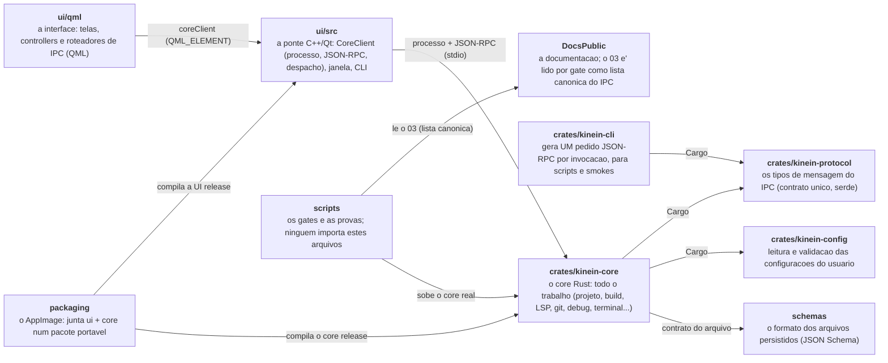

| De | Para | Como | Por quê |
| --- | --- | --- | --- |
| `ui/qml` | `ui/src` | propriedade `coreClient` (QML_ELEMENT) chamada pelos roteadores de `ui/qml/ipc` | a QML nunca fala processo nem JSON: so' o CoreClient sabe que o core existe |
| `ui/src` | `crates/kinein-core` | processo filho (QProcess); JSON-RPC 2.0 por linha em stdin/stdout | a UI nao linka Rust: um crash do core nao derruba a janela, e o core reinicia |
| `crates/kinein-core` | `crates/kinein-protocol` | dependencia Cargo | o formato de cada mensagem tem um dono so', compartilhado com a CLI |
| `crates/kinein-core` | `crates/kinein-config` | dependencia Cargo | ler e validar configuracao nao e' trabalho de cada dominio |
| `crates/kinein-cli` | `crates/kinein-protocol` | dependencia Cargo | a CLI monta pedidos com os MESMOS tipos que o core le |
| `crates/kinein-core` | `schemas` | o formato persistido e' documentado pelo schema | arquivo que o usuario guarda precisa de contrato fora do codigo |
| `scripts` | `DocsPublic` | o verificar_fiacao_ipc.py le o 03-protocolo-ipc.md | o documento do protocolo nao pode divergir dos metodos roteados |
| `scripts` | `crates/kinein-core` | os gates sobem o binario do core e falam JSON-RPC com ele | prova contra o core REAL, nao contra um falso |
| `packaging` | `ui/src` | o empacotador compila a UI release e a poe no AppDir | o pacote e' o que o usuario roda; tem de ser o mesmo codigo |
| `packaging` | `crates/kinein-core` | o empacotador compila o core release e o poe ao lado da UI | UI e core viajam juntos e na mesma versao |

## O caminho de um pedido (todos os contextos)

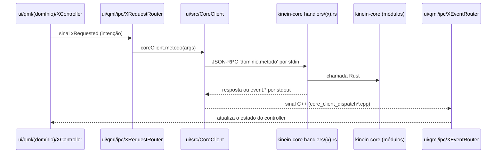

Por que assim: o **controller** guarda estado e intenção e não sabe que existe IPC;
o **RequestRouter** é o único que chama o `CoreClient` naquele domínio (uma guarda
cross-domain, quando existe, mora nele e só nele); o **EventRouter** é o espelho da
volta. Trocar o transporte muda o `CoreClient`, e nenhuma tela.

Medido: 183 métodos IPC roteados pelo core.

## Nível 2 — os domínios do `kinein-core`

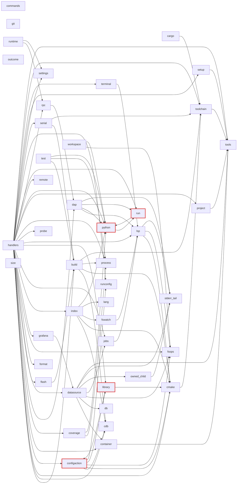

44 módulos, 86 dependências (`crate::<módulo>` fora de testes). Em vermelho, os que estão num ciclo.

### Ciclos

- **configaction ↔ library** — dívida medida em 2026-10-01: a biblioteca propoe acoes, e as acoes aplicam bibliotecas
- **python ↔ run** — dívida medida em 2026-10-01: o run pede o interpretador ao python, e o python executa pelo run

### O que cada domínio diz de si

| Domínio | Depende de | Cabeçalho |
| --- | --- | --- |
| `build` | cdb, cmake, process, toolchain | Build execution with streamed output and structured diagnostics. |
| `cargo` | toolchain | Servico Cargo: |
| `cdb` | — | Descoberta e diagnóstico da compilation database do C/C++. |
| `cmake` | toolchain | Servico CMake: |
| `commands` | — | Command descriptors advertised to the UI (command palette, menus, shortcuts). |
| `configaction` | cdb, cmake, fsops, library, runconfig | Configuration Actions: |
| `container` | tools | Containers como dominio NATIVO: |
| `coverage` | process, python | Cobertura de linhas dos testes (D8 do roadmaps/41, P5 do 40 §4.1, 2026-09-17), com o LCOV como lingua comum. |
| `dap` | lsp, python, run, stderr_tail | Subsistema de debug: |
| `datasource` | container, db, fsops, jobs, owned_child, stderr_tail, tools | Fontes de dados: |
| `db` | — | Persistência local em SQLite — rede de segurança de dados (DocsPublic/seguranca/23). |
| `flash` | build | Gravar como CONFIGURACAO DE EXECUCAO (E4 do integracoes/38 §6; decisao do autor em 2026-09-11: |
| `format` | — | Buffer formatting by orchestrating the project's own formatters. |
| `fsops` | — | File system operations confined to the open workspace root. |
| `fswatch` | lsp | Debounced, workspace-confined observation of external file-system changes. |
| `git` | — | Git orquestrado sobre o binario git. |
| `grafana` | datasource | Observabilidade: |
| `handlers` | build, cdb, cmake, configaction, container, coverage, dap, datasource, flash, format, fsops, grafana, index, jobs, library, lsp, probe, process, project, python, remote, rpc, run, runconfig, serial, settings, setup, terminal, toolchain, tools | Handlers for the build / quality / test runners, all async cancelable jobs. |
| `index` | cdb, cmake, fswatch, lang, python | O indice proprio do projeto INTEIRO: |
| `jobs` | lsp | Job system: |
| `lang` | — | Incremental local syntax intelligence backed by Tree-sitter. |
| `library` | cmake, configaction | Bibliotecas C/C++ curadas: |
| `lsp` | cmake, fsops, stderr_tail | Subsistema LSP: |
| `outcome` | — | O desfecho de um pedido (RequestOutcome) e o erro dos lacos de IO (CoreError). |
| `owned_child` | stderr_tail | A base prova o que diz: |
| `probe` | — | Sondas de debug conectadas: |
| `process` | — | Synchronous line streaming for child processes. |
| `project` | tools | O MODELO do projeto embarcado — pilar 0 do roadmaps/42 (2026-09-12). |
| `python` | run | O dominio python: |
| `remote` | — | O alvo Linux por SSH como recurso do projeto (P6 do roadmaps/42, fatia 1, 2026-09-17): |
| `rpc` | dap | JSON-RPC helpers shared by the request handlers: |
| `run` | python | O que "Executar" roda, e como se mostra. |
| `runconfig` | — | Run configurations por workspace (.kinein/runconfigs.json). |
| `runtime` | rpc, settings | Habilitacao dos servicos externos e configuracao dos servidores LSP do Core. |
| `serial` | build, toolchain | Portas seriais USB: |
| `settings` | — | Settings persistidos em dois níveis (settings.*). |
| `setup` | tools | Como instalar o que falta — passo a passo OFICIAL, para a distro detectada. |
| `size` | — | O tamanho de um ELF: |
| `stderr_tail` | — | O stderr de um processo filho de LONGA VIDA (adaptador DAP, servidor de debug, servidor LSP): |
| `terminal` | lsp | Terminal profissional: |
| `test` | build, process, python | Test execution with streamed, per-case results. |
| `toolchain` | tools | Toolchain: |
| `tools` | — | External tool detection. |
| `workspace` | fsops, python | Workspace opening, project kind detection, and metadata persistence. |

## Cobertura: todo método IPC tem um lugar

Dos 183 métodos roteados pelo core, 153 seguem o caminho padrão
e estão num contexto abaixo. Os outros 30 estão aqui,
nomeados, para nada ficar invisível:

**Chamados direto da QML, sem RequestRouter** (fora do padrão — dívida medida em
2026-10-01: o composition root fala com o `CoreClient` no lugar do roteador do domínio):

| Método | Quem chama |
| --- | --- |
| `build.run` | `ui/qml/app/AppDomains.qml` |
| `cargo.check` | `ui/qml/command/CommandDispatcher.qml` |
| `cargo.metadata` | `ui/qml/Main.qml`, `ui/qml/command/CommandDispatcher.qml` |
| `coverage.run` | `ui/qml/app/AppDomains.qml` |
| `environment.scan` | `ui/qml/Main.qml` |
| `format.capabilities` | `ui/qml/Main.qml` |
| `lsp.restart` | `ui/qml/command/CommandDispatcher.qml`, `ui/qml/shell/ShellHeaderHost.qml` |
| `quality.run` | `ui/qml/app/AppDomains.qml` |
| `run.capabilities` | `ui/qml/Main.qml` |
| `settings.get` | `ui/qml/Main.qml`, `ui/qml/app/AppDomains.qml` |
| `settings.set` | `ui/qml/app/AppDomains.qml` |
| `test.discover` | `ui/qml/app/AppDomains.qml` |
| `test.run` | `ui/qml/app/AppDomains.qml` |
| `tools.detect` | `ui/qml/Main.qml`, `ui/qml/app/AppDomains.qml`, `ui/qml/command/CommandDispatcher.qml`, `ui/qml/shell/ShellHeaderHost.qml` |
| `workspace.close` | `ui/qml/Main.qml`, `ui/qml/command/CommandDispatcher.qml`, `ui/qml/shell/ShellHeaderHost.qml` |
| `workspace.createFolder` | `ui/qml/Main.qml` |
| `workspace.createProject` | `ui/qml/Main.qml` |
| `workspace.recent.clear` | `ui/qml/app/AppDomains.qml` |
| `workspace.recent.list` | `ui/qml/app/AppDomains.qml` |
| `workspace.recent.pin` | `ui/qml/app/AppDomains.qml` |
| `workspace.recent.remove` | `ui/qml/app/AppDomains.qml` |

**Enviados só pela ponte C++** (ciclo de vida do processo, respostas encadeadas): `cmake.presets.list`, `cmake.status`, `core.ping`, `remote.status`, `runConfig.list`, `tools.status`.

**Sem cliente na UI** (a CLI, os gates ou nenhum): `core.shutdown`, `job.list`, `workspace.status`.

## Contextos

Cada contexto é o caminho de um pedido aplicado a uma área da IDE, com os arquivos
reais de cada etapa. Ida em linha cheia, volta (resposta e eventos) tracejada.

### Workspace e arvore do projeto

Abrir uma pasta e mexer em arquivos e' o unico caminho de escrita em disco fora do editor: passa pelo core para que a vigilancia de arquivos, os rascunhos e o indice vejam a mesma mudanca.

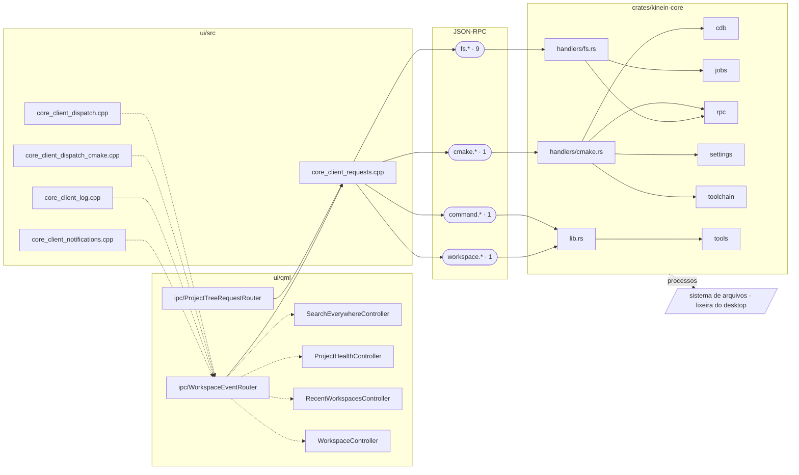

| Etapa | Arquivo | O que ele diz de si |
| --- | --- | --- |
| controller | `ui/qml/search/SearchEverywhereController.qml` | SEARCH EVERYWHERE: |
| controller | `ui/qml/workspace/ProjectHealthController.qml` |  |
| controller | `ui/qml/workspace/RecentWorkspacesController.qml` | A lista de recentes como a tela inicial a mostra (Etapa 2 F7, 2026-09-18): |
| controller | `ui/qml/workspace/WorkspaceController.qml` |  |
| roteador | `ui/qml/ipc/ProjectTreeRequestRouter.qml` | Leva ao core o que a arvore de projeto pede: |
| roteador | `ui/qml/ipc/WorkspaceEventRouter.qml` |  |
| ponte C++ | `ui/src/core_client_dispatch.cpp` |  |
| ponte C++ | `ui/src/core_client_dispatch_cmake.cpp` | Dispatch do dominio CMake/build (ARCHITECTURE.md §5). |
| ponte C++ | `ui/src/core_client_log.cpp` |  |
| ponte C++ | `ui/src/core_client_notifications.cpp` | O que o core manda SEM SER PERGUNTADO: |
| ponte C++ | `ui/src/core_client_requests.cpp` |  |
| handler Rust | `crates/kinein-core/src/handlers/cmake.rs` | Handlers for cmake.* requests (impl Core): |
| handler Rust | `crates/kinein-core/src/handlers/fs.rs` | Filesystem request router and mutation handlers. |
| handler Rust | `crates/kinein-core/src/lib.rs` | Rust core for Kinein Vectis. |

Métodos IPC (12): `cmake.configure`, `command.list`, `fs.copy`, `fs.createDirectory`, `fs.createFile`, `fs.delete`, `fs.list`, `fs.read`, `fs.rename`, `fs.transferBatch`, `fs.trash`, `workspace.browse`.

### Editor e inteligencia de linguagem (LSP)

O editor nao conhece servidor de linguagem: pede ao core, que sobe um servidor por linguagem, traduz LSP para o protocolo da IDE e devolve diagnosticos e simbolos.

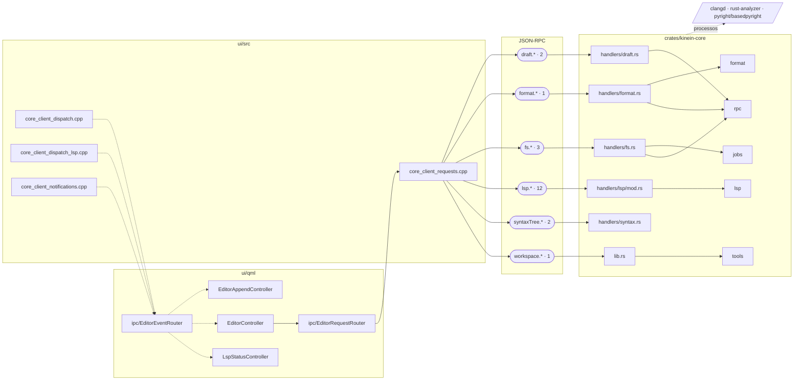

| Etapa | Arquivo | O que ele diz de si |
| --- | --- | --- |
| controller | `ui/qml/editor/EditorAppendController.qml` | Append a prepared instruction using native editing, after opening its file. |
| controller | `ui/qml/editor/EditorController.qml` |  |
| controller | `ui/qml/workspace/LspStatusController.qml` | O ESTADO DOS SERVIDORES DE LINGUAGEM para a barra de status (Etapa 2, F2). |
| roteador | `ui/qml/ipc/EditorRequestRouter.qml` | Espelho do EditorEventRouter. |
| roteador | `ui/qml/ipc/EditorEventRouter.qml` |  |
| ponte C++ | `ui/src/core_client_dispatch.cpp` |  |
| ponte C++ | `ui/src/core_client_dispatch_lsp.cpp` | Dispatch do dominio LSP (ARCHITECTURE.md §5): |
| ponte C++ | `ui/src/core_client_notifications.cpp` | O que o core manda SEM SER PERGUNTADO: |
| ponte C++ | `ui/src/core_client_requests.cpp` |  |
| handler Rust | `crates/kinein-core/src/handlers/draft.rs` | Handlers de draft.* (autosave/rascunhos) — rede de segurança (DocsPublic/seguranca/23). |
| handler Rust | `crates/kinein-core/src/handlers/format.rs` | Handlers for format.* requests (impl Core): |
| handler Rust | `crates/kinein-core/src/handlers/fs.rs` | Filesystem request router and mutation handlers. |
| handler Rust | `crates/kinein-core/src/handlers/lsp/mod.rs` | Handlers for lsp.* requests (impl Core). |
| handler Rust | `crates/kinein-core/src/handlers/syntax.rs` | Handlers for local incremental syntax intelligence (syntaxTree.*). |
| handler Rust | `crates/kinein-core/src/lib.rs` | Rust core for Kinein Vectis. |

Métodos IPC (21): `draft.clear`, `draft.save`, `format.text`, `fs.read`, `fs.readExternal`, `fs.write`, `lsp.applyCodeAction`, `lsp.codeActions`, `lsp.completion`, `lsp.definition`, `lsp.didChange`, `lsp.hover`, `lsp.references`, `lsp.rename`, `lsp.semanticTokens`, `lsp.switchSourceHeader`, `lsp.workspaceEdit.apply`, `lsp.workspaceEdit.cancel`, `syntaxTree.indent`, `syntaxTree.update`, `workspace.saveSession`.

### Busca, indice e simbolos

Buscar e substituir mexe em disco; o indice e' do core para responder sem reler a arvore. O roteador da busca conhece o editor: substituir com arquivo sujo perderia edicao.

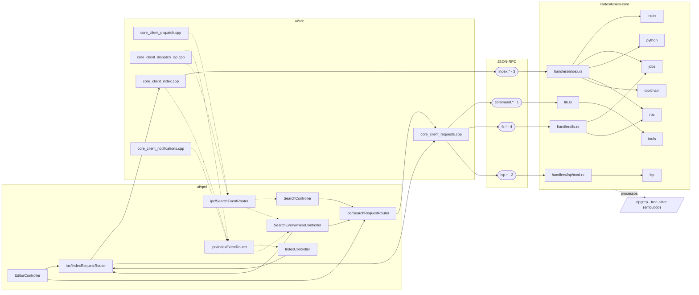

| Etapa | Arquivo | O que ele diz de si |
| --- | --- | --- |
| controller | `ui/qml/editor/EditorController.qml` |  |
| controller | `ui/qml/index/IndexController.qml` | Estado do indice do projeto INTEIRO (pilar 0 do roadmaps/42, decisao do autor em 2026-09-12: |
| controller | `ui/qml/search/SearchController.qml` | BUSCA E SUBSTITUIÇÃO NO PROJETO — o painel de baixo. |
| controller | `ui/qml/search/SearchEverywhereController.qml` | SEARCH EVERYWHERE: |
| roteador | `ui/qml/ipc/SearchRequestRouter.qml` | Espelho do SearchEventRouter: |
| roteador | `ui/qml/ipc/SearchEventRouter.qml` | Resultados de busca, substituicao e Search Everywhere -> os DOIS donos. |
| roteador | `ui/qml/ipc/IndexRequestRouter.qml` | Espelho do IndexEventRouter: |
| roteador | `ui/qml/ipc/IndexEventRouter.qml` | O que o core responde/emite de index.* -> IndexController (os totais) e SearchEverywhereController (os simbolos do #nome, antes do LSP responder). |
| ponte C++ | `ui/src/core_client_dispatch.cpp` |  |
| ponte C++ | `ui/src/core_client_dispatch_lsp.cpp` | Dispatch do dominio LSP (ARCHITECTURE.md §5): |
| ponte C++ | `ui/src/core_client_index.cpp` | O indice do projeto INTEIRO no lado da UI (pilar 0 do roadmaps/42, decisao do autor em 2026-09-12): |
| ponte C++ | `ui/src/core_client_notifications.cpp` | O que o core manda SEM SER PERGUNTADO: |
| ponte C++ | `ui/src/core_client_requests.cpp` |  |
| handler Rust | `crates/kinein-core/src/handlers/fs.rs` | Filesystem request router and mutation handlers. |
| handler Rust | `crates/kinein-core/src/handlers/index.rs` | Handler for index.* requests (impl Core) — o indice do projeto inteiro (pilar 0 do roadmaps/42, decisao do autor em 2026-09-12). |
| handler Rust | `crates/kinein-core/src/handlers/lsp/mod.rs` | Handlers for lsp.* requests (impl Core). |
| handler Rust | `crates/kinein-core/src/lib.rs` | Rust core for Kinein Vectis. |

Métodos IPC (10): `command.list`, `fs.findFiles`, `fs.read`, `fs.replace`, `fs.search`, `index.context`, `index.status`, `index.symbols`, `lsp.documentSymbols`, `lsp.workspaceSymbols`.

### Git

O core executa o git do sistema. O roteador e' a unica aresta do git para o editor: checkout, branch, pull e stash nao rodam com arquivo modificado.

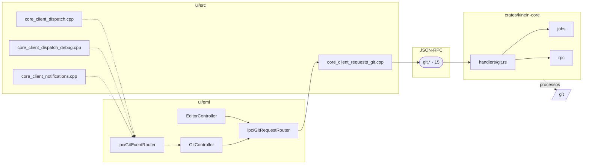

| Etapa | Arquivo | O que ele diz de si |
| --- | --- | --- |
| controller | `ui/qml/editor/EditorController.qml` |  |
| controller | `ui/qml/git/GitController.qml` | Estado git da UI (fatia M3.1): |
| roteador | `ui/qml/ipc/GitRequestRouter.qml` | Espelho do GitEventRouter: |
| roteador | `ui/qml/ipc/GitEventRouter.qml` | Resultado do git.status → GitController, e os momentos que a UI já conhece como "o status pode ter mudado" (save e fs-ops) → refresh. |
| ponte C++ | `ui/src/core_client_dispatch.cpp` |  |
| ponte C++ | `ui/src/core_client_dispatch_debug.cpp` | Dispatch do dominio DEBUG (ARCHITECTURE.md §5): |
| ponte C++ | `ui/src/core_client_notifications.cpp` | O que o core manda SEM SER PERGUNTADO: |
| ponte C++ | `ui/src/core_client_requests_git.cpp` | Dominio GIT no lado da UI: |
| handler Rust | `crates/kinein-core/src/handlers/git.rs` | Handlers for git.* requests (impl Core). |

Métodos IPC (15): `git.blame`, `git.branchCreate`, `git.branches`, `git.checkout`, `git.commit`, `git.commitDiff`, `git.discard`, `git.fileDiff`, `git.log`, `git.pull`, `git.push`, `git.stage`, `git.stash`, `git.status`, `git.unstage`.

### Executar, terminal, build e testes

Toda execucao e' uma sessao de terminal do core (PTY), e todo trabalho longo e' um Job: a UI so' recebe o render e os eventos, e cancelar e' um pedido como outro qualquer.

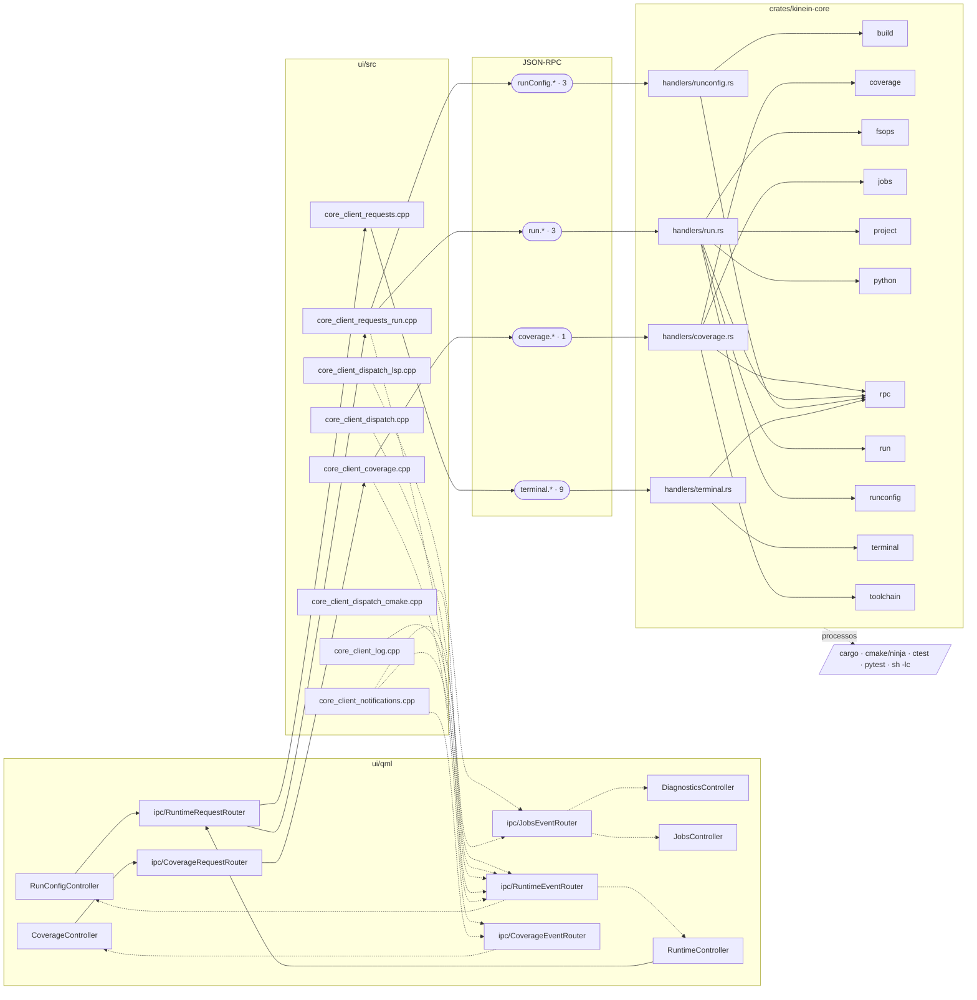

| Etapa | Arquivo | O que ele diz de si |
| --- | --- | --- |
| controller | `ui/qml/coverage/CoverageController.qml` | A COBERTURA dos testes na tela (D8 do roadmaps/41, 2026-09-17): |
| controller | `ui/qml/diagnostics/DiagnosticsController.qml` | Store de diagnósticos por arquivo (fatia T6). |
| controller | `ui/qml/jobs/JobsController.qml` |  |
| controller | `ui/qml/runtime/RunConfigController.qml` | Configuracoes de execucao salvas: |
| controller | `ui/qml/runtime/RuntimeController.qml` |  |
| roteador | `ui/qml/ipc/RuntimeRequestRouter.qml` | Espelho do RuntimeEventRouter: |
| roteador | `ui/qml/ipc/RuntimeEventRouter.qml` |  |
| roteador | `ui/qml/ipc/JobsEventRouter.qml` |  |
| roteador | `ui/qml/ipc/CoverageRequestRouter.qml` | Espelho do CoverageEventRouter: |
| roteador | `ui/qml/ipc/CoverageEventRouter.qml` | O que o core responde/emite de coverage.* -> CoverageController. |
| ponte C++ | `ui/src/core_client_coverage.cpp` | A COBERTURA dos testes no lado da UI (D8 do roadmaps/41, 2026-09-17): |
| ponte C++ | `ui/src/core_client_dispatch.cpp` |  |
| ponte C++ | `ui/src/core_client_dispatch_cmake.cpp` | Dispatch do dominio CMake/build (ARCHITECTURE.md §5). |
| ponte C++ | `ui/src/core_client_dispatch_lsp.cpp` | Dispatch do dominio LSP (ARCHITECTURE.md §5): |
| ponte C++ | `ui/src/core_client_log.cpp` |  |
| ponte C++ | `ui/src/core_client_notifications.cpp` | O que o core manda SEM SER PERGUNTADO: |
| ponte C++ | `ui/src/core_client_requests.cpp` |  |
| ponte C++ | `ui/src/core_client_requests_run.cpp` | Dominio RUN no lado da UI: |
| handler Rust | `crates/kinein-core/src/handlers/coverage.rs` | Handlers de coverage.* (impl Core). |
| handler Rust | `crates/kinein-core/src/handlers/run.rs` | Handlers for run.* requests (impl Core). |
| handler Rust | `crates/kinein-core/src/handlers/runconfig.rs` | Handlers for runConfig.* requests (impl Core): |
| handler Rust | `crates/kinein-core/src/handlers/terminal.rs` | Handlers for terminal.* requests (impl Core). |

Métodos IPC (16): `coverage.lines`, `run.script`, `run.start`, `run.stop`, `runConfig.delete`, `runConfig.save`, `runConfig.setActive`, `terminal.clearScrollback`, `terminal.close`, `terminal.copySelection`, `terminal.input`, `terminal.mouse`, `terminal.open`, `terminal.resize`, `terminal.scroll`, `terminal.selectAll`.

### Depuracao (DAP)

O core e' o cliente DAP: sobe o adaptador, guarda a sessao e manda para a UI frames, variaveis e paradas ja' no formato da IDE.

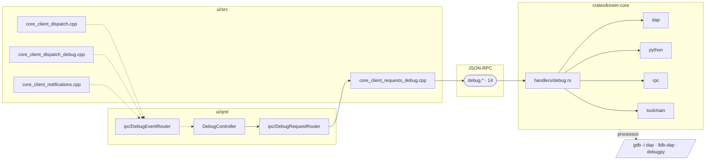

| Etapa | Arquivo | O que ele diz de si |
| --- | --- | --- |
| controller | `ui/qml/debug/DebugController.qml` | Estado da sessao de debug e dos breakpoints na UI (fatia M2.5b). |
| roteador | `ui/qml/ipc/DebugRequestRouter.qml` | Espelho do DebugEventRouter: |
| roteador | `ui/qml/ipc/DebugEventRouter.qml` | Roteia eventos de debug do CoreClient para o DebugController. |
| ponte C++ | `ui/src/core_client_dispatch.cpp` |  |
| ponte C++ | `ui/src/core_client_dispatch_debug.cpp` | Dispatch do dominio DEBUG (ARCHITECTURE.md §5): |
| ponte C++ | `ui/src/core_client_notifications.cpp` | O que o core manda SEM SER PERGUNTADO: |
| ponte C++ | `ui/src/core_client_requests_debug.cpp` | Dominio de DEBUG no lado da UI: |
| handler Rust | `crates/kinein-core/src/handlers/debug.rs` | Handlers for debug.* requests (impl Core). |

Métodos IPC (14): `debug.continue`, `debug.disassemble`, `debug.evaluate`, `debug.next`, `debug.pause`, `debug.readMemory`, `debug.scopes`, `debug.setBreakpoints`, `debug.stackTrace`, `debug.start`, `debug.stepIn`, `debug.stepOut`, `debug.stop`, `debug.variables`.

### Embarcados: sonda, serial, gravacao

Gravar e monitorar passam pelo mesmo caminho de Executar (configuracao de execucao): a IDE compoe a linha da ferramenta oficial e nunca grava sem pedido.

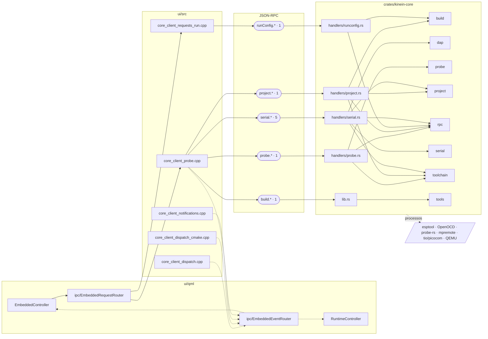

| Etapa | Arquivo | O que ele diz de si |
| --- | --- | --- |
| controller | `ui/qml/embedded/EmbeddedController.qml` | Estado do painel de embarcados (roadmaps/35 §5.7, fatia 1 — o FIO). |
| controller | `ui/qml/runtime/RuntimeController.qml` |  |
| roteador | `ui/qml/ipc/EmbeddedRequestRouter.qml` | Espelho do EmbeddedEventRouter: |
| roteador | `ui/qml/ipc/EmbeddedEventRouter.qml` | O que o core responde de probe.*, build.size e serial.* -> EmbeddedController. |
| ponte C++ | `ui/src/core_client_dispatch.cpp` |  |
| ponte C++ | `ui/src/core_client_dispatch_cmake.cpp` | Dispatch do dominio CMake/build (ARCHITECTURE.md §5). |
| ponte C++ | `ui/src/core_client_notifications.cpp` | O que o core manda SEM SER PERGUNTADO: |
| ponte C++ | `ui/src/core_client_probe.cpp` | Dominio de embarcados no lado da UI: |
| ponte C++ | `ui/src/core_client_requests_run.cpp` | Dominio RUN no lado da UI: |
| handler Rust | `crates/kinein-core/src/handlers/probe.rs` | Handler for probe.* requests (impl Core). |
| handler Rust | `crates/kinein-core/src/handlers/project.rs` | Handler for project.* requests (impl Core) — o MODELO do projeto embarcado (pilar 0 do roadmaps/42). |
| handler Rust | `crates/kinein-core/src/handlers/runconfig.rs` | Handlers for runConfig.* requests (impl Core): |
| handler Rust | `crates/kinein-core/src/handlers/serial.rs` | Handler for serial.* requests (impl Core). |
| handler Rust | `crates/kinein-core/src/lib.rs` | Rust core for Kinein Vectis. |

Métodos IPC (9): `build.size`, `probe.list`, `project.model`, `runConfig.flashProposal`, `serial.access`, `serial.files`, `serial.identify`, `serial.list`, `serial.monitor`.

### Toolchains e kits

O kit diz qual compilador, sysroot e alvo valem; o core detecta, explica a origem e nunca 'corrige' sozinho.

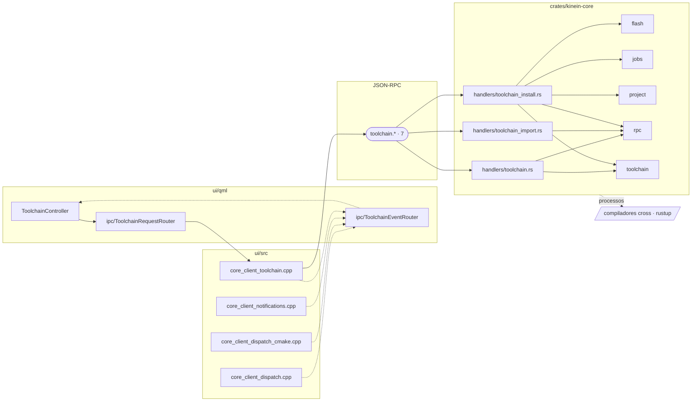

| Etapa | Arquivo | O que ele diz de si |
| --- | --- | --- |
| controller | `ui/qml/toolchain/ToolchainController.qml` | Estado da toolchain do workspace (roadmap 30, etapa 5). |
| roteador | `ui/qml/ipc/ToolchainRequestRouter.qml` | Espelho do ToolchainEventRouter: |
| roteador | `ui/qml/ipc/ToolchainEventRouter.qml` | O que o core responde de toolchain.* -> ToolchainController. |
| ponte C++ | `ui/src/core_client_dispatch.cpp` |  |
| ponte C++ | `ui/src/core_client_dispatch_cmake.cpp` | Dispatch do dominio CMake/build (ARCHITECTURE.md §5). |
| ponte C++ | `ui/src/core_client_notifications.cpp` | O que o core manda SEM SER PERGUNTADO: |
| ponte C++ | `ui/src/core_client_toolchain.cpp` | Dominio da toolchain no lado da UI: |
| handler Rust | `crates/kinein-core/src/handlers/toolchain.rs` | Handlers for toolchain.* requests (impl Core): |
| handler Rust | `crates/kinein-core/src/handlers/toolchain_import.rs` | Handlers do gerenciador de toolchain que LE o disco (impl Core). |
| handler Rust | `crates/kinein-core/src/handlers/toolchain_install.rs` | Handlers do provedor de instalacao de toolchain (impl Core). |

Métodos IPC (7): `toolchain.get`, `toolchain.importKit`, `toolchain.inspectSysroot`, `toolchain.install`, `toolchain.installable`, `toolchain.set`, `toolchain.setKit`.

### Remote SSH

O alvo remoto e' espelhado e comandado pelo core; o resultado de `remote.command` vai para o dono certo (configuracao de execucao, kit ou terminal).

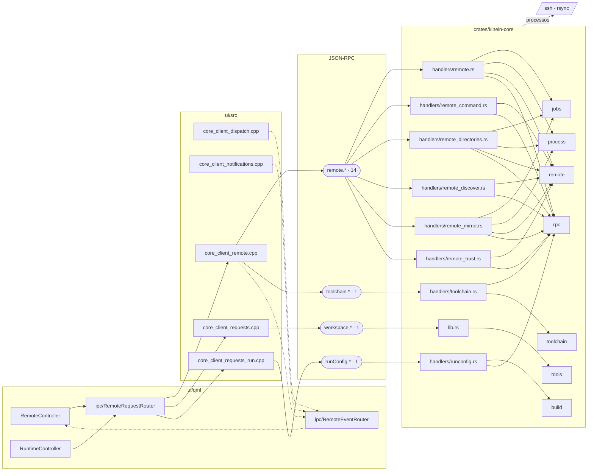

| Etapa | Arquivo | O que ele diz de si |
| --- | --- | --- |
| controller | `ui/qml/remote/RemoteController.qml` | Estado do ALVO LINUX POR SSH (P6 fatia 1 do roadmaps/42, 2026-09-17): |
| controller | `ui/qml/runtime/RuntimeController.qml` |  |
| roteador | `ui/qml/ipc/RemoteRequestRouter.qml` | Espelho do RemoteEventRouter: |
| roteador | `ui/qml/ipc/RemoteEventRouter.qml` | O que o core responde/emite de remote.* -> RemoteController. |
| ponte C++ | `ui/src/core_client_dispatch.cpp` |  |
| ponte C++ | `ui/src/core_client_notifications.cpp` | O que o core manda SEM SER PERGUNTADO: |
| ponte C++ | `ui/src/core_client_remote.cpp` | O ALVO LINUX POR SSH no lado da UI (P6 fatia 1 do roadmaps/42, 2026-09-17): |
| ponte C++ | `ui/src/core_client_requests.cpp` |  |
| ponte C++ | `ui/src/core_client_requests_run.cpp` | Dominio RUN no lado da UI: |
| handler Rust | `crates/kinein-core/src/handlers/remote.rs` | Handlers de remote.* (impl Core) — P6 fatia 1 do roadmaps/42, 2026-09-17. |
| handler Rust | `crates/kinein-core/src/handlers/remote_command.rs` | remote.command (impl Core) — compor a linha, sem rodar nada. |
| handler Rust | `crates/kinein-core/src/handlers/remote_directories.rs` | One-level remote directory browsing for the existing SSH mirror flow. |
| handler Rust | `crates/kinein-core/src/handlers/remote_discover.rs` | remote.discover / remote.resolve (impl Core) — a DESCOBERTA e a EXPLICACAO do SSH que a maquina ja' tem (0.132.0, fatia R0.5 de especificacoes/remote-ssh-ui-hud… |
| handler Rust | `crates/kinein-core/src/handlers/remote_mirror.rs` | remote.open / remote.sync / remote.status (impl Core) — o workspace ESPELHADO (P6 fatia 2 do roadmaps/42, 2026-09-18) — e o empurrao automatico depois de um fs.… |
| handler Rust | `crates/kinein-core/src/handlers/remote_trust.rs` | remote.hostKey / remote.trustHost (impl Core, 0.153.0): |
| handler Rust | `crates/kinein-core/src/handlers/runconfig.rs` | Handlers for runConfig.* requests (impl Core): |
| handler Rust | `crates/kinein-core/src/handlers/toolchain.rs` | Handlers for toolchain.* requests (impl Core): |
| handler Rust | `crates/kinein-core/src/lib.rs` | Rust core for Kinein Vectis. |

Métodos IPC (17): `remote.command`, `remote.deploy`, `remote.directories`, `remote.discover`, `remote.hostKey`, `remote.list`, `remote.open`, `remote.parseCommand`, `remote.probe`, `remote.remove`, `remote.resolve`, `remote.save`, `remote.sync`, `remote.trustHost`, `runConfig.save`, `toolchain.setKit`, `workspace.open`.

### Banco de dados e observabilidade

Credenciais atravessam o roteador uma vez e nao ficam: a senha vai no `datasource.test`, o token no `grafana.probe`, e o cliente os redige do log.

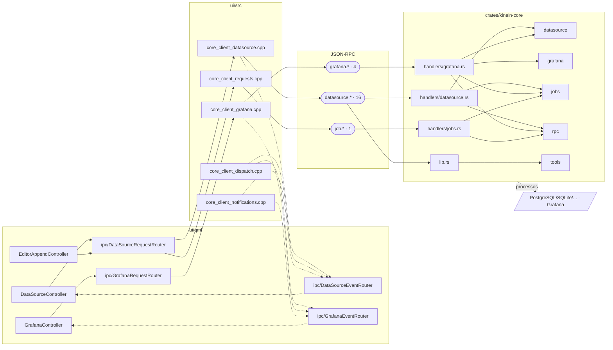

| Etapa | Arquivo | O que ele diz de si |
| --- | --- | --- |
| controller | `ui/qml/datasource/DataSourceController.qml` | Estado de fontes de dados; regras/validacao sao do core. |
| controller | `ui/qml/editor/EditorAppendController.qml` | Append a prepared instruction using native editing, after opening its file. |
| controller | `ui/qml/grafana/GrafanaController.qml` | Estado da OBSERVABILIDADE (etapa 27 do roadmaps/35). |
| roteador | `ui/qml/ipc/DataSourceRequestRouter.qml` | Espelho do DataSourceEventRouter: |
| roteador | `ui/qml/ipc/DataSourceEventRouter.qml` | Roteia as respostas de datasource.* do CoreClient para o controller. |
| roteador | `ui/qml/ipc/GrafanaRequestRouter.qml` | Leva os pedidos do GrafanaController ao CoreClient. |
| roteador | `ui/qml/ipc/GrafanaEventRouter.qml` | Roteia as respostas e o evento de grafana.* para o GrafanaController. |
| ponte C++ | `ui/src/core_client_datasource.cpp` | Dominio de FONTES DE DADOS no lado da UI: |
| ponte C++ | `ui/src/core_client_dispatch.cpp` |  |
| ponte C++ | `ui/src/core_client_grafana.cpp` | Dominio de OBSERVABILIDADE no lado da UI: |
| ponte C++ | `ui/src/core_client_notifications.cpp` | O que o core manda SEM SER PERGUNTADO: |
| ponte C++ | `ui/src/core_client_requests.cpp` |  |
| handler Rust | `crates/kinein-core/src/handlers/datasource.rs` | Handler dos pedidos datasource.* (impl Core). |
| handler Rust | `crates/kinein-core/src/handlers/grafana.rs` | Handler dos pedidos grafana.* (impl Core). |
| handler Rust | `crates/kinein-core/src/handlers/jobs.rs` | Handlers for job.* requests (impl Core). |
| handler Rust | `crates/kinein-core/src/lib.rs` | Rust core for Kinein Vectis. |

Métodos IPC (21): `datasource.console`, `datasource.console.statement`, `datasource.create`, `datasource.destroy`, `datasource.disconnect`, `datasource.discover`, `datasource.impact`, `datasource.introspect`, `datasource.list`, `datasource.odbc.authorize`, `datasource.odbc.sources`, `datasource.preview.decide`, `datasource.query`, `datasource.remove`, `datasource.save`, `datasource.test`, `grafana.forget`, `grafana.get`, `grafana.probe`, `grafana.save`, `job.cancel`.

### Containers

A UI nunca chama docker/podman: o roteador e' a unica ponte, e o core fala com o motor.

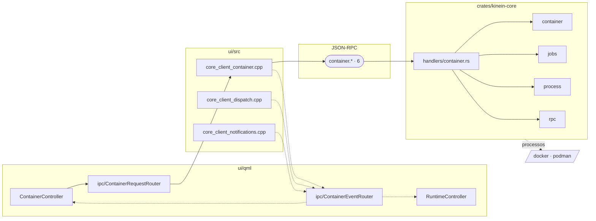

| Etapa | Arquivo | O que ele diz de si |
| --- | --- | --- |
| controller | `ui/qml/container/ContainerController.qml` | Estado do painel de containers (roadmaps/28 §0: |
| controller | `ui/qml/runtime/RuntimeController.qml` |  |
| roteador | `ui/qml/ipc/ContainerRequestRouter.qml` | Espelho do ContainerEventRouter: |
| roteador | `ui/qml/ipc/ContainerEventRouter.qml` | O que o core responde de container.* -> ContainerController; a aba de terminal que container.open cria -> RuntimeController, como qualquer outra. |
| ponte C++ | `ui/src/core_client_container.cpp` | Dominio de containers no lado da UI: |
| ponte C++ | `ui/src/core_client_dispatch.cpp` |  |
| ponte C++ | `ui/src/core_client_notifications.cpp` | O que o core manda SEM SER PERGUNTADO: |
| handler Rust | `crates/kinein-core/src/handlers/container.rs` | Handler for container.* requests (impl Core). |

Métodos IPC (6): `container.action`, `container.compose`, `container.images`, `container.list`, `container.open`, `container.status`.

### Python

O interpretador do projeto (venv, uv) e' decidido no core e usado por executar, testar, depurar e formatar — um dono so'.

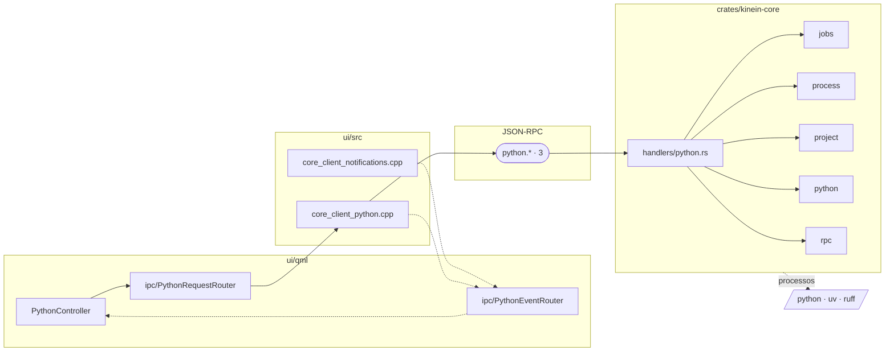

| Etapa | Arquivo | O que ele diz de si |
| --- | --- | --- |
| controller | `ui/qml/python/PythonController.qml` | O AMBIENTE Python do projeto (bloco B do roadmaps/41, fatia 1 em 2026-09-12). |
| roteador | `ui/qml/ipc/PythonRequestRouter.qml` | Espelho do PythonEventRouter: |
| roteador | `ui/qml/ipc/PythonEventRouter.qml` | O que o core responde/emite de python.* -> PythonController. |
| ponte C++ | `ui/src/core_client_notifications.cpp` | O que o core manda SEM SER PERGUNTADO: |
| ponte C++ | `ui/src/core_client_python.cpp` | O AMBIENTE Python do projeto no lado da UI (bloco B do roadmaps/41, fatia 1 em 2026-09-12): |
| handler Rust | `crates/kinein-core/src/handlers/python.rs` | Handlers for python.* requests (impl Core) — o AMBIENTE do projeto Python (bloco B do roadmaps/41, cadeia iniciada em 2026-09-12). |

Métodos IPC (3): `python.createEnvironment`, `python.status`, `python.stubs`.

### Configuracao: acoes, biblioteca, setup e ajustes

Mudanca de configuracao do projeto e' sempre list -> preview -> apply, com escopo e documentacao; o controller nunca escreve arquivo de configuracao.

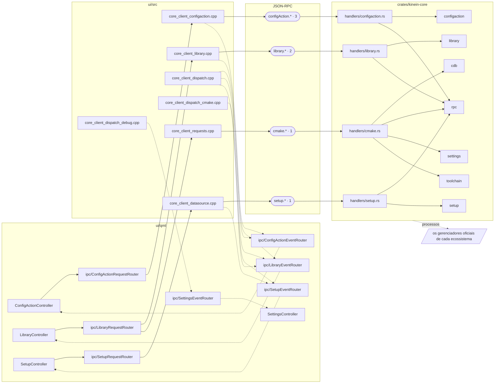

| Etapa | Arquivo | O que ele diz de si |
| --- | --- | --- |
| controller | `ui/qml/configaction/ConfigActionController.qml` | Estado das Configuration Actions (roadmap 30, etapa 2). |
| controller | `ui/qml/library/LibraryController.qml` | Estado do catalogo de bibliotecas (etapa 20 do roadmaps/35). |
| controller | `ui/qml/settings/SettingsController.qml` | Estado de configuracoes (fatia M4.1). |
| controller | `ui/qml/setup/SetupController.qml` | O passo a passo OFICIAL para instalar o que falta, na distro detectada. |
| roteador | `ui/qml/ipc/ConfigActionRequestRouter.qml` | Espelho do ConfigActionEventRouter: |
| roteador | `ui/qml/ipc/ConfigActionEventRouter.qml` | O que o core devolve das Configuration Actions -> ConfigActionController. |
| roteador | `ui/qml/ipc/LibraryRequestRouter.qml` | Espelho do LibraryEventRouter: |
| roteador | `ui/qml/ipc/LibraryEventRouter.qml` | Roteia as respostas de library.* do CoreClient para o LibraryController. |
| roteador | `ui/qml/ipc/SetupRequestRouter.qml` | Espelho do SetupEventRouter: |
| roteador | `ui/qml/ipc/SetupEventRouter.qml` | Roteia a resposta de setup.list do CoreClient para o SetupController. |
| roteador | `ui/qml/ipc/SettingsEventRouter.qml` | Resultado de settings.get/set → SettingsController (fatia M4.1). |
| ponte C++ | `ui/src/core_client_configaction.cpp` | Dominio das Configuration Actions no lado da UI: |
| ponte C++ | `ui/src/core_client_datasource.cpp` | Dominio de FONTES DE DADOS no lado da UI: |
| ponte C++ | `ui/src/core_client_dispatch.cpp` |  |
| ponte C++ | `ui/src/core_client_dispatch_cmake.cpp` | Dispatch do dominio CMake/build (ARCHITECTURE.md §5). |
| ponte C++ | `ui/src/core_client_dispatch_debug.cpp` | Dispatch do dominio DEBUG (ARCHITECTURE.md §5): |
| ponte C++ | `ui/src/core_client_library.cpp` | Dominio de BIBLIOTECAS no lado da UI: |
| ponte C++ | `ui/src/core_client_requests.cpp` |  |
| handler Rust | `crates/kinein-core/src/handlers/cmake.rs` | Handlers for cmake.* requests (impl Core): |
| handler Rust | `crates/kinein-core/src/handlers/configaction.rs` | Handlers for configAction.* requests (impl Core): |
| handler Rust | `crates/kinein-core/src/handlers/library.rs` | Handlers for library.* requests (impl Core). |
| handler Rust | `crates/kinein-core/src/handlers/setup.rs` | Handler dos pedidos setup.* (impl Core). |

Métodos IPC (7): `cmake.targets.list`, `configAction.apply`, `configAction.list`, `configAction.preview`, `library.list`, `library.plan`, `setup.list`.
