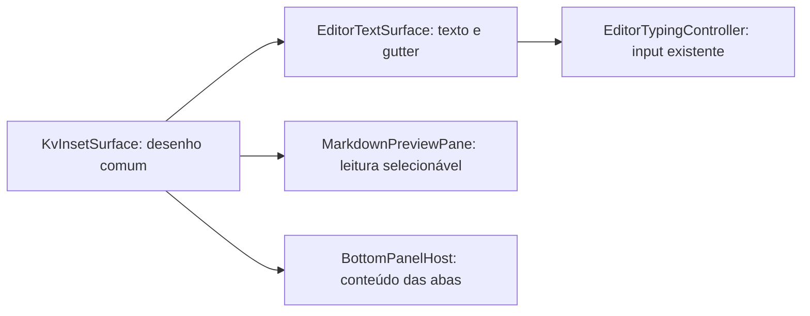
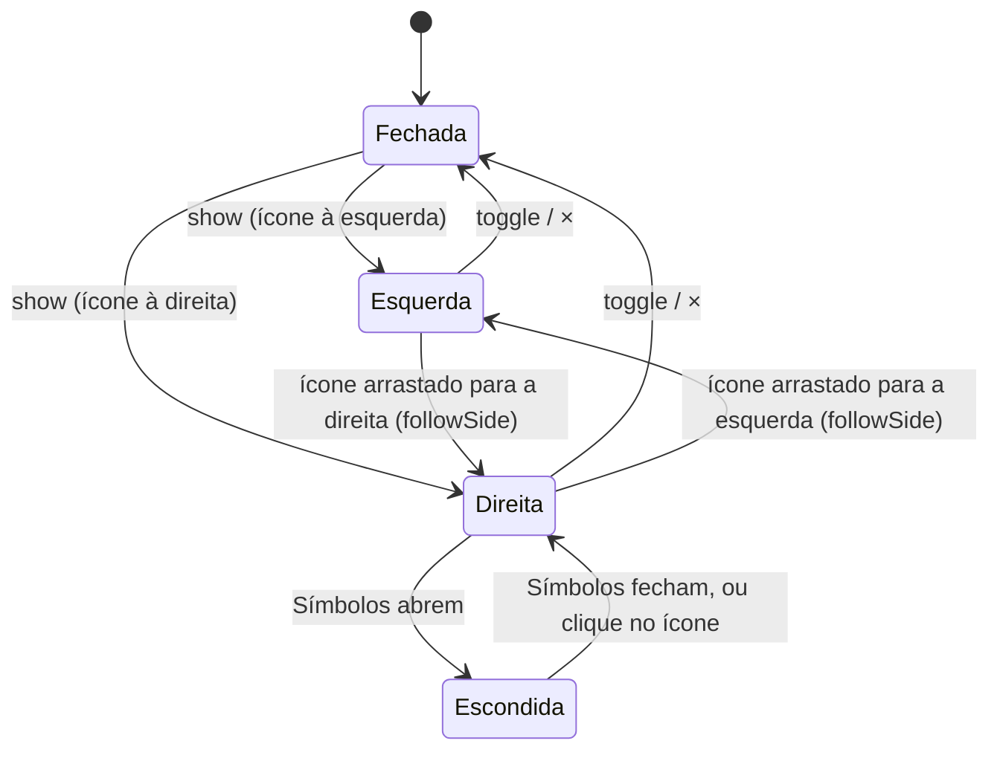
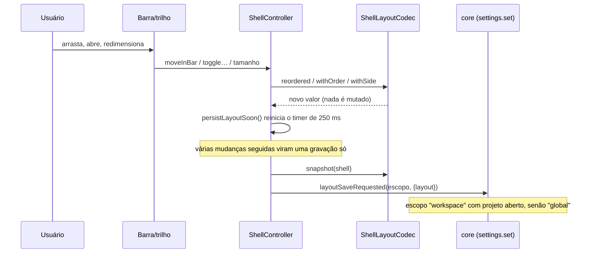
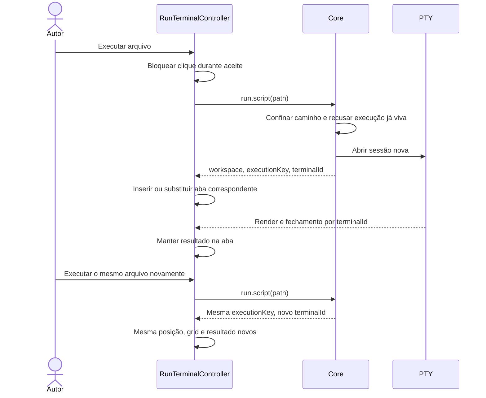

# A casca da IDE: moldura, ilha, trilhos, barras e foco

> **Classe: ESTADO** (`DocsPublic/README.md`). Este documento descreve o que o
> código faz **hoje**, na série 0.3.6–0.3.9. Ele foi escrito em 2026-10-03,
> com as suítes de lógica QML verdes no Qt 6.10 e no Qt 6.4. Se o texto
> divergir do código, o código vence, e o documento é corrigido no mesmo
> commit.
>
> **Para quem é:** para quem vai mexer na janela principal sem ter
> acompanhado a série: um contribuidor novo, quem revisa um PR ou uma sessão
> futura.
>
> **O que responde:**
> - onde cada parte da janela mora no código;
> - quem é o dono de cada estado;
> - como o layout é gravado;
> - como funciona o arrastar para reordenar;
> - como o foco percorre a janela;
> - quais invariantes quebram em silêncio se forem ignoradas.
>
> **Leia antes:** [`ARCHITECTURE.md`](ARCHITECTURE.md) (camadas e catraca) e
> [`35-crescer-sem-god-object.md`](35-crescer-sem-god-object.md) (por que
> cada estado tem UM dono).
>
> **A especificação visual** (paleta, medidas e tokens) está em
> [`../especificacoes/sistema-de-layout.md`](../especificacoes/sistema-de-layout.md)
> §7.1. O **porquê** de cada fatia está no registro
> [`../roadmaps/40.7-registro-das-entregas.md`](../roadmaps/40.7-registro-das-entregas.md)
> (§7.172–§7.195) e no plano
> [`../roadmaps/53-arquitetura-executavel-da-0.3.6.md`](../roadmaps/53-arquitetura-executavel-da-0.3.6.md).

## 1. A anatomia da janela

A janela é **uma moldura** com **uma ilha** dentro, no modelo Islands das IDEs
JetBrains, com âmbar onde elas usam verde:

- **A moldura** é um único fundo cinza. Ela leva as funções nas bordas: o
  topo, os dois trilhos e a barra de status.
- **A ilha** é um retângulo arredondado. Ela leva o trabalho: a área da
  esquerda, o editor e o painel de baixo.

As áreas dentro da ilha são separadas por divisórias de 1 px. Editor,
prévia Markdown e conteúdo do painel inferior têm um fundo interno
rebaixado (§1.2.1), dentro das bandejas das abas.

```text
┌──────────────────────────────────────────────────────────────────────────┐
│ [K] ☰  │ projeto ▾ │ main ③ │ Clang++ · Ninja ▾ │ ⋯      ▷ ⏹ ⌘   _ □ ✕ │ ← topo (38 px)
│                                                                          │   AppMenuBar + TopHeaderBar
│ ┌──┐ ╭──────────────┬────────────────────────────┬─────────────╮ ┌──┐   │
│ │▣ │ │ slot da      │ abas do editor             │ slot da     │ │▤ │   │
│ │⌨ │ │ ESQUERDA     │                            │ DIREITA     │ │🛢│   │
│ │⬡ │ │ (Projeto,    │ editor                     │ (a janela   │ │  │   │ ← trilhos na moldura
│ │⋯ │ │  Git ou      │                            │  cujo ícone │ │  │   │   (SideRail esquerdo,
│ │  │ │  Banco)      ├────────────────────────────┤  está à     │ │  │   │    RightSideRail)
│ │  │ │              │ painel de baixo            │  direita)   │ │  │   │
│ └──┘ ╰──────────────┴────────────────────────────┴─────────────╯ └──┘   │
│ projeto › src › main.cpp   índice…   contexto…          1:1  LSP ● 1  IDE│ ← barra de status
└──────────────────────────────────────────────────────────────────────────┘
  └─ WindowBackdrop: a moldura inteira (Theme.frame) com um véu âmbar no canto
     superior esquerdo (Theme.frameAccentTint), que esmaece para a direita e
     para baixo.
     ╭───╮ ShellLayout: a ilha (Theme.background1, raio Theme.radiusLarge).
```

### 1.1 Quem desenha cada parte

| Parte | Arquivo | O que faz |
| --- | --- | --- |
| Fundo e moldura | `ui/qml/shell/WindowBackdrop.qml` | Cor `Theme.frame` e o véu âmbar. Não tem lógica. |
| Linha do topo, à esquerda | `ui/qml/shell/AppMenuBar.qml` | Ícone da IDE, ☰ (`menuExpanded`), os menus Arquivo…Ajuda **na própria barra** quando expandidos e os controles da janela. É também a área de arrastar a janela. |
| Linha do topo, ao meio | `ui/qml/shell/TopHeaderBar.qml` | Os widgets de contexto: projeto, Git, toolchain, Python e o "⋯". A barra é transparente e fica por cima da `AppMenuBar` (`z: 101`). |
| Montagem do topo | `ui/qml/shell/ShellHeaderHost.qml` | Põe a `TopHeaderBar` logo depois do fim dos menus (`menuEndX`) e antes dos controles da janela (`controlsX`). |
| Ilha e divisórias | `ui/qml/shell/ShellLayout.qml` | Um `Rectangle` arredondado atrás de uma `Row` (slot da esquerda, centro e slot da direita), mais as divisórias de 1 px (esquerda/centro, centro/direita, editor/painel de baixo). |
| Janelas acopladas | `ui/qml/shell/ShellLeftWindowHost.qml` | Tem a instância **única** de cada janela acoplada (Projeto, Git, Banco, Containers, Remoto, Grafana). Cada uma tem `parent: slotOf(nome)`: o próprio host (slot da esquerda) ou o slot da direita (§2.3). |
| Slot da direita | `ui/qml/shell/ShellRightDock.qml` | Um `Item` vazio na `Row`, com a alça de largura no vão à esquerda dele. Recebe a janela por troca de pai. |
| De que lado cada janela abre | `ui/qml/shell/ShellDocks.qml` | Funções sobre o estado do `ShellController`: `sideOf`, `placed`, `showing`, `show`, `close`, `toggle`, `followSide`, `normalize`, `widen` (§2.3). |
| Trilho da esquerda | `ui/qml/shell/SideRail.qml` | Ícones das áreas (34 px de largura, botões de 28 px, ícones de 20 px). |
| Trilho da direita | `ui/qml/shell/RightSideRail.qml` | Um `SideRail` com o lado e a barra de ordem da direita. |
| Barra de status | `ui/qml/shell/WorkspaceStatusBar.qml` | Duas faixas (esquerda e direita) de lugares arrastáveis. |
| Peças do status | `ui/qml/shell/StatusBarParts.qml` | Um `Component` por peça: trilha do arquivo, índice, contexto, cursor, LSP, core… |
| Lugar do status | `ui/qml/shell/StatusBarSlot.qml` | Cria a peça por `createObject` e trata o arrasto. |
| Composição | `ui/qml/shell/ShellWorkspaceHost.qml` | Monta tudo e liga sinais a donos. Não guarda estado próprio. |
| Conteúdo rebaixado | `ui/qml/components/KvInsetSurface.qml` | Desenho comum do editor, Markdown e painel inferior: fundo, borda e sombra interna. Nenhuma regra de input. |

### 1.2 Medidas que valem para a janela inteira

Todas vêm do `Theme` (`ui/qml/Theme.qml`); nenhum arquivo da casca tem
número mágico de cor, raio ou fonte. A catraca
`scripts/verificar-qml-tokens.sh` cobra isso.

```text
Theme.panelGap   6 px   vão entre moldura e ilha, e entre trilho e ilha
topo             38 px  AppMenuBar e TopHeaderBar, uma linha só
trilho           34 px  largura; botões 28 px; ícones 20 px
ilha             raio Theme.radiusLarge (8 px); cor Theme.background1
divisória        1 px Theme.borderSoft, com recuo de Theme.spacingSmall nas pontas
fontes           Micro 9 · Caption 10 · Small 11 · Body 12 · Medium 13 ·
                 Large 14 · Subtitle 15 · Headline 20 · Display 22 · Hero 40
```

### 1.2.1 Profundidade do editor e do painel inferior

Desde 2026-10-06, o editor usa a mesma separação visual do terminal, a pedido
do autor (40.7 §7.224). `EditorPane` e `BottomPanelHost` desenham a bandeja
em `Theme.surface1` (#1e1f22). `KvInsetSurface` desenha o conteúdo em
`Theme.background0` (#141517), raio `radiusLarge`, borda `borderSoft` de
1 px e sombra interna no topo (10 px, alfa 0,32 até transparente).



O componente foi extraído de `BottomPanelWell`; o painel inferior conserva
seu desenho. Editor e Markdown usam o componente como raiz, sem mudar ancoras,
larguras, margens, tamanho da fonte ou espaçamento de linhas. O gutter fica
no mesmo fundo do código. Abas, símbolos, overlays e separadores conservam
seus donos e gestos; o relevo não cria MouseArea, Timer, animação ou layer.
Markdown lado a lado mantém duas superfícies e a alça existente.

`Theme.backgroundEditor` permanece como estava: outros consumidores
(Início, configuração e diffs) continuam com seus tokens. A mudança é nos
hosts/superfícies citados, sem redefinir a paleta global.

### 1.3 Ordem de empilhamento (z) — onde cliques se perdem

Os cliques no topo dependem da ordem z, e já se perderam duas vezes:

```text
z 500  FolderPickerDialog           acima de tudo, inclusive do topo
z 101  TopHeaderBar                 acima da AppMenuBar, que tem z 100
z 100  AppMenuBar                   a área de arrastar a janela fica embaixo
z  99  painéis de ambiente          overlays sobre a ilha (§6)
z  50  linha de soltura do arrasto  dentro do pai da barra (§3)
```

Os dois casos (40.7 §7.190 e §7.172):

- Com a `TopHeaderBar` em `z` igual ao da `AppMenuBar`, a área de arrastar a
  janela engolia os cliques nos widgets.
- Com o seletor de pasta em `z` igual ao do topo, o cabeçalho cortava o
  cartão do seletor.

**Invariante:** um item novo sobre a linha do topo declara `z` acima de 100.

## 2. Estado: quem é o dono de quê

```text
                  ┌────────────────────────────┐
  settings.json ─▶│ core (settings.rs)         │  valida o schema e entrega
  (workspace ou   │ EffectiveSettings.layout   │  só o schemaVersion conhecido
   global)        └─────────────┬──────────────┘
                                │ settings.changed / settings.get
                                ▼
                  ┌────────────────────────────┐
                  │ ShellController            │  DONO do estado da casca:
                  │  showExplorer, leftWindow  │  painéis, tamanhos, abas,
                  │  rightWindow (2026-10-03)  │  os dois slots,
                  │  showBottomPanel, bottomTab│  trilho, ordem das barras
                  │  outlineCollapsed, sizes   │
                  │  railState {pinned,        │
                  │    unpinned, hidden, sides}│
                  │  barOrders {bar: [chaves]} │
                  └──────┬──────────────┬──────┘
          codec puro ◀───┘   ShellDocks ◀──┘──▶ FocusModeController (Foco)
   ShellLayoutCodec                            narrowViewport (< 1024 px)
   snapshot/decode/ordered/                    effectiveOutlineCollapsed
   reordered/inserted/withSide
```

- **`ShellController`** (`ui/qml/shell/ShellController.qml`) é o único dono do
  estado da casca. As barras e os trilhos **pedem** mudanças por funções
  (`moveInBar`, `moveRailEntryToSide`, `toggleExplorer`…). Elas nunca
  escrevem nas propriedades do controlador.
- **`ShellLayoutCodec`** (`ui/qml/shell/ShellLayoutCodec.qml`) guarda as
  funções **puras**: ele recebe valores e devolve valores, sem efeito
  colateral. Toda derivação de ordem e de lado mora ali, uma vez só. Ninguém
  reimplementa "ordem salva + o que é novo no fim" em outro arquivo, e o gate
  `scripts/verificar-qml-duplicacao.sh` cobra isso.
- **O que é efetivo e o que é preferido são coisas separadas.** O usuário
  prefere `outlineCollapsed`. A tela mostra `effectiveOutlineCollapsed`, que
  é a preferência **ou** a janela estreita. Uma janela estreita não apaga a
  preferência: ao alargar, ela volta.

### 2.0 Janelas acopladas: os dois slots (2026-10-03)

**Pedido do autor:** "coloca para o painel aparecer no canto de acordo com o
ícone na trilha", primeiro para o Banco e depois também para o Projeto. Ele
avisou que essa parte "pode ser complicada de se fazer para evitar bugs".
Por isso as regras abaixo são **um dono só** (`ShellDocks`) e estão provadas
uma a uma no `tst_shell_docks`.

**O estado.** Há um slot por lado:

| Lado | Estado no `ShellController` | Fechado quando |
| --- | --- | --- |
| esquerda | `leftWindow` (`explorer`/`git`/`database`/`containers`/`remote`/`observability`) + `showExplorer` | `showExplorer` é falso |
| direita | `rightWindow` (a mesma lista, ou `""`) | `rightWindow` é `""` |

**De que lado** uma janela abre é o lado do **ícone** dela no trilho:
`railState.sides[nome]`, que o usuário muda arrastando o ícone (§3.4). Sem
registro, o lado é a esquerda. O Git não tem ícone no trilho, então abre à
esquerda até alguém mudar isso.

**As regras** (`ShellDocks`):

| Situação | O que acontece |
| --- | --- |
| Sem projeto (tela de boas-vindas) | **Nenhum** slot aparece (`slotVisible`), mesmo que o layout lembre uma janela aberta; os trilhos, o painel de baixo, os atalhos de área (`EnvironmentShortcuts`) e o widget "Abrir projeto" do topo também somem. Decisão do autor (2026-10-03): a tela de boas-vindas é só de boas-vindas. |
| `show(nome)` com o ícone à direita | `rightWindow = nome`; se a mesma janela estava na esquerda, a esquerda fecha. |
| `show(nome)` com o ícone à esquerda | `leftWindow = nome`, `showExplorer = true`; se estava na direita, a direita esvazia. |
| `toggle(nome)` | Visível em algum lado: fecha. Senão: `show`. É o clique no ícone. |
| Ícone arrastado com a janela **aberta** do outro lado (`followSide`) | A janela vai junto (`show` no lado novo). |
| Ícone arrastado com a janela **fechada** | Nada abre. |
| Layout gravado com a janela no lado errado (`normalize`, depois de `applyLayout`) | A janela vai para o lado do ícone. Pega layouts gravados antes de existir o slot da direita. |
| Símbolos abertos (`effectiveOutlineCollapsed` falso) | O slot da direita **some** (`showing` devolve `""`, o `ShellRightDock` fica invisível), sem perder `rightWindow`; ao fechar os Símbolos ele volta igual. Decisão do autor: "quando ele aparecer, o que estiver ali desaparece momentaneamente". |
| `show` de uma janela escondida pelos Símbolos | Fecha os Símbolos (`toggleOutline`); senão o clique no ícone não faria nada visível. |
| A janela pede mais largura (`widen`) | O slot dela **só alarga** até o pedido; o teto do `ShellController` continua valendo, e nunca encolhe por aqui. O Banco pede a largura natural da grade de dados (§2.0, "Tamanhos"). |

`placed(nome)` diz em que slot a janela está **posta**, e `showing(nome)` diz
onde ela está **visível** agora (a diferença são os Símbolos). As derivações
`effectiveShowExplorer`, `gitWindowVisible` e `databaseWindowVisible` usam
`showing`, e por isso o realce do ícone no trilho apaga quando os Símbolos
escondem a janela.



**Uma instância, troca de pai.** As janelas não são duplicadas para cada
lado. `ShellLeftWindowHost` tem uma instância de cada uma, e o `parent` dela
é o próprio host ou o `ShellRightDock` (`slotOf(nome)`). O estado vai junto
de graça: a árvore aberta do Banco, os dados na tela e a seleção no Projeto
sobrevivem a trocar de lado, fechar e reabrir. Duas instâncias exigiriam
sincronizar esse estado, e é aí que nasceriam os defeitos. O host da
esquerda fica invisível quando `leftWindow === rightWindow`, para não mostrar
um slot vazio.

**Tamanhos.** Cada slot tem o próprio preferido: `explorerPreferredWidth`
(esquerda) e `rightPreferredWidth` (direita, padrão 300, gravado em
`sizes.right`, entre 220 e 640). O mínimo é **declarado pela janela** que
está no slot, `ShellLeftWindowHost.minimumOf(nome)`:

| Janela | Mínimo |
| --- | --- |
| Projeto | 220 px |
| Git | a maior das três linhas do Git (40.7 §7.205) |
| Banco | 260 px |

O teto da direita é o teto da esquerda menos o que a esquerda ocupa, e assim
o editor nunca fica abaixo de 480 px.

### 2.1 Gravação do layout



Ao abrir, o caminho é o inverso: `applyLayout(layout)` chama `codec.decode`.
Um campo ausente ou estranho mantém o valor atual, porque o decode nunca
lança erro por causa de um arquivo editado à mão.

### 2.2 O formato gravado (`layout`, schema 1)

O schema formal está em
[`../../schemas/settings.schema.json`](../../schemas/settings.schema.json)
(propriedade `layout`), e o protocolo em
[`03-protocolo-ipc.md`](03-protocolo-ipc.md). Exemplo completo:

```json
{
  "layout": {
    "schemaVersion": 1,
    "leftWindow": "explorer",
    "leftVisible": true,
    "rightWindow": "database",
    "sizes": { "explorer": 280, "outline": 260, "right": 300, "bottom": 240 },
    "outlineCollapsed": false,
    "bottom": { "visible": true, "tab": "terminal", "pinned": ["terminal"] },
    "rail": {
      "pinned": ["git"], "unpinned": [], "hidden": [],
      "sides": { "outline": "right", "database": "right" }
    },
    "order": {
      "rail":        ["explorer", "terminal", "embedded"],
      "railRight":   ["outline", "database"],
      "bottom":      ["terminal", "problems", "jobs"],
      "header":      ["git", "project", "toolchain", "python"],
      "statusLeft":  ["breadcrumb", "index", "context"],
      "statusRight": ["cursor", "lsp", "ide", "core"]
    }
  }
}
```

Validação na leitura (`ShellLayoutCodec.decode`):

- **`leftWindow` e `rightWindow`.** Só valem se estiverem na lista
  `leftWindows`. `rightWindow` aceita `""` (fechado). Uma janela que não
  existe é ignorada.
- **`bottom.tab`.** Só vale se a aba existir hoje (`bottomTabs`). Uma aba que
  deixou de existir cai no padrão. É o caso de `"git"`, que virou janela, e
  de `"database"`, a aba "Resultado" de 2026-10-03, cujos dados foram para a
  janela do Banco. Antes disso, o painel de baixo abria **vazio**: isso foi
  achado na tela real.

Regras do `order`, que valem para as seis barras:

| Situação | Comportamento | Função |
| --- | --- | --- |
| Item que a ordem salva não conhece (área nova, peça que apareceu agora) | Entra **depois** dos conhecidos, na ordem de fábrica. | `ordered` |
| Chave salva que não existe mais | É ignorada; nada quebra. | `ordered` |
| Item salvo que não está à vista agora | **Guarda o lugar** no fim da lista e volta quando reaparece. | `reordered` |
| Item que chega de outra barra | Entra no vão onde foi solto. | `inserted` |

## 3. Arrastar para reordenar

O usuário pode arrastar itens dentro de **toda** barra: os dois trilhos, as
abas do painel de baixo, o topo e as duas faixas do status. Entre os trilhos,
o item pode **passar** de um lado para o outro. As abas do editor usam o
mesmo `ReorderMouseArea`, mas gravam a ordem no modelo de arquivos abertos
(`filesModel.move`).

### 3.1 As três peças

```text
ReorderMouseArea   (por item)  distingue clique de arrasto (limiar de 6 px)
   │ begin(chave)               e converte a posição para o container
   │ update(x, y)
   │ finish() / cancel()
   ▼
ReorderController  (por barra) acha o VÃO pelos centros dos itens visíveis
   │                            que têm `reorderKey`, desenha a linha de
   │                            acento e emite:
   │ moved(chave, vão, chavesVisíveis)
   │ transferred(chave, vão, chavesDeLá)   ← só com `partner`
   ▼
ShellController    (dono)      moveInBar / moveRailEntryToSide → codec → grava
```

- `ui/qml/components/ReorderMouseArea.qml`: o clique continua sendo clique
  (sinal `tapped`). Depois de um arrasto, o clique que o Qt emite ao soltar é
  engolido (`swallowClick`), e Esc cancela o arrasto.
- `ui/qml/components/ReorderController.qml`: só conhece os itens do próprio
  `container`. O vão `i` fica **antes** do item `i`, e o vão `n` fica depois
  do último.
- O status não usa `MouseArea`. Ele usa um `DragHandler` em
  `StatusBarSlot.qml`, que só toma o gesto depois do limiar. Assim, o clique
  continua chegando à peça (o ✕ de um job, a dica do LSP).

### 3.2 Como o vão é escolhido

```text
itens:     [  a  ]   [  b  ]   [  c  ]
centros:      ·         ·         ·
vãos:     0       1         2         3
posição x ─────────────▲  passou de 2 centros → vão 2 (entre b e c)
```

A conta é: `vão = quantos centros ficam antes da posição`. Os itens são
ordenados por `x` (ou por `y`, se `vertical`), e não pela ordem dos filhos.
Por isso a conta também vale numa barra que posiciona os itens por conta
própria, como a `TopHeaderBar` (§5).

Ao soltar, `codec.reordered(visíveis, salvos, chave, vão)` tira a chave do
lugar antigo e a põe no vão. Se o vão fica **depois** do lugar antigo, o
índice desconta 1. Os casos estão provados em `tst_bar_reorder`.

### 3.3 A linha de soltura

O indicador é um `Rectangle` de 3 px em `Theme.accent`. Ele é filho do
**pai** do container, e não do container, porque um `Row`/`Column`
posicionaria a linha como se ela fosse mais um item. O indicador também
nunca fica antes do começo: o container costuma recortar (`clip`), e a linha
do vão 0 sumia. O item arrastado fica a 40% de opacidade (`opacityFor`).

### 3.4 Passar de um trilho para o outro

Cada trilho tem um `ReorderController`, e um aponta para o outro como
`partner`. A `dropZone` de cada um é o **trilho inteiro**, e não só a coluna
de ícones, porque a coluna pode estar vazia e ter altura zero.

```mermaid
sequenceDiagram
    participant M as ReorderMouseArea (ícone no trilho esquerdo)
    participant L as ReorderController esquerdo
    participant R as ReorderController direito (partner)
    participant S as ShellController
    M->>L: begin("database")
    M->>L: update(x, y)
    alt a posição está dentro de R.dropZone
        L->>R: receive("database", x', y')
        Note over R: só a linha aparece lá; nada fica translúcido
        L->>L: overPartner = true
    else voltou para o próprio trilho
        L->>R: cancel()
        L->>L: placeAt(x, y)
    end
    M->>L: finish()
    L->>S: transferred → moveRailEntryToSide("database", "right", vão, chavesDeLá)
    S->>S: railState.sides.database = "right"; order.railRight = inserted(...)
```

O lado de cada área é `ToolWindows.sideOf(entrada)`: vale o lado que o
usuário arrastou (`rail.sides`) e, se não houver, o `side` da entrada, que por
padrão é `left`. Os dois trilhos desenham `leftEntries` e `rightEntries`.

## 4. As áreas do trilho (`ToolWindows`)

`ui/qml/shell/ToolWindows.qml` tem **uma** lista, `entries`, com uma entrada
por área. Cada entrada traz o id, o ícone, a dica, o atalho, o comando e o
`kind`. Quem quer saber o que uma área faz lê essa lista. O único lugar que
age é a função `activate(id)`.

| `kind` | Exemplos | O clique faz |
| --- | --- | --- |
| `dock-left` | Projeto, Banco, Containers, Remoto, Grafana | janela acoplada: abre ou fecha no slot **do lado do ícone** (`toggleDockWindow`, §2.0) |
| `dock-right` | Símbolos | recolhe/expande os Símbolos (abertos, escondem o slot da direita) |
| `bottom` | Terminal, Ferramentas | abre o painel de baixo na aba; se ela já estiver à vista, recolhe |
| `overlay` | Embarcados | abre o painel de ambiente do dono (`owner.open()`); vira janela na 0.4 |

Duas camadas filtram o que aparece:

1. **Visível ou não.** `RailProjection.visibleEntries` cruza as entradas com
   o estado do trilho (fixadas, desafixadas, escondidas) e com os **fatos**
   de `RailFacts`. Uma área contextual só aparece quando há o que mostrar, e
   uma área com a janela ABERTA aparece enquanto estiver aberta, mesmo
   contextual sem fato ou oculta (2026-10-04: a janela no slot tem de ter o
   ícone que a fecha).
2. **De que lado.** `sideOf`.

Para acrescentar uma área, basta acrescentar **uma entrada** à lista: os
dois trilhos, o painel "⋯ áreas", os overlays e o atalho a encontram por
ela. Isso é o aceite da fatia V3, provado em `tst_tool_windows`.

## 5. A linha do topo

```text
AppMenuBar (z 100, a linha inteira)
├─ [ícone da IDE]  ☰ ─┬─ recolhido: nada
│                     └─ expandido: Arquivo Editar Ver … Ajuda   (menuEndX)
├─ TopHeaderBar (z 101), de menuEndX até controlsX
│    leftWidgets: projeto · git · toolchain · python · ⋯
│    à direita:   perfil ▾  ▷  ⏹  ⌘
└─ controles da janela: _ □ ✕                                    (controlsX)
```

Os widgets do topo **não** estão num `Row` nem num `Repeater`. Cada um
calcula o próprio `x` com `xOf(chave)`, que soma as larguras dos **visíveis**
que vêm antes dele na ordem do usuário (`widgetOrder`). As alternativas
falharam:

- **Reanexar a um pai invisível** para reordenar deixava o widget que
  aparecia depois fora do grafo de cena (40.7 §7.178).
- **`stackBefore`/`stackAfter`** não são invocáveis pelo QML.

Quando o contexto não cabe, os chips de menor prioridade se escondem e vão
para o "⋯". Um ponto de aviso no "⋯" indica que há algo escondido com
alerta. O editor nunca encolhe para caber um chip (53 §5.7).

## 6. Painéis de ambiente

`ui/qml/shell/ShellEnvironmentOverlays.qml` monta os cinco painéis de
`overlay` sobre a ilha (`z: 99`), além dos painéis fixos de bibliotecas e de
instalação. Duas regras desse arquivo já falharam em silêncio:

1. **`createObject`, e não `Loader`.** Os painéis são componentes *bound*
   do `ToolWindows`. O `Loader` do Qt 6.4 (o do AppImage) os recusa com
   "Cannot instantiate bound component outside its creation context".
2. **O modelo do `Repeater` é a contagem**, e não a lista. `entries` é
   refeita a cada mudança de estado (um `panelVisible`, a aba de baixo…).
   Com a lista como modelo, cada mudança destruía e recriava os cinco
   painéis: cerca de 45 ms, e o que estava digitado num painel aberto se
   perdia (40.7 §7.195). Com um número igual, o modelo não reinicia.
3. **Cada painel nasce na primeira abertura, e fica** (40.7 §7.203). A vaga
   (`panelSlot`) chama `ensurePanel()` quando fica visível pela primeira
   vez. Fechar e reabrir mostra o mesmo objeto, então o estado digitado
   sobrevive. Criar os cinco na abertura da IDE pesava no primeiro quadro.

A prova das regras 2 e 3 é o `tst_environment_overlays`. Ele exige que nada
seja criado com tudo fechado, que abrir crie só o painel aberto, que
reabrir não recrie e que o texto digitado continue.

### 6.1 O que nasce na abertura, e como medir

O primeiro quadro (o orçamento é 400 ms; 247 ms em 2026-10-03) paga tudo o
que é **criado** antes dele, visível ou não. Um diálogo escondido custa o
mesmo que um aberto. A regra da casca é esta: o que só serve aberto nasce na
primeira abertura.

| Onde | Como fica sob demanda |
| --- | --- |
| `DocumentationDialog` (o manual inteiro em Markdown) | `manualLoaded` vira verdadeiro na primeira abertura; só então o texto entra no `TextEdit` |
| `ShellEnvironmentOverlays` (cinco painéis) | `ensurePanel()` na primeira abertura (regra 3 acima) |

**Medir antes de cortar.** A medida por componente que encontrou os dois
casos acima pode ser repetida assim:

```text
cmake --preset dev-local-release -B build/qmlprof -DCMAKE_CXX_FLAGS=-DQT_QML_DEBUG
cmake --build build/qmlprof --target kinein-vectis
QT_QPA_PLATFORM=offscreen KINEIN_PERF_MARKER=1 KINEIN_PERF_EXIT=1 \
  qmlprofiler -o abertura.qtd -- build/qmlprof/ui/kinein-vectis
```

O `.qtd` é XML. Some o tempo próprio dos eventos `Creating` pelo
**arquivo e linha onde o objeto é declarado**, e não pelo aninhamento no
tempo: o QML compilado não aninha os eventos. O profiler infla o tempo
absoluto, então compare só proporções. Depois de cortar, a prova é um A/B
intercalado (antes e depois alternados, máquina parada), nunca um número de
outro dia.

**Invariante geral:** um `Repeater` sobre uma lista **derivada** recria os
delegados a cada nova avaliação. Isso é aceitável para itens baratos e sem
estado (um ícone), e é um defeito para itens com estado ou caros.

## 7. Foco e espaço para código

### 7.1 Modo Foco (`Ctrl+Shift+F12`, comando `view.focusMode`)

O dono é `ui/qml/shell/FocusModeController.qml`.

```text
          toggle (guarda {explorador, baixo, Símbolos}; recolhe os três)
 normal ─────────────────────────────────────────────────────────▶ foco
   ▲  ◀──── toggle (restaura EXATAMENTE o guardado) ─────────────  │
   └──────── painel aberto à mão (encerra SEM restaurar) ──────────┘
```

Se o usuário abriu um painel durante o Foco, quem mexeu no layout foi ele, e
o layout dele vale. `applying` impede que o próprio modo conte como "aberto
à mão". "Voltar ao editor" (`view.returnToEditor`) devolve o teclado ao
editor de qualquer lugar.

### 7.2 Ciclo de foco (`Ctrl+F6` / `Ctrl+Shift+F6`)

O dono é `ui/qml/shell/FocusCycle.qml`.

```text
[slot da esquerda] ─▶ [editor] ─▶ [slot da direita] ─▶ [painel de baixo] ─┐
        ▲                                                                 │
        └─────────────────────────── Ctrl+F6 ─────────────────────────────┘
```

O slot da direita entrou em 2026-10-03. O `focusArea()` dele pede ao
`ShellLeftWindowHost` o foco da janela que está ali (`focusSlot("right")`),
porque é o host quem tem as janelas.

- Só as áreas **visíveis** entram no ciclo.
- A área atual é a que **contém** o item com foco ativo (o ciclo sobe pela
  cadeia de pais).
- Sem nenhuma área atual, o ciclo começa no editor.
- Cada área expõe `focusArea()` e mostra que tem o foco: o painel de baixo,
  por exemplo, ganha uma borda `Theme.accentDim`.

### 7.3 Janela estreita

Abaixo de 1024 px de largura, a casca cede espaço nesta ordem, antes de
reduzir o editor (53 §5.8):

1. Os Símbolos recolhem: `narrowViewport` liga `effectiveOutlineCollapsed`.
2. O topo manda chips para o "⋯" (§5).
3. O status mostra só as peças de maior prioridade.

Nenhuma preferência gravada muda: ao alargar, tudo volta.

## 8. Armadilhas do Qt 6.4 que esta casca já pagou

O AppImage roda Qt 6.4 (Debian 12), e o desenvolvimento usa Qt 6.10. O gate
`scripts/verificar-qml-logica-qt64.sh` roda as mesmas suítes num container
com Qt 6.4. Os casos abaixo passaram no 6.10 e quebraram no 6.4:

| Armadilha | Sintoma | Como a casca evita |
| --- | --- | --- |
| `createObject(pai, props)` avalia os bindings **antes** de as props chegarem | `TypeError` em `bar.x` | As peças do status leem `bar ? bar.x : padrão`. |
| Propriedade de delegado com o nome de um id de fora | `bar: bar` lia a si mesma (laço de binding) | A propriedade se chama `statusBar`. |
| `children` não é `Array` | `children.find` não existe | Laço por índice. |
| `Loader.sourceComponent` com componente *bound* | Painel não abre | `createObject` (§6). |

Outras armadilhas, que valem nas duas versões e foram achadas na tela real
em 2026-10-03:

| Armadilha | Sintoma | Como a casca evita |
| --- | --- | --- |
| Uma lista vinda do C++ (`QVariantList`) **não** é `Array`: `Array.isArray` dá falso, e só existem `length` e índices | O trilho perdia a ordem (40.7 §7.160); a grade do Banco mostrava tudo como `null`, porque tratava a linha como objeto | Um dono para a pergunta, `ui/qml/components/KvLists.js` (`isList`, `listOf`), usado pelo codec e pela `GridRules`. |
| Botão que aparece com `containsMouse` da `MouseArea` da linha | O botão pisca: quando o mouse entra nele, ele "rouba" o hover, some, devolve e reaparece | Hover passivo: `HoverHandler` na linha (`DatabaseTreeView`). |
| `Text` com `elide` e `height: implicitHeight + …` | "Binding loop detected for property height" no log | Altura tirada da **fonte**, e não do próprio texto (`DataSourceResultsPanel`). |

## 9. Provas

### Abas de execução (0.160.0, 2026-10-06; aceite no 40.7)

RuntimeController mantém a lista/render das sessões; RunTerminalController
é o dono dos vínculos das execuções, aceite pendente e desfechos. O core
devolve workspace e executionKey: tupla JSON opaca com categoria e destino
canônico (arquivo, id da configuração ou comando completo). O título
abreviado é apresentação. Shells não participam desse mapa.



Substituir remove estado e vínculo do PTY anterior, sem reutilizar seu id.
Render atrasado sem aba dona é descartado. Fechar uma execução viva pede
terminal.close e remove a aba quando o fechamento chega; uma concluída
fecha localmente. Falha de aceite/desconexão libera o bloqueio. Mudança de
workspace limpa o estado. Resposta de outro workspace não cria aba.
O pendingShell não entrega seu comando a uma execução: ele espera a resposta
terminal.open do shell. Isso evita injetar uma linha interativa no programa.

As provas são tst_run_tab_reuse, tst_run_tab_survives, tst_run_device e
tests/run_reuse.rs: repetição, posições, saída, eventos atrasados, fechamento,
clique duplo, recusa antes do spawn, caminhos canônicos e configuração editada.
Os processos PTY são reais; a prova visual e gates constam do 40.7.

| Harness (`scripts/qml-harness/`) | O que prova |
| --- | --- |
| `tst_bar_reorder` | O codec (ordem, vão, chave escondida, transferência, lados, aba de baixo que deixou de existir), o `ReorderController` com `partner`, as abas e o status na ordem salva. |
| `tst_header_order` | Os widgets do topo na ordem de fábrica e na ordem salva; nenhum chip vai para o "⋯" quando cabe. |
| `tst_tool_windows` | As nove entradas, `activate`, os painéis por entrada e os trilhos sem as áreas indisponíveis. |
| `tst_environment_overlays` | Os painéis de ambiente nascem na primeira abertura, uma vez só, e guardam o estado. |
| `tst_focus_mode` | Foco: guardar e restaurar; painel aberto à mão; janela estreita. |
| `tst_focus_cycle` | O ciclo com áreas escondidas, para frente e para trás; o slot da direita depois do editor. |
| `tst_shell_docks` | §2.0 inteira: lado do ícone, um slot por lado, nunca nos dois lados, arrastar leva junto (e fechada não abre), Símbolos escondem e devolvem, `normalize`, `widen` só alarga, o retrato e o decode do slot da direita. |
| `tst_shell_panel_limits` | Os tamanhos entre o mínimo e o máximo; o retrato do layout (com `rightWindow` e `sizes.right`). |

Todos rodam em `scripts/verificar-qml-logica.sh` (Qt 6.10) e em
`scripts/verificar-qml-logica-qt64.sh` (Qt 6.4), dentro do gate
`scripts/verificar.sh`. A prova **visual** está em
`scripts/capturar-telas.sh`, que fotografa as cenas em 1024×700, 1366×768 e
1920×1080 num Xvfb, com projeto e HOME de teste.
