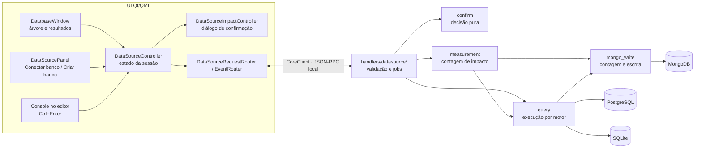
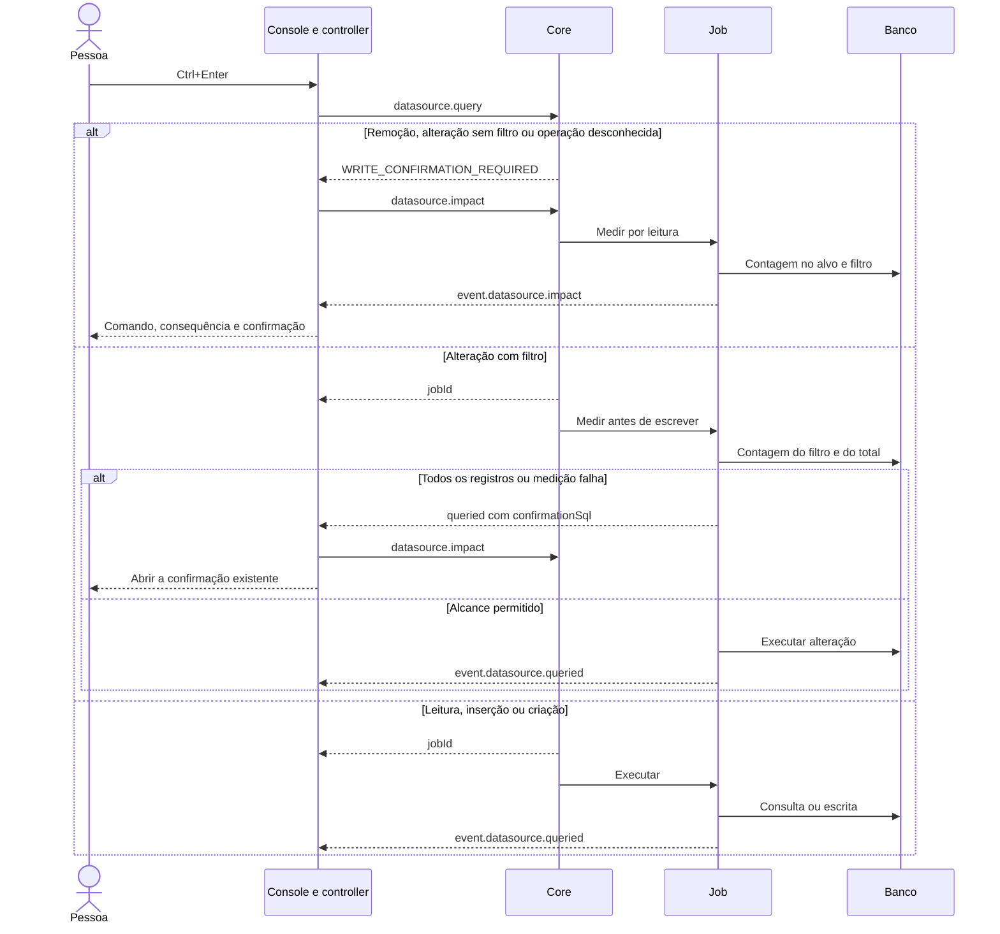

# 37 — Banco de dados: execução, confirmação e continuidade

<!-- caminhos-conferidos -->

> **Classe: ESTADO.** Conferido contra o código em 2026-10-05, na fatia do
> passo 7 da [0.3.9](../roadmaps/59-fechamento-da-0.3.9.md).
> O contrato do fio pertence ao [03](03-protocolo-ipc.md); o uso, ao
> [manual](../manual.md); a fila, ao [40](../roadmaps/40-estado-e-continuidade.md).
> O aceite e as provas desta fatia ficam no [40.7](../roadmaps/40.7-registro-das-entregas.md).
> Este documento explica o desenho e os limites; não encerra o passo 7.

## 1. O que foi retomado

A sessão de 2026-10-04 parou durante a troca do formulário de PostgreSQL
para MongoDB. Havia código de escrita MongoDB e de confirmação seletiva,
com protocolo `0.156.0`, ainda sem commit. A retomada revisou essa base,
acrescentou testes de despacho e corrigiu o caminho das alterações que,
apesar de terem filtro, atingem todos os registros.

O Banco continua sendo uma janela acoplada, com árvore e resultados.
O console é um arquivo do editor: `.kinein/consoles/*.sql` ou `*.mongo`.
A composição dos slots e o foco pertencem à [casca](36-casca-da-ide.md).
O diálogo edita ou cria conexões; ele não substitui o console.



## 2. Quem é dono de cada responsabilidade

Os caminhos são relativos à raiz do repositório.

| Responsabilidade | Dono |
| --- | --- |
| Perfis e mensagens tipadas | `crates/kinein-protocol/src/datasource.rs`, `crates/kinein-protocol/src/datasource_impact.rs` |
| Persistir, normalizar e validar perfil | `crates/kinein-core/src/datasource/mod.rs`, `crates/kinein-core/src/datasource/store.rs` |
| Política de segredo e conexão PostgreSQL | `crates/kinein-core/src/datasource/secret.rs`, `crates/kinein-core/src/datasource/connection.rs` |
| Dividir e classificar SQL; construir contagens | `crates/kinein-core/src/datasource/impact.rs` |
| Decidir se uma operação pede confirmação ou medição silenciosa | `crates/kinein-core/src/datasource/confirm.rs` |
| Medir o alcance; promover operação desconhecida ou contagem falha | `crates/kinein-core/src/datasource/measurement.rs` |
| Gramática MongoDB, sem avaliação local de JavaScript | `crates/kinein-core/src/datasource/mongo_command.rs` |
| Operações do driver MongoDB e contagem exata | `crates/kinein-core/src/datasource/mongo_write.rs` |
| Leitura com teto e execução por motor | `crates/kinein-core/src/datasource/query.rs` |
| Jobs de consulta e impacto | `crates/kinein-core/src/handlers/datasource_query.rs`, `crates/kinein-core/src/handlers/datasource_impact.rs` |
| Ponte existente e eventos | `ui/src/core_client_datasource.cpp`, `ui/src/core_client_notifications.cpp` |
| Pedidos e respostas da UI | `ui/qml/ipc/DataSourceRequestRouter.qml`, `ui/qml/ipc/DataSourceEventRouter.qml` |
| Estado, rascunho e segredo de sessão | `ui/qml/datasource/DataSourceController.qml` |
| Padrões e textos por motor | `ui/qml/datasource/DataSourceKinds.qml` |
| Estado do aviso e apresentação | `ui/qml/datasource/DataSourceImpactController.qml`, `ui/qml/datasource/SqlImpactDialog.qml` |
| Seleção de opções, foco e setas | `ui/qml/components/KvSegmentedControl.qml` |

A confirmação nasce no core. A UI apresenta a classificação recebida e
coordena o gesto; nenhum clique no seletor decide se uma consulta é segura.

Todo o lote SQL é classificado antes do job. Uma leitura inicial não
pode esconder `COMMIT` seguido de remoção: qualquer instrução que exige
confirmação interrompe o lote inteiro antes de abrir a conexão.

## 3. O caminho de uma consulta

A política foi alterada pelo autor em 2026-10-04 para evitar interromper
toda escrita de desenvolvimento. `confirm` decide sobre a classificação:

| Operação | Caminho |
| --- | --- |
| Leitura | Executa com teto; PostgreSQL e SQLite impõem leitura no motor |
| Inserção e criação | Executa diretamente |
| Alteração com filtro | Mede em silêncio num job; executa se a medição permite |
| Alteração em massa sem filtro | Recusa antes do job e pede confirmação |
| Apagar, esvaziar, remover objeto | Pede confirmação, mesmo com filtro |
| `REPLACE` / `INSERT OR REPLACE` / `UPDATE OR REPLACE` | Pede confirmação: substituição pode apagar registro anterior |
| SQL não classificado, como `CALL` ou `DO` | Pede confirmação; impacto desconhecido exige nome digitado |



O evento que interrompe a medição silenciosa leva `confirmationSql` com o
texto exato. O controller compara texto e conexão com o último pedido antes
de abrir o aviso. Uma resposta de uma consulta anterior não deve abrir um
diálogo para a consulta nova.

O diálogo espera a medição terminar. Na operação destrutiva exige o nome
do alvo; sem alvo conhecido, usa o nome da conexão. No MongoDB, o ponto
pertence ao nome da coleção: `telemetria.sensores` exige esse nome inteiro,
e `sensores` não libera a confirmação. Cancelar não envia escrita.
Confirmar reenvia o mesmo texto com `confirmWrite: true`.

**Limites reais:** contagem e execução usam conexões/operações separadas.
A prévia não congela o banco: alterações concorrentes podem mudar o alcance.
A transação PostgreSQL com prévia, `COMMIT` e `ROLLBACK` ainda é trabalho do
59 §5.3. A classificação SQL é uma análise limitada; não prevê efeitos de
triggers, funções e cascatas. Ela não substitui as permissões do servidor.

O executor SQL ainda escolhe leitura pela primeira palavra. Um lote misto
iniciado por leitura pode ser recusado pelo caminho de leitura do motor.
A proteção do handler cobre o lote inteiro, mas isso não transforma o
executor numa sessão de console com transação. Essa evolução pertence ao
59 §5.2–§5.3.

## 4. MongoDB e a gramática do console

Um comando por execução. A forma é `colecao.operacao(argumentos JSON)`,
com os argumentos convertidos em BSON; Extended JSON permite valores como
`{"$oid":"..."}`. A forma anterior `colecao {filtro}` continua lendo.

```text
sensores.find({"placa":"esp32"})
sensores.insertOne({"placa":"esp32","valor":21})
sensores.insertMany([{"placa":"pico"},{"placa":"pi"}])
sensores.updateOne({"placa":"pico"},{"$set":{"ativo":true}})
sensores.updateMany({"placa":"esp32"},{"$inc":{"valor":1}})
sensores.deleteOne({"placa":"pi"})
sensores.deleteMany({"ativo":false})
sensores.drop()
```

O parser identifica a operação antes dos argumentos. Uma string como
`"log.find("` dentro de um documento continua sendo dado. Chaves precisam
de aspas JSON; blocos JavaScript, métodos desconhecidos e comandos
encadeados são recusados. O nome da coleção é validado, e escrita em
`system.*` é recusada antes do driver.

`insertMany` exige uma lista não vazia de objetos. `updateOne/Many`
exigem filtro e documento de alteração com operadores; não aceitam
documento de substituição. `deleteOne/Many` aceitam filtro ausente, mas
sempre pedem confirmação. `drop` não aceita argumentos.

A medição usa `count_documents` com o mesmo filtro, e uma contagem exata
para o total. `deleteOne/updateOne` limitam a contagem atingida a um.
`updateMany/deleteMany` que alcançam toda uma coleção não vazia são
promovidos a destrutivos. O retorno `affected` contém inseridos,
modificados ou apagados; numa remoção de coleção, a contagem anterior.
A leitura mostra a união dos campos de primeiro nível e valores em JSON.

## 5. Conectar e criar são gestos diferentes

**Conectar banco** prepara o perfil de um banco existente.
**Criar banco…** cria arquivo SQLite, servidor em contêiner ou banco no
PostgreSQL selecionado. O comando do contêiner aparece antes da execução.
A IDE valida nomes e executa argumentos de processo; o texto da prévia
não é enviado a um shell.

O formulário usa o seletor segmentado em motor, origem da senha e TLS.
A criação usa o mesmo componente, com opções indisponíveis desabilitadas.
Tab chega ao seletor; setas percorrem opções disponíveis; a escolha é
emitida por sinal, preservando o binding do dono. Os campos e botões do
Banco participam explicitamente do percurso de Tab. A prova na tela achou
e corrigiu o salto que saía do seletor direto para os controles da janela.

`DataSourceKinds` fornece os padrões ao rascunho inicial e à troca de motor:

| Motor | Host | Porta | Banco |
| --- | --- | --- | --- |
| PostgreSQL | `/var/run/postgresql` | 5432 | `postgres` |
| MongoDB | `localhost` | 27017 | `test` |
| SQLite | vazio | 0 | vazio; a pessoa informa o arquivo |

Ao trocar de motor, campos ainda iguais ao padrão anterior ou vazios
recebem o novo padrão. Valores personalizados são preservados. A senha da
sessão é apagada; o tamanho da amostra MongoDB sobrevive a editar outro
campo e ao salvamento.

## 6. Provas reproduzíveis

| Prova | Comando ou arquivo |
| --- | --- |
| Despacho, recusa antes do job e medição que impede alteração global | `cargo test -p kinein-core datasource --all-features`; `crates/kinein-core/src/tests/datasource_query.rs` |
| Gramática, Extended JSON e tentativas inválidas | Testes de `mongo_command.rs` |
| Mudança de motor, amostra e recusa antiga | `scripts/qml-harness/tst_datasource_defaults.qml` |
| Seletor, opções desabilitadas e binding | `scripts/qml-harness/tst_kv_segmented_control.qml` |
| Nome completo na confirmação, inclusive coleção com ponto | `scripts/qml-harness/tst_datasource_impact.qml` |
| PostgreSQL/MongoDB reais, senha, escrita e impacto | `python3 scripts/testar-banco-real.py` |
| Mesmos servidores e projeto para gesto na IDE | `python3 scripts/testar-banco-real.py --ui` |
| Aceite da fatia | `bash scripts/verificar.sh --completo --estrito` e registro no 40.7 |

A prova real exige os binários de debug atualizados e as imagens locais
`postgres:16-alpine` e `mongo:7`. Não baixa imagens. Usa contêineres
temporários com portas só no loopback, senha de teste gerada em memória e
XDG isolado. O HOME é o real. Em `--ui`, fechar a IDE remove o projeto,
as XDG de teste e os contêineres. Capturas devem conter só a janela da IDE.

**Referências consultadas em 2026-10-05 (MODE-D).**
[Confirm Drop, DataGrip 2026.2](https://www.jetbrains.com/help/datagrip/confirm-drop-dialog.html):
prévia do comando antes de remover o objeto, adaptada ao protocolo e ao
diálogo existentes.
[Accessible, Qt Quick 6.11](https://doc.qt.io/qt-6/qml-qtquick-accessible.html):
papel, nome, seleção e ação acessível do controle. Nenhum código ou runtime
da referência foi incorporado.

## 7. Onde continuar

A fila e o prompt de retomada ficam no
[59 §5.8](../roadmaps/59-fechamento-da-0.3.9.md).
ODBC, produção/somente leitura, transação com prévia, menus e árvore viva,
completion e ampliação da grade continuam no passo 7. O pente fino e o
AppImage seguem a ordem do 59 §7.
