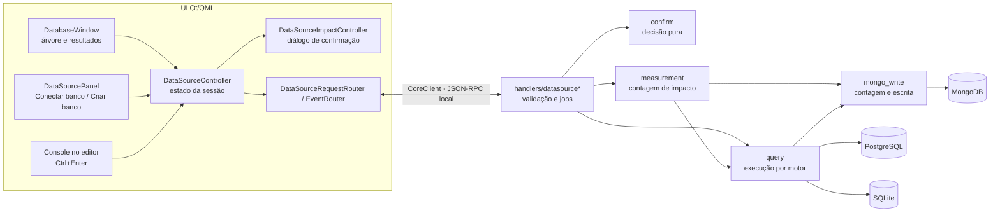
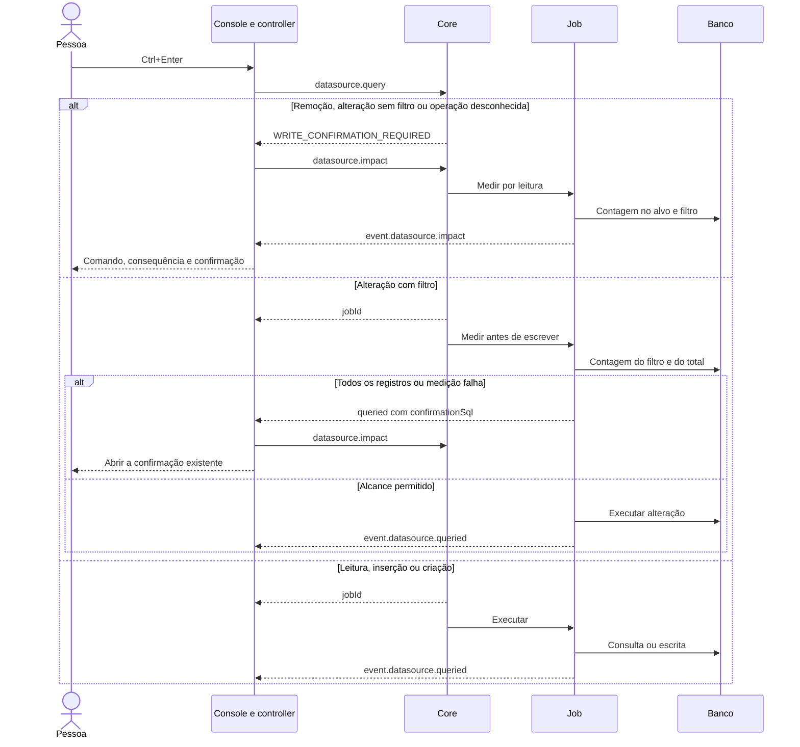
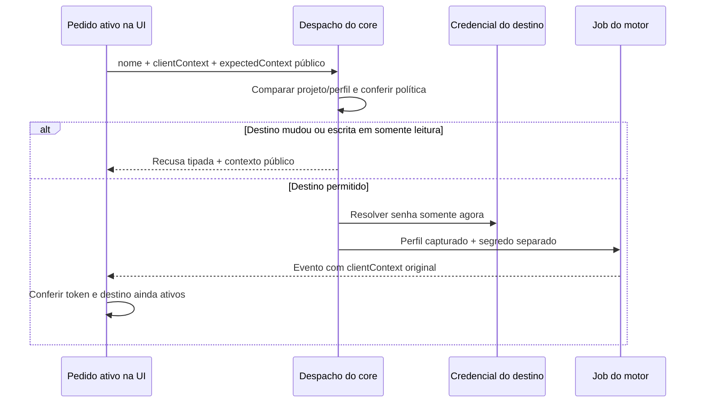
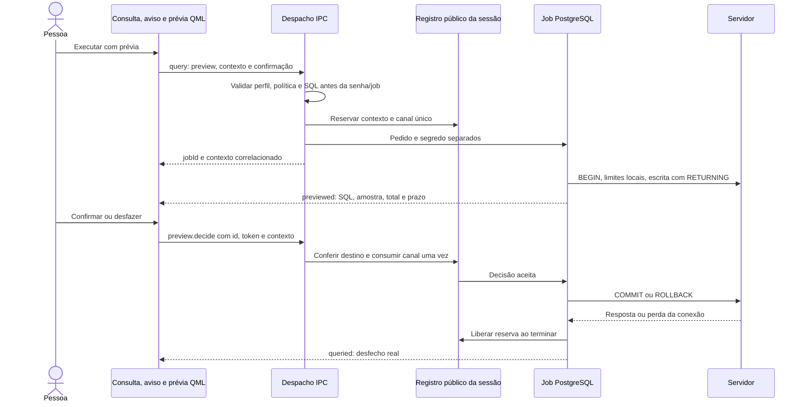
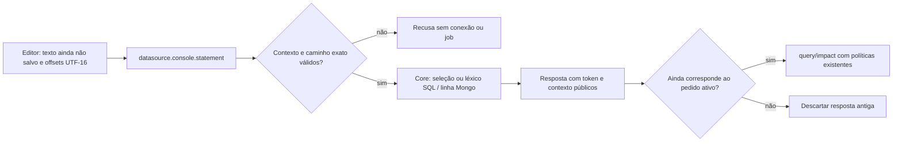

# 37 — Banco de dados: execução, confirmação e continuidade

<!-- caminhos-conferidos -->

> **Classe: ESTADO.** Conferido contra o código em 2026-10-06, nas fatias do
> passo 7 da [0.3.9](../roadmaps/59-fechamento-da-0.3.9.md).
> O contrato do fio pertence ao [03](03-protocolo-ipc.md); o uso, ao
> [manual](../manual.md); a fila, ao [40](../roadmaps/40-estado-e-continuidade.md).
> O aceite e as provas desta fatia ficam no [40.7](../roadmaps/40.7-registro-das-entregas.md).
> Este documento explica o desenho e os limites; não encerra o passo 7.

O [desenho 38](38-provedores-de-banco-e-linguagem.md), decidido em 2026-10-07,
planeja expansão por adaptadores e provedores LSP, MongoDB moderno e InfluxDB 3
nativo. É PLANO: o estado de execução descrito aqui permanece a base atual.
O [39](39-drivers-externos-e-compatibilidade.md) detalha a revisão anterior
ao código: drivers em processos atualizáveis, contratos negociados e
migração gradual. A extração ainda não ocorreu no produto.

## 1. O que foi retomado

A sessão de 2026-10-04 parou durante a troca do formulário de PostgreSQL
para MongoDB. Havia código de escrita MongoDB e de confirmação seletiva,
com protocolo `0.156.0`, ainda sem commit. A retomada revisou essa base,
acrescentou testes de despacho e corrigiu o caminho das alterações que,
apesar de terem filtro, atingem todos os registros.

O Banco continua sendo uma janela acoplada, com árvore e resultados.
O console é um arquivo do editor: `.kinein/consoles/v1/*.sql` ou `*.mongo`.
Consoles antigos preservam seu arquivo e vínculo quando não há ambiguidade.
A composição dos slots e o foco pertencem à [casca](36-casca-da-ide.md).
O diálogo edita ou cria conexões; ele não substitui o console.



## 2. Quem é dono de cada responsabilidade

Os caminhos são relativos à raiz do repositório.

| Responsabilidade | Dono |
| --- | --- |
| Perfis e catálogo tipados | `crates/kinein-protocol/src/datasource.rs` |
| Consulta e impacto tipados | `crates/kinein-protocol/src/datasource_query.rs`, `crates/kinein-protocol/src/datasource_impact.rs` |
| Persistir, normalizar e validar perfil | `crates/kinein-core/src/datasource/mod.rs`, `crates/kinein-core/src/datasource/store.rs` |
| Descrever adaptadores implementados e campos do formulário | `crates/kinein-core/src/datasource/providers.rs`, `crates/kinein-protocol/src/datasource_provider.rs` |
| Política de segredo e conexão PostgreSQL | `crates/kinein-core/src/datasource/secret.rs`, `crates/kinein-core/src/datasource/connection.rs` |
| Léxico SQL comum, fronteiras e leitura do lote inteiro | `crates/kinein-core/src/datasource/sql_syntax.rs` |
| Classificar por motor e construir contagens | `crates/kinein-core/src/datasource/classification.rs`, `crates/kinein-core/src/datasource/impact.rs` |
| Produção, somente leitura, contexto e nomes | `crates/kinein-core/src/datasource/policy.rs`, `crates/kinein-protocol/src/datasource_policy.rs` |
| Decidir se uma operação pede confirmação ou medição silenciosa | `crates/kinein-core/src/datasource/confirm.rs` |
| Medir o alcance; promover operação desconhecida ou contagem falha | `crates/kinein-core/src/datasource/measurement.rs` |
| Gramática MongoDB, sem avaliação local de JavaScript | `crates/kinein-core/src/datasource/mongo_command.rs` |
| Operações do driver MongoDB e contagem exata | `crates/kinein-core/src/datasource/mongo_write.rs` |
| Leitura com teto e execução por motor | `crates/kinein-core/src/datasource/query.rs` |
| Jobs de consulta e impacto | `crates/kinein-core/src/handlers/datasource_query.rs`, `crates/kinein-core/src/handlers/datasource_impact.rs` |
| Ponte existente e eventos | `ui/src/core_client_datasource.cpp`, `ui/src/core_client_notifications.cpp` |
| Pedidos e respostas da UI | `ui/qml/ipc/DataSourceRequestRouter.qml`, `ui/qml/ipc/DataSourceEventRouter.qml` |
| Composição, perfis e rascunho | `ui/qml/datasource/DataSourceController.qml` |
| Identidade, expansão e seleção da árvore | `ui/qml/datasource/DataSourceTree.qml` |
| Contexto do menu e despacho das ações existentes | `ui/qml/datasource/DatabaseTreeActions.qml` |
| Barra, árvore visual e menu na camada da janela | `ui/qml/datasource/DatabaseToolbar.qml`, `ui/qml/datasource/DatabaseTreeView.qml`, `ui/qml/datasource/DatabaseWindow.qml` |
| Instruções dos objetos do catálogo | `crates/kinein-core/src/datasource/object_statements.rs` |
| Acrescentar modelos ao buffer sem substituir edições | `ui/qml/editor/EditorAppendController.qml` |
| Credencial vinculada ao destino e retomada pública | `ui/qml/datasource/DataSourceSecretController.qml` |
| Consulta e descarte de resposta antiga | `ui/qml/datasource/DataSourceQueryController.qml` |
| Pedidos de teste e catálogo por destino | `ui/qml/datasource/DataSourceCatalogController.qml` |
| Padrões e textos por motor | `ui/qml/datasource/DataSourceKinds.qml` |
| Estado do aviso e apresentação | `ui/qml/datasource/DataSourceImpactController.qml`, `ui/qml/datasource/SqlImpactDialog.qml` |
| Contrato, registro e decisão da prévia | `crates/kinein-protocol/src/datasource_preview.rs`, `crates/kinein-core/src/datasource/preview.rs`, `crates/kinein-core/src/handlers/datasource_preview.rs` |
| Elegibilidade, execução e amostra PostgreSQL | `crates/kinein-core/src/datasource/preview_sql.rs`, `crates/kinein-core/src/datasource/preview_postgres.rs`, `crates/kinein-core/src/datasource/preview_rows.rs` |
| Estado público e janela da prévia | `ui/qml/datasource/DataSourcePreviewController.qml`, `ui/qml/datasource/DataSourcePreviewDialog.qml` |
| Seleção de opções, foco e setas | `ui/qml/components/KvSegmentedControl.qml` |

A confirmação nasce no core. A UI apresenta a classificação recebida e
coordena o gesto; nenhum clique no seletor decide se uma consulta é segura.

Todo o lote SQL é classificado antes do job. Uma leitura inicial não
pode esconder `COMMIT` seguido de remoção: qualquer instrução que exige
confirmação interrompe o lote inteiro antes de abrir a conexão.

## 3. O caminho de uma consulta

A política foi alterada pelo autor em 2026-10-04 para evitar interromper
toda escrita de desenvolvimento. `confirm` decide sobre a classificação:

| Operação | Caminho |
| --- | --- |
| Leitura | Executa com teto; PostgreSQL e SQLite impõem leitura no motor |
| Inserção e criação | Executa diretamente |
| Alteração com filtro | Mede em silêncio num job; executa se a medição permite |
| Alteração em massa sem filtro | Recusa antes do job e pede confirmação |
| Apagar, esvaziar, remover objeto | Pede confirmação, mesmo com filtro |
| `REPLACE` / `INSERT OR REPLACE` / `UPDATE OR REPLACE` | Pede confirmação: substituição pode apagar registro anterior |
| SQL não classificado, como `CALL` ou `DO` | Pede confirmação; impacto desconhecido exige nome digitado |



O evento que interrompe a medição silenciosa leva `confirmationSql` com o
texto exato. O controller compara texto, conexão e `clientContext` com o pedido ativo
antes de abrir o aviso. Mudança de projeto ou perfil invalida esse contexto. Uma resposta de uma consulta anterior não deve abrir um
diálogo para a consulta nova.

O diálogo espera a medição terminar. Na operação destrutiva exige o nome
do alvo; sem alvo conhecido, usa o nome da conexão. No MongoDB, o ponto
pertence ao nome da coleção: `telemetria.sensores` exige esse nome inteiro,
e `sensores` não libera a confirmação. Cancelar não envia escrita.
Confirmar reenvia o mesmo texto com `confirmWrite: true`.

**Limites reais:** contagem e execução usam conexões/operações separadas.
Essa contagem não congela o banco: alterações concorrentes podem mudar o alcance.
A execução PostgreSQL com prévia é um caminho explícito separado (§9).
A classificação SQL é uma análise limitada; não prevê efeitos de
triggers, funções e cascatas. Ela não substitui as permissões do servidor.

Desde o `0.158.0`, handler e executor SQL usam o mesmo léxico para conferir
o lote inteiro, incluindo CTE mutante, comandos de transação, comentários,
identificadores delimitados e blocos com dólar. Entrada incompleta ou ambígua
não é promovida a leitura. O parser conserva fronteiras em bytes UTF-8.
Isso continua sendo classificação conservadora, não um parser completo nem
uma sessão comum de transação mantida entre pedidos. A prévia da §9 tem
seu próprio contrato, prazo e conexão pertencendo ao worker.

## 4. MongoDB e a gramática do console

Um comando por execução. A forma é `colecao.operacao(argumentos JSON)`,
com os argumentos convertidos em BSON; Extended JSON permite valores como
`{"$oid":"..."}`. A forma anterior `colecao {filtro}` continua lendo.

```text
sensores.find({"placa":"esp32"})
sensores.insertOne({"placa":"esp32","valor":21})
sensores.insertMany([{"placa":"pico"},{"placa":"pi"}])
sensores.updateOne({"placa":"pico"},{"$set":{"ativo":true}})
sensores.updateMany({"placa":"esp32"},{"$inc":{"valor":1}})
sensores.deleteOne({"placa":"pi"})
sensores.deleteMany({"ativo":false})
sensores.drop()
```

O parser identifica a operação antes dos argumentos. Uma string como
`"log.find("` dentro de um documento continua sendo dado. Chaves precisam
de aspas JSON; blocos JavaScript, métodos desconhecidos e comandos
encadeados são recusados. O nome da coleção é validado, e escrita em
`system.*` é recusada antes do driver.

`insertMany` exige uma lista não vazia de objetos. `updateOne/Many`
exigem filtro e documento de alteração com operadores; não aceitam
documento de substituição. `deleteOne/Many` aceitam filtro ausente, mas
sempre pedem confirmação. `drop` não aceita argumentos.

A medição usa `count_documents` com o mesmo filtro, e uma contagem exata
para o total. `deleteOne/updateOne` limitam a contagem atingida a um.
`updateMany/deleteMany` que alcançam toda uma coleção não vazia são
promovidos a destrutivos. O retorno `affected` contém inseridos,
modificados ou apagados; numa remoção de coleção, a contagem anterior.
A leitura mostra a união dos campos de primeiro nível e valores em JSON.

## 5. Conectar e criar são gestos diferentes

**Conectar banco** prepara o perfil de um banco existente.
**Criar banco…** cria arquivo SQLite, servidor em contêiner ou banco no
PostgreSQL selecionado. O comando do contêiner aparece antes da execução.
A IDE valida nomes e executa argumentos de processo; o texto da prévia
não é enviado a um shell.

O formulário usa o seletor segmentado em motor, origem da senha e TLS.
A criação usa o mesmo componente, com opções indisponíveis desabilitadas.
Tab chega ao seletor; setas percorrem opções disponíveis; a escolha é
emitida por sinal, preservando o binding do dono. Os campos e botões do
Banco participam explicitamente do percurso de Tab. A prova na tela achou
e corrigiu o salto que saía do seletor direto para os controles da janela.

`DataSourceKinds` fornece os padrões ao rascunho inicial e à troca de motor:

| Motor | Host | Porta | Banco |
| --- | --- | --- | --- |
| PostgreSQL | `/var/run/postgresql` | 5432 | `postgres` |
| MongoDB | `localhost` | 27017 | `test` |
| SQLite | vazio | 0 | vazio; a pessoa informa o arquivo |
| Outro banco (ODBC) | vazio | 0 | DSN escolhido no registro local |

Ao trocar de motor, campos ainda iguais ao padrão anterior ou vazios
recebem o novo padrão. Valores personalizados são preservados. A senha da
sessão é apagada; o tamanho da amostra MongoDB sobrevive a editar outro
campo e ao salvamento.

## 6. Provas reproduzíveis

| Prova | Comando ou arquivo |
| --- | --- |
| Despacho, recusa antes do job e medição que impede alteração global | `cargo test -p kinein-core datasource --all-features`; `crates/kinein-core/src/tests/datasource_query.rs` |
| Gramática, Extended JSON e tentativas inválidas | Testes de `mongo_command.rs` |
| Mudança de motor, amostra e recusa antiga | `scripts/qml-harness/tst_datasource_defaults.qml` |
| Seletor, opções desabilitadas e binding | `scripts/qml-harness/tst_kv_segmented_control.qml` |
| Nome completo na confirmação, inclusive coleção com ponto | `scripts/qml-harness/tst_datasource_impact.qml` |
| PostgreSQL/MongoDB reais, senha, escrita e impacto | `python3 scripts/testar-banco-real.py` |
| Mesmos servidores e projeto para gesto na IDE | `python3 scripts/testar-banco-real.py --ui` |
| Aceite da fatia | `bash scripts/verificar.sh --completo --estrito` e registro no 40.7 |

A prova real exige os binários de debug atualizados e as imagens locais
`postgres:16-alpine` e `mongo:7`. Não baixa imagens. Usa contêineres
temporários com portas só no loopback, senha de teste gerada em memória e
XDG isolado. O HOME é o real. Em `--ui`, fechar a IDE remove o projeto,
as XDG de teste e os contêineres. Capturas devem conter só a janela da IDE.

**Referências consultadas em 2026-10-05 (MODE-D).**
[Confirm Drop, DataGrip 2026.2](https://www.jetbrains.com/help/datagrip/confirm-drop-dialog.html):
prévia do comando antes de remover o objeto, adaptada ao protocolo e ao
diálogo existentes.
[Accessible, Qt Quick 6.11](https://doc.qt.io/qt-6/qml-qtquick-accessible.html):
papel, nome, seleção e ação acessível do controle. Nenhum código ou runtime
da referência foi incorporado.

## 7. ODBC: descoberta e carregamento são operações distintas

A decisão, alternativas e licenças estão no
[ADR-0007](../decisoes-adr/ADR-0007-odbc-com-consentimento.md).
Protocolo `0.157.0`: motor `odbc`, com DSN em `database` e segredo pelo
contrato existente. O formulário lista o que está registrado na máquina.
Não configura DSN, instala driver ou cria banco pelo ODBC.

```mermaid
sequenceDiagram
  actor user as Pessoa
  participant ui as UI / OdbcController
  participant core as Core
  participant manager as unixODBC
  participant driver as Driver local
  ui->>core: datasource.odbc.sources
  core->>manager: SQLDataSources / SQLDrivers
  manager-->>ui: DSN, driver e identidade (sem conectar)
  user->>ui: Testar, abrir estrutura ou executar consulta
  ui->>core: datasource.test / introspect / query
  core-->>ui: DRIVER_APPROVAL_REQUIRED antes do job
  ui-->>user: Aviso de código nativo; Cancelar em foco
  alt Cancelar
    user->>ui: Cancelar ou Esc
    Note over core,driver: Sem conexão nem carregamento
  else Carregar driver
    user->>ui: Carregar driver
    ui->>core: datasource.odbc.authorize com projeto e desafio
    core->>core: Conferir perfil e driver; guardar só em memória
    core-->>ui: Autorização correlacionada
    ui->>core: Repetir a operação original
    core->>manager: SQLConnect com campos separados
    manager->>driver: Carregar biblioteca e conectar
    driver-->>ui: Catálogo ou resultado limitado
  end
```

### Donos da fatia

| Responsabilidade | Dono |
| --- | --- |
| Mensagens de descoberta e autorização | `crates/kinein-protocol/src/datasource_odbc.rs` |
| Descoberta, identidade, sessão e conexão | `crates/kinein-core/src/datasource/odbc.rs` |
| Validação antes de criar job | `crates/kinein-core/src/handlers/datasource_odbc.rs` e handlers de Banco |
| Classificação conservadora e execução | `crates/kinein-core/src/datasource/odbc_query.rs` |
| Catálogo e leitura escapada de tabela | `crates/kinein-core/src/datasource/odbc_catalog.rs` |
| Buffer comum de consulta e catálogo | `crates/kinein-core/src/datasource/odbc_rows.rs` |
| Correlação do erro com o pedido original | `ui/src/core_client_dispatch.cpp`, `ui/src/core_client_process.cpp` |
| Estado da lista/aviso e repetição após o gesto | `ui/qml/datasource/DataSourceOdbcController.qml` |
| DSN e confirmação de carregamento | `ui/qml/datasource/DataSourceDsnPicker.qml`, `ui/qml/datasource/DataSourceDriverDialog.qml` |

A ponte guarda os parâmetros da consulta pendente por id RPC, sem senha;
retira-os ao receber a resposta. Anexa esse pedido ao erro entregue à UI,
sem acrescentá-lo ao log do protocolo. O controller confere projeto,
perfil, nome e texto antes de repetir. Resposta obsoleta não executa outro
comando. Autorizar driver não substitui a confirmação de escrita.

Catálogo usa `SQLTables`/`SQLColumns` em duas passagens, sem N+1. Recusa
catálogo incompleto, truncamento e mais de 500 tabelas ou 16.000 colunas.
`readSql` é aditivo em `DataSourceTable`; a UI conserva esse texto e envia
`maxRows: 200`, sem LIMIT de motor nativo. Delimitadores suportados: aspas
duplas, crase e colchete, com fechamento escapado. Sem delimitador, só
identificadores ASCII simples. Qualificação usa ponto; outros formatos
podem exigir SQL manual. Nenhuma compatibilidade com driver não provado
é presumida.

Console e catálogo conservam NULL; o buffer limita 128 colunas, 16 KiB por
célula e 8 MiB de resultado retido, incluindo a estrutura das linhas.
Mais linhas sinalizam `truncated`; célula cortada ou UTF-8 inválido é erro.
Login e statement recebem timeout de cinco segundos; um driver que ignora
o atributo não está isolado por esse limite.

**Política ODBC:** leitura simples e única pode executar diretamente.
Funções, CTE, sequências, escrita e sintaxe desconhecida pedem confirmação
pelo nome da conexão. Impacto é local, sem COUNT nem abertura do driver.
Leitura solicita transação sem autocommit e termina com rollback. Isso
não equivale a READ ONLY do servidor, nem cobre efeitos externos de views,
triggers ou código nativo. Drivers sem os recursos solicitados falham;
não há fallback que retira proteção. Só o primeiro conjunto de resultados
é exibido. Permissões do servidor continuam essenciais.

As aprovações não são salvas no projeto: mudar/fechar projeto e remover
perfil revoga o consentimento. Identidade por caminho/tamanho/mtime
detecta alterações usuais, com precedência Driver64; não oferece pin de
conteúdo contra mudanças externas. Diagnósticos arbitrários são removidos
na fronteira de driver para evitar eco de credenciais; SQLSTATE é mantido.
Tracing configurado fora da IDE permanece sob controle do usuário.

**Provas reproduzíveis:** `crates/kinein-core/src/tests/datasource_odbc.rs`,
`scripts/qml-harness/tst_datasource_odbc.qml` e
`python3 scripts/testar-odbc-real.py --driver /caminho/do/driver.so`.
O script nunca baixa driver, isola ODBC/XDG e limpa seus arquivos.
Acrescente `--ui` para gesto real na IDE; capture somente a janela.

## 8. Produção, somente leitura e contexto — 0.158.0

**Implementado e validado no checkout; aceite e provas no 40.7 §7.222.**
`production` e `readOnly` são preferências públicas, persistidas no perfil,
com padrão falso. O formulário usa `KvSegmentedControl`; árvore, console e
resultado mostram o destino e a política. Salve alterações antes de conectar.

| Perfil/operação | Decisão do core |
| --- | --- |
| Desenvolvimento: inserir/criar/alterar com filtro | Política seletiva da §3 |
| Produção: qualquer escrita | Aviso explícito antes de executar |
| Produção: remoção, alteração global ou operação desconhecida | Confirmação com nome exato da conexão e alvo fornecido pelo core |
| Somente leitura: escrita, lote mutante ou operação desconhecida | `READ_ONLY_VIOLATION`, antes de senha, aprovação ODBC e job |
| Remover somente perfil | Alteração de configuração permitida, inclusive em produção/somente leitura |
| Remover dados de produção | Nome exato da conexão e banco/arquivo; `readOnly` recusa |

As duas opções podem coexistir: produção destaca o destino, e somente
leitura continua recusando escrita mesmo com `confirmWrite: true`.
O caminho nativo também confere `readOnly` antes de abrir a conexão;
PostgreSQL e SQLite mantêm a proteção de leitura do motor. ODBC conserva
as restrições e os limites da §7. Funções, triggers e efeitos externos
continuam dependendo das permissões do servidor; a IDE não oferece sandbox
de banco universal. Contagem e execução ainda são separadas.

O léxico nativo reconhece LF e CR como fim de comentário de linha; `$$`
colado a identificador, inclusive Unicode, não abre string. A regra de
dólar acompanha a [estrutura léxica do PostgreSQL](https://www.postgresql.org/docs/16/sql-syntax-lexical.html).
ODBC também encerra comentário em LF/CR em seu classificador conservador.
Testes tentam esconder COMMIT/DELETE nessas formas antes de senha/job.



`expectedContext` contém `{ workspace, profile }` com a cópia pública do
perfil salvo. `clientContext` identifica o pedido, inclusive para o mesmo
SQL e para reabertura do mesmo caminho. A UI o ecoa na medição e descarta
resultados antigos de consulta, teste, catálogo e remoção. O token não é
segredo nem autorização: o core confere o perfil e a política novamente.
Clientes antigos podem omitir contexto; a UI atual sempre o envia.

A senha de sessão tem dono: projeto e chave canônica do perfil completo.
`passwordFor(name)` é usado por consulta, teste, catálogo, impacto e remoção.
Outro nome, outro host/DSN, edição, remoção, fechamento ou troca de projeto
revoga a credencial. Operações pendentes guardam apenas intenção pública.
Quando o console pede senha, a UI seleciona o perfil certo e Enter repete
o SQL, teto e propósito originais com token novo. `CREATE DATABASE` começa
sem confirmação presumida; seu perfil derivado usa o destino capturado.

Uma remoção PostgreSQL aceita senha de sessão pelo mesmo fio redigido no
log. No fim do job, `remove_unchanged` compara o perfil capturado e conserva
uma substituição de mesmo nome. As leituras/escritas do catálogo feitas por
este core são serializadas por mutex; outro processo editando o JSON não
participa desse mutex, e isso não é uma transação entre processos.

`event.datasource.queried.access` informa `read` ou `write`, inclusive quando
nenhuma linha mudou. Uma falha no caminho de escrita pode ter efeitos parciais;
o evento não promete rollback de um lote ou de `insertMany`.

Provas específicas: `tst_datasource_secrets`, `tst_datasource_context`,
`tst_datasource_retry`, `tst_datasource_catalog_context` e
`tst_datasource_destroy_policy`, além de `tests/datasource_policy.rs`.
`python3 scripts/testar-banco-real.py --policy` acrescenta bancos reais,
conferência independente, nomes parciais, CTE/lote, teste/catálogo com contexto
e remoção PostgreSQL com senha. `--ui` mantém o ambiente para gestos e limpa
o que criou ao encerrar a IDE.

## 9. Prévia PostgreSQL — 0.159.0

**Implementada; aceite da fatia pendente no 40.7 §7.223.** Plano antes do
código no 59 §5.11. A prévia executa uma escrita real e conserva a transação
pendente até uma decisão; não é simulação nem a contagem de impacto da §3.
O aviso antecede a execução, também em Desenvolvimento. Produção e somente
leitura mantêm suas regras; não há atalho por `confirmWrite`.



### Elegibilidade e SQL executado

`preview_sql` usa o mesmo léxico `SqlScan` da política. Aceita somente uma
instrução direta `INSERT`, `UPDATE` ou `DELETE` PostgreSQL; recusa lotes,
controle de transação, comandos fora desse recorte e léxico ambíguo.
É uma regra conservadora de elegibilidade, não um parser SQL completo nem
sandbox. CTE inicial não tem prévia nesse recorte.

Sem RETURNING explícito no nível da instrução, acrescenta `RETURNING *`
antes de comentários finais; com RETURNING, conserva a cláusula. Literais,
identificadores, comentários, dólar e posições UTF-8 passam pelo léxico
comum. O SQL original e o executado ficam visíveis separadamente. As linhas
vêm do [RETURNING do PostgreSQL](https://www.postgresql.org/docs/16/dml-returning.html):
na alteração são os valores novos; na remoção são os valores removidos.
O tamanho da amostra não limita o alcance da escrita.

A medição silenciosa de produção pode promover um filtro que pega todos
os registros para confirmação por nomes. Nesse caso ainda não houve prévia
executada: `queried` informa `access: write` e `confirmationSql`, libera a
reserva e a UI retorna ao aviso mantendo a intenção de prévia.

### Donos, capacidade e descarte

O registro `preview::Session` pertence ao Core. Guarda apenas cópia pública
do projeto/perfil, token, identificador, job, prazo e canal de decisão.
Não guarda SQL, senha, driver ou conexão. `Lease` é a reserva do worker:
até quatro vivas por core, uma por projeto/nome de conexão. A capacidade
permanece ocupada durante cancelamento e finalização, e é liberada antes
do evento terminal. Identificador desconhecido, não pronto, repetido,
expirado ou com contexto diferente é recusado.

O job mantém conexão, senha e transação. Um runtime Tokio de uma thread
é criado somente para esse worker; o driver é drenado enquanto se espera
a decisão. O despacho IPC continua disponível. `tokio-postgres` 0.7.18,
`tokio` 1.53.1 e `futures-util` 0.3.34 já eram transitivos no lock e agora
são dependências diretas explícitas. Não entrou crate ou versão nova.
Licenças, escopo e verificação constam no registro de componentes abertos.

Troca/fechamento do projeto, alteração/remoção do perfil, shutdown e
cancelamento descartam decisões ainda pendentes. COMMIT confere o perfil
salvo novamente antes de consumir o canal. Depois do aceite, cancelar o
job retorna falso: a IDE não promete revogar um comando que já pode ter
chegado ao servidor. O controller QML guarda só dados públicos, cancela
aceite/resultado antigo e não reabre a janela para outra consulta.
**Desfazer** recebe o foco inicial; Esc/clique fora solicitam rollback.
SQL solicitado/executado, aliases, células, dicas e mensagens da grade são texto
literal. Dados não confiáveis não ganham links ou imagens por AutoText;
`tst_kv_data_grid_plain_text` reproduziu links nesses pontos antes da
correção e verifica o resultado desenhado, sem abrir URLs.

### Orçamentos e desfechos

| Recurso | Limite desta implementação |
| --- | --- |
| Conexão | 5 s no socket do driver; timeout de 6 s na future de conexão |
| Consulta | statement_timeout 10 s, lock_timeout 1 s, 15 s totais no worker |
| Decisão | 60 s após a amostra ficar pronta |
| Transação ociosa | idle_in_transaction_session_timeout 65 s no servidor |
| COMMIT/ROLLBACK | 12 s no cliente; statement_timeout local continua valendo |
| Amostra | maxRows: padrão 500, máximo 10.000; 128 colunas, 16 KiB por célula, 8 MiB de células retidas |

**Limite do resolvedor ainda a tratar:** host com nome usa DNS/NSS bloqueante
no pool do Tokio. A future de conexão pode vencer em 6 s, mas o Drop do
runtime espera esse trabalho terminar; o evento terminal do job pode chegar
mais tarde se o resolvedor do sistema travar. O laço IPC continua livre e a
reserva permanece ocupada, limitando o total de prévias em limpeza. Não
apresentar esse timeout como teto absoluto de duração do job com DNS.
Os fontes resolvidos de `tokio-postgres`/Tokio confirmam esse caminho; a
[documentação de Runtime](https://docs.rs/tokio/latest/tokio/runtime/struct.Runtime.html)
explica a espera de tarefas bloqueantes no encerramento. Corrigir e provar
esse ciclo na revisão de recursos/segurança antes do fechamento da 0.3.9;
não trocar por shutdown_background que permita acumular resoluções órfãs.

O stream drena todas as linhas e usa o total do comando do servidor, mesmo
quando só retém uma amostra. NULL permanece nulo. Erro SQL, limite de
célula/coluna/memória ou tempo excessivo encerra a execução/conexão. O driver
aloca a mensagem recebida antes da validação de cada célula; esses limites
não são um teto absoluto da memória de todos os frames na rede. O caminho
comum `postgres::simple_query` ainda coleta um Vec: esta fatia não resolve
seu consumo na consulta ordinária.

`committed` e `rolledBack` só chegam após a resposta correspondente.
Expiração/cancelamento com ROLLBACK reconhecido chegam como `expired`/
`cancelled`; sem reconhecimento de rollback, há falha, sem afirmar que o
servidor o confirmou. COMMIT recusado com severidade tipada ERROR é `failed`,
exceto resultado desconhecido (`40003`) ou classe de conexão (`08`). FATAL,
PANIC, perda de transporte ou timeout durante COMMIT são `unknown`.
Ter SQLSTATE, sozinho, não prova que COMMIT foi recusado. A pessoa deve
conferir os dados em outra conexão antes de repetir.

Rollback não recupera valores consumidos de [sequências](https://www.postgresql.org/docs/16/functions-sequence.html)
nem efeitos externos de funções/triggers. Locks e efeitos no servidor
existem durante a prévia; não há promessa de ausência de efeitos colaterais.

A configuração de conexão/TLS é compartilhada com as operações síncronas.
O perfil TLS verificado define `SslMode::Require` explicitamente; sem TLS,
define `Disable`. Isso corrige o fallback indevido do padrão `Prefer`,
reproduzido por teste antes da correção e por servidor real sem TLS.

### Provas reproduzíveis

Testes unitários: `preview_tests.rs`, `preview_sql.rs`, `preview_rows.rs`,
contrato `datasource_preview.rs` e conexão `connection_tests.rs`.
`tst_datasource_preview` tenta contexto antigo, decisão repetida, expiração
da UI, descarte, cancelamento antes da amostra e preservação de decisão aceita.

`python3 scripts/testar-banco-real.py --preview` acrescenta PostgreSQL real:
commit/rollback com psql independente, NULL, UPDATE FROM, RETURNING explícito,
sequência não recuperada, recusa somente leitura/contexto/TLS/lote,
cancelamento, perfil/projeto alterado, amostra de 2 para 3.000 alterações,
célula hostil, erro SQL, lock_timeout, expiração real de 60 s, constraint
diferida que recusa COMMIT e duas perdas de resposta durante COMMIT.
A última mata somente o backend dentro do contêiner descartável da prova,
confere recuperação e saldo por outra conexão; nunca usa banco do autor.
`--ui` conserva esse ambiente até o fechamento normal da janela e limpa
os contêineres/projeto/XDG. O aceite completo fica no 40.7, sem tratar uma
prova intermediária como fechamento do passo 7.

## 10. Onde continuar

### Console: arquivo, vínculo e instrução (0.160.0, 2026-10-06)

Validado no 40.7 §7.225. Rótulos das abas são um mapa de apresentação
produzido pelo controller do console, com caminhos exatos como chaves;
o editor não chama uma função guardada em propriedade dinâmica.

O core fornece consoleBindings junto do workspace e perfis: caminhos exatos
para cada nome. A UI não deriva fileStem nem aceita subcaminhos por prefixo.
Consoles novos vivem em `.kinein/consoles/v1/<prefixo>--<sha256>.sql` ou
`.mongo`: prefixo ASCII de até 32 bytes e SHA-256 completo do nome UTF-8.
A aba mostra o nome da conexão; o caminho continua identidade de documento.

Legado só conserva vínculo quando há exatamente um perfil com seu nome
antigo/extensão. Colisão deixa o texto antigo intacto e sem vínculo de
execução; cada perfil ganha arquivo novo. Não há migração ou sobrescrita.
console_fs abre diretórios/arquivo com NOFOLLOW, verifica regularidade com
NONBLOCK, publica header completo por renameat NOREPLACE e recusa links,
FIFO e diretórios. Header escapa o nome numa linha. Não há isolamento contra
renomeações posteriores de outro processo do mesmo usuário.



Limite do texto: 1 MiB. Offsets inválidos ou entre pares surrogate são
recusados. Seleção explícita preserva seu texto; separação automática exige
léxico válido e divide apenas fora de literais/comentários/parênteses.
Não resolve senha nem abre banco nessa etapa. O bridge não registra o buffer
nem a instrução dessa operação nos logs. Isso não é uma auditoria completa
dos logs de todos os métodos da IDE, pendente no passo 8.

Chaves da árvore são tuplas JSON; mapas por nome têm protótipo nulo e
leitura de propriedade própria. Nomes com separadores, __proto__ ou
constructor não confundem estrutura, expansão ou leitura de outro perfil.
Testes tentam colisões, links/FIFO, oito criações concorrentes, nome com
newline, literais multilinha, Unicode, resposta antiga e contexto alterado.

### Seleção e ações da árvore (2026-10-06)

`DataSourceTree` mantém a chave selecionada e a conexão de origem. Enquanto
o catálogo está lendo, conserva a chave e mostra a conexão como seleção
provisória. A resposta preserva o objeto se ele existir; remoção retorna à
conexão. Workspace novo limpa expansão e seleção. A navegação usa o índice
lógico dessa seleção: o `currentIndex` transitório do ListView não decide o
próximo objeto nem a posição do menu.

`DatabaseTreeActions` conserva chave e contexto do menu (workspace e perfil
completo). Mudança de contexto ou remoção do objeto fecha o menu; uma ação
confere sua disponibilidade antes de fechar. O AppMenuPopup restaura o foco
ao ficar invisível, antes do sinal que pode abrir um diálogo. A camada cobre
a janela e não herda o recorte da árvore, incluindo o dock direito.

Releitura, console e dados reutilizam catálogo, console e consulta existentes.
Não há método IPC novo, nem SQL novo gerado pelo menu. `readSql` do ODBC é
encaminhado intacto. O seletor de motores reutiliza os padrões do formulário;
a paleta pertence ao Theme e a classificação dos objetos ao DataSourceKinds.
Shift+F10/F5 têm ShortcutOverride local enquanto a árvore está com foco.
O harness de composição também prova que restaurar foco não cancela a ação
nem rouba o foco do diálogo que ela abre.

A fila e o prompt de retomada ficam no
[59 §5.8](../roadmaps/59-fechamento-da-0.3.9.md).
Prévia PostgreSQL (§9) e profundidade do editor aceitas no 40.7 §7.223/224.
Base de console/árvore aceita no 40.7 §7.225; primeira fatia de ações no
§7.226. Modelos do catálogo e ações com impacto aceitos no §7.228;
releitura automática após execução aceita no §7.229 e Novo banco no menu
aceito no §7.230. Desconexão aceita no §7.231. Seguir localizar o objeto do console;
depois completion, histórico e grade no passo 7. O pente fino e o AppImage
seguem a ordem do 59 §7.

### Modelos e ações com impacto (2026-10-06, aceitos no 40.7 §7.228)

No protocolo 0.161.0, tabelas e coleções recebem `statements` do core.
`object_statements` delimita nomes de esquema/tabela/coluna e produz
SELECT, modelos incompletos INSERT/UPDATE e esvaziar/remover. SQLite esvazia
com DELETE; PostgreSQL com TRUNCATE. Visões só recebem leitura/remoção.
A leitura não leva `LIMIT` no texto (2026-10-08, 59 §5.4.1): quem limita é
o `maxRows` do pedido, como no ODBC, e o core diz quando cortou; com o limite
no texto, o "Carregar mais" da grade nunca aparecia na leitura da árvore.
Mongo confere os nomes pela gramática existente e não oferece alteração
para visões/séries temporais. ODBC conserva a leitura do driver e não
recebe dialeto de escrita inventado. Valores e filtro dos modelos devem
ser preenchidos no editor; os placeholders deixam o texto incompleto.

DataSourceTree transporta instruções do catálogo. Ver dados e console usam
a mesma leitura; o controller não monta mais SELECT em JavaScript.
DatabaseTreeActions envia modelos ao console e esvaziar/remover à consulta
normal não confirmada. O core recusa essas escritas antes da execução, e
o fluxo existente abre/mede/confirma o impacto, com contexto e políticas.
O menu apenas desabilita escrita em perfis somente leitura; a recusa efetiva
continua no core.

EditorAppendController vive na composição AppRouters e recebe o documento
e sua ponte existentes. Abas abertas não são relidas: texto sujo é conservado.
Uma inserção nativa no fim do buffer seleciona apenas o modelo e permite
desfazer. Para aba nova, espera a carga, confere novamente o contexto e
descarta a fila ao trocar de workspace ou falhar a leitura. Não executa
nem grava diretamente o arquivo. EditorController conserva seus donos e
tamanho anterior; não absorve esta responsabilidade.

### Releitura após execução (2026-10-06, aceita no 40.7 §7.229)

`classification::invalidates_catalog` aproveita os impactos já produzidos
no core. Alteração estrutural ou instrução relacional desconhecida, escrita
válida Mongo e operação ODBC que não é leitura invalidam o catálogo após
tentativa de execução. O evento `queried.catalogUpdate: reload` não afirma
commit: pode acompanhar erro de lote parcialmente aplicado. Recusa de
política/preflight, senha necessária e prévia pendente não geram esse sinal.

DataSourceQueryController confere token/perfil/workspace e consome resultado
terminal uma vez antes de encaminhar a invalidação. DataSourceCatalogController
usa a introspecção atual: se ocupada, guarda uma invalidação por conexão e
faz uma leitura posterior, descartando o snapshot anterior. Perfil/workspace
alterados descartam a fila; necessidade de credencial impede retry automático.
O resultado/erro da consulta permanece independente da releitura, e a árvore
conserva a seleção por identidade ou retorna à conexão se o objeto sumir.

Não há polling nem observação de bancos externos. DML relacional conhecido
não relê estrutura; efeitos indiretos ou alterações fora da IDE usam F5.
No Mongo a amostra de campos pode mudar após escrita. A ponte C++ transporta
o mapa do evento sem assinatura nova. Contratos de execução ficam em
`crates/kinein-protocol/src/datasource_query.rs`, separados de perfis/catálogo
e reexportados pela mesma API pública. Desenho e referências no 59 §5.1.3;
provas automatizadas e na IDE real no 40.7 §7.229.

### Novo banco no menu (2026-10-06, aceito no 40.7 §7.230)

DatabaseTreeActions oferece `database.create` no menu comum de +/Alt+Insert
e estado vazio. Fecha o menu antes de emitir a intenção; DatabaseWindow
encaminha ao ShellLeftWindowHost, que chama DataSourceController.openCreation.
O controller limpa senha/erro e usa a abertura/refresh existentes, sem trocar
perfil/rascunho nem iniciar criação. Não há pedido IPC novo; protocolo 0.162.0.

DataSourcePanelHost recebe a intenção por Connections e troca a face do
DataSourcePanel existente. Fechar ou mudar workspace devolve a face de
conexão. DataSourceDiscoveryController conserva os pedidos e o progresso de
criação; o editor e o resultado de consulta conservam seus donos.
No servidor só fica disponível para o rascunho idêntico ao PostgreSQL salvo
e sem readOnly; o core mantém a recusa efetiva. Desenho no 59 §5.1.4.

### Descritores dos motores atuais (2026-10-07, 0.164.0)

O registro `datasource/providers.rs` descreve os quatro adaptadores existentes.
`datasource.list/save/remove` levam seus descritores tipados pelo mesmo
CoreClient e roteador de perfis. O formulário e o menu de conexão recebem
essa lista; campos de endereço, credenciais, TLS verificado e amostra seguem
o descritor. Motor ausente não habilita Salvar nem adota padrões PostgreSQL.
Leitura de metadata não resolve segredo, conecta, instala ou carrega driver.

Identidade da implementação é distinta do motor: `builtin.postgres`,
`builtin.sqlite`, `builtin.mongo` e `system.odbc` descrevem o backend atual.
Não são IDs de instâncias nem seleções de ferramentas. Contextos públicos e
arquivo de perfis schema 1 conservam o formato. O formulário mantém seus
padrões de preenchimento no dono UI existente; validação permanece no core.
Os descritores não declaram permissões efetivas, versão de servidor nem
recursos LSP. A extração para processos e linguagem segue o 38/39.

### Desconexão e ciclo dos drivers (2026-10-07, 0.163.0)

`datasource.disconnect` exige workspace/perfil/token e não recebe senha.
O aceite cria um job; o evento `disconnected` só confirma sucesso depois de
liberar os trabalhadores daquele workspace/nome. Conexões comuns vivem por
operação. A prévia PostgreSQL (§9) mantém um driver vivo enquanto aguarda
decisão; limpar a árvore não encerra essa sessão.

| Responsabilidade | Dono |
| --- | --- |
| Contrato obrigatório e evento terminal | `crates/kinein-protocol/src/datasource_session.rs` |
| Leases por destino e barreira de encerramento | `crates/kinein-core/src/datasource/activity.rs` |
| Contexto, revogação e job de espera | `crates/kinein-core/src/handlers/datasource_session.rs` |
| Encerramento síncrono do pool MongoDB | `crates/kinein-core/src/datasource/mongo_client.rs` |
| Intenção/estado visual, sem driver ou buffer | `ui/qml/datasource/DataSourceSessionController.qml` |
| Descarte do catálogo após confirmação | `DataSourceCatalogController.detach` |
| Descarte de abertura/extração pendente, preservando vínculos | `DataSourceConsoleController.discard` |

Cada operação reserva uma lease antes de lançar seu trabalhador. Desconectar
recusa novos testes/leituras/consultas/impactos/remoções nesse destino, revoga
a autorização ODBC e a prévia pendente pelos donos existentes e espera num
job. A Condvar libera o mutex durante a espera; o despacho e outros destinos
continuam livres. Decisão de prévia já aceita conserva seu desfecho;
escrita comum já aceita pode concluir. Não há promessa de cancelamento
instantâneo ou rollback dessa escrita. A barreira sai antes do evento final.

O driver MongoDB 3.9.0 limpa o pool em segundo plano ao sofrer Drop. O guard
comum ao teste/catálogo/leitura/escrita/impacto aguarda `shutdown().run()`.
Ele nasce antes de cursores/sessões, que saem primeiro, inclusive em erro.
Não se retém cliente em outro dono nem se cria um executor novo.

O controller invalida pedidos/credencial/retry do destino, mas conserva o
catálogo enquanto aguarda. Só o evento correspondente retira seu snapshot;
perfil e texto do console permanecem. Token/job/perfil/workspace antigos
não alteram o estado. A linha mostra desconectando… e depois desconectado;
F5 ou nova consulta explícita usam os caminhos existentes. Outro catálogo
e seu pedido pendente continuam independentes. A abertura/extração pendente
do console desse destino é descartada antes do pedido de desconexão;
Ctrl+Enter enquanto encerra não reserva extração. Assim, uma resposta antiga
não inicia consulta depois do evento terminal nem reconecta sem novo gesto.

Prova reproduzível: `python3 scripts/testar-banco-real.py --disconnect`.
Usa imagens locais PostgreSQL 16/MongoDB 7, loopback, containers e XDG
temporários; não baixa driver/imagem. psql confere espera da consulta,
ROLLBACK pendente, COMMIT já aceito e ausência de sessões do core; currentOp
confere o pool MongoDB fechado em todos os caminhos. Perfis e consoles
mantêm bytes/texto. Desenho no 59 §5.1.5; registro no 40.7 §7.231.
