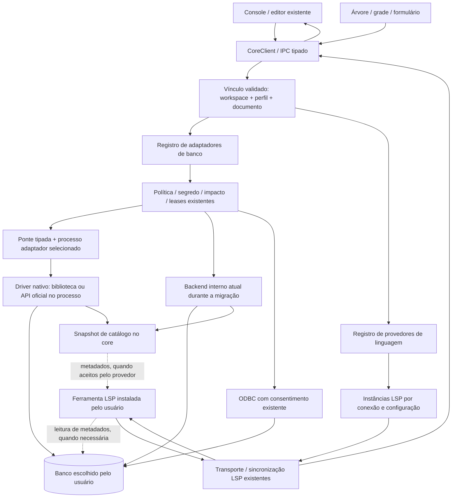

# 38 — Provedores de banco e de linguagem

<!-- caminhos-conferidos -->

> **Classe: PLANO.** Decisão do autor esclarecida em 2026-10-07; base lida:
> `main`, commit `33463a1`, protocolo `0.163.0`. A integração descrita aqui
> ainda não está integrada por inteiro. D1 entrega o registro de motores
> atuais em `0.164.0`; runtime externo e LSP continuam pendentes. A decisão está no
> [ADR-0009](../decisoes-adr/ADR-0009-banco-e-linguagem-por-provedores.md);
> execução atual no [37](37-banco-de-dados.md), fila no
> [59 §5](../roadmaps/59-fechamento-da-0.3.9.md).

> **Revisão anterior ao código, 2026-10-07, base `0214927`:** após a pesquisa
> do IntelliJ, atualização independente passa a incluir o driver em processo
> adaptador, conforme o [39](39-drivers-externos-e-compatibilidade.md) e o
> [ADR-0010](../decisoes-adr/ADR-0010-drivers-em-processos-versionados.md).
> Drivers internos são a transição; LSP e acesso continuam independentes.

## 1. Escopo decidido

A IDE orquestra ferramentas existentes. O suporte de linguagem de Banco
entra no fechamento da 0.3.9 como requisito (passos 10–11 do 59 §2), usando
o cliente LSP existente: completar
tabelas, colunas, palavras-chave e, no MongoDB, coleções, campos e operadores.
O alvo inclui PostgreSQL, SQLite, MongoDB moderno, MySQL/MariaDB e InfluxDB 3
nativo, sem ODBC para este último. MySQL/MariaDB nativo foi adiado pelo autor
em 2026-10-08 para versão futura (59 §2.3); até lá, segue pelo ODBC. MongoDB 3.x não é requisito de legado.
ODBC conserva seu caminho genérico e seu consentimento de sessão.

O usuário instala e atualiza servidores de banco, adaptadores externos e LSPs.
A IDE não os baixa, congela ou atualiza silenciosamente. Versões citadas são
revisões pesquisadas/testadas, não versões obrigatórias do produto.
Uma instalação usada em projetos existentes e uma versão mais recente usada
em projetos novos podem coexistir: o caminho da ferramenta é uma escolha
do usuário, com resolução por workspace e substituição explícita por conexão.

LSP é suporte de linguagem; driver/API é acesso ao banco. Um provedor LSP
pode atender vários motores e um motor pode aceitar vários provedores,
desde que dialeto, catálogo e recursos sejam compatíveis. A marca do banco
e a extensão `.sql` não bastam para escolher o servidor.

## 2. O que já existe e deve ser reutilizado

| Responsabilidade atual | Dono lido na base |
| --- | --- |
| Perfis e enum fechado `postgres/sqlite/mongo/odbc` | `crates/kinein-protocol/src/datasource.rs` |
| Validar/persistir perfis, obter segredo | `crates/kinein-core/src/datasource/mod.rs`, `store.rs`, `secret.rs` |
| Drivers, catálogo e execução | `crates/kinein-core/src/datasource/connection.rs`, `sqlite.rs`, `mongo.rs`, `query.rs`, `introspect.rs` |
| Processos, jobs e eventos | `crates/kinein-core/src/process.rs`, `stderr_tail.rs`, `jobs/context.rs`, `runtime.rs`; limites da reutilização no 39 §7 |
| Política, impacto, prévia e barreira de desconexão | `crates/kinein-core/src/datasource/policy.rs`, `measurement.rs`, `preview.rs`, `activity.rs` |
| Vincular console à conexão e extrair instrução | `crates/kinein-core/src/datasource/console.rs`, `console_statement.rs` |
| Descrever servidores C/C++, Rust e Python | `crates/kinein-core/src/lsp/registry.rs` |
| Transporte, inicialização, sincronização e consultas LSP | `crates/kinein-core/src/lsp/server.rs`, `handshake.rs`, `sync.rs`, `query.rs` |
| Selecionar processos LSP por chave estática de linguagem | `crates/kinein-core/src/lsp/manager.rs`, `session.rs` |
| Detectar ferramentas instaladas | `crates/kinein-core/src/tools/mod.rs`, `known.rs` |
| Estado visual de catálogo/segredo/sessão | `ui/qml/datasource/DataSourceCatalogController.qml`, `DataSourceSecretController.qml`, `DataSourceSessionController.qml` |
| Popup e apresentação de completion | `ui/qml/editor/EditorCompletionController.qml` |
| Ponte e roteamento do editor | `ui/src/core_client_requests.cpp`, `core_client_dispatch_lsp.cpp`, `ui/qml/ipc/EditorRequestRouter.qml`, `EditorEventRouter.qml` |

Hoje não há LSP para `.sql`/`.mongo`, adaptador InfluxDB ou catálogo
compartilhado no core. O snapshot carregado pertence ao controller QML.
O resultado de completion também não ecoa identidade de sessão/versão do
buffer; isso precisa mudar antes de alternar servidores entre conexões.
Nenhum desses itens é tratado como implementação já concluída.

## 3. Fronteiras e pontos de extensão

A resposta ao editor passa pelo transporte e pelo IPC. A gramática,
inferência e sugestões semânticas pertencem à ferramenta externa.
O core adapta protocolo, contexto e dados.

### 3.1 Adaptador de banco

O registro do domínio tem identificador estável, nome de apresentação,
campos públicos de conexão e operações/capacidades suportadas. Os contratos
iniciais cobrem consumidores reais: testar conexão, ler catálogo, consultar,
classificar/medir escrita e gerar instruções de objeto. Prévia transacional
e edição por chave primária são capacidades opcionais, com executor próprio.

Os módulos existentes tornam-se implementações desses pontos. Política,
validação de contexto, credencial, jobs e leases continuam comuns e antecedem
a chamada ao adaptador. Acrescentar um banco significa registrar seu
adaptador e provas; não espalhar `if engine` pelos controllers e handlers.
O formulário recebe campos tipados e capacidades do core, sem executar
expressões nem carregar componentes QML fornecidos por terceiros.

A fronteira alvo do driver é processo externo com API versionada, detalhada
no 39. O registro permite implementação interna durante a migração, sempre
com um backend por operação. A biblioteca mantida e os objetos de conexão/
transação ficam no adaptador externo; autorização e decisão continuam no core.

### 3.2 Provedor de linguagem

O registro descreve identificador, dialetos aceitos, ferramenta/runtime,
argumentos de inicialização, modo de catálogo e protocolo específico de
configuração. Há três modos distintos: sem catálogo; snapshot/DDL fornecido
pelo core; leitura de metadados pelo próprio servidor. Cada modo exige prova.

O adaptador produz configuração e, se necessário, documento virtual com
mapeamento de posições. Não implementa analisador SQL ou MongoDB. O resultado
oferecido à UI contém apenas recursos que a ferramenta anunciou e o cliente
sabe aplicar. Um fornecedor aceitar `sql` como `languageId` não prova
compatibilidade com PostgreSQL, SQLite ou InfluxDB.

### 3.3 Identificadores extensíveis, com migração controlada

O enum atual continua durante a primeira fatia: uma tabela de compatibilidade
traduz seus quatro valores para descritores internos. A primeira inclusão
de motor, InfluxDB 3, será precedida pelo contrato de identificadores
validados e formato versionado de perfil, substituindo o enum no fio.
Os valores existentes `postgres`, `sqlite`, `mongo`, `odbc` são preservados.

O novo formato separa identidade/política comum de opções públicas validadas
pelo adaptador. Opções desconhecidas não viram um `Value` persistido sem
validação; senha/token nunca entram nesse envelope. Migração lê e valida
todo o arquivo antes de gravar atomicamente. Provedor ausente/incompatível
mantém o perfil visível como indisponível e preserva seus dados, sem virar
PostgreSQL por padrão nem sobrescrever a lista com vazio.
Vínculos e nomes seguros dos consoles continuam pertencendo ao código atual.

Essa é extensibilidade do domínio Banco, sem antecipar o roadmap de plugins
da 0.5. LSPs e adaptadores de acesso alvo são processos externos independentes.
Drivers atuais ficam internos somente durante a migração; o consumidor do
contrato de acesso é o serviço Banco existente. D1a define perfis/API de
processo, D1b a ponte e D1c/D1d a extração de drivers, conforme o 39 §8.
Não haverá ABI Rust dinâmica, importação de host VS Code nem runtime de
extensões dentro de Qt. A prova MongoDB abaixo usa somente o servidor
extraído do artefato oficial, não executa a extensão.

### 3.4 Contratos dos descritores

Vocabulário previsto, a tipar na D1 conforme os consumidores do IPC:

| Descritor / estado | Dados públicos e responsabilidade |
| --- | --- |
| Adaptador de banco | `engineId`, rótulo, campos de conexão tipados, dialetos e operações suportadas; validação/configuração/driver pertencem ao módulo do motor |
| Provedor de linguagem | `providerId`, dialetos compatíveis, `toolId`, modo de catálogo, recursos esperados e adaptador de configuração; nenhum segredo no descritor |
| Escolha de ferramenta | Caminho de executável/runtime instalado, argumentos separados e opções públicas permitidas; origem da escolha e versão detectada |
| Capacidade efetiva | Recursos realmente disponíveis e motivos de ausência, após descoberta/negociação e política do perfil |
| Contexto de documento | `sessionId`, época do workspace, identidade do perfil, geração e versão do buffer; eco necessário para aceitar resposta |
| Snapshot de catálogo | Contexto público, revisão e objetos/tipos limitados; exportação específica só para provedor que sabe recebê-la |

Descrição de operação não concede execução: o adaptador recebe contexto
validado e segredo temporário só depois da política comum. Descritor LSP
não contém callback de consulta SQL. As extensões do protocolo específico
ficam no adaptador de linguagem, fora dos controllers.

## 4. Sessões, catálogo e respostas antigas

Um descritor reutilizável não é uma instância de processo. A identidade de
instância contém época do workspace, perfil completo/fingerprint público,
provedor, dialeto, geração de configuração e época da credencial. Segredo
não entra na chave, em hash exposto ou em log. O buffer pertence ao vínculo
validado, com revisão de catálogo e versão do texto em cada pedido.

Duas conexões PostgreSQL usam instâncias isoladas, mesmo com o mesmo binário.
Um processo global `sql` cuja conexão muda conforme a seleção não atende.
O registro passa a distinguir `ProviderId` de `InstanceId`, com chaves
próprias, sem converter identificadores dinâmicos em `&'static str`.
C/C++, Rust e Python preservam os contratos e comportamento atuais.

O novo dono do snapshot de catálogo será o core. Recebe o resultado do job
de introspecção existente; o controller conserva apenas a representação
visual. Identificadores, revisão, tipos, tamanho e origem acompanham o
snapshot. Um provedor que aceita DDL recebe exportação por seu adaptador,
sem consulta duplicada e sem SQL gerado no QML. Um provedor que exige conexão
própria declara isso; não se inventa uma API de importação de catálogo.

Ao alterar perfil/provedor, trocar workspace ou desconectar, invalidar
pedidos e caches da instância, fechar documentos e encerrar seus processos.
A barreira de `datasource.disconnect` passa a aguardar também o LSP e seus
auxiliares. Preservar perfil, console, buffer sujo e outras conexões.
Resposta de geração/versão anterior é descartada antes de abrir popup,
publicar diagnóstico ou aplicar edição. Digitar num console desconectado
não reconecta automaticamente o banco; o modo sem conexão deve ser real e
explicitamente suportado pelo provedor.

Criação é sob demanda, com limites de instâncias, fila, bytes e cache.
Espera por inicialização/consulta/encerramento ocorre fora do despacho.
Falha fica na instância, com motivo público; não derruba editor, driver ou
conexão vizinha. Evicção só alcança instância ociosa, nunca prévia/job vivo.
Orçamentos concretos serão definidos e medidos na fatia do runtime, usando
os timeouts e o mecanismo de espera LSP já existentes como base.

## 5. Atualizar ferramentas sem acoplar a IDE à versão do banco

O usuário escolhe executável/runtime instalado e pode substituí-lo sem
recompilar a IDE. O detector existente identifica ausência, versão pública
e falha de execução. A seleção automática só considera provedores
compatíveis; se houver mais de um, preferência explícita vence e a ordem
curada é documentada. Ausência de suporte não escolhe um dialeto aproximado.

Ao reiniciar a instância, ler `serverInfo` quando existir, negociar
`initialize`/capabilities e validar recursos mínimos. Versão anunciada é
evidência, não único teste: MongoDB não anunciou `serverInfo` na prova.
Sem versão detectável, mostrar desconhecida e validar o protocolo; não
fabricar um número. Recursos extras desconhecidos são ignorados. Mudança
de encoding, sync, formato de resultado ou comando customizado é tratada
somente pelo adaptador daquele provedor, com erro tipado quando incompatível.

O adaptador de banco descobre versão/capacidades pela API oficial e pelo
driver, usando um conjunto de operações comum. Não exigir igualdade com
o número usado na bateria de testes, nem recusar toda versão futura por
um teto arbitrário. Só habilitar recurso de versão quando comprovado.
Permissão efetiva é a interseção entre capacidade do adaptador, servidor,
perfil e operação; recursos de linguagem também dependem do LSP/cliente.

A matriz de aceitação terá uma versão moderna usada em projetos existentes
e uma versão recente para novos projetos, escolhidas na prova de cada motor.
Para MongoDB, a base real aceita é 7 e a série moderna 8 ainda precisa dessa
prova; o driver Rust 3.9.0 não significa servidor MongoDB 3.9.
O alvo InfluxDB é a geração 3; versão patch fica a cargo do usuário.

Essa fronteira reduz regressões e contém falhas; não garante que um protocolo
futuro incompatível funcione sem adaptação. Hoje as crates dos drivers nativos
são compiladas no core: atualizar essas bibliotecas requer atualizar o core.
O alvo revisto no 39 desloca essas dependências para adaptadores selecionáveis,
com API negociada, que podem ser atualizados sem recompilar a IDE. Isso exige
D1a–D1d e prova por motor; ainda não existe no produto. UI/manual distinguem
versões do servidor, driver, adaptador, contrato e LSP, sem prometer todos os
recursos de uma versão desconhecida nem reenvio automático após falha.

## 6. Contrato de integração previsto

O desenho foi escrito antes do IPC, em `0.163.0`. D1 acrescenta descritores
a `datasource.list/save/remove` no [03](03-protocolo-ipc.md), `0.164.0`,
com consumidores no formulário e menu existentes. A superfície de linguagem
abaixo continua prevista; sua fatia define tipos/eventos/erros antes do código.

| Superfície prevista | Finalidade e correlação |
| --- | --- |
| `datasource.list/save/remove.providers` | D1: descritores dos quatro adaptadores atuais, modelo de endereço e opções de perfil, sem conectar/carregar. Seleções/compatibilidade de ferramentas e LSP virão com consumidores próprios |
| `datasource.language.attach` | Validar perfil/caminho/contexto e reservar job de inicialização; aceitar `{ jobId }`, sem bloquear o despacho |
| `event.datasource.language.attached` | Resultado correlacionado por job/contexto: `sessionId`, provedor, dialeto, geração e recursos efetivos ou falha tipada |
| `lsp.*` existente | Acrescentar contexto opcional da sessão de Banco e versão do documento; ecoar contexto nas respostas/eventos; conservar clientes de linguagens atuais |
| `lsp.restart` existente | Acrescentar destino opcional de sessão; reiniciar somente a instância escolhida |
| `datasource.disconnect` existente | Encerrar/aguardar instâncias ligadas ao destino, conservando seu contrato de perfil/rascunho |

Anexar sessão depende do vínculo real do console, nunca de caminho adivinhado
ou primeira conexão da lista. Arquivo SQL comum sem vínculo pode usar dialeto
escolhido e suporte sem conexão; não recebe credencial automaticamente.
Segredo de inicialização usa o mesmo dono de sessão e política existente,
em memória. Eventos nunca devolvem senha, token ou DSN com credenciais.

`EditorCompletionController`/roteadores recebem o contexto e rejeitam
respostas antigas; popup, filtro e aplicação de texto são reutilizados.
Não aumentar o `EditorController` em dívida nem transformar `AppDomains`
em dono do registro. Contratos e tipos ficam no protocolo; escolha,
configuração e compatibilidade ficam no core; QML apresenta dados/estado.

## 7. Execução continua com o Banco

Toda execução continua passando por classificação, contexto, produção,
somente leitura, medição e confirmação existentes. Completion e diagnóstico
não concedem permissão para consultar/escrever. O cliente de Banco não
encaminha comandos de execução do LSP, nem aceita ações que os embrulhem.
Edições oferecidas pelo servidor continuam confinadas ao documento/workspace
e à versão atual. O adaptador pode permitir comando específico de invalidação
de metadados, após provar que não executa instrução do usuário.

Inicialização usa configuração explícita por instância e ambiente permitido,
sem herdar `DATABASE_URL`, variáveis PG ou opções de conexão de outro perfil.
Conexão fica desativada antes de fornecer destino/credencial; não aceitar
fallback silencioso para localhost, senha padrão ou TLS mais fraco.
Segredos vão por configuração em memória quando a ferramenta suporta.
Não gravar senha em JSONC, argumentos, logs ou exportações de catálogo.
Logs externos precisam da política de redação/limite antes de receber segredo.

LSP que lê metadados diretamente precisa comprovar configuração de TLS,
credencial, escopo e desconexão; validação por EXPLAIN e execução de ações
ficam desativadas por padrão. Um executável externo é código instalado pelo
usuário, não um sandbox criado pelo protocolo LSP. Conta limitada de leitura
é a defesa do banco para esse processo; a IDE não a cria automaticamente.

## 8. Ferramentas pesquisadas e provas delimitadas — 2026-10-07

| Alvo | Ferramenta / licença | Resultado e falta concreta |
| --- | --- | --- |
| PostgreSQL | Postgres Language Server 0.27.1, MIT | Parser PostgreSQL original e recursos de catálogo. Handshake/completion RPC/encerramento isolados provados; catálogo vivo, TLS e integração na IDE pendentes |
| SQLite | syntaqlite 0.12.1, Apache-2.0 e código SQLite em domínio público | Gramática SQLite e DDL offline; coluna `name` sugerida numa prova real. Ainda 0.x; não tratar número de versão como maturidade comprovada. Faltam integração, atualização de catálogo e regressões |
| MongoDB moderno | Servidor da extensão oficial MongoDB for VS Code 1.17.1, Apache-2.0; runtime Node externo | Bundle `languageServer.js --stdio` respondeu fora do VS Code, com 70 sugestões para `db.`. Falta adaptar o subconjunto JSON estrito do console e provar catálogo/campos/conexão real |
| MySQL/MariaDB | Provedor compatível a selecionar | sqls e sql-language-server declaram múltiplos motores; suporte concreto ainda precisa de prova. Não presumir MariaDB por compartilhar parte do protocolo MySQL |
| InfluxDB 3 | API HTTP v3 nativa; provedor SQL/InfluxQL ainda não selecionado | Pesquisa não confirmou LSP mantido que atenda esses dialetos e catálogo. Requisito continua aberto; não substituir por LSP PostgreSQL ou Flux |

sqls informa ausência de release estável. sql-language-server declara
PostgreSQL, SQLite e MySQL e usa Node como processo externo; continua
alternativa sob avaliação, sem incorporar host da extensão. Usar ferramenta
existente exige avaliar seu contrato, não chamar todo candidato de consolidado.
MongoDB também exige Node externo, já separado da UI na prova. Nenhum runtime
ou LSP novo foi instalado globalmente nem adicionado às dependências da IDE.

O Postgres Language Server exige conexão para completar catálogo. Com banco
desativado a prova devolveu zero itens, corretamente registrado; não há
prova de nomes de tabela/coluna offline. Seu daemon usa socket por versão
no cache: cada instância terá cache/socket privado e seu encerramento deve
atingir também o daemon. Matar apenas o proxy não prova desconexão.
No SQLite, `syntaqlite.toml` recebeu DDL sem segredo e sugeriu a coluna
definida. Recurso experimental de contexto de sessão anunciado pelo servidor
não será dependência inicial sem contrato/prova específicos.

O console MongoDB atual não avalia JavaScript: aceita JSON estrito e driver
nativo. O servidor oficial entende Playgrounds JavaScript. A adaptação deve
mapear texto/posições e filtrar sugestões incompatíveis, conservando essa
gramática; se isso exigir reimplementar o analisador, rejeitar essa opção e
pesquisar outro provedor. `EXECUTE_CODE_FROM_PLAYGROUND` não entra na execução
da IDE. Collections/fields não foram provados com banco vivo nesta pesquisa.

InfluxDB 3 usa SQL baseado em DataFusion e InfluxQL, não Flux. O `flux-lsp`
oficial está arquivado e não atende esse alvo. O adaptador nativo inicial
usa a API HTTP documentada (`query_sql`/`query_influxql`) com o cliente HTTP/TLS
já presente. Escrita por line protocol e operações administrativas são
capacidades separadas: não fabricar `UPDATE WHERE pk` nem prévia PostgreSQL
para séries temporais. Reutilizar bibliotecas oficiais quando necessárias;
não recriar servidor, parser ou mecanismo de armazenamento.

## 9. Migração por fatias e critérios de aceite

| Fatia | Entrega verificável |
| --- | --- |
| D0 — este desenho | Donos, associação banco/LSP, atualização independente, limites e candidatos com provas delimitadas |
| D1 — descritores e contratos | Registro dos quatro motores e formulário/menu consumidores em `0.164.0`; contexto de operação existente preservado; perfis/wire anteriores mantidos. Entrega no 40.7 §7.234 |
| D1a — contratos de processo e perfil | Negociação/erros/limites do adaptador; perfil extensível e migração/preservação, conforme o 39 |
| D1b — ponte de acesso externa | Base de processo compartilhada, handshake, pipes/fila limitados e encerramento real; sem novo executor completo |
| D1c/D1d — drivers substituíveis | PostgreSQL com impacto/prévia; depois SQLite e MongoDB, extraindo implementação existente para processos escolhíveis |
| D2 — instâncias de linguagem | Reusar transporte/sync, selecionar por vínculo, correlacionar versões, isolar configurações/segredos e integrar desconexão; dois destinos simultâneos |
| D3 — PostgreSQL | Ferramenta externa escolhida pelo usuário; sugestões de tabela/coluna/palavra-chave na IDE, catálogo vivo, TLS e nenhuma execução por LSP |
| D4 — SQLite | Provedor SQLite com catálogo offline atualizado, completion e navegação reais, arquivos/buffer preservados |
| D5 — MongoDB | Provedor externo oficial ou alternativa comprovada; compatibilidade com console atual, campos/coleções e duas versões modernas reais |
| D6 — InfluxDB 3 nativo | Perfil versionado/ID extensível, API nativa, catálogo/consulta/grade e política por capacidade; sem ODBC |
| D7 — linguagem InfluxDB 3 | Selecionar e provar ferramenta existente compatível com SQL/InfluxQL; ausência de candidato não conta como conclusão |

Dependências: D1a antes de D1b; D1b antes de D1c/D1d e D6. D2 depende dos
contextos D1/D1a, podendo avançar sem esperar toda a extração de drivers.
O [39 §9](39-drivers-externos-e-compatibilidade.md#9-revisão-do-desenho--2026-10-07)
registra a revisão anterior ao código, achados e correções no plano.

Cada linha pode exigir mais de um commit. D0 não habilita recurso no produto.
Reorganização do autor em 2026-10-07: D1/D1a ficam no passo 7, D1b no 8,
D1c/D1d no 9, D2–D5 no 10 e D6–D7 no 11 do
[59 §2](../roadmaps/59-fechamento-da-0.3.9.md#2-a-ordem-reorganizada-por-pedido-do-autor-em-2026-10-07).
MySQL/MariaDB, console/localizar/histórico, grade e provas finais ficam nos
passos 12–15; o 12 e a edição na grade foram adiados em 2026-10-08 (59 §2.3). As onze pendências antigas não fixam número de commits.
Pente fino é o passo 16, último da 0.3.9; AppImage foi adiado (59 §8).

Aceite da expansão: acrescentar outro descritor/adaptador com prova sem
novo ramo por marca no editor; provar dois motores que compartilham provedor
e duas conexões do mesmo motor que não compartilham estado. Atualizar o
binário escolhido e reiniciar só o destino; negociar recursos ausentes/
novos, processo incompatível/ausente e resposta atrasada após troca/
desconexão. Conferir perfil desconhecido preservado, migração inválida sem
escrita, permissões/TLS/segredos, ping e conexão vizinha disponíveis.
Recursos integrados exigem gates e gestos reais na IDE; a bateria documental
e as provas externas de D0 não substituem esses critérios.

## 10. Referências e modos de reaproveitamento

Fontes primárias consultadas em 2026-10-07:

- **IntelliJ/Database Navigator, MODE-D**: comportamento oficial e código
  aberto do plugin separados; revisões, arquivos, licença e tradução para
  processos nativos no [39 §2/§10](39-drivers-externos-e-compatibilidade.md).
  Não importar JDBC/JVM/PSI nem duplicar completion interna no lugar do LSP.

- **Code OSS, MODE-D, MIT**, revisão
  `50f37bcc26c75b91937883a8974c969af300d4d4`:
  [LanguageFeatureRegistry](https://github.com/microsoft/vscode/blob/50f37bcc26c75b91937883a8974c969af300d4d4/src/vs/editor/common/languageFeatureRegistry.ts).
  Registro/seleção consideram documento e linguagem; aprender a seleção de
  provedor e seu descarte, sem importar Extension Host.
- **Zed, MODE-D**, revisão `8323e2327761aa297bb80b2eb0c9acc20bca4eb9`:
  [lsp_store.rs](https://github.com/zed-industries/zed/blob/8323e2327761aa297bb80b2eb0c9acc20bca4eb9/crates/project/src/lsp_store.rs),
  [licença do crate](https://github.com/zed-industries/zed/blob/8323e2327761aa297bb80b2eb0c9acc20bca4eb9/crates/project/Cargo.toml).
  `LanguageServerSeed`, `LanguageServerId` e snapshots por buffer/servidor
  separam configuração de instância. Crate GPL-3.0-or-later; estudo sem
  copiar código/runtime.
- **LSP 3.17, integração do protocolo existente**:
  [especificação oficial](https://microsoft.github.io/language-server-protocol/specifications/lsp/3.17/specification/),
  [fonte consultada](https://github.com/microsoft/language-server-protocol/blob/gh-pages/_specifications/lsp/3.17/specification.md).
  Negociar capacidades/encoding e respeitar ciclo de documento e shutdown.
- **Rust std, API oficial**:
  [Command, argumentos e ambiente](https://doc.rust-lang.org/std/process/struct.Command.html).
  Executável e argumentos separados, ambiente explícito; sem shell.
- **Postgres Language Server, MODE-A candidato**:
  [release 0.27.1](https://github.com/supabase-community/postgres-language-server/releases/tag/0.27.1),
  [configuração de conexão](https://pg-language-server.com/latest/guides/configure_database/),
  [daemon Unix consultado](https://github.com/supabase-community/postgres-language-server/blob/0.27.1/crates/pgls_cli/src/service/unix.rs).
- **syntaqlite, MODE-A candidato**:
  [projeto/licença](https://github.com/LalitMaganti/syntaqlite),
  [integração por stdio e DDL](https://docs.syntaqlite.com/latest/getting-started/other-editors/).
- **MongoDB, MODE-A candidato**:
  [artefato oficial 1.17.1](https://github.com/mongodb-js/vscode/releases/tag/v1.17.1),
  [servidor e comandos](https://github.com/mongodb-js/vscode/blob/v1.17.1/src/language/server.ts),
  [Playgrounds e completion](https://www.mongodb.com/docs/mongodb-vscode/playgrounds/).
- **Alternativas SQL, sob avaliação**:
  [sqls](https://github.com/sqls-server/sqls),
  [sql-language-server](https://github.com/joe-re/sql-language-server).
- **InfluxDB 3, integração de API oficial**:
  [SQL/InfluxQL e APIs](https://docs.influxdata.com/influxdb3/core/get-started/query/),
  [referência SQL DataFusion](https://datafusion.apache.org/user-guide/sql/),
  [clientes oficiais e comunitários](https://docs.influxdata.com/influxdb3/core/reference/client-libraries/v3/).
  [Flux LSP arquivado](https://github.com/influxdata/flux-lsp) é evidência de
  exclusão desse candidato, não dependência nova.
