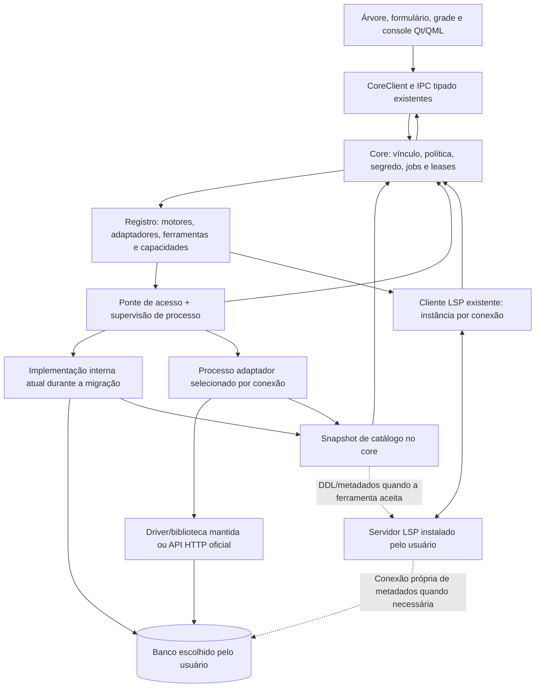
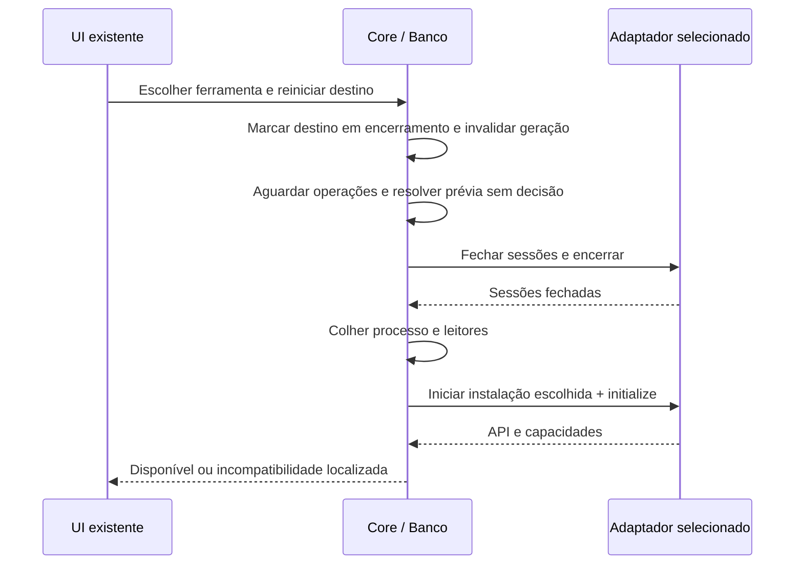

# 39 — Drivers externos e compatibilidade de versões

<!-- caminhos-conferidos -->

> **Classe: PLANO.** Desenho e revisão anteriores à implementação, em
> 2026-10-07, sobre `main` em `0214927`, protocolo `0.163.0`.
> Pedido do autor após a pesquisa do IntelliJ IDEA Community. Decisão no
> [ADR-0010](../decisoes-adr/ADR-0010-drivers-em-processos-versionados.md).
> Complementa o [38](38-provedores-de-banco-e-linguagem.md), sem substituir
> seus registros, cliente LSP ou contratos de execução já aceitos no
> [37](37-banco-de-dados.md). D1a.1 protege o catálogo e D1a.2 implementa
> negociação/erros puros (§4.4; 40.7 §7.235–§7.236). D1a.3 acrescenta
> mensagens e validação operacional pura (§4.5). Processos externos e
> migração de perfis continuam pendentes.

## 1. Objetivo e limite da atualização independente

Permitir que o usuário mantenha uma ferramenta compatível com um banco
antigo num projeto e outra para um banco recente, sem atualizar o binário
da IDE para trocar a biblioteca de acesso. A fronteira estável é o contrato
entre core e processo adaptador; o driver oficial e suas dependências ficam
nesse processo. A atualização de driver pode exigir uma nova compilação do
adaptador, mas não do core enquanto esse contrato continuar compatível.

LSP, driver e servidor do banco têm versões distintas. O LSP atende linguagem;
o adaptador atende catálogo e execução. Cada um pode ser substituído sem
trocar o outro. Driver atualizado não torna um dialeto novo conhecido pelo
LSP, nem faz uma operação desconhecida aparecer automaticamente na UI.
Mudanças incompatíveis ainda exigem adaptar a ferramenta ou o contrato.

Reutilizar bibliotecas/APIs mantidas: PostgreSQL, SQLite e MongoDB já possuem
implementações no produto; InfluxDB 3 usará sua API nativa. O trabalho novo
é a fronteira de orquestração, não um driver de protocolo, parser, servidor
de banco ou gerenciador de pacotes. Instalação e atualização continuam
explícitas e a cargo do usuário. ODBC conserva o caminho e consentimento
aceitos no ADR-0007; sua transferência de processo seria outra decisão.
MySQL/MariaDB nativo, adiado em 2026-10-08 para versão futura (59 §2.3), usará essa mesma fronteira
com biblioteca compatível comprovada; não ganha caminho especial na UI.

## 2. Lições verificadas no IntelliJ e no plugin Community

Pesquisa em 2026-10-07, distinguindo dois produtos:

- A Community histórica não incluía o Database Tools oficial. Desde 2025.3,
  a distribuição unificada oferece parte das funções de banco gratuitamente;
  isso não torna a implementação completa aberta. O conjunto oficial
  separa perfil, driver JDBC escolhível, processo JVM, catálogo e dialeto.
- Para ler uma implementação aberta compatível com a Community, foi
  examinado **Oracle Database Navigator**, Apache-2.0, revisão
  `39ff45b3f66c72858cbf3b978c1a66d092880f96`. É um plugin independente,
  não o código do Database Tools da JetBrains.

Arquivos lidos no Database Navigator: `plugin.xml`, `DatabaseDriverManager`,
`DriverBundle`, `DriverClassLoaderImpl`, `ConnectionDatabaseSettings`,
`DatabaseInterfacesBundle`, `DatabaseInterfaces`, `PostgresDatabaseInterfaces`,
`PostgresCompatibilityInterface`, `CodeCompletionContributor`,
`CodeCompletionProvider`, `DatabaseVersionPrerequisite` e os XMLs de catálogo
PostgreSQL/Oracle. Seu manifesto depende da plataforma/linguagem, sem exigir
`com.intellij.database`. O registro separa interfaces de acesso, metadados,
execução e compatibilidade. Os JARs usam classloader próprio e as instâncias
de driver são associadas à conexão. Esse classloader não é o processo JVM
separado documentado para o conjunto oficial da JetBrains.

O plugin usa parsers e completion internos da plataforma. Há consultas de
catálogo condicionadas por `since-version` e verificações de versão via
metadados JDBC. A lição é localizar diferenças no adaptador, sem presumir
que JDBC resolve linguagem e catálogo de qualquer versão. O conjunto oficial
também oferece introspecção JDBC mais limitada quando a específica falha.

Modo **MODE-D**: estudar fronteiras e falhas, sem copiar código, gramáticas,
classloader ou testes. A tradução para a Kinein é processo nativo com contrato
tipado, perfis por workspace e LSP existente. Não introduz JVM, Swing,
IntelliJ Platform nem um requisito JDBC para MongoDB/InfluxDB.
Fontes e limites estão no §10; não houve build nem execução desses produtos.

## 3. Componentes e fluxo alvo

Há um backend escolhido por operação: interno ou externo. Nunca executar
nos dois para comparar resultados, nem trocar silenciosamente para outro
após uma falha. O fallback de catálogo genérico só existe quando comprovado,
declarado pelo adaptador e mostrado como limitado; não supõe outro dialeto.

O registro possui três identidades diferentes: motor/dialeto; implementação
do adaptador; instalação da ferramenta escolhida. O mesmo motor pode ter
várias instalações do mesmo adaptador. A identidade de processo incorpora
workspace, perfil, instalação resolvida e geração de configuração/credencial.
Não usar nome de motor, nome do perfil sozinho ou segredo como chave.

Uma instância externa atende um perfil. Pode manter conexões distintas por
operação, como os drivers atuais; isso não cria uma sessão SQL compartilhada
implicitamente entre consoles. Uma prévia conserva sua própria conexão e
transação durante toda a decisão. A fila por instância tem capacidade finita;
operações independentes só concorrem conforme o adaptador suporta.

## 4. Contratos e negociação

### 4.1 Quatro contratos com versões independentes

| Contrato | Quem o consome | Regra de evolução |
| --- | --- | --- |
| UI ↔ core | CoreClient e `kinein-protocol` atuais | Mudança aditiva documentada no 03; versão IPC não é versão do banco |
| Perfil persistido | Store e validadores do motor | Migração explícita; schema desconhecido não pode virar lista vazia gravável |
| Core ↔ adaptador | Ponte e executável externo | Faixa de major/minor negociada antes de segredo ou conexão |
| Core ↔ LSP | Cliente LSP existente | `initialize`, recursos anunciados e adaptação específica do provedor |

O protocolo de adaptador é uma API pequena do serviço Banco, em stdio privado,
com objetos tipados e uma mensagem JSON por linha. Não é outro cliente
UI/core, não substitui o LSP e não importa protocolo de um host de extensões.
Os tipos ficam em módulo próprio de `kinein-protocol`; o executável depende
da versão dos tipos com que foi construído, não da crate core inteira.
As versões dos binários podem divergir quando negociam a mesma API.
Opções públicas do perfil também têm versão de schema por adaptador, separada
do schema do arquivo. Mudança incompatível exige migrador correspondente;
um binário novo não pode reinterpretar opções antigas silenciosamente.

Reutilizar envelope de pedidos, serialização, correlação e jobs existentes.
O erro atual de `rpc.rs` usa enum textual e `details`; isso não é o erro
numérico `code`/`data` do JSON-RPC 2.0. A nova fronteira externa usará erro
numérico e motivo estável tipado em `data`, mapeado para o erro UI existente.
Não declarar conformidade usando o formato textual nem alterar o wire UI
durante essa extração. A fatia de contrato define esses tipos antes do runtime.

### 4.2 Inicialização sem efeitos no banco

O primeiro pedido, `driver.initialize` (nome previsto), informa a faixa de
API que o core entende e os limites de mensagem/pedidos que aceita. A resposta
informa faixa de API, identidade, versão do adaptador/driver, motores/dialetos
e operações implementadas. Negociar a maior versão comum, sem baixar arquivo,
abrir banco, carregar segredo ou executar probe SQL nesse handshake.
Major sem interseção recusa somente essa instalação.

Dentro da versão negociada, campos novos são opcionais e recursos novos só
valem quando ambos anunciam suporte. Campos desconhecidos de resposta podem
ser ignorados; campo obrigatório inválido, recurso com semântica desconhecida
ou mudança de tipo produz incompatibilidade localizada. Pedidos continuam
estritos, sem parâmetros arbitrários. Não confundir permissividade de
resposta do handshake com aceitar senha/opções desconhecidas no perfil.

Depois da política, `driver.open` recebe contexto validado, opções públicas,
restrições efetivas e credencial transitória por pipe. Retorna identificador
opaco de sessão, versão pública do servidor quando detectável e capacidades
observadas. Não anuncia compatibilidade universal por sucesso no handshake.
O processo não devolve credencial nem pode pedir que o core execute SQL por ele.

### 4.3 Superfície mínima orientada aos consumidores atuais

| Operação prevista | Dono e garantia |
| --- | --- |
| Inicializar/abrir/testar/fechar | Ponte valida versão/contexto; adaptador abre e fecha recursos reais |
| Ler catálogo | Adaptador consulta metadados; core limita, valida e publica snapshot com revisão |
| Consultar | Core autoriza texto e alvo; adaptador aplica restrições nativas e devolve resultado limitado |
| Medir impacto | Reusar medição atual; ausência/inconclusão preserva o aviso de impacto desconhecido |
| Prévia e decisão | Capacidade opcional; conexão/transação ficam no adaptador, autorização/decisão no core |
| Cancelar/encerrar | Identificador da operação/sessão, resposta terminal e liberação real de recursos |

Nenhum nome nessa tabela é método público registrado no dispatcher da IDE.
A D1a define mensagens, erros e limites em documento de contrato antes de
acrescentar tipos ao produto; a inicialização pura já está no §4.4.
Geração de modelos/instruções reutiliza os módulos atuais; só atravessa o
processo quando precisa do driver. Não criar endpoints para capacidades sem
consumidor, consultas RPC genéricas nem callback de execução vindo do plugin.

Capacidade efetiva combina implementação, versão/recursos do servidor,
permissões observadas, política do perfil e recursos conhecidos pelo core.
Versão desconhecida não ativa recurso dependente de versão. Operação negada
mantém contexto e explicação pública; não rebaixa TLS nem tenta credencial
alternativa. A matriz publicada separará versões testadas de suporte alegado.

### 4.4 D1a.2 — contrato de inicialização e erros (2026-10-07)

Primeiro recorte tipado do contrato externo, anterior ao runtime. Os tipos
ficam em `kinein-protocol::driver`, com API própria **1.0**. A versão IPC
UI/core continua `0.164.0`; nenhum `driver.*` é registrado no dispatcher da
IDE. O envelope de pedido reutiliza `JsonRpcRequest`. Respostas externas
usam `jsonrpc: "2.0"`, `id` e exatamente um entre `result` e `error`; o erro
tem `code` numérico, `message` e `data` opcional. Não reutiliza o erro textual
UI nem interpreta `details` como `data`. Batch e callbacks não entram aqui.

`driver.initialize` recebe `{ api: { min, max }, limits }`; cada versão é
`{ major, minor }`. A faixa é fechada, pertence a um único major e tem mínimo
menor ou igual ao máximo. O core negocia o maior minor comum. A resposta
tem `api`, `adapterId`, `adapterVersion`, `driverVersion` opcional, `engines`,
`operations` e `limits`. O core confere a identidade escolhida e o motor,
sem escolher substituto. Campos adicionais da resposta são ignorados;
parâmetros, versões e orçamento têm formato fechado. Operação desconhecida,
repetida ou obrigatória ausente recusa essa instalação.

Operações conhecidas: `open`, `test`, `introspect`, `query`, `impact`,
`preview`, `decide`, `cancel`, `close` e `shutdown`. Exceto `impact`,
`preview` e `decide`, todas são obrigatórias para o backend deste recorte.
Prévia e decisão devem ser anunciadas juntas. O anúncio não comprova
permissão, suporte do servidor ou capacidade efetiva da operação.

| Campo de `limits` | Teto local inicial | Regra |
| --- | --- | --- |
| `messageBytes` | 1 MiB | JSON UTF-8 serializado, sem terminador; mínimo negociável 1 KiB |
| `inFlight` | 8 | Pedidos ainda sem resposta terminal por instância; mínimo 2 para permitir um pedido de controle |
| `rows` | 10.000 | Mesmo teto público atual; não altera a preferência de 500 |
| `columns` | 128 | Dimensão máxima de uma linha |
| `cellBytes` | 16 KiB | UTF-8 de uma célula; excesso não vira valor cortado íntegro |
| `retainedBytes` | 8 MiB | Total retido de uma operação, incluindo seu catálogo/amostra |
| `catalogueItems` | 5.000 | Soma dos objetos/colunas/campos retidos, não por chunk |

Negociação toma o menor valor de cada campo; zero ou combinação em que uma
célula excede mensagem/retenção é inválida. O orçamento recebido nunca eleva
o teto local. D1b aplica esses valores antes de alocar/reter mensagens e
chunks; esta fatia prova negociação, não execução limitada de um processo.
**Revisão preparatória D1b em 2026-10-07:** mínimo `inFlight` 2; um pedido
de prévia/consulta ainda pendente não pode impedir sua decisão/cancelamento,
que também é pedido contado. O ator futuro reserva um slot para controle,
limitando pedidos comuns a `inFlight - 1`; não exclui controles da contagem.
Prazos/encerramento ainda precisam de prova no runtime, não são garantidos
por essa negociação pura.
Fila local terá 16 operações aguardando, inicialização 5 s e encerramento
5 s. Esses prazos não são garantias de desligamento; o runtime precisará
provar coleta real. Prazo de decisão de prévia permanece 60 s, no dono atual.

Erro de aplicação usa `code: -32000` e `data: { reason, outcome }`.
`reason`: `incompatibleApi`, `unsupportedOperation`, `secretRequired`,
`readOnly`, `contextChanged`, `busy`, `cancelled`, `timeout`,
`connectionFailed`, `executionFailed`, `limitExceeded` ou `outcomeUnknown`.
`outcome`: `notStarted`, `failed` ou `unknown`. Falha confirmada não promete
desfazer comandos anteriores de um lote. Erros padrão JSON-RPC numéricos
podem omitir `data`; motivo novo desconhecido não é interpretado.

O core mapeia somente motivos tipados para erros UI existentes. Nunca
repassa `message` livre ou campos desconhecidos do adaptador à UI/log;
`Debug` do erro também omite essa mensagem. Desfecho desconhecido recebe
texto explícito e não autoriza repetição. A perda de transporte depois de
enviar escrita continua sendo responsabilidade do runtime, que deve inferir
desfecho indeterminado mesmo sem resposta de erro do adaptador.

**Precedência de desfecho (revisão, 2026-10-07):** `outcome: unknown` ou
`reason: outcomeUnknown` retorna erro genérico com resultado indeterminado,
antes de mapear motivo. Nunca recebe código que ofereça nova credencial ou
repreparo. `secretRequired` só recebe `SECRET_REQUIRED` com `notStarted`;
com `failed` vira erro genérico, sem sugerir reenvio nem rollback de comandos
anteriores de um lote. Motivo tipado original permanece nos detalhes públicos.
`contextChanged` segue a mesma regra (o código `DATA_SOURCE_CONTEXT_CHANGED`
pede "prepare novamente", e repreparar um lote iniciado repetiria comandos
já aplicados): só com `notStarted`. `inFlight` negociado abaixo de 2 recusa
a instalação (`InvalidLimits`). Implementado em `driver_contract.rs`
(`public_error`, `negotiate_limits`); aceite no 40.7 §7.240.

`datasource/driver_contract.rs` monta o pedido, aceita a resposta limitada,
confere correlação/versão/identidade/recursos e fornece o mapeamento público.
Fixtures JSON v1 e testes provam major incompatível, minor aditiva, campos
extras de resposta, orçamento reduzido, resposta ambígua/antiga e segredo
ausente do erro público. Nada abre banco, carrega senha ou inicia programa.
Mensagens operacionais estão na D1a.3 (§4.5); formato extensível/migração
de perfis seguem na D1a.4. D1b ainda não pode iniciar só com este handshake.

**Aceite:** 40.7 §7.236. Desserialização exige objetos em todas as camadas,
recusando arrays posicionais, campos duplicados e envelopes ambíguos. Sete
testes do protocolo e oito do negociador usam fixtures e casos adversos;
gates completos/estritos passaram com 1034 testes Rust. Não há transporte
externo nem garantia de prazo/coleta de processos nesta implementação pura.

### 4.5 D1a.3 — contrato e validação operacional pura (2026-10-07)

O [40](40-contrato-operacional-de-drivers.md) fecha pedidos, chunks,
prévia/decisão/cancelamento e terminais da API externa 1.0 antes do runtime.
Tipos em `driver/operation.rs` reutilizam modelos de resultados e decisões
atuais. Credencial transitória só cabe em abrir; Debug a omite. Nenhum desses
métodos é registrado no dispatcher UI/core, que permanece `0.164.0`.

`datasource/driver_stream.rs` valida contexto completo, sequência contígua,
terminal único e limites cumulativos sem reter linhas/catálogo. Confere
alvos exatos de decisão/cancelamento e coerência da prévia; recusa dimensões,
células ou catálogo inválidos antes de mudar estado. NULL e texto vazio são
distintos. Catálogo externo não fornece instruções executáveis ao core.

Sete testes operacionais do protocolo e 15 do guardião passaram na árvore
integrada. D1b ainda precisa limitar o envelope antes de extrair o payload,
aplicar autorização, fila/prazos e supervisionar/coletar processos reais.
Aceite de decisão e publicação/merge do snapshot conservam seus donos;
validação pura não comprova conexão, commit/rollback ou atualização externa.

## 5. Configuração, perfis e escolha de versão

Ferramentas são registradas por caminho/runtime escolhido explicitamente,
com argumentos separados e configuração pública permitida. Definições do
provedor descrevem campos tipados, versões de opções e capacidades; não trazem
QML, JavaScript, shell ou expressões para a UI executar. As instalações
executáveis pertencem ao registro de ferramentas escolhido pelo usuário;
o perfil do projeto referencia essa escolha, sem autorizar um caminho novo
por conteúdo recebido do repositório. Ler um descritor ou abrir um workspace
não executa programas recém-descobertos nessa pasta.
Identificadores duplicados/inválidos recusam aquela definição, sem escolher
outro fornecedor por ordem incidental.

O perfil referencia a instalação preferida; pode herdar uma escolha explícita
do workspace. Uma escolha ausente/incompatível deixa o perfil indisponível,
preservando seu console. Não usar o primeiro driver instalado nem substituir
a ferramenta legada por uma recente automaticamente. Atualizações pelo usuário
podem coexistir em caminhos separados. Versão detectada é informação; o
handshake e as operações necessárias determinam compatibilidade efetiva.
Retornar à instalação anterior também exige API e schema de opções compatíveis.
Se não forem, recusar a ativação mantendo perfil/configuração; não converter
opções para uma versão antiga com perda silenciosa. Trocar executável não
autoriza migrar permanentemente o perfil por efeito do handshake.

Migração precede a primeira persistência com IDs extensíveis/instalações.
Antes de D1a.1, o store aceitava schema 1, devolvia vazio para arquivo
inválido/desconhecido e gravava com `fs::write`. A primeira correção preserva
esse schema, recusa arquivo não reconhecido/não regular e aplica teto de
1 MiB e escrita atômica compartilhada. A leitura pública responde erro,
sem sucesso com lista vazia. Formato extensível e migração ainda são alvo.
O novo loader distingue ausência, arquivo inválido, schema futuro e perfil
indisponível. Somente formato reconhecido e validado pode ser salvo/migrado,
por escrita atômica; arquivo futuro/inválido permanece intacto e somente leitura.

Perfis de provedor ausente, dentro de formato reconhecido, permanecem visíveis
como indisponíveis. Suas opções originais ficam preservadas sem reinterpretar,
enviar a processo ou expor conteúdo bruto à UI/log. Um merge só pode conservar
esses registros sem alterá-los; se não conseguir, recusa a gravação inteira.
Editar opções exige o validador compatível do provedor. Senhas/tokens nunca
viram campos novos de perfil ou descritor. Valores e vínculos atuais
`postgres/sqlite/mongo/odbc` sobrevivem; migração não conecta nem atualiza banco.

### 5.1 D1a.4 — formato 2 dos perfis e migração (desenho, 2026-10-08)

> **Implementado** em 2026-10-08: core na D1a.4a (40.7 §7.243) e a árvore do
> Banco mostrando os indisponíveis na D1a.4b (§7.244).

Desenho escrito antes do código. O problema medido: o schema 1 guarda
`DataSourceProfile` fechado (`deny_unknown_fields`) com `engine` em enum
fechado; um único perfil de motor desconhecido torna o arquivo inteiro
inválido e o catálogo do projeto fica somente leitura. O primeiro
consumidor concreto do formato extensível é o InfluxDB 3 (passo 11).

**Formato 2.** Envelope `{ schemaVersion: 2, profiles: [...] }`. Cada
perfil separa o que é do core do que é do adaptador:

| Campo | Dono | Regra |
| --- | --- | --- |
| `name` | core | identidade única no projeto, como hoje |
| `engine` | core | id do motor (`postgres`, `sqlite`, `mongo`, `odbc`; futuros como `influxdb3`), `[a-z0-9._-]`, até 64 |
| `adapter` | core | id da implementação (`builtin.postgres`…), distinto do motor |
| `installation` | core | opcional, reservado para D1b (instalação escolhida pelo usuário); nesta versão, presente torna o perfil indisponível |
| `production`, `readOnly` | core | política, como hoje |
| `secretSource`, `secretVariable` | core | de onde vem a senha; nunca a senha |
| `options` | adaptador | `PublicOptions` do contrato do driver (`schemaVersion` + `fields` texto/booleano/inteiro) |

Opções v1 dos adaptadores atuais: PostgreSQL `host`, `port`, `database`,
`user`, `tls`, `caFile`; SQLite `path`; MongoDB `host`, `port`,
`database`, `user`, `sampleSize`; ODBC `dsn`, `user`. A conversão para o
`DataSourceProfile` do IPC fica num único dono; a UI continua recebendo o
mesmo tipo para os perfis disponíveis.

**Leitura.** Ausente: catálogo vazio e gravável. Schema 1: lido como hoje e
convertido em memória, sem gravar nada. Schema 2: envelope estrito; cada
perfil vira **disponível** (motor, adaptador e opções reconhecidos e
válidos) ou **indisponível** (motor ou adaptador desconhecido, instalação
presente, `options.schemaVersion` não suportado, chave ou valor de opção
recusado). O indisponível guarda o texto JSON original byte a byte
(`RawValue`; um `Value` intermediário perderia a recusa de chave duplicada
nos campos conhecidos), que nunca vai para a UI, log ou processo; a UI recebe só nome, motor, adaptador e motivo. Perfil sem
nome, nome repetido, envelope inválido ou schema 3+ continuam tornando o
arquivo somente leitura e intacto (D1a.1).

**Escrita e migração.** Toda gravação escreve schema 2. A primeira gravação
sobre um arquivo schema 1 é a migração, disparada pelo gesto do usuário
(salvar ou remover um perfil), nunca pela leitura: copia os bytes originais
para `.kinein/datasources.schema1.json`, grava o schema 2 por escrita
atômica e relê; se a releitura não reproduzir o mesmo catálogo, restaura os
bytes originais e responde erro. Campos que o motor não usa e que o schema 1
aceitava (o `host` de um SQLite, a amostra de um PostgreSQL, a CA fora do
PostgreSQL) não migram: a cópia schema 1 os conserva, e a verificação
compara o perfil efetivo de cada motor. Indisponíveis são regravados com o
JSON original. Salvar um perfil com o nome de um indisponível é recusado;
removê-lo, pelo gesto explícito, é permitido. Se a cópia schema 1 já existir
com outro conteúdo, a migração é recusada sem escrita, para não apagar uma
cópia anterior.

**Contrato.** `datasource.list`, `save` e `remove` ganham `unavailable:
[{ name, engine, adapter, reason }]`, aditivo; `reason`:
`unknownProvider`, `unsupportedInstallation`, `unsupportedOptions` (chave ou
`schemaVersion` que esta versão não conhece, no perfil ou nas opções) ou
`invalidOptions` (chave conhecida com valor recusado). IPC `0.165.0`, com o `arquitetura/03` antes do core. A
árvore do Banco mostra o indisponível esmaecido, com o motivo, sem
conectar nem editar; remover usa o fluxo existente.

**Aceite:** fixtures v1 legado (os quatro motores, TLS, CA, amostra,
variável de segredo), v2 atual, v2 com motor desconhecido, com instalação,
com opções futuras, schema 3 e inválido; v1 lido igual a hoje; migração
grava v2 + cópia v1 idêntica e relê igual; falha simulada na verificação
restaura o original; indisponível preservado ao salvar outro perfil; nome
colidindo recusado; segredo ausente do arquivo; nenhum processo iniciado.
Harness da árvore com o indisponível; prova na tela pelo autor.

## 6. Execução, falhas e atualização

Política e correlação continuam no core, antes de resolver segredo, reservar
job e enviar operação. O processo usa a biblioteca existente para impor
somente leitura/limites/transação quando disponíveis. Conta/permissão real
do banco continua sendo a defesa para um executável instalado pelo usuário;
capacidade anunciada não é prova de que o processo seja seguro.

Todo pedido e resultado é associado à instância, sessão, geração e operação;
chunks de catálogo/resultado também têm sequência e um terminal único. O core
rejeita duplicatas, contexto antigo, dimensões inválidas e excesso de bytes.
Stdout contém somente protocolo. Para processo com credencial, stderr bruto
e campos livres do erro não chegam à UI/log por padrão; códigos/campos públicos
permitidos são mapeados e limitados pelo core. Redação pontual não garante
remover segredo codificado ou interpolado pelo executável. Leitura/escrita
de pipes e espera de resposta não ocupam o despacho. Fila, mensagens, células,
catálogo e tempo de encerramento
têm tetos documentados na D1a; negociação pode reduzi-los, nunca elevar o teto
local. O resultado preserva `NULL`, truncamento e a forma MongoDB atuais.
O spawn tem ambiente explícito por instalação/sessão, sem variáveis de banco
herdadas de outro perfil. Credencial vem do dono atual de segredos; delegação
ao driver, incluindo arquivo de senha quando realmente suportado, precisa
ser declarada/provada. Não supor que uma biblioteca Rust lê arquivos do libpq.

O teto existente de consulta continua até 10.000 linhas; o limite de bytes
também precisa existir, pois uma célula pode ser maior que toda a grade.
Um resultado grande pode ser parcial com motivo explícito, sem apresentar
célula cortada como valor íntegro. Não antecipar um novo modelo de valores
ou paginação antes de seus consumidores do §5.4 do roadmap 59.

Troca de ferramenta/credencial ou desconexão usa a barreira atual do destino.
Não troca biblioteca dentro de processo ativo e não interrompe escrita aceita
para instalar outra versão. Prévia sem decisão pede rollback; decisão de
commit já aceita segue até o resultado terminal. EOF/encerramento desfaz
transação ainda aberta quando o banco oferece essa garantia. Isso não desfaz
escritas autocommit nem garante rollback se um commit já foi enviado.

Queda, timeout ou perda de resposta depois de enviar escrita tem **resultado
indeterminado** quando o banco não confirmou o desfecho. Não repetir consulta,
commit, criação ou escrita automaticamente. Reabrir o processo não reenvia
operações antigas. Leitura também só é retomada por novo pedido, preservando
resultados parciais identificados. A UI deve distinguir falha anterior ao envio,
falha confirmada e desfecho indeterminado, sem afirmar que nada foi aplicado.

Encerramento só é sucesso após fechar sessões, colher processo e finalizar
leitores/auxiliares. Prazo esgotado comunica falha/em encerramento, sem liberar
uma instância que ainda executa. Desconectar/trocar versão não é autorização
para matar uma escrita aceita. Um daemon auxiliar, como o do LSP PostgreSQL,
exige fechamento próprio; PID do proxy não prova desligamento. Processos de
outros perfis não são atingidos. Alteração do executável no disco é detectada
na resolução/reinício e não provoca substituição automática do processo vivo.

## 7. Reaproveitamento e donos conferidos

| Responsabilidade | Dono atual e evolução |
| --- | --- |
| Perfis/tipos públicos | `crates/kinein-protocol/src/datasource.rs`; contratos do adaptador entram no mesmo crate, em módulo próprio |
| Carregar/gravar perfis | `crates/kinein-core/src/datasource/store.rs`; distinguir estado inválido e migrar atomicamente antes de ID novo |
| Política, segredo e leases | `crates/kinein-core/src/datasource/policy.rs`, `secret.rs`, `activity.rs`; permanecem comuns |
| Driver nativo e catálogo | `crates/kinein-core/src/datasource/connection.rs`, `sqlite.rs`, `mongo_client.rs`, `introspect.rs`; extrair comportamento por motor para o executável |
| Consulta/impacto/prévia | `crates/kinein-core/src/datasource/query.rs`, `measurement.rs`, `preview.rs`, `preview_postgres.rs`; separar autorização/lease de objetos do driver |
| Jobs e eventos | `crates/kinein-core/src/jobs/context.rs`, `runtime.rs`; um job público, subprocesso não cria outro registro de jobs |
| Processos e logs | `crates/kinein-core/src/process.rs`, `stderr_tail.rs`, `lsp/server.rs`; extrair recursos compartilhados de spawn/drain/reap sem novo executor completo |
| LSP e ferramentas | `crates/kinein-core/src/lsp/manager.rs`, `session.rs`, `registry.rs`, `tools/mod.rs`; ampliar identidade/seleção existentes |
| Desconexão | `crates/kinein-core/src/handlers/datasource_session.rs`; fechar recursos externos dentro da barreira já aceita |
| UI e catálogo | `ui/qml/datasource/DataSourceCatalogController.qml`, `ui/qml/editor/EditorCompletionController.qml`; só apresentação/contexto, sem subprocesso direto |

O executor de linhas atual fecha stdin e tem cancelamento que pode deixar
leitores destacados após dois segundos. Não atende um protocolo bidirecional
persistente nem prova término dos descendentes. O servidor LSP já tem pipes,
pedidos pendentes e handshake, mas usa framing LSP e identidades estáticas.
Logo, nenhum dos dois deve ser usado como está nem copiado integralmente.
Extrair apenas propriedade de processo, pipes limitados, fechamento e coleta
para uma base compartilhada, com dois consumidores reais: LSP e adaptador.
Framing, pending requests e semântica de cada protocolo ficam em seus donos.

Os executáveis nascem com driver/biblioteca mantida e camada fina própria;
dependem de contratos/módulos extraídos, sem importar o estado inteiro do core.
Não duplicar implementação nativa na extração nem manter duas cópias de
SQL de catálogo. O core mantém o backend interno somente até aceitar a
substituição daquele motor. Dependência nativa sai do core quando seu último
consumidor migrar. Manter limites/catraca atuais, sem crescer fachadas em dívida.

## 8. Migração e critérios de manutenção

Complemento à fila D0–D7 do 38; numeração não significa um commit por linha:

| Fatia | Entrega e dependência |
| --- | --- |
| D1 | Registro dos quatro motores e descritores consumidos pelo formulário/menu em `0.164.0`; 40.7 §7.234. Nenhum processo externo ou LSP ativado |
| D1a | Proteção do catálogo, negociação/erros e fluxo operacional puros (§7.235–§7.237); perfil extensível/migração D1a.4 ainda necessário antes de persistir IDs de ferramenta |
| D1b | Base de processo compartilhada e ponte externa; handshake sem segredo, fila limitada, encerramento e isolamento provados |
| D1c | Migrar PostgreSQL, incluindo impacto e prévia com conexão/transação reais, para o processo escolhido |
| D1d | Migrar SQLite e depois MongoDB, cada um em sua fatia com recursos atuais e versões aceitas preservados |
| D2–D5 | Contexto/instâncias e integrações LSP conforme o 38, sobre os contratos D1/D1a |
| D6–D7 | InfluxDB 3 nativo no processo D1b e seleção/prova do seu LSP; linguagem continua pendente |

D1a precede D1b; D1b precede migrar drivers e adicionar InfluxDB. D2 depende
dos contextos D1/D1a e não precisa esperar toda a extração de drivers.
A transição fica explícita por motor; atualização independente só é aceita
quando aquele motor usa o backend externo com prova, não na entrega do registro.

Cada adaptador mantém fixtures de protocolo versionadas e uma matriz curta:
versão consolidada, versão recente e a mais antiga que declarar suportada.
Legado só entra por necessidade concreta e por ferramenta compatível separada;
MongoDB 3.x não voltou ao escopo. APIs/probes verificam recursos, não apenas
strings de versão. Nenhuma branch do core por patch do banco.

Aceite obrigatório: duas instalações do mesmo adaptador atendendo destinos
distintos; atualização e retorno à ferramenta anterior sem trocar a IDE;
major incompatível sem segredo/conexão; minor aditiva; recurso ausente;
catálogo limitado; pipes saturados e célula grande; queda antes/depois de
escrita; resposta tardia; commit com confirmação perdida sem repetição;
prévia mantida na mesma conexão; fim real de processos/auxiliares; TLS,
somente leitura e consentimento ODBC; arquivo futuro/perfil desconhecido
preservados. Provar concorrência vizinha e `core.ping` durante as esperas.
Esses critérios estão distribuídos nos passos 7–15 do 59 §2, por revisão
do autor em 2026-10-07. Passo 7 fecha contratos/perfis; runtime/extrações
e linguagem têm aceites próprios nos passos seguintes. Pente fino é o
passo 16, último da 0.3.9; AppImage fica adiado no 59 §8.

## 9. Revisão do desenho — 2026-10-07

Revisão manual em duas passagens: donos/reaproveitamento, depois cenários
de falha/atualização. Esta tabela registra correções no plano, não testes
de produto nem implementação concluída.

| Achado | Correção no desenho e prova exigida |
| --- | --- |
| Driver compilado contradizia atualização sem trocar IDE | Processo adaptador passa a fronteira alvo; D1c/D1d provam substituição real |
| Driver e LSP poderiam ser confundidos | Registros/instalações independentes; mudança de um não seleciona o outro |
| Store desconhecido virava vazio gravável | Estado de carga explícito, arquivo protegido e migração/merge atômicos na D1a |
| Executor existente fecha stdin e não aguarda todos os leitores | Base bidirecional compartilhada com coleta real na D1b; não copiar executor |
| Troca/restart poderia repetir escrita | Sem retry/reenvio; resultado indeterminado e barreira por destino |
| Prévia poderia mudar de conexão no RPC | Conexão/transação permanecem no adaptador até decisão terminal |
| Anúncio de versão/capacidade parecia garantir compatibilidade | Negociação de contrato separada de prova de recursos/banco/permissões |
| Erro textual do IPC parecia JSON-RPC padrão | Erro externo numérico/motivo tipado e mapeamento explícito, sem mudar UI wire |
| Log/ambiente herdados poderiam misturar credenciais | Ambiente por sessão, campos públicos permitidos e stderr bruto suprimido para processo com segredo |
| Voltar ao binário anterior poderia perder opções novas | Compatibilidade de API/schema antes de ativar; perfil intacto se recusado |
| Completion/catálogo poderiam duplicar gramática e consulta | Cliente LSP e snapshot únicos; adaptadores só exportam formatos aceitos |

Desenho revisado e suficiente para iniciar **a fatia de contratos**, antes
de runtime/migração. D1a.2 já fecha números e fixtures da inicialização pura;
as mensagens operacionais e seu guardião puro estão na D1a.3. Formato de
perfis e aplicação dos limites no transporte seguem pendentes. Seleção LSP
InfluxDB e catálogo vivo/adaptação MongoDB
continuam pendências concretas do 38, sem um parser próprio como atalho.

## 10. Fontes primárias consultadas em 2026-10-07

- **JetBrains, documentação de comportamento, MODE-D**:
  [Community histórica e dependência Database Tools](https://plugins.jetbrains.com/docs/intellij/data-grip.html),
  [distribuição unificada 2025.3](https://blog.jetbrains.com/idea/2025/12/intellij-idea-unified-release/),
  [gratuito e aberto](https://blog.jetbrains.com/idea/2025/07/intellij-idea-unified-distribution-plan/),
  [escolha de versão JDBC](https://www.jetbrains.com/help/idea/jdbc-drivers.html),
  [processo JVM e introspecção alternativa](https://www.jetbrains.com/help/idea/data-sources-and-drivers-dialog.html),
  [catálogo](https://www.jetbrains.com/help/idea/introspection.html),
  [dialetos](https://www.jetbrains.com/help/idea/settings-languages-sql-dialects.html).
- **Database Navigator, Apache-2.0, MODE-D**, revisão citada no §2:
  [manifesto](https://github.com/oracle/database-navigator/blob/39ff45b3f66c72858cbf3b978c1a66d092880f96/src/main/resources/META-INF/plugin.xml),
  [registro](https://github.com/oracle/database-navigator/blob/39ff45b3f66c72858cbf3b978c1a66d092880f96/src/main/java/com/dbn/connection/DatabaseInterfacesBundle.java),
  [driver por conexão](https://github.com/oracle/database-navigator/blob/39ff45b3f66c72858cbf3b978c1a66d092880f96/src/main/java/com/dbn/driver/DriverBundle.java),
  [classloader](https://github.com/oracle/database-navigator/blob/39ff45b3f66c72858cbf3b978c1a66d092880f96/src/main/java/com/dbn/driver/DriverClassLoaderImpl.java),
  [completion interna](https://github.com/oracle/database-navigator/blob/39ff45b3f66c72858cbf3b978c1a66d092880f96/src/main/java/com/dbn/code/common/completion/CodeCompletionProvider.java),
  [catálogo dependente de versão](https://github.com/oracle/database-navigator/blob/39ff45b3f66c72858cbf3b978c1a66d092880f96/src/main/java/com/dbn/database/oracle/oracle_metadata_interface.xml),
  [licença](https://github.com/oracle/database-navigator/blob/39ff45b3f66c72858cbf3b978c1a66d092880f96/LICENSE.txt).
- **API oficial Rust**, reaproveitamento de processos:
  [Command/args/env](https://doc.rust-lang.org/std/process/struct.Command.html),
  [Child: drop não espera o término; wait/try_wait/kill](https://doc.rust-lang.org/std/process/struct.Child.html).
- **JSON-RPC 2.0**, somente envelope/erro/correlação:
  [especificação](https://www.jsonrpc.org/specification).
  Versionamento de API, framing, capacidades e autorização são decisões
  próprias deste desenho, não garantias fornecidas por JSON-RPC.
- As referências Code OSS/Zed, LSP 3.17, bibliotecas e ferramentas originais
  continuam no [38 §10](38-provedores-de-banco-e-linguagem.md#10-referências-e-modos-de-reaproveitamento).
