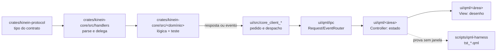

# 58 — Onde cada versão começa no código

<!-- caminhos-conferidos -->

> **Classe: PLANO, ancorado no código** (`DocsPublic/README.md`). Escrito em
> 2026-10-01, a pedido do autor: "detalhe o fluxo inicial das versões que
> estão para ser desenvolvidas, para que quem colabora — pessoa ou IA — foque
> na geração de código; leia o código e desenvolva a arquitetura das versões
> em cima disso".
>
> **O que este documento é dono:** *onde, no código de hoje,* cada versão
> começa — os arquivos reais, o mecanismo que já existe e deve ser estendido,
> a primeira fatia passo a passo e o que a prova. **O que ele não é dono:** o
> *quê* e o *porquê* de cada versão, que continuam no dono citado em cada
> seção (53, 52, 49, 50, 21); a ordem e a situação, que estão no
> [`57`](57-mapa-de-versoes-ate-a-1.0.md). Se este documento e o dono
> divergirem sobre o quê, o dono vence; se divergirem sobre onde está o
> código, **o código vence** e este documento se corrige.
>
> **Todo caminho entre crases aqui é conferido por gate**
> (`scripts/verificar-links-docs.sh`, marcador `caminhos-conferidos` acima): um
> arquivo citado que deixar de existir reprova. As contagens de linha são de
> 2026-10-01 e envelhecem; o gate de arquitetura é quem as mede de verdade.
> Nada que diga *(proposto)* existe no código.

## 0. Como usar este documento numa fatia

1. Ache a versão (§4) e a fatia. Leia o dono do *quê* (o link da seção).
2. Leia os arquivos da linha "começa em". **Meça antes de escrever**: se o
   estado descrito aqui não bate com o código, o código vence — corrija este
   documento no mesmo commit.
3. Se um arquivo que a fatia toca está no limite (§3), **divida antes de
   crescer**: é a primeira tarefa da fatia, em commit próprio.
4. Estenda o mecanismo que já existe (§2). Um segundo mecanismo para a mesma
   coisa é o anti-padrão que mais custou a este projeto
   ([`ARCHITECTURE.md`](../arquitetura/ARCHITECTURE.md) §8.1).
5. Siga a receita de ponta a ponta do `ARCHITECTURE.md` §5 e o ritual de
   [`contribuindo/03`](../contribuindo/03-o-ritual-de-uma-fatia.md); rode
   `scripts/verificar.sh`.

## 1. A forma de toda fatia, em uma figura

O caminho que um pedido percorre já está medido e desenhado no
[mapa de módulos](../arquitetura/01-mapa-de-modulos.md) (gerado do código). A
receita para acrescentar um método IPC — do tipo no protocolo até o harness —
mora no [`ARCHITECTURE.md`](../arquitetura/ARCHITECTURE.md) §5, com um exemplo
real. Aqui fica só o resumo de onde cada passo cai:



## 2. Os pontos de extensão que já existem

Crescer é **acrescentar uma entrada** num destes lugares. Todos foram medidos
em 2026-10-01; cada um tem o seu porquê escrito no próprio arquivo.

| Para acrescentar… | Acrescente em | Não faça |
| --- | --- | --- |
| uma área do trilho | uma entrada em `entries` e um caso em `activate` de `ui/qml/shell/ToolWindows.qml` | um botão novo no `ui/qml/shell/SideRail.qml` (o rail só desenha) |
| uma aba do painel de baixo | o `model` do `ui/qml/shell/BottomTabBar.qml` e o conteúdo no `ui/qml/panels/bottom/BottomPanelHost.qml` | uma segunda barra de abas |
| um comando (paleta, menu, atalho) | o descritor em `crates/kinein-core/src/commands/` (por área) e o caso no `execute` de `ui/qml/command/CommandDispatcher.qml` | um segundo dispatcher ou um `Shortcut` sem comando |
| um setting persistido | `crates/kinein-protocol/src/settings.rs` (`SettingsValues`/`EffectiveSettings`), `crates/kinein-core/src/settings.rs`, `schemas/settings.schema.json` e o `applySettings` de `ui/qml/shell/ShellController.qml` | guardar estado de UI fora do `settings` |
| um método IPC | a receita do `ARCHITECTURE.md` §5 | pendurar método num domínio que não é o dele |
| uma Configuration Action | `crates/kinein-core/src/configaction/catalog.rs` (dado) e o planejador no módulo do arquivo que ela edita | registro dinâmico |
| uma ferramenta detectada | `crates/kinein-core/src/tools/known.rs` | um segundo scanner da máquina |
| uma receita de instalação | `crates/kinein-core/src/setup/catalog.rs` ou `crates/kinein-core/src/setup/catalog_embedded.rs` | instalar sem comando visível |
| um language server | `crates/kinein-core/src/lsp/registry.rs` (`ServerRegistry`) | um cliente LSP próprio de linguagem |
| um adaptador de depuração | `crates/kinein-core/src/dap/adapter.rs` | falar DAP fora do `dap/` |
| um servidor de depuração (OpenOCD, QEMU…) | o `debugServer` do kit (`crates/kinein-protocol/src/toolchain.rs`), que o `crates/kinein-core/src/dap/server.rs` sobe e mata | subir processo pela UI |
| build ou gravação de um framework | `crates/kinein-core/src/build/frameworks.rs` e `crates/kinein-core/src/flash/frameworks.rs` | um caminho de build paralelo ao `build.run` |
| um runner de teste | `runner_name` em `crates/kinein-core/src/test/discover.rs` | descobrir teste na UI |
| um alvo de debug automático | `resolve_program` em `crates/kinein-core/src/dap/target.rs` | adivinhar entre candidatos |
| um gate de ambiente | o protocolo NÃO PROVADO de `scripts/unproven.py` | verde calado quando falta ferramenta |
| um contexto no mapa de módulos | uma entrada em `CONTEXTS` de `scripts/module_map.py` | desenhar diagrama à mão |

## 3. Arquivos no limite: divida antes de crescer

Medido em 2026-10-01 com a regra do `scripts/verificar-arquitetura.sh`
(QML visual 300; controller, host e `ui/qml/app/` 400; Rust 500, fora os
testes). **Uma fatia que precisa crescer um destes começa dividindo-o**, por
área, em commit próprio, provado pelos harnesses existentes.

| Arquivo | Linhas / limite | Quem o toca primeiro |
| --- | --- | --- |
| `ui/qml/app/AppDomains.qml` | 400 / 400 | qualquer controller novo (0.3.7 em diante) |
| `crates/kinein-core/src/handlers/debug.rs` | 500 / 500 | 0.4.3 (`debug.writeMemory`), PlatformIO debug |
| `ui/qml/debug/DebugController.qml` | 399 / 400 | 0.4.3 (periféricos SVD) |
| `ui/qml/toolchain/ToolchainController.qml` | 396 / 400 | 0.4.1 (kit cross, deriva) |
| `ui/qml/Main.qml` | 391 / 400 | 0.3.8 (host de superfície central) |
| `ui/qml/embedded/EmbeddedController.qml` | 365 / 400 | 0.4 (PlatformIO, emuladores) |
| `ui/qml/editor/EditorTextSurface.qml` | 300 / 300 | 0.3.9 (foco) e 0.6 (motor do editor) |
| `ui/qml/shell/ShellWorkspaceHost.qml` | 336 / 400 | 0.3.8 (centro) |
| `ui/qml/panels/bottom/BottomPanelHost.qml` | 306 / 400 | 0.3.7 (abas contextuais) |
| `ui/qml/shell/WorkspaceStatusBar.qml` | 256 / 300 | 0.3.8 (status com contexto) |

Débito já na catraca (`scripts/arquitetura-baseline.txt`, só pode descer):
`ui/qml/editor/EditorController.qml` com 791/400.

## 4. Versão a versão

### 4.1 0.3.7 — navegação (o quê: [`53`](53-arquitetura-executavel-da-0.3.6.md) §5.4–§5.5)

**Pré-requisito da 0.3.6:** o `layout` versionado no settings (53 §4.4). Sem
ele, fixar e ocultar não têm onde morar. Hoje o layout são campos soltos em
`SettingsValues` (`explorer_width`, `bottom_panel_height`, `outline_width`,
`rail_expanded`…), em `crates/kinein-protocol/src/settings.rs`.

**Estado de partida (medido).** `ui/qml/shell/ToolWindows.qml` (224/300) é a
lista de dados do trilho, com 7 entradas — `explorer`, `embedded`, `database`,
`containers`, `remote`, `observability`, `tools` — cada uma com `id, label,
icon, tooltip, area, order, available, active` e, quando é painel de ambiente,
`panel`. **O Git não é entrada:** é a janela esquerda alternativa, escolhida
por `leftWindow` no `ui/qml/shell/ShellController.qml` (232/400) e montada por
`ui/qml/shell/ShellLeftWindowHost.qml`. O harness é
`scripts/qml-harness/tst_tool_windows.qml`.

**Primeira fatia — projeção do trilho (F1):**

```text
1  QML   ToolWindows.qml: cada entrada ganha kind, defaultPolicy, factKey,
         commandId (53 §4.1) — DADOS, nenhum branch novo
2  QML   ToolWindows.qml: visibleEntries(state, facts) pura (53 §4.3);
         se passar de 300 linhas, a função vai para arquivo próprio em
         ui/qml/shell/ (proposto: RailProjection.qml)
3  QML   SideRail.qml desenha visibleEntries(...) em vez de entries
4  core  nenhum método novo: cada factKey lê um fato que já chega
         (git.status, project.model, remote.status, listas de datasource e
         container) — a fatia escreve a tabela factKey → evento
5  QML   fixar/ocultar → ShellController.persistLayoutSoon() (já existe, com
         o layoutSaveTimer de debounce) → settings.set
6  prova tst_tool_windows.qml: tabela verdade da projeção (oculta vence,
         fixada aparece, contextual só com fato, desconhecido mantém a
         última); mutação de cada termo da fórmula
```

**Segunda fatia — painel de baixo contextual (F2).** Começa em
`ui/qml/shell/BottomTabBar.qml` (179/300): o `model` é uma lista fixa de 9
abas (`terminal, build, problems, tests, jobs, debug, search, tools, logs`). A
regra de 53 §5.5 vira uma função pura ao lado do `model`; os fatos já existem
nos controllers (`DebugController.sessionActive`, os jobs vivos do
`ui/qml/jobs/`, o resultado da busca). Antes de remover a aba `tools`, migrar
o gesto para Ambiente/Setup (49 F2).

### 4.2 0.3.8 — centro e contexto (o quê: 53 §5.6–§5.7)

**Estado de partida (medido).** O centro é o editor, composto em
`ui/qml/shell/ShellWorkspaceHost.qml` (336/400). Os overlays de ambiente são
montados por `ui/qml/shell/ShellEnvironmentOverlays.qml` (100/300): um
`Repeater` sobre `overlayEntries` do `ToolWindows`, e cada painel criado com
`createObject` — **não com `Loader`**, porque o `Loader` do Qt 6.4 (o do
AppImage) não instancia os componentes `Bound` do `ToolWindows` (o porquê
está no próprio arquivo). O header é
`ui/qml/shell/ShellHeaderHost.qml` (215/400) com
`ui/qml/shell/TopHeaderBar.qml`, `ui/qml/shell/HeaderRunWidget.qml` e
`ui/qml/shell/RunConfigMenu.qml`; o status é
`ui/qml/shell/WorkspaceStatusBar.qml` (256/300), com o harness
`scripts/qml-harness/tst_status_bar_state.qml`.

**Primeira fatia — host de superfície central (R7):**

```text
0  dividir ShellWorkspaceHost: o centro vira arquivo próprio
   (proposto: ui/qml/shell/ShellCenterHost.qml), sem mudar comportamento;
   prova: os harnesses de shell existentes, sem alteração
1  ShellController: centralArea = "editor" | <id de área kind=surface>
2  ShellCenterHost: o editor fica MONTADO e oculto (não perde abas, texto,
   cursor); a superfície entra pelo MESMO padrão dos overlays (createObject,
   criado uma vez) — um Loader aqui repetiria o defeito do Qt 6.4 que o
   ShellEnvironmentOverlays já contornou, e o G0.2 o recusaria
3  comando view.returnToEditor no CommandDispatcher + descritor no core
   (crates/kinein-core/src/commands/ide.rs); Esc com foco na superfície
4  prova: harness com uma área de teste; nenhuma área real é surface ainda
   (a Library da 0.5 é a primeira)
```

**Segunda fatia — chips com contexto efetivo (F3).** Os fatos já existem como
métodos: `project.model`, `toolchain.get`, `runConfig.list`, `remote.status`,
`index.status`. A fatia é QML: uma função pura de prioridade por largura no
status e no header (53 §5.7), testada no `tst_status_bar_state.qml`. O status
tem folga de 44 linhas; se a função não couber, ela vai para arquivo próprio.

### 4.3 0.3.9 — teclado, fluidez e prova (o quê: 53 §5.8–§5.9 e §13.1)

**Estado de partida (medido em 2026-10-01).** `ui/qml/Theme.qml` (65 linhas)
tem tokens de cor, espaçamento, raio (`radiusXSmall` 3, `radius` 5,
`radiusLarge` 8, `radiusDialog` 12) e fonte, mas **nenhum token de
movimento**. No QML:

```text
radius: Theme.*        190 usos      radius: <número>        34 usos
font.pixelSize: <núm.> 497 usos      duration: <número>       9 usos em 5 arquivos
color: "#…" fora do Theme   4 usos
```

É a linha de base da direção visual (bordas arredondadas, animação fluida,
53 §13.1): **o número que a 0.3.9 tem de baixar**, medido igual antes e depois.

**Primeira fatia — tokens antes de telas:**

```text
1  Theme.qml: tokens de movimento (proposto: motionFast, motionNormal,
   easing padrão) e de tipografia por papel, respeitando movimento reduzido
2  gate de catraca para literais (proposto: estender o
   scripts/verificar-qml-duplicacao.sh ou um irmão), baseline = os números
   acima, que só podem descer — o mesmo padrão do G0.1
3  migrar por pasta, um commit por pasta, foto antes/depois (KINEIN_SCREENSHOT)
```

**Fatias seguintes.** O grafo de foco (53 §5.8) começa no
`ui/qml/shell/GlobalShortcuts.qml` e precisa do `ui/qml/editor/EditorTextSurface.qml`
(300/300): divida-o antes. O modo Foco reusa o `layout` da 0.3.6
(`focusRestore`).

### 4.4 0.4 — embarcados (o quê: [`52`](52-arquitetura-executavel-da-0.4.md); ordem: 52 §11)

**Estado de partida (medido).**

```text
contexto de arquivo  index.context → FileContext (crates/kinein-protocol/src/index.rs):
                     language, unit (CDB), crate, python, targets, source, hint.
                     Lógica: crates/kinein-core/src/index/context/ (mod, cdb, cargo).
                     NÃO tem: kit/alvo efetivo nem a origem de cada valor (52 §4)
diagnóstico          DiagnosticSource (crates/kinein-protocol/src/diagnostic.rs):
                     Build, Quality, Lsp, Toolchain. NÃO tem Compiler (52 §5.2)
tamanho              build.size → crates/kinein-core/src/size.rs (259/500)
kit                  toolchain.get/set/setKit/importKit/inspectSysroot →
                     crates/kinein-core/src/toolchain/ (mod.rs 376/500)
gravar               crates/kinein-core/src/flash/ (idf.py, west, pio)
depurar              crates/kinein-core/src/dap/ — adaptador, servidor (OpenOCD/QEMU),
                     escopos, memória, disassembly; handlers/debug.rs 500/500
emulador             QEMU: o debugServer do kit; provado por
                     scripts/verificar_embarcado.py (lm3s6965evb, gdb -i dap).
                     Renode: nenhum código
```

**0.4.0 — primeira fatia, contexto efetivo com origem (52 §4):**

```text
1  protocolo  FileContext ganha os campos de 52 §4.3 (opcionais, para o
              cliente antigo continuar lendo); PROTOCOL_VERSION sobe
2  core       index/context/mod.rs preenche cada valor COM a origem
              (preset, kit, CDB, padrão) — derivado, nunca copiado
3  core       teste com fixture real anotada com versão (52 §10)
4  UI         nenhuma tela nova: o consumidor é o chip da 0.3.8
5  doc        03-protocolo-ipc (contrato), 40 (estado), 40.7 (registro)
```

**PlatformIO como cidadão de tier 1 (decisão do autor, 2026-10-01).** Medido
hoje, por jornada:

| Jornada | PlatformIO hoje | Onde está ou falta |
| --- | --- | --- |
| J1 abrir | detecta `platformio.ini` | `crates/kinein-core/src/project/detect.rs` |
| J2 contexto e diagnóstico | **falta**: sem CDB, o clangd não vê o projeto | Configuration Action `pio run -t compiledb` (52 §5.10) — nova entrada em `crates/kinein-core/src/configaction/catalog.rs` |
| J3 construir | `pio run` com diagnóstico GCC | `crates/kinein-core/src/build/frameworks.rs` |
| J3 testar | **falta**: `runner_name` devolve `None` | `crates/kinein-core/src/test/discover.rs` (`pio test`) |
| J3 checar | **falta** | `pio check` como provider de qualidade (proposto; dono: Quality) |
| J4 gravar | `pio run -t upload [--upload-port]` | `crates/kinein-core/src/flash/frameworks.rs` |
| J4 monitor | via serial | `crates/kinein-core/src/serial/` |
| J5 depurar | **falta**: `resolve_program` recusa o tipo | `crates/kinein-core/src/dap/target.rs` (o `.elf` do env; o servidor do `debug_tool` do `platformio.ini`) |

As quatro faltas entram na 0.4 como fatias próprias, na ordem das jornadas:
compiledb na 0.4.0 (é o contexto), `pio test` e `pio check` na 0.4.2, depurar
na 0.4.3. A prova de cada uma é um `pio` falso no padrão das ferramentas
falsas do 52 §10 e, quando houver `pio` na máquina, a exercitação real (senão,
NÃO PROVADO).

**Emuladores como alvo (decisão do autor, 2026-10-01; o quê e o limite com
a simulação que saiu do produto: 52 §10.1).** No código, um emulador entra
pelo `debugServer` do kit (`crates/kinein-protocol/src/toolchain.rs`), que o
`crates/kinein-core/src/dap/server.rs` sobe, espera a porta e mata com a
sessão — nenhum mecanismo novo. A prova de cada emulador é um ciclo do
`scripts/verificar_embarcado.py` com ele (hoje: QEMU `lm3s6965evb`); a
receita de instalação de cada emulador novo entra no
`crates/kinein-core/src/setup/catalog_embedded.rs`, onde o QEMU já tem a dele.

### 4.5 0.5 — ambiente e capacidades (o quê: [`49`](49-frontend-0.3.6-e-sequencia-0.5.md) §6, [`50`](50-biblioteca-e-providers-0.5.md))

**Estado de partida (medido).** A Library existe: domínio
`crates/kinein-core/src/library/` (`catalog.rs` 337/500, `availability.rs`,
`applied.rs`; métodos `library.list` e `library.plan`) e a UI em
`ui/qml/library/` (`LibraryController.qml` 109/400, `LibraryPanel.qml`
248/300). O Setup existe: `crates/kinein-core/src/setup/` e
`ui/qml/setup/SetupController.qml`. A detecção é o `ToolDetector` de
`crates/kinein-core/src/tools/mod.rs` (307/500). Hoje a Library abre como
overlay; a 0.5 a leva para a superfície central da 0.3.8 (50 §8).

**0.5-A — primeira fatia, expor o que já existe por capacidade (50 §5):**

```text
1  inventário medido: cada capacidade (cppcheck, clang-tidy, cobertura,
   sanitizers, ccache…) com o estado real — documentado, detectado,
   utilizável (50 §2: três estados distintos)
2  core  a taxonomia como DADO no library/catalog.rs; o estado vem do
         ToolDetector e do availability.rs, nunca de uma segunda detecção
3  UI    LibraryPanel por capacidade; nenhum estado "pronto" sem o core dizer
4  prova o mesmo valor visto na Library e no Settings vem de UM dono
```

**Atenção na 0.5-B:** o Renode, proposto como provider de prova no 50 §5,
chega à 0.5 já integrado pela 0.4 — a consequência está na nota datada do
50 §5.

### 4.6 0.6 — motor do editor (o quê: [`21`](21-roadmap-de-longo-prazo.md) §M5.4)

**Estado de partida (medido).** O texto é um `TextEdit` do QtQuick em
`ui/qml/editor/EditorTextSurface.qml` (linha 235; arquivo 300/300). O
`ui/qml/editor/EditorSurfaceBridge.qml` já é a costura entre a superfície e o
resto do editor (cursor para a status bar, carga de texto). O
`ui/qml/editor/EditorController.qml` tem 791 linhas (débito na catraca).

**Primeira fatia — medir antes de decidir.** A 0.6 começa com o ADR da
decisão M5.4, e o ADR começa com a medida: a régua de latência do
[`45`](45-etapa4-backend-lsp-edicao-compiladores.md) §5 (latência da tecla, `KINEIN_PERF_TYPING*`, e primeiro frame) contra o editor de hoje e
contra cada candidato, na mesma máquina. Código só depois do ADR. A costura é
o `EditorSurfaceBridge`: tudo o que o resto do editor pede à superfície passa
por ela, e o motor novo a implementa — antes disso, a fatia preparatória é
garantir que **nada fala com o `TextEdit` por fora da ponte** (medir com
`grep` e transformar em gate).

### 4.7 0.7 — paridade diária (o quê: 21 §M5.1–§M5.3)

**Estado de partida (medido).** Git em `crates/kinein-core/src/git/`: status,
stage, commit, log, diff, blame, pull, push, stash, branchCreate, checkout. O
parser já reconhece arquivo em conflito (`GitEntryKind::Conflicted` em
`crates/kinein-core/src/git/parse.rs`), mas **não há fluxo de resolução**.
Refatoração por LSP existe (rename, code actions, workspace edit).

**Primeira fatia — conflito de merge.** O fato já chega (`Conflicted` no
`git.status`); a fatia é o fluxo: abrir o arquivo em conflito, aceitar
nosso/deles/ambos por bloco e marcar resolvido (`git add`), com a operação no
core e a prova contra um repositório git real criado no teste.

### 4.8 0.8 — extensão declarativa (o quê: 21 §M6)

**Estado de partida (medido).** Os language servers são uma tabela estática,
`ServerRegistry::default()` em `crates/kinein-core/src/lsp/registry.rs`, com o
executável já substituível em tempo de execução (`set_command`). Os
adaptadores DAP são candidatos fixos em `crates/kinein-core/src/dap/adapter.rs`.
Não há método `task.*`; o que mais se aproxima é o `runConfig`
(`crates/kinein-core/src/runconfig.rs`).

**Primeira fatia — a tabela vira dado.** O `ServerRegistry` passa a ser
carregado de um arquivo versionado com schema em `schemas/` (proposto), com o
`default()` de hoje como o conteúdo de fábrica. O critério do 57 é "um
servidor novo entra por configuração, sem código no core": a prova é um
servidor falso declarado só em dado e exercitado pelo teste que já usa a
tabela injetável.

### 4.9 0.9 — distribuição e comunidade (o quê: 21 §M7)

**Estado de partida (medido).** Não há `.github/` nem CI. O empacotamento
existe (`packaging/appimage/`, com smokes em `packaging/testes/`). O
orquestrador `scripts/verificar.sh --estrito` já é o comando que uma CI
rodaria, e o `packaging/appimage/Containerfile.qml64` já descreve um ambiente
Debian 12 com o Qt do AppImage.

**Primeira fatia — CI que roda o gate que já existe.** Um workflow que monta o
ambiente declarado (o mesmo do `scripts/instalar-ambiente.sh`) e roda
`scripts/verificar.sh --estrito`. O que a CI não tem (placa, display real)
aparece como NÃO PROVADO no resumo — e o `--estrito` decide se isso reprova.

### 4.10 1.0 — contratos congelados (critério: 57 §4, ainda PROPOSTA)

**Estado de partida (medido).** `PROTOCOL_VERSION` em
`crates/kinein-protocol/src/lib.rs`; os formatos persistidos têm schema em
`schemas/` (`ipc`, `project`, `recent-workspaces`, `settings`, `workspace`).
A primeira fatia depende do critério, que o autor ainda decide (57 §6).
