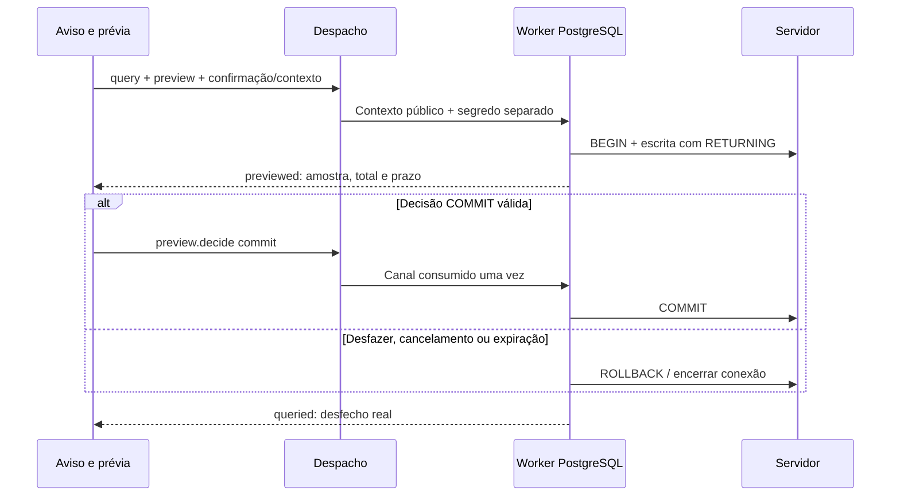

# 59 — O fechamento da 0.3.9: janelas acopladas, banco completo e pente fino

> **Classe: PLANO** (`DocsPublic/README.md`). Este documento diz **o que falta**
> para encerrar a 0.3.9 e **em que ordem**. O que já foi feito, com data e prova,
> fica no [`40.7`](40.7-registro-das-entregas.md). O estado do projeto, no
> [`40`](40-estado-e-continuidade.md). Cada item, ao ser entregue, ganha a data e
> o parágrafo do 40.7 que o prova; nenhum item sai daqui sem isso.

## 1. A decisão (o autor, 2026-10-03, noite)

A série 0.3.6–0.3.9 reorganizou a casca da IDE. Ela **não se encerra** no estado
de 2026-10-03 (protocolo `0.150.0`). Antes, o autor quer:

- **Painéis que não são pop-up.** Ferramenta de trabalho contínuo vira
  **janela acoplada** ao layout, no modelo das tool windows da JetBrains. Abre
  no slot do lado do trilho em que o ícone está (40.7 §7.207).
- **Banco de dados completo**, nas palavras dele: "um ambiente completo para
  banco de dados e com certa profundidade prática e segura para usar banco de
  dados na IDE". O MongoDB entra **com escrita** (era só leitura).
- **Grafana com visualização web dentro da IDE.** Ela é opcional e vem
  **desligada por padrão**: "vai pesar apenas no download, e não em consumo de
  memória RAM, pois o usuário pode ativar/desativar". Desligada, a IDE não
  carrega o motor web.
- **Pente fino no fim:** polimento de frontend, bugs, comportamento e
  desempenho.

Depois disso a 0.3.9 fecha **oficialmente**, "para não ficarmos nisso
eternamente". A **0.4 é inteira do ecossistema embarcados**
([`52`](52-arquitetura-executavel-da-0.4.md)). Ela já começa com a base de
frontend para painéis acoplados, porque os painéis da 0.4 também não serão
pop-up.

### 1.1 O que continua pop-up, por decisão

| Painel | Por quê |
| --- | --- |
| Aviso de escrita SQL (impacto, 40.7 §7.209) | Decisão do autor ("faz sentido e eu quero que isso se mantenha"): uma decisão pontual e perigosa pede o foco inteiro. |
| Diálogo da conexão do Banco | Configuração pontual. A JetBrains também usa diálogo ("Data Sources and Drivers"). |
| Bibliotecas, Instalar ferramentas | Tarefa pontual: escolher, ver a prévia e aceitar. |
| Configurações, seletor de pastas, renomear, excluir, descartar no Git, colar no terminal | Decisões pontuais. |
| Toolchain e Python (abrem abaixo do widget do topo) | São contextuais ao widget. |
| Embarcados | Fica como está até a 0.4, que o redesenha. |

## 2. A ordem (consolidada com o autor em 2026-10-03, noite)

Cada passo termina com:

- a **prova na tela real, com o mouse e o teclado do autor**;
- os gates verdes;
- o registro no 40.7.

| # | Passo | Situação |
| --- | --- | --- |
| 1 | **Containers acoplados** (§3), **tela de boas-vindas** (§3.1) e **interruptor moderno** (§3.2) | feito (40.7 §7.210–§7.211) |
| 2 | **Topo:** o ☰ esconde por um momento os widgets do topo, em vez de empurrá-los (§3.3) | feito (40.7 §7.213) |
| 3 | **Modernizar os controles antigos** no padrão interativo (§3.4) | feito (40.7 §7.214) |
| 4 | **Configurações redesenhada** (§3.5) e **seletor "Abrir projeto"** (§3.6) | feito (40.7 §7.215), com os campos de texto refeitos e o menu que não deixa o mouse atravessar |
| 5 | **Remoto acoplado** (§4) | feito (40.7 §7.216), provado contra sshd reais, com as conveniências de SSH (confiar no servidor, último contato, programa lembrado) |
| 5b | **Painel de baixo em relevo** (pedido do autor, 2026-10-04: "um fundo e melhorar a separação visual") | feito (40.7 §7.217): bandeja e poço para todas as abas; o texto do terminal na grade |
| 6 | **Grafana: visualização web opcional** (§6) | feito (40.7 §7.218–§7.219, protocolo `0.154.0`), provado contra um Grafana 11.2.0 real, com a aba Web endurecida. O AppImage com o QtWebEngine foi testado (121 MB) e **só volta depois do pente fino** (decisão do autor) |
| 7 | **Banco completo** (§5.1–§5.7), com o MongoDB lendo e escrevendo | escrita MongoDB, confirmação seletiva e formulário concluídos (40.7 §7.220, 2026-10-05); ODBC concluído e validado (§5.9; 40.7 §7.221); produção/somente leitura e contexto validados (§5.10; 40.7 §7.222); prévia PostgreSQL validada (§5.11; 40.7 §7.223); base segura dos consoles/árvore aceita (§5.12; 40.7 §7.225); menus, console, grade e motores restantes a fazer |
| 8 | **Pente fino e fechamento** (§7) | a fazer |

## 3. Containers acoplados

**Inspiração:** o Docker Desktop, adaptado ao estilo JetBrains da IDE. É a
mesma base da janela do Banco.

- **Os arquivos:**
  - `ContainersWindow.qml`: cabeçalho com o motor (● podman · rootless), o
    filtro e "parados".
  - `ContainerListPane.qml`: seções EM EXECUÇÃO, PARADOS e IMAGENS, com ponto
    de estado, nome, imagem e porta do host. Ao passar o mouse aparecem
    parar/iniciar, logs e shell.
  - `ContainerDetail.qml`: o container escolhido, com imagem, id, status,
    portas (a do host vira link para `localhost`) e ações conforme o estado.
  - `ContainerRows.qml`: as linhas, puras.
- **Abre sem projeto**, porque o motor é da máquina (`ShellDocks.needsProject`).
  As abas de logs e shell continuam exigindo projeto, e a tela diz isso.
- **O compose do projeto** fica no rodapé. Desligado, ele diz o que falta.
- **Saíram:** `ContainerPanel.qml`, `ContainerPanelHost.qml` e
  `ContainerListView.qml`. O `ContainerController` perdeu `close()` e
  `panelVisible`; `open()` pergunta ao motor e pede a janela
  (`windowRequested`).
- **Provas:** `tst_container_rows` e `tst_containers_window` (a promessa do
  compose); falta a tela.

### 3.1 A tela de boas-vindas (decisões do autor, 2026-10-03)

- **Só boas-vindas.** Não há trilhos, janelas, painel de baixo, atalhos de
  área (Ctrl+Alt+W/J/O/M/K/P) nem o "Abrir projeto" da barra de cima. O
  conteúdo fica: os projetos recentes, criar, o cartão "Abrir projeto" e
  Configurações.
- **A linha "Ambiente: N de M ferramentas" saiu.** O autor achou que ela
  "atrapalha"; as ferramentas ficam no painel Ferramentas, dentro do
  projeto.
- **O texto é próprio**, e não cópia do site: "Bem-vindo ao Kinein Vectis /
  Do código à placa, no mesmo lugar."
- **O fundo é um degradê da paleta do ícone**, misturado em OKLab ("suave,
  não o sRGB"), com uma **onda animada**:
  - vem ligada e se desliga no interruptor "Animação"; a escolha fica no
    global, `welcomeAnimation`, protocolo 0.151.0;
  - só anda com a tela à vista e a janela em uso, então ao abrir um projeto
    ela para sozinha;
  - o relógio dá 20 passos por segundo: medido, 4,8% de um núcleo ligada e
    0% desligada (a 60 quadros por segundo eram 10,8%).
- **A arte do site foi tentada e trocada.** O autor preferiu o degradê,
  porque a arte competia com o conteúdo. A arte também não está sob a
  licença do código.
- **As cores do degradê são calculadas ANTES**, por um script em `scripts/`,
  e não em tempo de execução. Um gate confere que o resultado bate com o
  script.

### 3.2 O interruptor moderno

`KvToggleChip` com `switchStyle`: rótulo, ícone opcional e um trilho com a
bolinha que desliza (âmbar quando ligado). Todo chip acende ao pairar e
responde ao pressionar. Ele vale para toda preferência de liga/desliga.

### 3.3 O topo com o ☰ aberto

Pedido do autor: ao clicar no ☰, os menus aparecem na barra e os widgets do
topo (projeto, git, toolchain, python) **somem por um momento**, em vez de
serem empurrados para o lado. Ao fechar o ☰, eles voltam iguais.

### 3.4 Modernizar os controles antigos

Feito em 2026-10-03 (40.7 §7.214). O levantamento, por script, achou 31
campos de texto, ~20 botões e três menus desenhados à mão. Agora:

- **`KvTextField`** é o campo da IDE (placeholder, pairar, foco âmbar com
  anel, ícone opcional, × que limpa). Os 31 campos usam ele; fica só o
  caminho editável do seletor de pastas, revisto no passo 4.
- **`KvButton`/`KvIconButton`** acendem ao pairar e respondem ao pressionar,
  com transição; `primary` + `danger` é o vermelho cheio do irreversível.
- **Um menu só** (`AppMenuPopup`) para o ☰, a árvore, o terminal e a
  configuração de execução: ícone, atalho real à direita, separador entre
  grupos e a barra âmbar no item da vez.
- **O atalho do menu sai do catálogo de comandos**, e o gate de atalhos
  confere os mapas de exceção.

### 3.6 O seletor "Abrir projeto" (pedido do autor, 2026-10-03, noite)

Feito em 2026-10-04 (40.7 §7.215, protocolo `0.152.0`). O autor acrescentou,
vendo a tela: o seletor **abre sempre no Início** (`/home/<usuário>`), com o
projeto aberto marcado, e não dentro do projeto.

A navegação de pastas "está muito boa". O que muda:

- **LOCAIS só com o Início** (`/home/<usuário>`). É lá que os projetos
  ficam, e o Início já contém Downloads, Documentos e as outras pastas do
  usuário. Saem os atalhos "Documentos", "Downloads" e "Raiz do sistema", e
  os RECENTES ficam.
- **Dimensionamento e aproveitamento do espaço** revistos: a coluna de
  locais mais estreita, a lista com mais respiro e informação útil por
  linha.
- **O botão "+ Criar projeto…" sai deste painel.** Ele estava apagado e sem
  função clara no "Abrir"; criar continua no cartão da tela de boas-vindas e
  no menu.
- **O selo do ecossistema** (Rust/Cargo, Python…) fica. Uma pasta **híbrida**
  (duas ou mais linguagens que a IDE suporta, como o próprio Kinein: Rust e
  CMake/C++) ganha um selo que diz isso, com as linguagens no tooltip, em vez
  de mostrar só a primeira.

### 3.5 Configurações

Feito em 2026-10-04 (40.7 §7.215). Três seções à esquerda (Editor, Build,
Interface), a linha inteira clicável, a prévia da fonte, o perfil de rigor
com o que cada opção faz, a animação da tela de boas-vindas, e o selo
"neste projeto" onde o valor vem do projeto.

## 4. Remoto acoplado

Os alvos SSH, com deploy, sync e comandos, são trabalho contínuo: a saída é
acompanhada enquanto se edita. O painel pop-up vira janela acoplada:

- a lista de alvos com o estado da conexão;
- as ações do alvo escolhido;
- a saída da última ação.

O mesmo modelo serve de referência para a JetBrains ("Remote Host").

Feito em 2026-10-04 (40.7 §7.216): `RemoteWindow` no slot do lado do ícone,
com os alvos em cima (o ponto da última sonda), uma ação primária com o
porquê, as seções em chips que quebram a linha e o conteúdo da seção. O
pop-up (`RemotePanel`, `RemotePanelHost`, `RemoteList`) saiu. A área com a
janela aberta aparece no trilho enquanto estiver aberta.

## 5. Banco de dados completo

**Retomada em 2026-10-05, antes de editar o código.** A sessão anterior
terminou com a fatia ainda sem commit: escrita MongoDB (`mongo_command` e
`mongo_write`), protocolo `0.156.0`, confirmação seletiva (`confirm`), nomes
**Conectar banco** / **Criar banco…**, `KvSegmentedControl` e padrões por
motor. A retomada revisou a recusa no core e o aviso na UI, testou a
gramática e os padrões, provou PostgreSQL/MongoDB reais e os gestos com
mouse/teclado na janela da IDE, sincronizou a documentação e passou pelo
gate completo e estrito. Fatia concluída no 40.7 §7.220. Esse é o registro
da retomada de 2026-10-05; ODBC foi concluído depois (§7.221), seguido por
produção/somente leitura (§7.222) e prévia PostgreSQL (§7.223).

**Decisão do autor na sessão de 2026-10-04:** escrita comum roda direto;
remoção, esvaziamento, alteração em massa sem filtro e instrução que o core
não sabe classificar pedem confirmação. Essa decisão substitui a regra de
avisar em toda escrita de desenvolvimento. Perfis de produção, modo somente
leitura e transação com prévia PostgreSQL estão implementados e validados
(§5.3; 40.7 §7.222–§7.223).

**Base histórica em 2026-10-03, antes dessas entregas:**

- a janela acoplada, com a árvore e os dados na própria janela;
- o console no editor, com cores;
- a grade revista;
- o aviso de escrita com o impacto contado;
- PostgreSQL, SQLite e MongoDB (só leitura).

Ver 40.7 §7.206–§7.209.

### 5.1 Barra, menus e árvore viva

**Primeira fatia concluída e validada em 2026-10-06; provas no 40.7 §7.226.**
Seleção estável, setas/Home/End/Enter, F5, botão direito/Shift+F10 e Escape;
barra com releitura do catálogo, console, dados e recolher; + por motor e
descoberta local; estado vazio clicável/Alt+Insert; cores por motor e menu
fora do recorte nos dois docks. Console/edição/consulta usam os donos atuais.
Protocolo permanece `0.160.0`. Aceite dos gates registrado no diário.

**Ainda pendentes desta seção:** “Novo banco…” no submenu, localizar o
objeto do console, abrir console com SELECT/modelos SELECT/INSERT/UPDATE,
esvaziar/remover objetos com aviso de impacto, desconectar com descarte
real da sessão e atualizar o catálogo após DDL. SQL/modelos e detecção de
mudança estrutural precisam de contrato no core; não duplicar o gerador
existente de leitura da tabela no QML. A lista abaixo conserva o escopo
completo da seção, incluindo o que já foi feito.

- **Barra da janela**, como na referência JetBrains:
  - **+** com submenu de motores, cada um com ícone colorido, e "Desta
    máquina…" e "Novo banco…";
  - ler de novo, console, ver dados, recolher tudo e localizar o objeto do
    console.
- **Estado vazio** com o atalho: "Nenhuma conexão · Criar conexão… (Alt+Insert)".
- **Menu de contexto** (botão direito) na árvore:
  - **conexão:** abrir console, ler de novo, editar, desconectar;
  - **tabela:** ver dados, abrir console com `SELECT`, copiar nome, gerar
    `SELECT`/`INSERT`/`UPDATE`, esvaziar e remover. As duas últimas passam
    pelo aviso de impacto.
- **A árvore se atualiza sozinha.** Depois de um `CREATE`, `DROP` ou `ALTER`
  executado com sucesso, a estrutura da conexão é relida.
- **Ícones dos motores coloridos**, para reconhecer o motor de relance.

#### 5.1.1 Desenho da primeira fatia de ações (2026-10-06)

A base é `d116b43`, protocolo `0.160.0`. Esta fatia liga gestos novos aos
pedidos existentes: `datasource.introspect`, `datasource.console` e
`datasource.query`. Não altera o contrato IPC nem cria outra interpretação
SQL. A geração de modelos e o refresh automático após DDL serão uma fatia
posterior no core, junto com a semântica de desconectar.

- `DataSourceTree`: seleção por chave de tupla, navegação e recolher tudo;
  releitura preserva a seleção ou retorna à conexão se o objeto sumir.
- `DatabaseTreeActions`: dono das ações disponíveis e do contexto do menu;
  perfis, workspace ou objeto diferentes invalidam um menu aberto. Releitura
  usa o catálogo existente e fica indisponível enquanto ele estiver lendo.
- `DatabaseTreeView`: seleção visível, setas, Home/End, Enter, F5, Shift+F10
  e botão direito. A view emite gestos e não interpreta SQL.
- `DatabaseToolbar` e `DatabaseWindow`: criar conexão por motor, reler a
  conexão escolhida, console, dados, recolher; estado vazio clicável e
  Alt+Insert quando o foco está no Banco.
- O menu usa `AppMenuPopup` numa camada da janela, fora do recorte da
  árvore e válida também no dock direito. Escape devolve o foco à árvore;
  a ação restaura o foco antes de abrir outro diálogo.

Provas: harnesses com mudança de catálogo durante seleção/menu, colisões de
nomes, invalidação de perfil/workspace, releitura ocupada e ações por tipo;
GUI real com clique direito, teclado, releitura de uma tabela criada fora da
IDE, dois bancos homônimos e dock estreito. Lint, fiação, arquitetura,
harnesses nos Qt 6.10/6.4, build e abertura sem diagnósticos obrigatórios.

### 5.2 Console que ajuda

- **Completar nomes** de tabelas e colunas a partir da estrutura já lida, e
  palavras-chave. Isso funciona sem servidor de linguagem.
- **Histórico de consultas** por conexão (as últimas N), reabrível no
  console.
- **O LSP de SQL fica como opção registrada.** O candidato é o **Postgres
  Language Server** (Supabase, Rust, MIT). O sqls (Go, MIT) é multi-motor, e
  o sql-language-server (Node) fica fora.

### 5.3 Segurança em camadas

1. **Feito (40.7 §7.209).** O aviso mostra o comando e a consequência contada,
   e na destrutiva só roda com o nome digitado.
2. **Conexão de produção — feito (40.7 §7.222).**
   - Um perfil marcado como **produção** ganha uma cor de destaque na janela,
     no console e no aviso.
   - Toda escrita pede o aviso, mesmo a comum, e a destrutiva pede o nome da
     **conexão** além do alvo.
   - Uma opção "somente leitura" recusa qualquer escrita no core.
3. **Transação com prévia — feito (40.7 §7.223)** (PostgreSQL). Uma opção no aviso: executar dentro
   de `BEGIN`, mostrar as linhas afetadas e só então **confirmar (COMMIT)** ou
   **desfazer (ROLLBACK)**.
4. **Mongo usa a mesma política de confirmação** (decisão de 2026-10-04).
   Inserir e alterar com filtro podem rodar diretamente. Apagar pede aviso;
   `deleteMany({})`, `drop()` e `updateMany({})` são destrutivos. Filtro que
   pega toda uma coleção não vazia também exige confirmação.

### 5.4 Grade de dados de trabalho

- **Carregar mais:** hoje a grade para nas primeiras 200 linhas; páginas
  seguintes por `LIMIT/OFFSET`, ou pelo teto do core.
- **Ordenar:** clique no cabeçalho.
- **Copiar:** célula ou linha, em TSV ou CSV.
- **Exportar** o resultado para CSV.
- **Editar célula** numa tabela com chave primária: gera o `UPDATE … WHERE pk`,
  que respeita a política de confirmação e de alcance do §5.3.

### 5.5 MongoDB completo

**Implementado e validado em 2026-10-05 (40.7 §7.220).** O core interpreta
JSON estrito e chama o driver para leitura, escrita e medição; não avalia
JavaScript. A sintaxe aceita está no manual e na arquitetura/37 §4.

- **Escrita:** `insertOne`/`insertMany`, `updateOne`/`updateMany`,
  `deleteOne`/`deleteMany` e `drop`. A sintaxe do console é definida no
  passo, documentada no manual e com teste.
- **Impacto:** contagem por `countDocuments` com o mesmo filtro.
  Alterar/apagar em massa com filtro vazio é destrutivo; `updateOne` e
  `deleteOne` tocam no máximo um documento. Apagar sempre pede confirmação.
- **Teste com MongoDB real em container**, como o PostgreSQL.

### 5.6 Provado com PostgreSQL real

A fatia 7.220 provou PostgreSQL e MongoDB reais em 2026-10-05: leitura,
escrita, senha pedida/recusada e aviso com DROP. Os gestos de console e
confirmação passaram na janela da IDE; a prova automatizada está em
`testar-banco-real.py`. A IDE cria PostgreSQL em contêiner por **Criar banco…**.
Para completar a bateria do passo 7, faltam:

- o aviso com `UPDATE … FROM`;
- TLS `verify-full` (configuração).

A transação com prévia deixou de ser pendência: COMMIT/ROLLBACK, expiração,
contexto e desfecho desconhecido foram provados contra PostgreSQL real e
na IDE, no 40.7 §7.223. TLS obrigatório também foi corrigido e provado contra
servidor sem TLS nessa fatia; isso não substitui a prova de `verify-full`.

As imagens `postgres:16-alpine` e `mongo:7` já estão no podman local.

### 5.7 "Todos os bancos": a pergunta do autor (2026-10-04), para decidir

O autor perguntou se há algo pronto que a IDE só orquestre, para a pessoa
escolher qualquer banco em vez dos quatro de hoje. As opções levantadas:

| Caminho | O que cobre | Custo |
| --- | --- | --- |
| **ODBC** (crate `odbc-api`, unixODBC) | Qualquer banco com driver ODBC: Oracle, SQL Server, MySQL, Firebird, DB2, Snowflake… A pessoa instala o driver do fabricante; a IDE lista os DSN por `SQLDataSources`, sem depender do executável `odbcinst`. | Uma dependência de sistema (`unixodbc`). A árvore sai do catálogo padrão (`SQLTables`/`SQLColumns`). A qualidade varia por driver. |
| **ADBC** (Arrow Database Connectivity) | PostgreSQL, SQLite, DuckDB, Snowflake, BigQuery, Flight SQL | Bom para dados em colunas, mas com poucos motores ainda. |
| **`usql`** (cliente universal, um binário Go) | Mais de 40 bancos pela linha de comando | Orquestrar um processo externo e ler a saída como texto. Serve para console, não para árvore nem edição. |
| JDBC (o caminho do DBeaver e do DataGrip) | Praticamente todos | Exige uma JVM. Fora, pelo peso. |

**Proposta histórica, aceita pelo autor abaixo:** dois níveis.

1. **Nativos completos.** PostgreSQL, MySQL/MariaDB, SQLite e MongoDB, com
   árvore, edição, aviso de impacto e transação.
2. **"Outro banco (ODBC)" genérico.** Console, árvore pelo catálogo padrão e
   grade de leitura, com o aviso de escrita na forma genérica (sem contagem
   prévia).

É a forma que cobre "a escolha do usuário" sem a IDE manter um driver por
banco.

**Decidido pelo autor em 2026-10-04: vale, e entra no passo 7.** Nas palavras
dele: "os nativos e os por plugins que o usuário quiser usar, e a IDE apenas
orquestra". Ficam assim:

- os nativos completos, como acima;
- os outros bancos pelo driver ODBC que a pessoa instala;
- a IDE só lista os DSN e orquestra;
- a IDE não baixa driver sozinha. Um driver é código nativo de terceiros, e
  carregá-lo é gesto explícito, com aviso (§7, segurança).

### 5.8 A fatia retomada e o próximo prompt (atualizado em 2026-10-06)

A arquitetura do Banco, com diagramas, donos e limites, está no
[37](../arquitetura/37-banco-de-dados.md). A escrita MongoDB, a confirmação
seletiva e o formulário estão concluídos, com gate completo e estrito
verde, PostgreSQL/MongoDB reais e prova na tela registrados no 40.7 §7.220.
O passo 7 continua aberto.

**Última fatia concluída:** primeira fatia de ações da árvore (§5.1.1),
mantendo protocolo 0.160.0. Barra, menu por objeto/motor, seleção, atalhos
locais e releitura foram validados nos Qt 6.10/6.4 e na IDE real, nos dois
docks. Aceite, achados e limites no 40.7 §7.226; confira git log. Consoles
seguros e reutilização das abas continuam aceitos no §7.225 (d116b43).
Prévia PostgreSQL permanece aceita no §7.223 (fbf3294). Produção/somente leitura
permanecem aceitas no §7.222 (c4d8779), e ODBC no §7.221 (fa32f51).
Não repita provas aceitas sem risco concreto.

**Relevo do editor concluído:** pedido do autor em 2026-10-06, desenho
anterior ao código no §7 e aceite no 40.7 §7.224. Código e Markdown usam
KvInsetSurface como o terminal, conservando as 24 linhas de código na janela
de 1400×875. Provas de edição, roda, busca, foco e Markdown passaram; gates
completos e estritos verdes. Confira git log para o commit local.

**Fatia atual:** restante de ações/árvore viva (§5.1): geração de instruções
no core e ações com impacto, depois desconectar/localizar objeto e refresh
após DDL. Vínculo console/conexão, identidades, seleção, menus e releitura
já estão validados (§5.12/§5.1.1); continuar sobre essa base.
O desenho e o contrato antecedem o código. Depois console (§5.2) e grade
(§5.4), com prova real conforme §5.6.
MySQL/MariaDB é alvo do §5.7; não está no enum de motores atual. O passo 8
vem depois e inclui a correção do limite DNS/NSS registrado no §7.

Prompt de continuidade (conferir estado e log antes de usar):

```text
Kinein Vectis — continuar o fechamento da 0.3.9, passo 7 (Banco).
Use a main em /home/hugh/KineinVectis. Em 2026-10-06 o autor pediu reunir
frontend e core nesse checkout: os sete commits até b31aa89 foram incorporados
por fast-forward. Não abra outra divisão para o frontend.
O autor autorizou concluir Banco e pente fino e gerar/validar AppImage final.
A integração antecipada em main e a retirada da divisão substituem a ordem
anterior, por pedido explícito nessa sessão. Sem push. Não empacote antes de
cumprir os critérios do passo 8.

Comece com git status --short --branch e git log -5; preserve todo trabalho
local. Leia 00-comece-aqui, o cabeçalho e a fila do 40, a última entrada
do 40.7, o 59 §2/§5/§7, arquitetura/37 e o contrato arquitetura/03.
Confira PROTOCOL_VERSION no código. Preserve as proteções do 40.7 §7.220.
Leia o aceite do §7.221: protocolo 0.157.0, ODBC concluído e validado.
ODBC está no commit local fa32f51. Produção/somente leitura/contexto
(protocolo 0.158.0) estão validados no §7.222. Confira git log/status para
localizar o commit e preservar qualquer trabalho posterior. Não repita
provas aceitas sem risco concreto. Prévia PostgreSQL (§5.11), protocolo
0.159.0, está concluída e validada (§7.223). Confira git log e preserve
qualquer trabalho posterior. O relevo do editor está validado (§7.224),
com prova visual, gates completos e estritos e commit próprio. Consoles
seguros e abas de execução estão aceitos no §7.225, protocolo 0.160.0.
Barra, menus, seleção/atalhos locais e releitura estão aceitos no §7.226.
Atual: geração de instruções no core e ações com impacto, depois desconectar,
localizar objeto e refresh após DDL (§5.1). Não refaça os menus/seleção.
Leia os donos, limites e o desenho antes do código.

A decisão de 2026-10-04 permanece: inserir, criar e alterar com filtro
rodam sem pop-up comum; remover, alterar tudo e impacto desconhecido
pedem confirmação. A medição silenciosa protege filtro que pega todos.
O console Mongo usa um comando por linha, com JSON estrito; preserve
a forma antiga de leitura e o tratamento de Extended JSON.

Após o relevo do editor, siga menus/árvore viva (§5.1), console (§5.2),
grade (§5.4) e motores nativos restantes (§5.7). Uma fatia por commit,
contrato antes do código.
ODBC nunca baixa driver; preserve o gesto de carregar e a revogação da sessão.

PT-BR na documentação/UI; identificadores em inglês; regras no core.
Segurança: argumentos sem shell, validação estrita, segredos só em memória,
recusa por padrão e testes que tentam quebrar. Não suprima avisos de terminal.
Prove os gestos com mouse/teclado na janela da IDE, capturando só essa janela.
HOME real, XDG isolado; bancos de teste em contêineres no loopback, com limpeza.
Todos os gates verdes antes do commit local. Nunca push.
Registre em 40.7, 59, 40, CHANGELOG, manual e arquitetura.

Após o Banco, passo 8 inteiro: revisão minuciosa das outras áreas que
o autor relatou em 2026-10-05, além de segurança, bugs e desempenho.
O critério é consumo de recurso no uso diário. O AppImage é a última etapa,
com Qt estável atual e caminho acelerado da aba Web; não o faça antes.
Ao concluir de fato a 0.3.9, desative o timer local de retomada autorizado
pelo autor e registre o fechamento. Limite de uso não encerra a tarefa.
```

### 5.9 Desenho da fatia ODBC — 2026-10-05

**Implementado e validado no 40.7 §7.221 (fa32f51, protocolo 0.157.0).**
O desenho abaixo registra a situação anterior à implementação.

**Antes do código.** Base: commit 57dc6ec; protocolo 0.156.0; worktree
layout-0.3.6 limpo. O sistema tem unixODBC 2.3.14 como biblioteca, sem os
comandos isql/odbcinst nem driver de banco encontrado. Não há ODBC no enum,
no console ou na árvore atuais. A biblioteca Rust escolhida para avaliar
é odbc-api 29.1.1 (MIT), sem features de interface gráfica ou derive.
A IDE usa o gerenciador instalado no sistema; não instala nem baixa driver.

**Contrato previsto, protocolo 0.157.0:**

- Motor `odbc`; `database` identifica um DSN existente, não uma string de
  conexão. Host e porta ficam vazios/zero; usuário e política de segredo
  seguem os contratos existentes. Perfil salvo nunca contém senha.
- `datasource.odbc.sources {}` retorna `{ sources }`, com `dsn`, `driver` e
  `identity` em cada entrada. Usa SQLDataSources/SQLDrivers do gerenciador;
  não conecta nem carrega o driver. Expõe somente nome/identidade pública,
  nunca os atributos arbitrários, que podem conter segredos.
- `datasource.odbc.authorize { name, identity, workspace }` retorna `{ name, identity, workspace }`.
  Confere projeto e desafio do perfil completo/driver atual e registra aprovação apenas na memória do core,
  vinculada ao projeto, perfil e DSN/driver. Mudança de perfil ou identidade
  exige nova autorização; remover o perfil revoga a aprovação.
- `DRIVER_APPROVAL_REQUIRED`, com detalhes `{ name, dsn, driver, identity, workspace }`,
  recusa test/introspect/query antes do job que abriria a conexão. A UI mostra
  o aviso de código nativo e só envia authorize ao clicar **Carregar driver**.
  Cancelar não conecta; resposta atrasada não autoriza outro perfil/projeto.
- Catálogo por SQLTables/SQLColumns; retorna schemas/tables/columns existentes.
  Campo aditivo `readSql` da tabela guarda a leitura gerada pelo core com o
  delimitador de identificador informado pelo driver. A UI não adivinha a
  sintaxe do motor que está atrás do ODBC.
- Console usa query/queried existentes e segredo só em memória, via SQLConnect,
  sem shell, argumento de processo ou montagem de connection string. Leitura
  tem teto de linhas, colunas, célula e memória. Toda escrita ODBC exige o
  aviso genérico: nenhum COUNT SQL de outro dialeto é enviado para estimar.
  Impacto ODBC é classificação local, sem carregar driver ou executar SQL.

**Donos e arquivos:** tipos em protocol/datasource_odbc e datasource;
serviços em core/datasource/odbc (descoberta/aprovação/conexão),
odbc_query, odbc_catalog e odbc_rows (buffer comum); handler datasource_odbc; integração nos handlers
existentes; ponte core_client_datasource, dispatch de erro tipado e os
roteadores existentes. Um DataSourceOdbcController filho guarda o estado do
aviso e da lista; o formulário recebe DSN e emite escolha. Views Kv* e um
diálogo de carregamento próprio; criação de banco continua nativa.

**Provas de aceite:** recusa antes de qualquer carregamento, cancelamento,
identidade/perfil alterado e projeto diferente; params estritos, ausência de
senha no perfil/log e erros do driver sem ecoar credenciais; DSN malformado
não vira connection string; SQL e nomes com aspas não escapam dos limites.
Driver real de teste somente em diretório temporário, configuração ODBC/XDG
isolada e HOME real: listar sem carregar, autorizar, catálogo, leitura com
NULL/teto e escrita confirmada. Provar também os gestos na janela real da IDE,
com mouse/teclado e capturas só dessa janela. Limpar tudo que a prova criar.
Todos os gates verdes antes do commit local, sem push.

**Continuação atualizada:** esta fatia não encerra o passo 7. Produção/
somente leitura e prévia PostgreSQL já foram aceitas (§7.222–§7.223).
MySQL/MariaDB nativo, árvore viva, completion e ampliação da grade seguem
a fila do §5.8. Reempacotar AppImage permanece
no fim do passo 8; a dependência unixODBC deve ser tratada nessa etapa.

### 5.10 Desenho da próxima fatia: produção e somente leitura — 2026-10-06

**Execução concluída e validada no 40.7 §7.222.** O desenho original abaixo
preserva as decisões e os achados anteriores ao código.

**Plano, antes do código.** Implementar após aceitar e commitar ODBC.
O contrato terá duas preferências do perfil, `production` e `readOnly`,
ambas falsas quando ausentes. A decisão fica num módulo pequeno do core,
antes da resolução de senha e da criação do job. O modo somente leitura
recusa escrita e operação desconhecida, mesmo com `confirmWrite: true`.
Todo o lote deve ser considerado, incluindo CTE e comandos de transação.
Preservar a proteção de leitura no motor nativo e os limites declarados
para ODBC; não apresentar rollback genérico como garantia de READ ONLY.

Produção terá destaque na árvore, console e aviso. Toda escrita exige
confirmação; na destrutiva, conexão e alvo precisam ser conferidos.
Medição e confirmação devem continuar ligadas ao projeto, perfil e SQL,
para uma resposta antiga não liberar outra operação. O contrato tipado
deve ser atualizado antes de ligar os controles da UI.

O pedido da UI terá um `clientContext` público e único, ecoado no resultado
e na recusa, além do projeto esperado e da cópia pública do perfil salvo.
O core confere o destino antes da senha/job; a UI descarta resposta cujo
contexto já foi invalidado. A senha só entra no envio, por `passwordFor`,
e nunca na cópia da operação pendente. O léxico SQL terá um único dono
para fronteiras de instrução, strings, identificadores, comentários e
blocos com dólar; lote ou CTE mutante não se torna leitura pela primeira
palavra. Entrada ambígua exige confirmação e não passa em `readOnly`.

**Achado da revisão, ainda a corrigir:** a senha de sessão da UI é global.
`runOn(name)`, teste, catálogo e impacto podem enviá-la para outro perfil,
e editar o destino sem trocar de motor não a limpa. Extrair o dono da
credencial, ligando-a ao projeto e à cópia canônica do perfil completo.
Todos os emissores devem pedir `passwordFor(name)` ao mesmo dono;
nome igual com outro host/DSN não permite reutilização. Troca, edição,
remoção, fechamento e mudança de projeto limpam o segredo. Não salvar
senha em consulta pendente, histórico, perfil ou log.

A revisão também encontrou contexto incompleto nos resultados comuns:
o aviso de impacto não é cancelado na troca de projeto e `handleQueried`
não correlaciona todo resultado com o pedido ativo. Corrigir isso junto
da política, incluindo perfil alterado e projeto reaberto. A senha pedida
no console deve selecionar o perfil certo e repetir o SQL original.
`createDatabaseOnServer` não pode marcar escrita de produção como já
confirmada; `datasource.destroy` com dados também respeita `readOnly`.
Remover apenas o perfil continua sendo uma alteração de configuração.

Para a fatia do console (§5.2), guardar os achados: nomes diferentes
podem virar o mesmo `file_stem`; o cabeçalho não pode transformar quebra
de linha do nome em SQL; `ensure` precisa conferir links simbólicos e
limites do projeto; `statementAt` não pode separar dentro de literais.
Resolver a associação do console no core, sem escolher silenciosamente
o primeiro perfil cujo nome sanitizado coincide.

Aceite: testes que tentam contornar `readOnly`, lotes e confirmação;
teste QML com duas conexões e alteração de destino, inspecionando os
argumentos emitidos; PostgreSQL/MongoDB/SQLite reais; gestos na IDE com
produção destacada, nome parcial recusado e somente leitura bloqueando
escrita. Gates completos e documentação antes do commit local.

**Prévia PostgreSQL vem na fatia seguinte.** Worker mantém a transação,
decisão por canal, tempo limitado e rollback ao cancelar, falhar,
trocar projeto ou encerrar. Token ligado ao contexto, sem rede no despacho;
SQL que encerra a transação não pode escapar. Registrar limites de
sequências, triggers e efeitos externos antes de oferecer a prévia.
Provar commit e rollback por uma conexão independente, além de expiração
e decisões antigas ou repetidas.


### 5.11 Desenho da fatia seguinte: prévia PostgreSQL — 2026-10-06

**Implementado e validado no 40.7 §7.223 (fbf3294, protocolo 0.159.0).**
O plano original abaixo preserva as decisões e limites anteriores ao código.

**Plano antes do código, condicionado ao aceite da §5.10.** Preservar
produção, somente leitura, contexto e dono da senha da 0.158.0. A prévia
executa uma escrita real dentro de uma transação ainda aberta; a janela
mostra o efeito antes de a pessoa escolher confirmar ou desfazer. Não é
simulação. Conexão, locks e credencial ficam no worker, nunca no despacho.

**Referência de produto (MODE-D, consulta em 2026-10-06):** o
[modo de transação do DBeaver](https://dbeaver.com/docs/dbeaver/Auto-and-Manual-Commit-Modes/)
mantém alterações pendentes e oferece Commit/Rollback explícitos. A tradução
para a Kinein é um controller filho, mensagens IPC tipadas e a transação
pertencendo ao worker, com prazo e descarte ao perder o contexto.

**Referências e limites do motor.** O PostgreSQL documenta
[ROLLBACK](https://www.postgresql.org/docs/16/sql-rollback.html),
[RETURNING do UPDATE](https://www.postgresql.org/docs/16/sql-update.html)
e [sequências](https://www.postgresql.org/docs/16/functions-sequence.html).
O rollback desfaz as alterações transacionais; valores consumidos por
`nextval` e alterações de `setval` não são revertidos. Funções/triggers podem
ter efeitos externos que também não são desfeitos pela IDE. A UI precisa
explicar isso antes de executar a prévia; nunca prometer ausência de efeitos.

**API medida no checkout.** `postgres` 0.19.14 expõe `simple_query` que
coleta um `Vec`; seu comentário menciona `simple_query_iter`, mas essa API
não existe no código público instalado. Não implementar a partir do comentário.
`tokio-postgres` 0.7.18 já está no lock e expõe `Client::simple_query_raw`;
`Transaction::client()` permite usá-lo na conexão da transação. Conferir os
fontes e a documentação de [Client](https://docs.rs/tokio-postgres/latest/tokio_postgres/struct.Client.html)
e [Transaction](https://docs.rs/tokio-postgres/latest/tokio_postgres/struct.Transaction.html)
novamente antes do código. Tornar explícitas as
dependências já transitivas necessárias, auditar licença/MSRV e compartilhar
a montagem de configuração/TLS com o caminho atual. Runtime assíncrono fica
no worker para drenar o driver enquanto a prévia aguarda a decisão.

**Contrato proposto para a próxima versão do protocolo:**

- `datasource.query` recebe `preview?: bool`, falso quando ausente. Todas
  as regras de confirmação/contexto continuam valendo antes de senha/job.
  Pedir prévia exige o aviso antes da escrita, também em Desenvolvimento.
- `event.datasource.impact` acrescenta `previewEligible`, decidido no core.
  O aviso oferece executar com prévia quando elegível; o console também
  recebe um gesto explícito para pedi-la nos comandos que normalmente rodam
  sem aviso. Nenhuma elegibilidade é deduzida por parser na UI.
- `event.datasource.previewed` informa `jobId`, `name`, `clientContext`,
  `previewId`, prazo em segundos, SQL original/executado, colunas, linhas,
  total afetado e truncamento. Nenhuma senha ou configuração do driver.
- `datasource.preview.decide` recebe `previewId`, `decision: commit | rollback`,
  `name`, `clientContext` e `expectedContext` obrigatórios. Resposta aceita a
  decisão; o resultado real de COMMIT/ROLLBACK chega por evento. Token
  desconhecido, expirado, de contexto diferente ou já consumido é recusado.
- `event.datasource.queried` encerra o job com o desfecho da prévia. Uma
  falha de COMMIT é falha, não confirmação presumida; perda de conexão
  durante COMMIT pode deixar o desfecho desconhecido e deve dizer isso.

**Primeiro recorte de execução:** uma instrução direta `INSERT`, `UPDATE`
ou `DELETE` no PostgreSQL. O léxico comum recusa ambiguidades, lotes,
controle de transação, SQL dinâmico e comandos fora desse recorte. Prévia
não aceita `CREATE DATABASE`, que não roda nessa transação. A execução
comum desses comandos continua no caminho existente.

Sem `RETURNING` explícito, compor `RETURNING *` apenas depois de validar
uma instrução desse recorte e localizar seu fim pelo léxico; preservar o
comando original e mostrar a forma executada. Retornar as linhas alteradas
com teto de retenção e contar todas pelo comando do servidor. Não separar
instruções nem inserir cláusula por expressão regular na UI.

**Donos e ciclo:**

- Módulo de registro da sessão do Banco guarda apenas contexto público,
  identificadores e canal de decisão. No máximo quatro prévias vivas e
  uma por destino; confirmar consome o identificador uma única vez.
- Executor PostgreSQL mantém a transação no worker, com streaming de
  resultado, orçamento de colunas/célula/bytes e tempo de consulta. Ao
  exceder limite de segurança ou falhar, desfaz e encerra a conexão.
- Prazo inicial de decisão: 60 segundos; `lock_timeout` e
  `statement_timeout` curtos, além do prazo total do cliente. Poll/cancel
  não bloqueia o laço IPC. Fechamento/troca do workspace, cancelamento do
  job, canal perdido e expiração desfazem prévias ainda sem decisão.
- Dispatcher confere perfil/contexto outra vez ao aceitar COMMIT. Uma
  decisão já aceita entra em execução; trocar projeto depois não é
  promessa de revogar um COMMIT que o servidor já recebeu.
- Controller filho da consulta guarda apenas a prévia atual. Trocar
  consulta/destino/projeto solicita rollback; resposta antiga não reabre
  o painel. O diálogo Kv mostra destino, política, SQL, amostra e número
  afetado; **Desfazer** recebe foco padrão. A opção de prévia só aparece
  quando o core disser que o comando é elegível.



**Provas necessárias:** confirmar e desfazer com conferência por conexão
independente; expirar; cancelar job; fechar/trocar/reabrir workspace;
substituir perfil; repetir decisão; token antigo; lote com COMMIT oculto;
erro, lock e queda de rede; resultado grande sem retenção ilimitada;
`UPDATE ... FROM`; senha ausente em logs/disco; gestos com mouse/teclado
no diálogo e amostra real. Registrar a limitação de sequência/trigger no
manual e na arquitetura. Todos os gates antes do commit local; nenhum
AppImage nessa fatia. Em seguida continuam §5.1, §5.2, §5.4 e §5.7.

### 5.12 Base dos menus/árvore: identidade do console e instrução — 2026-10-06

**Concluída e validada no 40.7 §7.225 (protocolo 0.160.0).** A retomada
revisou os arquivos modificados e novos, preservou sua implementação e
corrigiu os achados dos gates. O desenho abaixo antecedeu o código.
A leitura do caminho anterior
achou três riscos concretos: nomes diferentes viram o mesmo fileStem; ensure
segue symlinks e escreve com truncamento; statementAt divide por regex dentro
de literais/comentários. Antes das novas ações de geração/execução, a fatia
0.160.0 corrige essas fronteiras e as chaves da árvore.

- O core é dono do nome do arquivo: prefixo legível limitado e SHA-256 completo
  do nome UTF-8, com extensão por motor, na subpasta v1 dos consoles. Essa
  pasta separa a identidade nova dos nomes legados. Catálogo devolve bindings públicos e
  workspace junto com perfis. UI usa igualdade de caminhos fornecidos, sem
  reconstruir nomes nem aceitar descendentes por prefixo.
- Console antigo continua utilizável somente se seu nome de arquivo identifica
  exatamente um perfil. Arquivo ambíguo permanece intacto e perde o vínculo de
  execução; consoles novos desses perfis têm identidades distintas. Nada de
  migrar, sobrescrever ou apagar SQL existente implicitamente.
- Criação/inspeção atravessa .kinein/consoles por descritores, NOFOLLOW,
  NONBLOCK e verificação de arquivo regular. Criação exclusiva e header com
  nome escapado em uma linha; symlink, FIFO e diretório recusados. Isso protege
  esta operação; não promete isolamento contra outro processo do mesmo usuário
  que renomeie a árvore depois de devolver o caminho.
- datasource.console passa a correlacionar pedido/resposta com perfil e
  workspace públicos. datasource.console.statement recebe caminho, texto
  ainda não salvo e offsets UTF-16 do editor, com contexto/token obrigatórios;
  resolve vínculo e instrução no core, sem senha, conexão ou job.
- Seleção explícita vence. SQL usa o léxico comum para ; e linhas em branco
  externos a literais, identificadores, comentários e parênteses. Entrada
  ambígua é recusada na separação automática. Seleção explícita conserva o
  texto inteiro para a política de query existente, inclusive dialeto desconhecido.
  Offsets inválidos, meio de surrogate e texto maior que
  1 MiB também. Mongo mantém um comando por linha e JSON estrito no executor.
  A UI aceita só sua resposta ainda ativa e usa datasource.query/impact
  existentes, incluindo produção, somente leitura, ODBC e prévia.
- Chaves da árvore usam tuplas JSON. Mapas por nome têm protótipo nulo e
  leitura por propriedade própria: nomes com |, __proto__ e constructor
  não confundem expansão, leitura pendente ou estrutura de outra conexão.

Provas antes do aceite: colisões e arquivo legado intacto; links nos dois
níveis e no arquivo, FIFO, criação concorrente; newline no nome; literais
multilinha/dollar quotes/comentários e Unicode; contexto alterado e respostas
fora de ordem; nomes especiais na árvore. Repetir gestos reais de console,
produção/prévia quando afetados, só janela da IDE, XDG isolado e limpeza.
Todos os gates completos/estritos antes do commit. Depois implementar os menus,
ações e atualização automática do §5.1; passo 7 continua aberto.

## 6. Grafana: visualização web dentro da IDE

- **QtWebEngine.** O painel pop-up atual sai; ele está quebrado: o
  "configurar…" não faz nada.
- **Desligada por padrão.** A opção fica em Configurações e liga a
  visualização.
- **Desligada não pesa:** o módulo web não é carregado (nem importado) até a
  opção ser ligada. A prova é medir a RSS com a opção desligada contra a
  medida atual (117 MB, 40.7 §7.203).
- **Só endereços locais** (`localhost`, `127.0.0.1`, `::1`): a visualização
  é para o desenvolvimento do próprio Grafana do projeto.
- **Janela acoplada**, com o endereço, o estado e o painel web.
- **O AppImage** passa a levar o QtWebEngine. O aumento do download foi
  aceito pelo autor e é medido e registrado no passo.

### 6.1 O desenho decidido (2026-10-04, antes de codificar)

Levantado no código e na máquina; a próxima sessão começa daqui.

**Situação de partida.**

- O Grafana é um pop-up (`GrafanaPanelHost` → `KvPanelFrame`, criado pelo
  `ToolWindowPanels.observabilityPanel` dentro do
  `ShellEnvironmentOverlays`).
- A entrada do trilho é `observability`, com `kind: "overlay"`, atalho
  Ctrl+Alt+O e `active` lido de `grafanaController.panelVisible`.
- O `GrafanaController` (394 linhas; o teto é 400) tem `open()`/`close()`
  mexendo em `panelVisible`. Um `Timer` de 30 s anda com ele.
- O conteúdo (`GrafanaPanel`: cabeçalho, ajustes, autenticação, token,
  veredito, cruzamentos, filtro, achados) é reaproveitável.
- O "configurar…" quebrado é o `secondaryLabel` do `KvPanelHeader`, que só
  alterna `setupPinned`.

**A janela acoplada, pelo mesmo caminho do Remoto** (commit `d46b925`; ver o
`git show d46b925 -- ui/qml/shell`).

- O nome da janela é `observability`, o mesmo id do trilho.
- `ShellController.leftWindows` e `observabilityWindowVisible`.
- No `ShellLeftWindowHost`: instância, `minimumOf`, `focusSlot` e
  `Connections { onWindowRequested → showDockWindow("observability") }`.
- No `ToolWindows`: `kind: "dock-left"`, `active` pela janela, sem `panel`; o
  `case "observability"` faz `toggleDockWindow`.
- Saem `GrafanaPanelHost` e `observabilityPanel` do `ToolWindowPanels`.
- No controller: `signal windowRequested()`; `open()` emite o sinal;
  `prepare()` liga `panelVisible` e pede `getRequested`; a janela chama
  `prepare()` ao aparecer e `close()` ao sumir. Para caber em 400 linhas,
  aparar comentários como no `RemoteController`.
- Padrão novo de frontend: cabeçalho como o do `RemoteWindow`, com o título,
  o `statusPhrase`, uma engrenagem que abre e fecha os ajustes (substitui o
  "configurar…" quebrado) e o ×.
- Abas `RemoteSections` "Painel" e "Web".

**A aba Web (QtWebEngine), opcional.**

- Configuração global `grafanaWebView`, desligada por padrão, na página
  Interface das Configurações (`SettingsInterfacePage`, `SettingsToggleRow`).
  A aba Web desligada mostra um cartão: o que é, o custo de memória medido e
  um botão "Ligar" (atalho para a mesma configuração) mais "Abrir no
  navegador".
- **Sem import estático.** A view nasce com
  `Qt.createQmlObject("import QtWebEngine; WebEngineView {…}", slot)`
  dentro de `try/catch`, só quando a opção está ligada E a aba Web abre.
  Assim:
  - nada do módulo web carrega com a opção desligada (a prova é a RSS igual
    aos 117 MB do 40.7 §7.203);
  - o `qmlcachegen` e o `qmllint` não precisam do módulo;
  - sem o módulo instalado, a aba diz "instale `qml6-module-qtwebengine`" em
    vez de quebrar.
- **No `main.cpp`**, antes de criar o `QGuiApplication`:
  `QCoreApplication::setAttribute(Qt::AA_ShareOpenGLContexts)`. É o que o
  QtWebEngine exige quando é inicializado por plugin, e não custa nada
  desligado. Não linkar `Qt6WebEngineQuick`.
- **Só endereço local:**
  - `onNavigationRequested` recusa host fora de
    `localhost`/`127.0.0.1`/`::1`, e o link externo vai para o navegador do
    sistema;
  - `onNewWindowRequested` também vai para o navegador.
  - Compatível com Qt 6.4 e 6.10: `request.reject()` quando existir; senão,
    `request.action = WebEngineNavigationRequest.IgnoreRequest`.
- **Com a aba Web à vista,** a janela pede largura (`docks.widen`, como o
  `DatabaseWindow.widenRequested`, uns 900 px). Clicar num dashboard dos
  achados abre na aba Web quando ela está ligada; senão, no navegador.
- Fechar a janela destrói a view (libera o processo do Chromium). A RSS com
  a view aberta é medida e registrada.

**Ambiente de teste (sem sudo).**

- O QtWebEngine não está instalado no sistema. Os `.deb` (Qt 6.10.2) foram
  extraídos com `apt-get download` + `dpkg -x` numa pasta local; 94 MB de
  pacote, 271 MB extraído.
- Pacotes: `libqt6webenginecore6`, `libqt6webenginecore6-bin`,
  `libqt6webengine6-data`, `libqt6webenginequick6`,
  `qml6-module-qtwebengine`, `qml6-module-qtwebengine-controlsdelegates`,
  `libqt6webchannel6`, `libqt6webchannelquick6`, `qml6-module-qtwebchannel`
  e `libqt6positioning6`.
- Para rodar: `QML_IMPORT_PATH=<root>/usr/lib/x86_64-linux-gnu/qt6/qml`,
  `LD_LIBRARY_PATH=<root>/usr/lib/x86_64-linux-gnu`,
  `QTWEBENGINEPROCESS_PATH=<root>/usr/lib/qt6/libexec/QtWebEngineProcess`,
  `QTWEBENGINE_RESOURCES_PATH=<root>/usr/share/qt6/resources` e
  `QTWEBENGINE_LOCALES_PATH=<root>/usr/share/qt6/translations/qtwebengine_locales`.
- Grafana real: a imagem `docker.io/grafana/grafana:11.2.0` já está no
  podman, na porta 3000.

**O AppImage** (Qt 6.4, Debian 12) passa a levar o QtWebEngine 6.4. O
aumento do download é medido e registrado; a aba Web tem de passar no gate
Qt 6.4 (`verificar-qml-qt64`, `verificar-qml-logica-qt64`).

## 7. Pente fino e fechamento

**Correção solicitada durante Banco (2026-10-06; validada no 40.7 §7.225):** o ▶ do
arquivo criava outra aba a cada tentativa. Manter uma aba por arquivo,
configuração ativa ou comando explícito no projeto. A identidade é resolvida
no core: tupla serializada de workspace canônico, categoria e caminho
canônico/id da configuração/comando completo. O título abreviado não decide
identidade. Repetir substitui a sessão e o grid na mesma posição; a saída da
última tentativa fica após o fim. Arquivos distintos continuam separados.
Fechar a aba libera seu vínculo, inclusive se ainda estiver rodando; eventos
atrasados do PTY anterior não alteram a tentativa atual. Trocar projeto limpa
os vínculos. Nenhuma sessão PTY/id é reutilizada.

A UI bloqueia cliques desde o envio até o aceite/erro; o core recusa outra
execução enquanto a anterior estiver viva, inclusive pedidos IPC sem UI.
Provar antes/depois: repetição sem crescimento, programas distintos, resposta
duplicada, render/fechamento atrasados, fechar/reabrir, clique duplo, erro e
troca de projeto. Executar processos reais e repetir o gesto na janela da
IDE; shell interativo continua independente. Gates completos antes do commit.

**Achado técnico da prévia a fechar nesta revisão:** resolver DNS/NSS
bloqueante do Tokio pode atrasar o Drop do runtime além do timeout da future
de conexão. O registro mantém a capacidade ocupada e o IPC fica livre, mas
o prazo não é teto absoluto do job com hostname. Reproduzir com resolvedor
controlado da prova e resolver duração/cancelamento sem acumular threads ou
processos órfãos; conferir também o caminho PostgreSQL ordinário.

**Inspeção adicional pedida pelo autor em 2026-10-06:** abrir o estado atual
da IDE e procurar defeitos fora do foco recente de Banco, sem declarar a
0.3.9 encerrada. A revisão inicial conferiu o handler de mensagens Qt com
uma prova isolada usando o código real e o handler padrão, fora do QtTest:
aviso chegou ao stderr e ao cache, saída 0. A hipótese de ocultação por
previousHandler nulo não se confirmou; nenhum código foi alterado para isso.
O auxiliar/binário e cache da prova foram limpos. PageUp/PageDown continuam
na fila abaixo, com reprodução real já registrada; a inspeção prossegue.

**Navegação do editor, achado na prova do relevo (40.7 §7.224):** PageDown
não moveu o cursor/viewport nem no release anterior ao relevo. Conferir
PageUp/PageDown com foco real, seleção com Shift, folding e tamanho da área
visível; corrigir no pente fino após Banco. Roda e barra são verificadas
separadamente; um evento discreto do auxiliar de input não foi entregue,
e a roda respondeu ao evento apropriado, sem alterar código da IDE.

**Pedido do autor em 2026-10-06:** depois de concluir a correção em curso da
prévia PostgreSQL, analisar e aplicar na área de edição de código o relevo
que já separa o conteúdo do terminal (40.7 §7.217). Conferir os fundos,
bordas, gutter, abas e sobreposições com o editor em uso; preservar espaço
útil, contraste, foco e digitação. Prova na janela real, comparação com o
terminal e gates antes do commit da fatia visual. Esse pedido entra após
a correção atual, mantendo o restante do Banco e do fechamento na fila.

**Análise antes do código da fatia visual:** o editor ainda usa
`backgroundEditor` = `background1`, por isso texto e moldura não se separam.
O terminal usa bandeja `surface1` e poço `background0`, com borda discreta
e sombra interna. Extrair esse desenho para um componente Kv comum;
aplicá-lo à superfície do editor, incluindo gutter, com as abas na bandeja.
Conservar as dimensões e margens existentes, sem acrescentar efeitos GPU,
timers ou camadas de input. Não alterar globalmente o token
`backgroundEditor`, usado também em outras áreas. Verificar Markdown
lado a lado, símbolos, overlays e terminais na mesma janela.

- **AppImage, depois de todo o pente fino** (decisões do autor, 2026-10-04).
  - **O tamanho não importa; o consumo de recurso no dia a dia sim.** Medir
    RSS/PSS e CPU parados e em uso, com e sem a aba Web.
  - **Qt atual no pacote.** O checkout usa o Qt 6.10.2, mas o AppImage é
    montado no Debian 12 e leva o Qt **6.4.2** do sistema. É esse 6.4 que
    tem o defeito dos avisos "is neither a QObject" (40.7 §7.219).
    - A correção é montar o pacote com o Qt estável mais recente, com o
      QtWebEngine, a partir dos binários oficiais (aqtinstall ou o
      instalador da Qt).
    - Esses binários são compilados para uma glibc antiga e rodam na base do
      builder (Ubuntu 24.04, abaixo).
    - Depois, o gate Qt 6.4 (`verificar-qml-qt64`,
      `verificar-qml-logica-qt64`) passa a valer para a versão nova; rever
      o que hoje só existe para o 6.4.
  - **Alvo de compatibilidade** (o autor, 2026-10-04): as distros recentes.
    - **Ubuntu 24.04 LTS em diante** e derivadas. O 22.04 fica de fora.
    - **Fedora atual e a anterior** (hoje 43 e 42).
    - **Debian 13.**
    - **Arch** (rolante).
    - O pacote é montado na distro MAIS ANTIGA do alvo. O mínimo é o Ubuntu
      24.04 (glibc 2.39); Debian 13, Fedora 42/43 e Arch têm glibc igual ou
      mais nova.
    - Builder em **Ubuntu 24.04**, com o **Qt estável mais recente** dos
      binários oficiais (hoje o 6.10.x; o do sistema é 6.4). Decisão do
      autor: os melhores recursos estáveis, não o LTS. O QtWebEngine é da
      mesma versão, e o Rust é o estável atual.
    - Provar o AppImage em contêineres Ubuntu 24.04, Debian 13, Fedora 43 e
      Arch.
  - **Gate Qt 6.4 aposentado** (o autor: "prosseguir com a modernização").
    Compilar do código-fonte passa a exigir a **mesma versão de Qt do
    AppImage** (a estável mais recente, pelo instalador oficial ou
    aqtinstall), para o código poder usar o que ela traz.
    - Saem `verificar-qml-qt64`, `verificar-qml-logica-qt64` e o contêiner
      `Containerfile.qml64`.
    - Sai também o que só existe para o 6.4: o `createObject` no lugar do
      `Loader` do `ShellEnvironmentOverlays`, o `action` da aba Web e os
      contornos marcados "Qt 6.4" no código.
    - O `contribuindo/` e o manual dizem a versão mínima nova.
  - **Caminho acelerado para a aba Web.** Hoje o hook portátil força
    `QT_QUICK_BACKEND=software` para não depender do driver da máquina, e o
    Chromium roda sem GPU ("Using Supported QSG Backend: no").
    - O backend do Qt Quick não troca com a IDE aberta.
    - A proposta: tentar o OpenGL/RHI por padrão, com detecção e queda
      automática para software quando a máquina não aguenta (e um modo
      seguro por variável, como hoje).
    - Medir o primeiro quadro e a RSS nos dois modos antes de decidir o
      padrão.
  - **`runtime-x86_64` fixado numa release com tag**, em vez do canal
    `continuous`, que mudou sem aviso.
- **Primeira abertura e a segurança da aba Web.** As proteções da view
  (configurações, permissões) só existem quando a view nasce, e ela nasce sob
  demanda: não tocam a abertura. O que roda na abertura é só o
  `AA_ShareOpenGLContexts`, e o A/B dele está na lista acima.
- **Terminal com reflow:** ao alargar, as linhas antigas continuam quebradas
  na largura estreita (visto com a janela do Grafana voltando ao tamanho).
  Terminais modernos refazem a quebra.
- **Segurança da casca** (pedido do autor, 2026-10-04: a IDE orquestra
  ferramentas prontas — ssh, Grafana, drivers de banco — e a falha não pode
  vir do lado dela). Revisar e testar, com teste que tenta quebrar:
  - **Injeção em linha de comando:** host, usuário, porta, caminho e nome de
    alvo viram argumentos de `ssh`/`rsync`/`ssh-copy-id`/`ssh-keyscan`.
    Valores que começam com `-`, ou que têm `;`, `$()`, espaço ou quebra de
    linha, num `remotes.json` de projeto clonado, não podem virar opção nem
    comando. O mesmo vale para runconfigs e para a linha armada no terminal.
  - **Projeto não confiável:** abrir um repositório de terceiros não executa
    nada, não grava chave e não conecta sem gesto explícito (`.kinein/`:
    runconfigs, remotos, Grafana, conexões).
  - **Credenciais:** o token do Grafana e a senha de banco ficam só na
    memória. Conferir a redação do log do cliente e do core com valores
    reais.
  - **Aba Web:** só localhost; nenhuma ponte JavaScript↔IDE (não há
    WebChannel exposto); link externo e janela nova vão ao navegador.
    Conferir que uma página local não alcança arquivo (`file://`).
  - **`known_hosts`/chaves:** grava só a chave vista; nunca sobrescreve a que
    mudou (`hostKeyChanged`).
  - **Caminhos:** o espelho remoto e o deploy não escapam da pasta (`..`,
    link simbólico, caminho absoluto).
  - **Cadeia de suprimento:** `cargo deny`, hashes fixados, e o runtime do
    AppImage tirado do canal `continuous`, que mudou sem aviso em 2026-10-04
    (o SHA fixado não bateu e o build recusou). Fixar uma release com tag.
  - **ODBC:** driver é código nativo de terceiros. A IDE carrega o que a
    pessoa instalou, com aviso, e nunca baixa driver.
- **Shift+F10** abre o menu de contexto no terminal e na árvore; Executar fica
  no Ctrl+Alt+R. **Confirmado pelo autor em 2026-10-04.**
- **A/B do `AA_ShareOpenGLContexts`** (40.7 §7.218): RSS e primeiro quadro
  com e sem a linha, N≥5 na mesma cena. Se custar, ligar só quando a opção
  `grafanaWebView` estiver ligada (lida antes do `QGuiApplication`).
- **Grafana:** o `KvButton` mostra o tooltip antigo depois que o rótulo muda,
  enquanto o mouse continua em cima ("testa o endereço…" sobre "Atualizar").
  É do `TooltipController`, não do Grafana.
- **Polimento de frontend:** consistência visual entre as janelas acopladas,
  textos, foco e teclado.
- **Caça a bugs de comportamento**, exercitando fluxos inteiros e não fotos
  paradas (regra do pente fino): abrir, editar, compilar com erro,
  Problemas, configurar, recompilar, banco, containers e remoto.
- **Desempenho:** primeiro quadro (orçamento de 400 ms; 247 ms em
  2026-10-03), RSS, e A/B intercalado para qualquer mudança medida.
- **Dívidas conhecidas:** resolvidas DENTRO da 0.3.9 (decisão do autor,
  2026-10-03: "tudo tem que estar preparado para iniciarmos a 0.4, evitando
  retrabalho; a 0.3.9 vai servir de base"). A lista:
  - o slot da esquerda tem uma largura só para as três janelas: alargar o
    Banco alarga o Projeto;
  - ~~os campos de texto feitos à mão~~: **resolvidos** em 2026-10-03
    (`KvTextField`, 40.7 §7.214), com os botões e os menus antigos.
  - **os `Flickable` que podem ficar rolados além do fim** (achado em
    2026-10-04 no Remoto: o conteúdo encolhe com a página rolada e o clique
    seguinte é gasto em "parar o movimento"). Corrigidos no Remoto e nas
    Configurações; varrer os outros 26 com o mesmo modo.
  - **mensagens do core sem acento** (achado em 2026-10-04, no veredito do
    Remoto: "nao alcancei … esta' ligada"): cerca de 60 textos que chegam à
    tela escritos sem acento. As três do Remoto e da instalação foram
    corrigidas; o resto se resolve no pente fino.
  - ~~os testes intermitentes do core~~: **resolvidos na causa** em
    2026-10-03 (40.7 §7.212, `crate::write_executable`); 25 rodadas
    paralelas sem falha, e o gate voltou a rodar em paralelo.
  - ~~a lista de recentes do ambiente de teste que apareceu alterada~~:
    confirmado em 2026-10-03, era o autor usando a instância de teste pela
    tela, e não um defeito.
- **Fechamento:** o 40, o 57 e o CHANGELOG dizem "0.3.9 encerrada", com a
  lista de provas.
