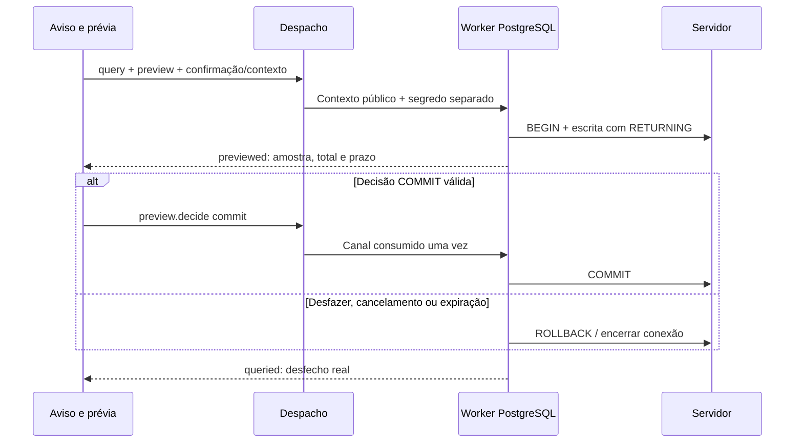

# 59 — O fechamento da 0.3.9: janelas acopladas, banco completo e pente fino

> **Classe: PLANO** (`DocsPublic/README.md`). Este documento diz **o que falta**
> para encerrar a 0.3.9 e **em que ordem**. O que já foi feito, com data e prova,
> fica no [`40.7`](40.7-registro-das-entregas.md). O estado do projeto, no
> [`40`](40-estado-e-continuidade.md). Cada item, ao ser entregue, ganha a data e
> o parágrafo do 40.7 que o prova; nenhum item sai daqui sem isso.

> **Revisão do autor em 2026-10-07:** o antigo passo 7 foi dividido nos
> passos 7–15 (§2); o pente fino é o passo 16, último da 0.3.9.
> Desenvolvimento e próximas provas focam **Qt 6.10** (checkout 6.10.2).
> Qt 6.4 do AppImage anterior sai do alvo de validação desta continuidade;
> não há migração para 6.12 planejada aqui. Novo AppImage fica fora do
> fechamento da 0.3.9; o autor considera lançá-lo após a 0.4.0, ainda sem
> decisão de publicação. Detalhes de empacotamento futuro no §8.
>
> **Ambiente, mesma data (noite):** o autor migrou o desenvolvimento para
> **Arch Linux**, "a fim de ter as ferramentas em versões estáveis mais
> atualizadas". O Qt local passou a ser o do sistema, **6.12.0** medido;
> isso substitui o foco 6.10.2 acima para as próximas provas (40.7 §7.240).
> Continua valendo: Qt 6.4 fora da validação, sem AppImage neste fechamento.

## 1. A decisão (o autor, 2026-10-03, noite)

A série 0.3.6–0.3.9 reorganizou a casca da IDE. Ela **não se encerra** no estado
de 2026-10-03 (protocolo `0.150.0`). Antes, o autor quer:

- **Painéis que não são pop-up.** Ferramenta de trabalho contínuo vira
  **janela acoplada** ao layout, no modelo das tool windows da JetBrains. Abre
  no slot do lado do trilho em que o ícone está (40.7 §7.207).
- **Banco de dados completo**, nas palavras dele: "um ambiente completo para
  banco de dados e com certa profundidade prática e segura para usar banco de
  dados na IDE". O MongoDB entra **com escrita** (era só leitura).
- **Grafana com visualização web dentro da IDE.** Ela é opcional e vem
  **desligada por padrão**: "vai pesar apenas no download, e não em consumo de
  memória RAM, pois o usuário pode ativar/desativar". Desligada, a IDE não
  carrega o motor web.
- **Pente fino no fim:** polimento de frontend, bugs, comportamento e
  desempenho.

Depois disso a 0.3.9 fecha **oficialmente**, "para não ficarmos nisso
eternamente". A **0.4 é inteira do ecossistema embarcados**
([`52`](52-arquitetura-executavel-da-0.4.md)). Ela já começa com a base de
frontend para painéis acoplados, porque os painéis da 0.4 também não serão
pop-up.

### 1.1 O que continua pop-up, por decisão

| Painel | Por quê |
| --- | --- |
| Aviso de escrita SQL (impacto, 40.7 §7.209) | Decisão do autor ("faz sentido e eu quero que isso se mantenha"): uma decisão pontual e perigosa pede o foco inteiro. |
| Diálogo da conexão do Banco | Configuração pontual. A JetBrains também usa diálogo ("Data Sources and Drivers"). |
| Bibliotecas, Instalar ferramentas | Tarefa pontual: escolher, ver a prévia e aceitar. |
| Configurações, seletor de pastas, renomear, excluir, descartar no Git, colar no terminal | Decisões pontuais. |
| Toolchain e Python (abrem abaixo do widget do topo) | São contextuais ao widget. |
| Embarcados | Fica como está até a 0.4, que o redesenha. |

## 2. A ordem (reorganizada por pedido do autor em 2026-10-07)

Os passos 1–6 conservam as entregas aceitas. O antigo Banco completo
deixa de ser um único passo aberto: seu restante ocupa 7–15, mantendo
o escopo na 0.3.9. Os números D1–D7/D1a–D1d continuam identificando as
fatias técnicas dos documentos 38/39; não são outra numeração de passos.
Um passo pode exigir vários commits, cada um com contrato e prova próprios.

Cada passo termina com:

- a **prova na tela real, com o mouse e o teclado do autor**, quando houver
  comportamento de interface; contrato puro exige provas no seu consumidor;
- os gates verdes;
- o registro no 40.7.

| # | Passo | Situação |
| --- | --- | --- |
| 1 | **Containers acoplados** (§3), **tela de boas-vindas** (§3.1) e **interruptor moderno** (§3.2) | feito (40.7 §7.210–§7.211) |
| 2 | **Topo:** o ☰ esconde por um momento os widgets do topo, em vez de empurrá-los (§3.3) | feito (40.7 §7.213) |
| 3 | **Modernizar os controles antigos** no padrão interativo (§3.4) | feito (40.7 §7.214) |
| 4 | **Configurações redesenhada** (§3.5) e **seletor "Abrir projeto"** (§3.6) | feito (40.7 §7.215), com os campos de texto refeitos e o menu que não deixa o mouse atravessar |
| 5 | **Remoto acoplado** (§4) | feito (40.7 §7.216), provado contra sshd reais, com as conveniências de SSH (confiar no servidor, último contato, programa lembrado) |
| 5b | **Painel de baixo em relevo** (pedido do autor, 2026-10-04: "um fundo e melhorar a separação visual") | feito (40.7 §7.217): bandeja e poço para todas as abas; o texto do terminal na grade |
| 6 | **Grafana: visualização web opcional** (§6) | feito (40.7 §7.218–§7.219, protocolo `0.154.0`), provado contra Grafana 11.2.0 real. Prova histórica do AppImage: 121 MB; novo pacote adiado (§8) |
| 7 | **Contratos e perfis extensíveis** (§5.13–§5.15; 38 D1/D1a) | feito (40.7 §7.234–§7.237, §7.243–§7.244; IPC `0.165.0`); aceite com mouse/teclado do autor pendente para a árvore com indisponíveis; handoff do 8 no §2.1 |
| 7b | **QML para desenvolver a IDE nela mesma** (§2.4) | feito (40.7 §7.245–§7.247): `qmlls` com o build do projeto, realce próprio e `qmlformat`; aceite com mouse/teclado do autor e a decisão do estilo QML deste repositório pendentes (40 §4) |
| 8 | **Supervisão de processos e ponte externa** (39 D1b) | a fazer: handshake, limites de envelope/pipes/fila, isolamento e encerramento real; depende do 7 |
| 9 | **Extrair os drivers atuais** (39 D1c/D1d) | a fazer em fatias separadas: PostgreSQL com impacto/prévia, SQLite, MongoDB; depende do 8 |
| 10 | **Instâncias e LSP de PostgreSQL/SQLite/MongoDB** (38 D2–D5) | a fazer: vínculo por conexão e ferramentas existentes com linguagem/catálogo vivos; D2 pode avançar após os contextos do 7, sem esperar toda a extração do 9 |
| 11 | **InfluxDB 3 nativo e linguagem** (38 D6–D7) | a fazer: API nativa sobre a ponte do 8; LSP SQL/InfluxQL existente selecionado e provado sobre as instâncias do 10 |
| 12 | **MySQL/MariaDB nativo** (§5.7) | **adiado** (autor, 2026-10-08; §2.3) para versão futura ainda sem número; o ODBC aceito continua cobrindo MySQL/MariaDB |
| 13 | **Console, localizar objeto e histórico** (§5.1–§5.2) | a fazer: localizar objeto, histórico por conexão e conveniências restantes; identidade/rascunho/execução atuais já aceitos |
| 14 | **Grade de dados** (§5.4) | a fazer em fatias: carregar mais/ordenar e copiar/exportar; edição por chave primária **adiada** (autor, 2026-10-08; §2.3) |
| 15 | **Provas finais do Banco** (§5.6) | a fazer: UPDATE FROM, TLS verify-full, DNS/NSS e regressões dos motores integrados, concorrência/contexto/segredos; critérios cruzados dos passos 7–14 |
| 16 | **Pente fino e fechamento da 0.3.9** (§7) | último passo: frontend, bugs, segurança, desempenho, uso cronometrado (40.7 §7.201) e documentação; depois dos critérios dos passos 7–15; não exige gerar AppImage |

### 2.1 Handoff do passo 7 — 2026-10-07

Base integrada: `main`, D1a.2 em `b29c549` e D1a.3 em `53fa4ac`, IPC UI/core
`0.164.0`, API externa 1.0. D1 registra os quatro motores; D1a.1 protege o
catálogo e escreve atomicamente; D1a.2 negocia identidade/recursos/limites e
mapeia erros; D1a.3 define mensagens operacionais e valida streams puros.
Nenhum runtime externo/LSP novo ativado, seleção de instalação persistida
ou migração extensível aceita. Provas atuais no 40.7 §7.234–§7.237.

**Próxima fatia do passo 7: D1a.4.** Ler 39 §5, store/perfis/validação e
descritores antes de desenhar o formato. Migrar schema 1 de forma explícita,
atômica e verificável; preservar perfis/opções de provedores ausentes sem
transformá-los em lista vazia gravável. Separar IDs de motor/adaptador/
instalação e schema público, mantendo segredo fora do arquivo. Fixtures
legadas/futuras/desconhecidas e migração recusada sem escrita são critérios
de aceite; não iniciar processo nesta fatia.

**Foco de validação:** Qt local (6.12.0 no Arch desde a revisão do topo;
6.10.2 quando este parágrafo foi escrito), Rust/Clippy, sete CTest, qmllint e
harnesses locais; abertura/gestos pertinentes nos presets atuais. As provas
Qt 6.4 já concluídas permanecem no histórico. O orquestrador legado ainda
contém chamadas Qt 6.4: alinhar esse perfil antes da próxima execução
completa; não usar o AppImage antigo como critério nem trocar SDK para 6.12.

O passo 7 termina com contrato/perfil/migração aceitos e a continuidade do
passo 8 registrada. Runtime, motores, linguagem e grade têm seus próprios
aceites na tabela; sua ausência não mantém o passo 7 indefinidamente aberto.
Incidente de perda de dados, crash ou bloqueio diário continua furando a fila.

**Fechamento do passo 7 (2026-10-08, 40.7 §7.243–§7.244):** D1a.4a (formato 2,
migração e preservação no core, IPC `0.165.0`) e D1a.4b (a árvore do Banco
mostra os indisponíveis; remover pede confirmação no menu) feitas. Provas no
display virtual e em harness; **o aceite com o mouse e o teclado do autor fica
pendente** (roteiro no 40.7 §7.244).

**Handoff do passo 8 (D1b), sobre a base `0.165.0`:** supervisionar o processo
do adaptador com o contrato já fixado. O que a revisão D1b (§7.239) e as fatias
D1a deixaram como requisito, nesta ordem:

1. **Dono único dos processos e pipes:** quem inicia o adaptador é dono do
   stdin/stdout/stderr e dos leitores; encerrar coleta processo, auxiliares e
   threads de leitura de verdade, com prova (não basta o prazo de 5 s).
2. **Limites antes de alocar:** mensagem até `messageBytes` lida com teto,
   fila local de 16 operações, `inFlight - 1` pedidos comuns e um slot
   reservado para decisão/cancelamento (39 §4.4).
3. **Desfecho na queda do transporte:** perda do processo depois de enviar
   escrita vira resultado indeterminado no core, sem resposta do adaptador e
   sem repetir (39 §4.4, precedência de desfecho).
4. **Handshake sem segredo e com prazo** (`initialize` 5 s), recusando
   adaptador incompatível sem afetar os outros perfis.
5. **Prova com adaptador falso** (como o `fake_lsp_server.py`) antes de extrair
   qualquer driver real (passo 9): pipes saturados, resposta tardia, célula
   grande, encerramento e `core.ping` durante as esperas.

O passo 7b (QML) vem antes do passo 8, por decisão do autor (§2.4).

### 2.2 Frentes paralelas autorizadas — 2026-10-07

O autor pediu mais agentes com a mesma capacidade desta sessão, no máximo
dois adicionais. Duas frentes de implementação foram abertas sobre
`78f3ea2`, em worktrees separados; o agente anterior foi reutilizado para
revisão preparatória. Mesmo modelo/esforço herdados, sem novas delegações.

| Dono | Recorte atual | Entrega esperada |
| --- | --- | --- |
| Principal | Passo 7 e validação Qt 6.10 | Perfil de verificação alinhado, revisão de contratos/D1a.4 e integração/commits das frentes |
| Agente passo 13 | Histórico limitado por conexão, reabrível no console | Desenho anterior ao código, persistência/contexto/rascunho provados, patch próprio |
| Agente passo 14 | Copiar célula/linha e exportar resultado carregado em CSV | Formatação/snapshot/limites e escrita sem sobrescrita provados, patch próprio |
| Agente anterior | Revisão preparatória do passo 8/D1b | Donos de processo/pipes/coleta, dependências e critérios; sem ativar runtime |

Passos 13/14 avançam sobre os consumidores atuais, enquanto 8–12 conservam
suas dependências. Cada frente entrega uma fatia, não o passo inteiro:
localizar objeto, paginação/ordenação/edição da grade ficam em recortes
seguintes. Qt 6.10, sem ações GNOME; provas GUI finais coordenadas pelo
principal. Só o principal integra e commita depois dos gates. Fiação/
registros de módulos, contrato IPC e hosts comuns são reconciliados em
sequência; ninguém trabalha diretamente na árvore de outro agente.

**Interrupção solicitada pelo autor nesta sessão:** as implementações foram
suspensas antes da integração. Histórico e grade têm contratos/código parcial,
patches WIP e notas nos seus worktrees; nenhuma entrega nova é declarada aceita.
Principal preserva dois testes negativos de negociação/erros que reproduzem
os achados da revisão D1b, com correção ainda pendente, e a edição não validada
do orquestrador para retirar Qt 6.4. Retomar pelos handoffs, não iniciar gate
completo esperando uma árvore já verde. D1a.4 continua pendente.

**Retomada em 2026-10-08 (40.7 §7.240):** a correção dos dois testes e o
perfil do orquestrador foram concluídos e validados no Arch/Qt 6.12. Os
worktrees das frentes dos passos 13 e 14 ficaram na máquina anterior; quando
esses passos chegarem, recomeçam pelos contratos aqui descritos, salvo se o
autor trouxer os patches.

### 2.3 Banco com foco em embarcados — decisão do autor, 2026-10-08

Pergunta do autor: quão utilizável fica a 0.3.9, profissionalmente, se o foco
da IDE é embarcados e eles só chegam na 0.4? A análise apontou que o Banco
cresceu de um passo para nove e que parte dele é cliente de banco genérico,
terreno em que DataGrip e DBeaver já existem. Decisão, nas palavras dele: "a
parte genérica deixa para alguma versão futura então, vamos fazer bem feito
a conexão e orquestração dos bancos de dados que são o foco de uso em
sistemas embarcados".

| Fica na 0.3.9 | Sai para versão futura (sem número) |
| --- | --- |
| Passos 7–11: contratos/perfis, ponte de processos, extração dos drivers, instâncias/LSP de PostgreSQL/SQLite/MongoDB e InfluxDB 3 nativo | Passo 12, MySQL/MariaDB nativo; o ODBC aceito continua cobrindo esses bancos |
| Passo 13: console, localizar objeto e histórico | Do passo 14, a edição de célula por chave primária (§5.4) |
| Passo 14: carregar mais/ordenar e copiar/exportar (telemetria sai em CSV) | |
| Passos 15–16: provas finais (sem os itens adiados) e pente fino | |

O critério é o uso em embarcados: SQLite no dispositivo e na borda, InfluxDB 3
para séries temporais de telemetria, PostgreSQL (e TimescaleDB) e MongoDB no
backend que recebe os dados. Os números dos passos não mudam, para não
renumerar entregas nem citações; o 12 fica marcado como adiado. Os itens
adiados não ganham versão por esta decisão. Inclusão de DataGrip ou DBeaver
na IDE: análise de licença e de forma na [integracoes/37](../integracoes/37-banco-e-observabilidade.md) §4.1.

### 2.4 QML na 0.3.9, para usar a IDE no próprio projeto — decisão do autor, 2026-10-08

Pedido do autor ao passar a usar o atalho de desenvolvimento: "vamos colocar
o LSP do QML também agora na 0.3.9, se não como eu uso a IDE para desenvolver
ela mesma? Como as fatias do banco de dados reduziram, dá para integrar todo
o necessário do QML". O QML é cerca de um terço do código deste repositório
(406 arquivos). **Medição corrigida no mesmo dia:** a primeira leitura olhou só
o registro tree-sitter do core (C, C++, Rust e Python) e concluiu que `.qml`
abria como texto puro. Errado: o realce em C++ (`editor_highlighter_rules.cpp`)
já trata `.qml` como JavaScript, com `property`, `readonly`, `required`,
`signal` e `import`. Falta o LSP, as construções próprias do QML e a
estrutura.

**Escopo do passo 7b**, com desenho escrito antes do código:

1. `.qml` reconhecido no registro de linguagens do core.
2. Realce de QML no editor: tipos, propriedades, `id`, sinais/handlers e o
   JavaScript embutido.
3. `qmlls` pelo gerenciador de LSP existente, recebendo o diretório de build
   do preset ativo (`-b`), sem configuração manual: diagnósticos, completar,
   ir para definição e hover.
4. `qmlformat` no formatador existente.
5. Outline e folding: pelo LSP ou pela gramática tree-sitter de QML, conforme
   a auditoria de licença.

`qmlls` e `qmlformat` são ferramentas do Qt executadas como processo, sem
ligação com o código da IDE; a adoção passa pelo checklist de
`integracoes/README.md`. **Aceite:** abrir este repositório na IDE e editar
um `.qml` com realce, diagnóstico do `qmlls` e ir para definição entre
arquivos do módulo, provado com o mouse e o teclado do autor; gates verdes.

**Ordem:** depois da D1a.4, que fecha o passo 7, e antes do passo 8, para
que os passos seguintes já sejam feitos com a IDE em uso diário.

**Desenho (2026-10-08), antes do código.** Duas fatias, cada uma estendendo um
mecanismo que já existe:

- **7b.1, core.** (1) A busca de ferramentas além do `PATH`
  (`tools/search_dirs.rs`) passa a incluir os diretórios de ferramentas do Qt
  das distros (`/usr/lib/qt6/bin` no Arch, `/usr/lib/x86_64-linux-gnu/qt6/bin`
  no Debian/Ubuntu, `/usr/lib64/qt6/bin` no Fedora), onde moram o `qmlls` e o
  `qmlformat`. (2) As duas entram em `tools/known.rs`. (3) O `qmlls` é o
  servidor principal `qml` do `lsp/registry.rs`, para `.qml`; o core passa
  `-b <diretório de build>` do projeto CMake configurado, para o `qmlls` achar
  os tipos dos módulos do próprio projeto; sem build, sobe sem `-b` e conhece
  só os módulos do Qt. Nenhum método IPC novo: os pedidos `lsp.*` já são por
  arquivo. **Feita em 2026-10-08 (40.7 §7.245).**
- **7b.3, formatação.** O `qmlformat` não lê stdin (medido no 6.12: só aceita
  arquivo), e o formatador da IDE é por stdin/stdout. Entra com um modo próprio:
  o buffer num arquivo temporário privado e o `.qmlformat.ini` do projeto
  passado por `-s`, para valer o estilo do projeto. **Feita em 2026-10-08
  (40.7 §7.247).**
- **7b.2, UI.** Regras de realce próprias do QML (tipo antes de `{`, `id:`,
  nome de binding, handler `onAlgo:`, `pragma`, `alias`, `component`, `enum`);
  `.js` continua nas regras de JavaScript. **Feita em 2026-10-08 (40.7 §7.246).**

`qmlls` e `qmlformat` vêm com o Qt que o usuário instalou (pacote
`qt6-declarative`/`qt6-tools` ou equivalente) e rodam como processo, como o
clangd: não entram no registro de componentes, que guarda o que a IDE liga
ou empacota. **Aceite:** teste com servidor falso provando `-b`; exercício
com o `qmlls` real dando diagnóstico de um `.qml` com erro; foto no display
virtual de um `.qml` deste repositório; aceite do autor com mouse e teclado,
que fica pendente.

## 3. Containers acoplados

**Inspiração:** o Docker Desktop, adaptado ao estilo JetBrains da IDE. É a
mesma base da janela do Banco.

- **Os arquivos:**
  - `ContainersWindow.qml`: cabeçalho com o motor (● podman · rootless), o
    filtro e "parados".
  - `ContainerListPane.qml`: seções EM EXECUÇÃO, PARADOS e IMAGENS, com ponto
    de estado, nome, imagem e porta do host. Ao passar o mouse aparecem
    parar/iniciar, logs e shell.
  - `ContainerDetail.qml`: o container escolhido, com imagem, id, status,
    portas (a do host vira link para `localhost`) e ações conforme o estado.
  - `ContainerRows.qml`: as linhas, puras.
- **Abre sem projeto**, porque o motor é da máquina (`ShellDocks.needsProject`).
  As abas de logs e shell continuam exigindo projeto, e a tela diz isso.
- **O compose do projeto** fica no rodapé. Desligado, ele diz o que falta.
- **Saíram:** `ContainerPanel.qml`, `ContainerPanelHost.qml` e
  `ContainerListView.qml`. O `ContainerController` perdeu `close()` e
  `panelVisible`; `open()` pergunta ao motor e pede a janela
  (`windowRequested`).
- **Provas:** `tst_container_rows` e `tst_containers_window` (a promessa do
  compose); falta a tela.

### 3.1 A tela de boas-vindas (decisões do autor, 2026-10-03)

- **Só boas-vindas.** Não há trilhos, janelas, painel de baixo, atalhos de
  área (Ctrl+Alt+W/J/O/M/K/P) nem o "Abrir projeto" da barra de cima. O
  conteúdo fica: os projetos recentes, criar, o cartão "Abrir projeto" e
  Configurações.
- **A linha "Ambiente: N de M ferramentas" saiu.** O autor achou que ela
  "atrapalha"; as ferramentas ficam no painel Ferramentas, dentro do
  projeto.
- **O texto é próprio**, e não cópia do site: "Bem-vindo ao Kinein Vectis /
  Do código à placa, no mesmo lugar."
- **O fundo é um degradê da paleta do ícone**, misturado em OKLab ("suave,
  não o sRGB"), com uma **onda animada**:
  - vem ligada e se desliga no interruptor "Animação"; a escolha fica no
    global, `welcomeAnimation`, protocolo 0.151.0;
  - só anda com a tela à vista e a janela em uso, então ao abrir um projeto
    ela para sozinha;
  - o relógio dá 20 passos por segundo: medido, 4,8% de um núcleo ligada e
    0% desligada (a 60 quadros por segundo eram 10,8%).
- **A arte do site foi tentada e trocada.** O autor preferiu o degradê,
  porque a arte competia com o conteúdo. A arte também não está sob a
  licença do código.
- **As cores do degradê são calculadas ANTES**, por um script em `scripts/`,
  e não em tempo de execução. Um gate confere que o resultado bate com o
  script.

### 3.2 O interruptor moderno

`KvToggleChip` com `switchStyle`: rótulo, ícone opcional e um trilho com a
bolinha que desliza (âmbar quando ligado). Todo chip acende ao pairar e
responde ao pressionar. Ele vale para toda preferência de liga/desliga.

### 3.3 O topo com o ☰ aberto

Pedido do autor: ao clicar no ☰, os menus aparecem na barra e os widgets do
topo (projeto, git, toolchain, python) **somem por um momento**, em vez de
serem empurrados para o lado. Ao fechar o ☰, eles voltam iguais.

### 3.4 Modernizar os controles antigos

Feito em 2026-10-03 (40.7 §7.214). O levantamento, por script, achou 31
campos de texto, ~20 botões e três menus desenhados à mão. Agora:

- **`KvTextField`** é o campo da IDE (placeholder, pairar, foco âmbar com
  anel, ícone opcional, × que limpa). Os 31 campos usam ele; fica só o
  caminho editável do seletor de pastas, revisto no passo 4.
- **`KvButton`/`KvIconButton`** acendem ao pairar e respondem ao pressionar,
  com transição; `primary` + `danger` é o vermelho cheio do irreversível.
- **Um menu só** (`AppMenuPopup`) para o ☰, a árvore, o terminal e a
  configuração de execução: ícone, atalho real à direita, separador entre
  grupos e a barra âmbar no item da vez.
- **O atalho do menu sai do catálogo de comandos**, e o gate de atalhos
  confere os mapas de exceção.

### 3.6 O seletor "Abrir projeto" (pedido do autor, 2026-10-03, noite)

Feito em 2026-10-04 (40.7 §7.215, protocolo `0.152.0`). O autor acrescentou,
vendo a tela: o seletor **abre sempre no Início** (`/home/<usuário>`), com o
projeto aberto marcado, e não dentro do projeto.

A navegação de pastas "está muito boa". O que muda:

- **LOCAIS só com o Início** (`/home/<usuário>`). É lá que os projetos
  ficam, e o Início já contém Downloads, Documentos e as outras pastas do
  usuário. Saem os atalhos "Documentos", "Downloads" e "Raiz do sistema", e
  os RECENTES ficam.
- **Dimensionamento e aproveitamento do espaço** revistos: a coluna de
  locais mais estreita, a lista com mais respiro e informação útil por
  linha.
- **O botão "+ Criar projeto…" sai deste painel.** Ele estava apagado e sem
  função clara no "Abrir"; criar continua no cartão da tela de boas-vindas e
  no menu.
- **O selo do ecossistema** (Rust/Cargo, Python…) fica. Uma pasta **híbrida**
  (duas ou mais linguagens que a IDE suporta, como o próprio Kinein: Rust e
  CMake/C++) ganha um selo que diz isso, com as linguagens no tooltip, em vez
  de mostrar só a primeira.

### 3.5 Configurações

Feito em 2026-10-04 (40.7 §7.215). Três seções à esquerda (Editor, Build,
Interface), a linha inteira clicável, a prévia da fonte, o perfil de rigor
com o que cada opção faz, a animação da tela de boas-vindas, e o selo
"neste projeto" onde o valor vem do projeto.

## 4. Remoto acoplado

Os alvos SSH, com deploy, sync e comandos, são trabalho contínuo: a saída é
acompanhada enquanto se edita. O painel pop-up vira janela acoplada:

- a lista de alvos com o estado da conexão;
- as ações do alvo escolhido;
- a saída da última ação.

O mesmo modelo serve de referência para a JetBrains ("Remote Host").

Feito em 2026-10-04 (40.7 §7.216): `RemoteWindow` no slot do lado do ícone,
com os alvos em cima (o ponto da última sonda), uma ação primária com o
porquê, as seções em chips que quebram a linha e o conteúdo da seção. O
pop-up (`RemotePanel`, `RemotePanelHost`, `RemoteList`) saiu. A área com a
janela aberta aparece no trilho enquanto estiver aberta.

## 5. Banco de dados completo

**Retomada em 2026-10-05, antes de editar o código.** A sessão anterior
terminou com a fatia ainda sem commit: escrita MongoDB (`mongo_command` e
`mongo_write`), protocolo `0.156.0`, confirmação seletiva (`confirm`), nomes
**Conectar banco** / **Criar banco…**, `KvSegmentedControl` e padrões por
motor. A retomada revisou a recusa no core e o aviso na UI, testou a
gramática e os padrões, provou PostgreSQL/MongoDB reais e os gestos com
mouse/teclado na janela da IDE, sincronizou a documentação e passou pelo
gate completo e estrito. Fatia concluída no 40.7 §7.220. Esse é o registro
da retomada de 2026-10-05; ODBC foi concluído depois (§7.221), seguido por
produção/somente leitura (§7.222) e prévia PostgreSQL (§7.223).

**Decisão do autor na sessão de 2026-10-04:** escrita comum roda direto;
remoção, esvaziamento, alteração em massa sem filtro e instrução que o core
não sabe classificar pedem confirmação. Essa decisão substitui a regra de
avisar em toda escrita de desenvolvimento. Perfis de produção, modo somente
leitura e transação com prévia PostgreSQL estão implementados e validados
(§5.3; 40.7 §7.222–§7.223).

**Base histórica em 2026-10-03, antes dessas entregas:**

- a janela acoplada, com a árvore e os dados na própria janela;
- o console no editor, com cores;
- a grade revista;
- o aviso de escrita com o impacto contado;
- PostgreSQL, SQLite e MongoDB (só leitura).

Ver 40.7 §7.206–§7.209.

### 5.1 Barra, menus e árvore viva

**Primeira fatia concluída e validada em 2026-10-06; provas no 40.7 §7.226.**
Seleção estável, setas/Home/End/Enter, F5, botão direito/Shift+F10 e Escape;
barra com releitura do catálogo, console, dados e recolher; + por motor e
descoberta local; estado vazio clicável/Alt+Insert; cores por motor e menu
fora do recorte nos dois docks. Console/edição/consulta usam os donos atuais.
Protocolo permanece `0.160.0`. Aceite dos gates registrado no diário.

**Modelos e ações com impacto concluídos e validados em 2026-10-06**
(40.7 §7.228, protocolo `0.161.0`; desenho no §5.1.2). Abrir console com
leitura/modelos preserva rascunho e permite desfazer. Esvaziar/remover usam
o aviso existente. ODBC conserva a leitura do driver; Mongo usa sua gramática.

**Releitura após execução concluída e validada em 2026-10-06**
(40.7 §7.229, protocolo `0.162.0`; desenho no §5.1.3). CREATE/ALTER/DROP
atualizam a árvore sem F5; erro de lote parcialmente aplicado conserva
a mensagem e relê o catálogo. Invalidações ocupadas são agrupadas.

**Novo banco no menu concluído e validado em 2026-10-06**
(40.7 §7.230; desenho no §5.1.4). +/Alt+Insert/estado vazio abrem a criação
existente; abrir/cancelar não escreve. Criação SQLite e preservação do
rascunho provadas na IDE real. Protocolo permanece 0.162.0.

**Desconexão concluída e validada em 2026-10-07**
(40.7 §7.231, protocolo `0.163.0`; desenho no §5.1.5). Aguarda trabalhos
e drivers, revoga prévia pendente/consentimento ODBC e conserva perfil e
rascunho. Resposta antiga do console não reconecta; outro destino fica livre.

**Ainda pendente desta seção:** localizar o objeto do console. Não duplicar
geração/interpretação de instruções no QML. A lista abaixo conserva o
escopo completo, incluindo o que já foi feito.

- **Barra da janela**, como na referência JetBrains:
  - **+** com submenu de motores, cada um com ícone colorido, e "Desta
    máquina…" e "Novo banco…";
  - ler de novo, console, ver dados, recolher tudo e localizar o objeto do
    console.
- **Estado vazio** com o atalho: "Nenhuma conexão · Criar conexão… (Alt+Insert)".
- **Menu de contexto** (botão direito) na árvore:
  - **conexão:** abrir console, ler de novo, editar, desconectar;
  - **tabela:** ver dados, abrir console com `SELECT`, copiar nome, gerar
    `SELECT`/`INSERT`/`UPDATE`, esvaziar e remover. As duas últimas passam
    pelo aviso de impacto.
- **A árvore se atualiza sozinha.** Depois de um `CREATE`, `DROP` ou `ALTER`
  executado com sucesso, a estrutura da conexão é relida.
- **Ícones dos motores coloridos**, para reconhecer o motor de relance.

#### 5.1.1 Desenho da primeira fatia de ações (2026-10-06)

A base é `d116b43`, protocolo `0.160.0`. Esta fatia liga gestos novos aos
pedidos existentes: `datasource.introspect`, `datasource.console` e
`datasource.query`. Não altera o contrato IPC nem cria outra interpretação
SQL. A geração de modelos e o refresh automático após DDL serão uma fatia
posterior no core, junto com a semântica de desconectar.

- `DataSourceTree`: seleção por chave de tupla, navegação e recolher tudo;
  releitura preserva a seleção ou retorna à conexão se o objeto sumir.
- `DatabaseTreeActions`: dono das ações disponíveis e do contexto do menu;
  perfis, workspace ou objeto diferentes invalidam um menu aberto. Releitura
  usa o catálogo existente e fica indisponível enquanto ele estiver lendo.
- `DatabaseTreeView`: seleção visível, setas, Home/End, Enter, F5, Shift+F10
  e botão direito. A view emite gestos e não interpreta SQL.
- `DatabaseToolbar` e `DatabaseWindow`: criar conexão por motor, reler a
  conexão escolhida, console, dados, recolher; estado vazio clicável e
  Alt+Insert quando o foco está no Banco.
- O menu usa `AppMenuPopup` numa camada da janela, fora do recorte da
  árvore e válida também no dock direito. Escape devolve o foco à árvore;
  a ação restaura o foco antes de abrir outro diálogo.

Provas: harnesses com mudança de catálogo durante seleção/menu, colisões de
nomes, invalidação de perfil/workspace, releitura ocupada e ações por tipo;
GUI real com clique direito, teclado, releitura de uma tabela criada fora da
IDE, dois bancos homônimos e dock estreito. Lint, fiação, arquitetura,
harnesses nos Qt 6.10/6.4, build e abertura sem diagnósticos obrigatórios.

#### 5.1.2 Desenho dos modelos e ações com impacto (2026-10-06)

**Desenho anterior ao código, implementado e aceito no 40.7 §7.228.**
O texto abaixo conserva o contrato planejado.

Base: main reunida em 39e6e71, protocolo 0.160.0. O contrato será aditivo
no 0.161.0: tabelas/coleções do catálogo recebem `statements` produzidas
por um dono puro no core. SELECT, INSERT, UPDATE, esvaziar e remover usam
nomes reais delimitados; valores/filtro dos modelos são espaços a preencher
e não executam enquanto incompletos. Visões só oferecem leitura e remoção.
Mongo usa a gramática existente; ODBC só oferece a leitura já produzida
pelo driver, sem inventar um dialeto de escrita.

A árvore transporta os textos; QML não compõe SQL. Ver dados reutiliza a
leitura do catálogo. Abrir console em tabela/modelo acrescenta a instrução
ao buffer, preservando o texto não salvo e permitindo desfazer; não executa.
Um dono pequeno no editor espera a carga apenas quando a aba não existe e
descarta pedidos na troca de workspace. O vínculo/contexto de abertura
continua pertencendo ao core e ao controller dos consoles.

Esvaziar/remover encaminham o texto ao aviso de impacto já existente;
cancelar não escreve e confirmar passa pela política/contexto do core.
Somente leitura desabilita essas ações na apresentação e continua sendo
recusado no core. As provas cobrem delimitadores, nomes hostis, modelos
incompletos, visões/Mongo/ODBC, leitura real SQLite, buffer sujo/desfazer,
respostas antigas e cancelamento/confirmar na tela. A releitura após DDL
foi aceita depois, no §5.1.3; desconexão no §5.1.5 e localizar segue na fila atual.

#### 5.1.3 Desenho da releitura após execução (2026-10-06)

**Implementado e validado no 40.7 §7.229.** O desenho abaixo foi registrado
antes do código; o contrato final usa enum none/reload.

Base aceita antes da fatia: main 7c69830, protocolo 0.161.0. A fatia acrescenta
`catalogUpdate: none | reload` ao evento `datasource.queried` no protocolo
0.162.0; ausente significa none. Nenhum método/evento novo e nenhuma
assinatura C++ nova: o mapa do evento já atravessa a ponte inteiro.

`classification::invalidates_catalog` reutiliza os impactos existentes:
CREATE/ALTER/DROP e instruções desconhecidas nos relacionais; escrita válida
no Mongo (coleções/campos podem mudar); toda operação ODBC não reconhecida
como leitura. Não há parser SQL no QML nem novo executor. O sinal sai após
a tentativa de execução e pode acompanhar erro: um lote SQLite pode ter
aplicado DDL antes de falhar. Significa reler, não afirmar commit ou sucesso.
Recusa de política/preflight, senha necessária e prévia pendente não invalidam.
Leitura e DML relacional conhecidos não pedem introspecção; alterações
externas/efeitos indiretos continuam cobertos por F5, sem watcher/polling.

DataSourceQueryController confere token/destino, consome cada resultado
terminal uma vez e passa somente o aviso ao catálogo atual. O catálogo
agrupa invalidações da mesma conexão durante uma leitura numa única
releitura posterior, descartando o snapshot anterior. Perfil/workspace
alterados descartam a fila; falha de credencial não dispara retry automático.
Resultado da consulta, foco, buffer e seleção estável da árvore permanecem
com seus donos atuais. Desconectar/localizar/Novo banco ficam para depois.

Provas: léxico real com comentários/literais/nomes delimitados, despacho
SQLite CREATE/ALTER/DROP e lote parcialmente aplicado, compatibilidade do
evento antigo, resultado duplicado/antigo, coalescência e troca de contexto,
falha de catálogo/credencial. Antes/depois na IDE real sem F5, dois bancos
com nomes parecidos, dados vizinhos intactos e gates completos/estritos.

Referências MODE-D, consultadas em 2026-10-06: [DataGrip 2026.2, Auto sync](https://www.jetbrains.com/help/datagrip/data-sources-and-drivers-dialog.html)
invalida a árvore após DDL; [SQLite, sqlite3_exec](https://www.sqlite.org/c3ref/exec.html)
para o lote no primeiro erro; [PostgreSQL 18, Simple Query](https://www.postgresql.org/docs/18/protocol-flow.html)
permite transações explícitas dentro de um lote; [MongoDB, coleções](https://www.mongodb.com/docs/manual/core/databases-and-collections/)
descreve criação implícita e campos variáveis. A adaptação usa o core e o
catálogo próprios, sem importar runtime/código dessas ferramentas.

#### 5.1.4 Desenho de Novo banco no menu (2026-10-06)

**Implementado e validado no 40.7 §7.230.** O desenho abaixo foi registrado
antes do código; protocolo permanece 0.162.0.

Base aceita: main 86d52de, protocolo 0.162.0. Esta fatia acrescenta
“Novo banco…” ao +/Alt+Insert/estado vazio do Banco. Abre a face Criar banco
do diálogo existente, que já oferece arquivo SQLite, servidor PostgreSQL/Mongo
em contêiner e banco dentro de PostgreSQL. Abrir o diálogo não cria nada.
Protocolo, motores, executores e geração de SQL não mudam.

DatabaseTreeActions emite creationRequested, DatabaseWindow encaminha e
ShellLeftWindowHost chama DataSourceController.openCreation. O controller
limpa segredo/erro, abre pelo caminho atual e emite a intenção de criação.
DataSourcePanelHost troca só a face visual; fechar/trocar workspace devolve
a face de conexão. Perfil/rascunho e texto do editor são preservados;
“No servidor” usa o perfil PostgreSQL salvo indicado no diálogo. Rascunho
alterado e somente leitura não habilitam essa opção; o core conserva sua
recusa. O formulário e os pedidos de criação existentes continuam sendo
os donos, inclusive quando uma criação já está em andamento.

Provas: antes/depois do item ausente, despacho único e contexto inválido,
composição real de menu/foco/diálogo, senha descartada, fechamento/reabertura
em conexão e opção No servidor apenas no contexto permitido. GUI real com
menu e teclado: abrir/cancelar sem arquivo novo, criar um SQLite descartável
pelo botão existente, perfil/arquivo e catálogo conferidos; editor intacto.
Desconectar e localizar objeto ficam nas próximas fatias.

Referências MODE-D consultadas em 2026-10-06:
[DataGrip 2026.2, Database Explorer](https://www.jetbrains.com/help/datagrip/database-explorer.html)
usa New/Alt+Insert e ações no menu da árvore;
[Qt 6.10, Connections](https://doc.qt.io/qt-6.10/qml-qtqml-connections.html)
documenta o encaminhamento por target. A adaptação liga intenção ao diálogo
da Kinein; não importa código/runtime dessas ferramentas.

#### 5.1.5 Desenho da desconexão (2026-10-06, antes do código)

**Implementado e validado em 2026-10-07; provas e aceite no 40.7 §7.231.**
O texto abaixo conserva o desenho anterior ao código.

Base main 2a0b1a6, protocolo 0.162.0. As conexões comuns vivem por operação;
a prévia PostgreSQL mantém transação/driver num job. Desconectar preserva
perfil, arquivos e buffer do console. Não remove banco/container nem apaga
dados. A confirmação do encerramento exige que os trabalhadores do destino
tenham liberado suas conexões; limpar apenas o catálogo não basta.

Contrato aditivo planejado 0.163.0: datasource.disconnect recebe name,
expectedContext e clientContext obrigatórios; responde jobId/name/token.
event.datasource.disconnected devolve jobId/name/token/success/message depois
da espera. Não recebe senha. Perfil/workspace diferentes recusam o pedido.

Um registro de atividade no domínio acompanha leases por workspace/nome,
reservadas antes de lançar teste, introspecção, consulta, medição de impacto
e remoção com trabalho assíncrono. A desconexão reserva uma barreira que
recusa novas operações desse destino e espera fora do despacho até todas
as leases saírem, inclusive caminhos de erro. Outro destino continua livre.
Revoga a autorização ODBC e a prévia pendente pelos donos existentes.
Decisão de prévia já aceita conserva seu desfecho e é aguardada; uma escrita
comum já aceita não é interrompida e pode concluir. Não há promessa de
rollback para escrita comum nem de cancelamento instantâneo do driver.

A auditoria do driver MongoDB 3.9.0 (`src/action/shutdown.rs`, dependência
fixada em Cargo.lock) confirmou que Drop limpa o pool em segundo plano.
Um guard comum aos caminhos existentes de teste/catálogo/leitura/escrita/
impacto aguardará `Client::shutdown().run()` depois de liberar cursores;
nenhuma lease será encerrada antes disso. A prova real verificará por
`currentOp` que não restam conexões com appName kinein-vectis.

DataSourceSessionController guarda só contexto/estado visual da intenção.
Descarta credencial/pedidos de retry e respostas antigas apenas do destino;
o catálogo permanece visível enquanto encerra. Só no evento correspondente
remove seu snapshot e a árvore volta à conexão. Mostra desconectando…,
desconectado ou erro na própria linha. Nova leitura explícita conecta pelo
caminho existente. Eventos de outra conexão/perfil/workspace não alteram
o estado; seleção e texto do editor continuam com seus donos atuais.
Menu da conexão ganha Desconectar; releitura/execução são bloqueadas durante
essa intenção. Localizar objeto continua na fatia posterior.

**Revisão da retomada em 2026-10-07, antes da correção:** uma extração
`datasource.console.statement` ainda pendente pode responder depois do evento
de desconexão e iniciar outra consulta. O dono dos consoles descartará os
pedidos públicos do destino ao desconectar, conservando vínculos e buffers;
pedidos de outra conexão permanecem. Ctrl+Enter durante o encerramento não
reserva uma extração que possa executar depois. O harness provará a resposta atrasada
após o encerramento e a conservação do pedido vizinho antes da alteração.

Provas planejadas: antes/depois do menu ausente, leases/barreira/isolamento,
despacho sem workspace/contexto/perfil válido, liberação depois de falhas,
correlação UI e evento antes do aceite, rascunho/perfil preservados,
respostas antigas e novo pedido após fechar. PostgreSQL real: consulta em
andamento aguardada, prévia pendente desfeita, dados e sessões conferidos
independentemente; SQLite real na IDE e texto sujo intacto. Gates estritos,
Qt 6.10/6.4, builds e abertura, sem aumentar limites/baselines.

Referências MODE-D consultadas em 2026-10-06:
[DataGrip 2026.2, Deactivate](https://www.jetbrains.com/help/datagrip/database-explorer.html)
fecha a conexão selecionada e conserva sua configuração;
[Rust std 1.99, Condvar::wait_while](https://doc.rust-lang.org/std/sync/struct.Condvar.html#method.wait_while)
documenta espera condicionada e mutex liberado durante a espera (API estável
anterior ao toolchain 1.96.1 do projeto);
[PostgreSQL 16, cancelamento](https://www.postgresql.org/docs/16/protocol-flow.html#PROTOCOL-FLOW-CANCELING-REQUESTS)
exige aguardar a resposta, mesmo após pedir cancelamento. A adaptação usa
leases e jobs próprios, sem incorporar runtime/código dessas ferramentas.

### 5.2 Console que ajuda

- **LSP obrigatório por decisão do autor em 2026-10-07.** Completar tabelas,
  colunas e palavras-chave usando ferramentas existentes e o cliente LSP
  já integrado. MongoDB precisa de coleções/campos/operadores; SQLite e
  InfluxDB 3 precisam de provedor compatível com seus dialetos. Um LSP pode
  atender vários bancos quando isso for comprovado. O plano anterior de
  completion própria e LSP SQL opcional foi substituído por essa decisão.
- **Histórico de consultas** por conexão (as últimas N), reabrível no
  console.
- **Arquitetura antes da integração:**
  [38](../arquitetura/38-provedores-de-banco-e-linguagem.md) e
  [ADR-0009](../decisoes-adr/ADR-0009-banco-e-linguagem-por-provedores.md).
  Adaptador de banco e provedor LSP são independentes; instâncias isoladas
  por conexão, atualização pelo usuário e compatibilidade por capacidade.
  Candidatos pesquisados: Postgres Language Server, syntaqlite e servidor
  oficial MongoDB, com provas externas delimitadas no 38 §8. A IDE ainda
  não os integra. MySQL/MariaDB e linguagem InfluxDB 3 exigem seleção/prova;
  sqls não declara release estável, e Flux LSP arquivado não atende InfluxDB 3.
  Runtime Node externo pode ser avaliado para ferramenta original, como
  no MongoDB; isso não incorpora host VS Code à IDE.
  Revisão após pesquisa do IntelliJ, anterior ao código, no
  [39](../arquitetura/39-drivers-externos-e-compatibilidade.md) e ADR-0010:
  processos adaptadores com API negociada permitem trocar o driver sem
  recompilar a IDE, após migração aceita. Contratos/perfis antes do runtime;
  cliente LSP e operações atuais são reaproveitados.

### 5.3 Segurança em camadas

1. **Feito (40.7 §7.209).** O aviso mostra o comando e a consequência contada,
   e na destrutiva só roda com o nome digitado.
2. **Conexão de produção — feito (40.7 §7.222).**
   - Um perfil marcado como **produção** ganha uma cor de destaque na janela,
     no console e no aviso.
   - Toda escrita pede o aviso, mesmo a comum, e a destrutiva pede o nome da
     **conexão** além do alvo.
   - Uma opção "somente leitura" recusa qualquer escrita no core.
3. **Transação com prévia — feito (40.7 §7.223)** (PostgreSQL). Uma opção no aviso: executar dentro
   de `BEGIN`, mostrar as linhas afetadas e só então **confirmar (COMMIT)** ou
   **desfazer (ROLLBACK)**.
4. **Mongo usa a mesma política de confirmação** (decisão de 2026-10-04).
   Inserir e alterar com filtro podem rodar diretamente. Apagar pede aviso;
   `deleteMany({})`, `drop()` e `updateMany({})` são destrutivos. Filtro que
   pega toda uma coleção não vazia também exige confirmação.

### 5.4 Grade de dados de trabalho

- **Carregar mais:** hoje a grade para nas primeiras 200 linhas; páginas
  seguintes por `LIMIT/OFFSET`, ou pelo teto do core.
- **Ordenar:** clique no cabeçalho.
- **Copiar:** célula ou linha, em TSV ou CSV.
- **Exportar** o resultado para CSV.
- **Editar célula** numa tabela com chave primária: gera o `UPDATE … WHERE pk`,
  que respeita a política de confirmação e de alcance do §5.3. **Adiado pelo
  autor em 2026-10-08 (§2.3)**, para versão futura sem número.

### 5.5 MongoDB completo

**Implementado e validado em 2026-10-05 (40.7 §7.220).** O core interpreta
JSON estrito e chama o driver para leitura, escrita e medição; não avalia
JavaScript. A sintaxe aceita está no manual e na arquitetura/37 §4.

- **Escrita:** `insertOne`/`insertMany`, `updateOne`/`updateMany`,
  `deleteOne`/`deleteMany` e `drop`. A sintaxe do console é definida no
  passo, documentada no manual e com teste.
- **Impacto:** contagem por `countDocuments` com o mesmo filtro.
  Alterar/apagar em massa com filtro vazio é destrutivo; `updateOne` e
  `deleteOne` tocam no máximo um documento. Apagar sempre pede confirmação.
- **Teste com MongoDB real em container**, como o PostgreSQL.

### 5.6 Provado com PostgreSQL real

A fatia 7.220 provou PostgreSQL e MongoDB reais em 2026-10-05: leitura,
escrita, senha pedida/recusada e aviso com DROP. Os gestos de console e
confirmação passaram na janela da IDE; a prova automatizada está em
`testar-banco-real.py`. A IDE cria PostgreSQL em contêiner por **Criar banco…**.
Para completar a bateria do Banco no passo 15, faltam:

- o aviso com `UPDATE … FROM`;
- TLS `verify-full` (configuração).

A transação com prévia deixou de ser pendência: COMMIT/ROLLBACK, expiração,
contexto e desfecho desconhecido foram provados contra PostgreSQL real e
na IDE, no 40.7 §7.223. TLS obrigatório também foi corrigido e provado contra
servidor sem TLS nessa fatia; isso não substitui a prova de `verify-full`.

As imagens `postgres:16-alpine` e `mongo:7` já estão no podman local.

### 5.7 "Todos os bancos": a pergunta do autor (2026-10-04), para decidir

O autor perguntou se há algo pronto que a IDE só orquestre, para a pessoa
escolher qualquer banco em vez dos quatro de hoje. As opções levantadas:

| Caminho | O que cobre | Custo |
| --- | --- | --- |
| **ODBC** (crate `odbc-api`, unixODBC) | Qualquer banco com driver ODBC: Oracle, SQL Server, MySQL, Firebird, DB2, Snowflake… A pessoa instala o driver do fabricante; a IDE lista os DSN por `SQLDataSources`, sem depender do executável `odbcinst`. | Uma dependência de sistema (`unixodbc`). A árvore sai do catálogo padrão (`SQLTables`/`SQLColumns`). A qualidade varia por driver. |
| **ADBC** (Arrow Database Connectivity) | PostgreSQL, SQLite, DuckDB, Snowflake, BigQuery, Flight SQL | Bom para dados em colunas, mas com poucos motores ainda. |
| **`usql`** (cliente universal, um binário Go) | Mais de 40 bancos pela linha de comando | Orquestrar um processo externo e ler a saída como texto. Serve para console, não para árvore nem edição. |
| JDBC (o caminho do DBeaver e do DataGrip) | Praticamente todos | Exige uma JVM. Fora, pelo peso. |

**Proposta histórica, aceita pelo autor abaixo:** dois níveis.

1. **Nativos completos.** PostgreSQL, MySQL/MariaDB, SQLite e MongoDB, com
   árvore, edição, aviso de impacto e transação.
2. **"Outro banco (ODBC)" genérico.** Console, árvore pelo catálogo padrão e
   grade de leitura, com o aviso de escrita na forma genérica (sem contagem
   prévia).

É a forma que cobre "a escolha do usuário" sem a IDE manter um driver por
banco.

**Decidido pelo autor em 2026-10-04: vale, e entrou no antigo passo 7
(agora dividido nos passos 7–15; MySQL/MariaDB no 12, adiado em 2026-10-08,
§2.3).** Nas palavras
dele: "os nativos e os por plugins que o usuário quiser usar, e a IDE apenas
orquestra". Ficam assim:

- os nativos completos, como acima;
- os outros bancos pelo driver ODBC que a pessoa instala;
- a IDE só lista os DSN e orquestra;
- a IDE não baixa driver sozinha. Um driver é código nativo de terceiros, e
  carregá-lo é gesto explícito, com aviso (§7, segurança).

**Ampliação esclarecida pelo autor em 2026-10-07:** incluir **InfluxDB 3
nativo**, sem ODBC, e suporte LSP de **MongoDB moderno**, SQLite e dialetos
SQL. MongoDB 3.x não é requisito de legado. A instalação/atualização do
banco e do LSP fica com o usuário. Não fixar versão de servidor ao teste;
detectar capacidades/compatibilidade e conter erro no adaptador/instância.
Drivers atuais são bibliotecas compiladas no core: sua atualização ainda
depende de atualizar o core. O alvo revisto antes do código no
[39](../arquitetura/39-drivers-externos-e-compatibilidade.md) move essas
bibliotecas para processos escolhíveis com API negociada. A independência
exige extração/prova por motor, ainda pendentes. Não prometer compatibilidade
com qualquer protocolo futuro. Donos, fronteiras, migração e provas estão
no 38/39; ODBC mantém o caminho aceito.

"Nativos completos" significa recursos suportados pelo motor: transação,
prévia e edição por chave primária não são capacidades universais.
InfluxDB 3 usa SQL/InfluxQL para consulta e API de escrita própria; não
atribuir a ele as operações PostgreSQL. O LSP correto ainda é pendência,
independente da integração de acesso nativo.

### 5.8 A fatia retomada e o próximo prompt (atualizado em 2026-10-07)

A arquitetura do Banco, com diagramas, donos e limites, está no
[37](../arquitetura/37-banco-de-dados.md). A escrita MongoDB, a confirmação
seletiva e o formulário estão concluídos, com gate completo e estrito
verde, PostgreSQL/MongoDB reais e prova na tela registrados no 40.7 §7.220.
O passo 7 continua aberto.

**Última fatia concluída:** D1a.3 (40.7 §7.237): contrato operacional e
guardião puro de contexto/sequência/terminal, alvos de decisão/cancelamento
e limites cumulativos. Agente adicional em worktree isolado; revisão,
integração e commits pelo principal. Gate completo/estrito em continuação,
1056 testes Rust, sete CTest e 132 harnesses por Qt; debug/release em
351/352 ms, 33 superfícies limpas cada. Sem runtime externo nem LSP novo.

**D1a.2 anterior aceita (40.7 §7.236):** negociação externa pura,
API própria 1.0, identidade/recursos/limites e erros públicos sem texto livre.
IPC UI/core permanece `0.164.0`. Gates completos/estritos em continuação,
1034 testes Rust, sete CTest e 132 harnesses por Qt. Não inicia processo ou
banco; fluxo operacional aceito em D1a.3, perfil extensível/migração pendente.

**D1a.1 anterior aceita (40.7 §7.235), mantendo `0.164.0`:**
Catálogo inválido/futuro e campos duplicados são recusados sem sobrescrita;
escrita atômica compartilhada, teto de 1 MiB e aviso na janela do Banco.
Gates completos/estritos em continuação, 1019 testes Rust, sete CTest e 132
harnesses por Qt; recusa real de criação SQLite, arquivo idêntico e texto do
console preservado na IDE. D1a segue aberta para formato/migração e contrato.

**D1 anterior aceita:** registro dos provedores (40.7 §7.234), `0.164.0`.
O core fornece os descritores dos quatro motores atuais ao formulário/menu
pelo fluxo de perfis existente. Gates completos/estritos em continuação,
1014 testes Rust, 132 harnesses em cada Qt 6.10/6.4 e prova com mouse/teclado
na sessão gráfica real. Perfis preservados; catálogo e linha SQLite lidos
na IDE. Drivers externos e LSP continuam pendentes; próxima fatia D1a.

**Desconexão anterior aceita:** Desconectar (§5.1.5, 40.7 §7.231), protocolo
`0.163.0`. Drena trabalhos e drivers, revoga prévia sem decisão/consentimento
ODBC, preserva perfil/rascunho e descarta resposta antiga do console.
PostgreSQL/MongoDB reais e gestos SQLite na janela da IDE provados. Gates
completos/estritos em continuação, com hashes conferidos: 1012 testes Rust,
Clippy, clang-format/clang-tidy 21 sem exceção, 131 harnesses em cada Qt
6.10/6.4, sete CTest nos três builds e abertura/33 superfícies em cada um.
Debug/release reconstruídos após o gate detectar objetos anteriores aos
headers do sistema. Launcher confirmado com UI hardened e core release
atuais. Novo banco no menu permanece aceito no §7.230; releitura após execução permanece aceita
no §7.229: CREATE/ALTER/DROP e lote parcialmente aplicado na IDE real sem F5;
contexto, resultado duplicado, coalescência e credencial cobertos.
Modelos/ações com impacto permanecem aceitos no §7.228: geração no core,
buffer sujo/desfazer e aviso existente. A primeira fatia da árvore, barra,
seleção e menus permanece aceita no §7.226; integração na main no §7.227. Consoles
seguros e reutilização das abas continuam aceitos no §7.225 (d116b43).
Prévia PostgreSQL permanece aceita no §7.223 (fbf3294). Produção/somente leitura
permanecem aceitas no §7.222 (c4d8779), e ODBC no §7.221 (fa32f51).
Não repita provas aceitas sem risco concreto.

**Relevo do editor concluído:** pedido do autor em 2026-10-06, desenho
anterior ao código no §7 e aceite no 40.7 §7.224. Código e Markdown usam
KvInsetSurface como o terminal, conservando as 24 linhas de código na janela
de 1400×875. Provas de edição, roda, busca, foco e Markdown passaram; gates
completos e estritos verdes. Confira git log para o commit local.

**Desenho registrado:** modularidade de Banco/LSP, atualização pelo usuário,
MongoDB moderno e InfluxDB 3 nativo, no 40.7 §7.232 e no
[38](../arquitetura/38-provedores-de-banco-e-linguagem.md). Sem mudança de
produto/protocolo; provas de ferramentas externas não são integração na IDE.

**Revisão anterior ao código:** após pesquisa do IntelliJ/Database Navigator,
o 39 e ADR-0010 definem atualização independente também do driver, com API
de processo, perfis preservados e migração gradual. Revisão de donos/falhas
registrada no 39 §9 e 40.7 §7.233. Sem implementação nessa entrega.

**D1 entregue (40.7 §7.234, `0.164.0`):** registro sobre os quatro motores
atuais, descritores no fluxo de perfis, formulário/menu consumidores. Nenhum
driver ou LSP novo carregado; perfis/contextos anteriores preservados.

**Próxima fatia executável:** perfil extensível e migração (D1a.4),
com preservação/migração antes de runtime ou seleção persistida de ferramenta.
A proteção do schema 1 já foi aceita em D1a.1 (§5.13, 40.7 §7.235);
não refaça essa correção. A inicialização/erros/limites puros já estão aceitos
em D1a.2 (§5.14, 40.7 §7.236); mensagens e guardião operacional em D1a.3
(§5.15, 40.7 §7.237). Falta o formato extensível com migração D1a.4,
antes de aplicar o contrato no transporte.
Ponte/extração de drivers em D1b–D1d; instâncias/contexto e integração LSP
(D2–D5) seguem as dependências do 39 §8.
LSP SQL passou a ser obrigatório: não implementar completion de catálogo
própria antes dessas ferramentas. InfluxDB 3 exige adaptador nativo e
provedor de linguagem comprovado (D6–D7), com perfil/ID extensível.

**Restante do Banco, distribuído nos passos 8–15 (§2):** localizar objeto do console (§5.1), histórico
(§5.2), carregar mais/ordenar/copiar/exportar (§5.4; a edição por chave
primária e o MySQL/MariaDB nativo do §5.7 foram adiados em 2026-10-08,
§2.3), aviso com `UPDATE FROM` e TLS
`verify-full` (§5.6), além das integrações LSP/InfluxDB acima.
Vínculos, identidades, seleção, menus, modelos, impacto, releitura e
desconexão já estão validados (§5.12/§5.1.1–§5.1.5); continuar sobre essa
base. As onze pendências contadas antes da ampliação não são onze commits
nem garantia de encerramento na fatia 11. Cada passo fecha com seus próprios
critérios; o 7 fecha com D1a.4, o 15 com a bateria cruzada do Banco.
O pente fino é o passo 16, incluindo revisão das demais áreas; DNS/NSS
entra na bateria do 15. AppImage está adiado e fora do fechamento (§8).

Prompt de continuidade (conferir estado e log antes de usar):

```text
Kinein Vectis — continuar a 0.3.9, passo 7 (contratos/perfis), fatia D1a.4.
Use a main em /home/hugh/Projects/KineinVectis (Arch Linux desde 2026-10-07;
o checkout anterior era /home/hugh/KineinVectis). Em 2026-10-06 o autor pediu reunir
frontend e core nesse checkout: os sete commits até b31aa89 foram incorporados
por fast-forward. Não abra outra divisão para o frontend.
O autor autorizou concluir o plano da 0.3.9. A revisão de 2026-10-07 divide
o antigo Banco nos passos 7–15; pente fino é o passo 16, último da versão.
Qt local do sistema (Arch, 6.12.0, clang 23, GCC 16); ignorar Qt 6.4 do AppImage
anterior nesta continuidade. Novo AppImage está fora deste fechamento;
o autor pensa em lançá-lo após a 0.4.0, ainda sem decisão de publicação.
A integração antecipada em main e a retirada da divisão substituem a ordem
anterior, por pedido explícito nessa sessão. Sem push/empacotamento.

Comece com git status --short --branch e git log -5; preserve todo trabalho
local. Leia 00-comece-aqui, o cabeçalho e a fila do 40, a última entrada
do 40.7, o 59 §2.1/§5.8/§7, arquitetura/37/38/39/40, ADR-0009/0010
e o contrato arquitetura/03.
Confira PROTOCOL_VERSION no código. Preserve as proteções do 40.7 §7.220.
Leia o aceite do §7.221: protocolo 0.157.0, ODBC concluído e validado.
ODBC está no commit local fa32f51. Produção/somente leitura/contexto
(protocolo 0.158.0) estão validados no §7.222. Confira git log/status para
localizar o commit e preservar qualquer trabalho posterior. Não repita
provas aceitas sem risco concreto. Prévia PostgreSQL (§5.11), protocolo
0.159.0, está concluída e validada (§7.223). Confira git log e preserve
qualquer trabalho posterior. O relevo do editor está validado (§7.224),
com prova visual, gates completos e estritos e commit próprio. Consoles
seguros e abas de execução estão aceitos no §7.225, protocolo 0.160.0.
Barra, menus, seleção/atalhos locais e releitura estão aceitos no §7.226.
Modelos do catálogo e ações com impacto estão aceitos no §7.228, protocolo
0.161.0. Releitura após execução está aceita no §7.229, protocolo
0.162.0, incluindo falha parcial e coalescência. Não refaça geração,
confirmação, inserção no buffer nem refresh automático. Novo banco no menu
está aceito no §7.230, mantendo 0.162.0; usa o formulário existente, com prova
de cancelamento/criação e rascunho intacto. Não refaça essa entrada.
Desconexão está aceita no §7.231, protocolo 0.163.0, com PostgreSQL/MongoDB
reais e rascunho preservado na IDE. Não refaça leases/barreira, shutdown
MongoDB nem descarte de pedidos antigos do console. Desenho modular registrado
no §7.232, arquitetura/38 e ADR-0009; ainda sem integração de
produto. A revisão posterior, antes do código, está no §7.233,
arquitetura/39 e ADR-0010. D1 entregue no §7.234, protocolo 0.164.0:
providers em datasource.list/save/remove, campos e motores do formulário/menu
vindos do core; não refaça esse registro. Atual: D1a.4, formato/migração de
perfis; proteção, negociação e guardião puros já aceitos em D1a.1–D1a.3;
runtime/extração de drivers em D1b–D1d, contexto LSP em D2 conforme o 39 §8.
Não refaça menus/seleção, popup LSP ou transporte do cliente. Leia os donos,
limites, revisão e dependências antes do código.

A decisão de 2026-10-04 permanece: inserir, criar e alterar com filtro
rodam sem pop-up comum; remover, alterar tudo e impacto desconhecido
pedem confirmação. A medição silenciosa protege filtro que pega todos.
O console Mongo usa um comando por linha, com JSON estrito; preserve
a forma antiga de leitura e o tratamento de Extended JSON.

A decisão esclarecida em 2026-10-07 torna LSP SQL obrigatório, com ferramentas
existentes para PostgreSQL, SQLite, MongoDB moderno e InfluxDB 3 SQL/InfluxQL.
Não há requisito MongoDB 3.x. O usuário instala/atualiza banco, adaptador e
LSP; a IDE negocia capacidades e contém incompatibilidade na instância/adaptador.
Um LSP pode atender vários bancos, se comprovado. InfluxDB 3 é nativo, sem
ODBC; seu LSP ainda precisa de seleção/prova. Não usar Flux LSP arquivado.
Não implementar parser ou completion semântica próprios. O alvo de driver
externo no 39 é independente do LSP e reutiliza bibliotecas/APIs mantidas.
Sem retry de escrita ou fallback automático após falha; prévia mantém a
mesma conexão/transação e desconexão aguarda recursos reais.
Siga D1–D7 e D1a–D1d no 38/39,
preservando localizar objeto (§5.1), histórico (§5.2), grade (§5.4) e
provas finais (§5.6). MySQL/MariaDB nativo e edição por chave primária foram
adiados pelo autor em 2026-10-08 (§2.3): não implementar nesta versão.
A correção pendente do WIP 1ebd7ad (desfecho/slot de controle) está no 40.7
§7.240; os worktrees dos passos 13/14 ficaram na máquina anterior. Não interpretar a contagem antiga
de onze pendências como onze commits até o fechamento. Uma fatia por commit,
contrato antes do código.
ODBC nunca baixa driver; preserve o gesto de carregar e a revogação da sessão.

PT-BR na documentação/UI; identificadores em inglês; regras no core.
Segurança: argumentos sem shell, validação estrita, segredos só em memória,
recusa por padrão e testes que tentam quebrar. Não suprima avisos de terminal.
Prove os gestos com mouse/teclado na janela da IDE, capturando só essa janela.
HOME real, XDG isolado; bancos de teste em contêineres no loopback, com limpeza.
Todos os gates verdes antes do commit local. Nunca push.
Registre em 40.7, 59, 40, CHANGELOG, manual e arquitetura.

Após os passos 7–15, passo 16 inteiro: revisão minuciosa das outras áreas que
o autor relatou em 2026-10-05, além de segurança, bugs e desempenho.
O critério é consumo de recurso no uso diário, com Qt 6.10. AppImage não é
critério de encerramento da 0.3.9; seu planejamento futuro está no §8.
Ao concluir de fato a 0.3.9, desative o timer local de retomada autorizado
pelo autor e registre o fechamento. Limite de uso não encerra a tarefa.
```

### 5.9 Desenho da fatia ODBC — 2026-10-05

**Implementado e validado no 40.7 §7.221 (fa32f51, protocolo 0.157.0).**
O desenho abaixo registra a situação anterior à implementação.

**Antes do código.** Base: commit 57dc6ec; protocolo 0.156.0; worktree
layout-0.3.6 limpo. O sistema tem unixODBC 2.3.14 como biblioteca, sem os
comandos isql/odbcinst nem driver de banco encontrado. Não há ODBC no enum,
no console ou na árvore atuais. A biblioteca Rust escolhida para avaliar
é odbc-api 29.1.1 (MIT), sem features de interface gráfica ou derive.
A IDE usa o gerenciador instalado no sistema; não instala nem baixa driver.

**Contrato previsto, protocolo 0.157.0:**

- Motor `odbc`; `database` identifica um DSN existente, não uma string de
  conexão. Host e porta ficam vazios/zero; usuário e política de segredo
  seguem os contratos existentes. Perfil salvo nunca contém senha.
- `datasource.odbc.sources {}` retorna `{ sources }`, com `dsn`, `driver` e
  `identity` em cada entrada. Usa SQLDataSources/SQLDrivers do gerenciador;
  não conecta nem carrega o driver. Expõe somente nome/identidade pública,
  nunca os atributos arbitrários, que podem conter segredos.
- `datasource.odbc.authorize { name, identity, workspace }` retorna `{ name, identity, workspace }`.
  Confere projeto e desafio do perfil completo/driver atual e registra aprovação apenas na memória do core,
  vinculada ao projeto, perfil e DSN/driver. Mudança de perfil ou identidade
  exige nova autorização; remover o perfil revoga a aprovação.
- `DRIVER_APPROVAL_REQUIRED`, com detalhes `{ name, dsn, driver, identity, workspace }`,
  recusa test/introspect/query antes do job que abriria a conexão. A UI mostra
  o aviso de código nativo e só envia authorize ao clicar **Carregar driver**.
  Cancelar não conecta; resposta atrasada não autoriza outro perfil/projeto.
- Catálogo por SQLTables/SQLColumns; retorna schemas/tables/columns existentes.
  Campo aditivo `readSql` da tabela guarda a leitura gerada pelo core com o
  delimitador de identificador informado pelo driver. A UI não adivinha a
  sintaxe do motor que está atrás do ODBC.
- Console usa query/queried existentes e segredo só em memória, via SQLConnect,
  sem shell, argumento de processo ou montagem de connection string. Leitura
  tem teto de linhas, colunas, célula e memória. Toda escrita ODBC exige o
  aviso genérico: nenhum COUNT SQL de outro dialeto é enviado para estimar.
  Impacto ODBC é classificação local, sem carregar driver ou executar SQL.

**Donos e arquivos:** tipos em protocol/datasource_odbc e datasource;
serviços em core/datasource/odbc (descoberta/aprovação/conexão),
odbc_query, odbc_catalog e odbc_rows (buffer comum); handler datasource_odbc; integração nos handlers
existentes; ponte core_client_datasource, dispatch de erro tipado e os
roteadores existentes. Um DataSourceOdbcController filho guarda o estado do
aviso e da lista; o formulário recebe DSN e emite escolha. Views Kv* e um
diálogo de carregamento próprio; criação de banco continua nativa.

**Provas de aceite:** recusa antes de qualquer carregamento, cancelamento,
identidade/perfil alterado e projeto diferente; params estritos, ausência de
senha no perfil/log e erros do driver sem ecoar credenciais; DSN malformado
não vira connection string; SQL e nomes com aspas não escapam dos limites.
Driver real de teste somente em diretório temporário, configuração ODBC/XDG
isolada e HOME real: listar sem carregar, autorizar, catálogo, leitura com
NULL/teto e escrita confirmada. Provar também os gestos na janela real da IDE,
com mouse/teclado e capturas só dessa janela. Limpar tudo que a prova criar.
Todos os gates verdes antes do commit local, sem push.

**Continuação atualizada:** esta fatia não encerra o passo 7. Produção/
somente leitura e prévia PostgreSQL já foram aceitas (§7.222–§7.223).
MySQL/MariaDB nativo, árvore viva, completion e ampliação da grade seguem
a fila do §5.8 e os passos 8–15 do §2. AppImage foi adiado (§8);
a dependência unixODBC será tratada quando houver nova fatia de pacote.

### 5.10 Desenho da próxima fatia: produção e somente leitura — 2026-10-06

**Execução concluída e validada no 40.7 §7.222.** O desenho original abaixo
preserva as decisões e os achados anteriores ao código.

**Plano, antes do código.** Implementar após aceitar e commitar ODBC.
O contrato terá duas preferências do perfil, `production` e `readOnly`,
ambas falsas quando ausentes. A decisão fica num módulo pequeno do core,
antes da resolução de senha e da criação do job. O modo somente leitura
recusa escrita e operação desconhecida, mesmo com `confirmWrite: true`.
Todo o lote deve ser considerado, incluindo CTE e comandos de transação.
Preservar a proteção de leitura no motor nativo e os limites declarados
para ODBC; não apresentar rollback genérico como garantia de READ ONLY.

Produção terá destaque na árvore, console e aviso. Toda escrita exige
confirmação; na destrutiva, conexão e alvo precisam ser conferidos.
Medição e confirmação devem continuar ligadas ao projeto, perfil e SQL,
para uma resposta antiga não liberar outra operação. O contrato tipado
deve ser atualizado antes de ligar os controles da UI.

O pedido da UI terá um `clientContext` público e único, ecoado no resultado
e na recusa, além do projeto esperado e da cópia pública do perfil salvo.
O core confere o destino antes da senha/job; a UI descarta resposta cujo
contexto já foi invalidado. A senha só entra no envio, por `passwordFor`,
e nunca na cópia da operação pendente. O léxico SQL terá um único dono
para fronteiras de instrução, strings, identificadores, comentários e
blocos com dólar; lote ou CTE mutante não se torna leitura pela primeira
palavra. Entrada ambígua exige confirmação e não passa em `readOnly`.

**Achado da revisão, ainda a corrigir:** a senha de sessão da UI é global.
`runOn(name)`, teste, catálogo e impacto podem enviá-la para outro perfil,
e editar o destino sem trocar de motor não a limpa. Extrair o dono da
credencial, ligando-a ao projeto e à cópia canônica do perfil completo.
Todos os emissores devem pedir `passwordFor(name)` ao mesmo dono;
nome igual com outro host/DSN não permite reutilização. Troca, edição,
remoção, fechamento e mudança de projeto limpam o segredo. Não salvar
senha em consulta pendente, histórico, perfil ou log.

A revisão também encontrou contexto incompleto nos resultados comuns:
o aviso de impacto não é cancelado na troca de projeto e `handleQueried`
não correlaciona todo resultado com o pedido ativo. Corrigir isso junto
da política, incluindo perfil alterado e projeto reaberto. A senha pedida
no console deve selecionar o perfil certo e repetir o SQL original.
`createDatabaseOnServer` não pode marcar escrita de produção como já
confirmada; `datasource.destroy` com dados também respeita `readOnly`.
Remover apenas o perfil continua sendo uma alteração de configuração.

Para a fatia do console (§5.2), guardar os achados: nomes diferentes
podem virar o mesmo `file_stem`; o cabeçalho não pode transformar quebra
de linha do nome em SQL; `ensure` precisa conferir links simbólicos e
limites do projeto; `statementAt` não pode separar dentro de literais.
Resolver a associação do console no core, sem escolher silenciosamente
o primeiro perfil cujo nome sanitizado coincide.

Aceite: testes que tentam contornar `readOnly`, lotes e confirmação;
teste QML com duas conexões e alteração de destino, inspecionando os
argumentos emitidos; PostgreSQL/MongoDB/SQLite reais; gestos na IDE com
produção destacada, nome parcial recusado e somente leitura bloqueando
escrita. Gates completos e documentação antes do commit local.

**Prévia PostgreSQL vem na fatia seguinte.** Worker mantém a transação,
decisão por canal, tempo limitado e rollback ao cancelar, falhar,
trocar projeto ou encerrar. Token ligado ao contexto, sem rede no despacho;
SQL que encerra a transação não pode escapar. Registrar limites de
sequências, triggers e efeitos externos antes de oferecer a prévia.
Provar commit e rollback por uma conexão independente, além de expiração
e decisões antigas ou repetidas.


### 5.11 Desenho da fatia seguinte: prévia PostgreSQL — 2026-10-06

**Implementado e validado no 40.7 §7.223 (fbf3294, protocolo 0.159.0).**
O plano original abaixo preserva as decisões e limites anteriores ao código.

**Plano antes do código, condicionado ao aceite da §5.10.** Preservar
produção, somente leitura, contexto e dono da senha da 0.158.0. A prévia
executa uma escrita real dentro de uma transação ainda aberta; a janela
mostra o efeito antes de a pessoa escolher confirmar ou desfazer. Não é
simulação. Conexão, locks e credencial ficam no worker, nunca no despacho.

**Referência de produto (MODE-D, consulta em 2026-10-06):** o
[modo de transação do DBeaver](https://dbeaver.com/docs/dbeaver/Auto-and-Manual-Commit-Modes/)
mantém alterações pendentes e oferece Commit/Rollback explícitos. A tradução
para a Kinein é um controller filho, mensagens IPC tipadas e a transação
pertencendo ao worker, com prazo e descarte ao perder o contexto.

**Referências e limites do motor.** O PostgreSQL documenta
[ROLLBACK](https://www.postgresql.org/docs/16/sql-rollback.html),
[RETURNING do UPDATE](https://www.postgresql.org/docs/16/sql-update.html)
e [sequências](https://www.postgresql.org/docs/16/functions-sequence.html).
O rollback desfaz as alterações transacionais; valores consumidos por
`nextval` e alterações de `setval` não são revertidos. Funções/triggers podem
ter efeitos externos que também não são desfeitos pela IDE. A UI precisa
explicar isso antes de executar a prévia; nunca prometer ausência de efeitos.

**API medida no checkout.** `postgres` 0.19.14 expõe `simple_query` que
coleta um `Vec`; seu comentário menciona `simple_query_iter`, mas essa API
não existe no código público instalado. Não implementar a partir do comentário.
`tokio-postgres` 0.7.18 já está no lock e expõe `Client::simple_query_raw`;
`Transaction::client()` permite usá-lo na conexão da transação. Conferir os
fontes e a documentação de [Client](https://docs.rs/tokio-postgres/latest/tokio_postgres/struct.Client.html)
e [Transaction](https://docs.rs/tokio-postgres/latest/tokio_postgres/struct.Transaction.html)
novamente antes do código. Tornar explícitas as
dependências já transitivas necessárias, auditar licença/MSRV e compartilhar
a montagem de configuração/TLS com o caminho atual. Runtime assíncrono fica
no worker para drenar o driver enquanto a prévia aguarda a decisão.

**Contrato proposto para a próxima versão do protocolo:**

- `datasource.query` recebe `preview?: bool`, falso quando ausente. Todas
  as regras de confirmação/contexto continuam valendo antes de senha/job.
  Pedir prévia exige o aviso antes da escrita, também em Desenvolvimento.
- `event.datasource.impact` acrescenta `previewEligible`, decidido no core.
  O aviso oferece executar com prévia quando elegível; o console também
  recebe um gesto explícito para pedi-la nos comandos que normalmente rodam
  sem aviso. Nenhuma elegibilidade é deduzida por parser na UI.
- `event.datasource.previewed` informa `jobId`, `name`, `clientContext`,
  `previewId`, prazo em segundos, SQL original/executado, colunas, linhas,
  total afetado e truncamento. Nenhuma senha ou configuração do driver.
- `datasource.preview.decide` recebe `previewId`, `decision: commit | rollback`,
  `name`, `clientContext` e `expectedContext` obrigatórios. Resposta aceita a
  decisão; o resultado real de COMMIT/ROLLBACK chega por evento. Token
  desconhecido, expirado, de contexto diferente ou já consumido é recusado.
- `event.datasource.queried` encerra o job com o desfecho da prévia. Uma
  falha de COMMIT é falha, não confirmação presumida; perda de conexão
  durante COMMIT pode deixar o desfecho desconhecido e deve dizer isso.

**Primeiro recorte de execução:** uma instrução direta `INSERT`, `UPDATE`
ou `DELETE` no PostgreSQL. O léxico comum recusa ambiguidades, lotes,
controle de transação, SQL dinâmico e comandos fora desse recorte. Prévia
não aceita `CREATE DATABASE`, que não roda nessa transação. A execução
comum desses comandos continua no caminho existente.

Sem `RETURNING` explícito, compor `RETURNING *` apenas depois de validar
uma instrução desse recorte e localizar seu fim pelo léxico; preservar o
comando original e mostrar a forma executada. Retornar as linhas alteradas
com teto de retenção e contar todas pelo comando do servidor. Não separar
instruções nem inserir cláusula por expressão regular na UI.

**Donos e ciclo:**

- Módulo de registro da sessão do Banco guarda apenas contexto público,
  identificadores e canal de decisão. No máximo quatro prévias vivas e
  uma por destino; confirmar consome o identificador uma única vez.
- Executor PostgreSQL mantém a transação no worker, com streaming de
  resultado, orçamento de colunas/célula/bytes e tempo de consulta. Ao
  exceder limite de segurança ou falhar, desfaz e encerra a conexão.
- Prazo inicial de decisão: 60 segundos; `lock_timeout` e
  `statement_timeout` curtos, além do prazo total do cliente. Poll/cancel
  não bloqueia o laço IPC. Fechamento/troca do workspace, cancelamento do
  job, canal perdido e expiração desfazem prévias ainda sem decisão.
- Dispatcher confere perfil/contexto outra vez ao aceitar COMMIT. Uma
  decisão já aceita entra em execução; trocar projeto depois não é
  promessa de revogar um COMMIT que o servidor já recebeu.
- Controller filho da consulta guarda apenas a prévia atual. Trocar
  consulta/destino/projeto solicita rollback; resposta antiga não reabre
  o painel. O diálogo Kv mostra destino, política, SQL, amostra e número
  afetado; **Desfazer** recebe foco padrão. A opção de prévia só aparece
  quando o core disser que o comando é elegível.



**Provas necessárias:** confirmar e desfazer com conferência por conexão
independente; expirar; cancelar job; fechar/trocar/reabrir workspace;
substituir perfil; repetir decisão; token antigo; lote com COMMIT oculto;
erro, lock e queda de rede; resultado grande sem retenção ilimitada;
`UPDATE ... FROM`; senha ausente em logs/disco; gestos com mouse/teclado
no diálogo e amostra real. Registrar a limitação de sequência/trigger no
manual e na arquitetura. Todos os gates antes do commit local; nenhum
AppImage nessa fatia. Em seguida continuam §5.1, §5.2, §5.4 e §5.7.

### 5.12 Base dos menus/árvore: identidade do console e instrução — 2026-10-06

**Concluída e validada no 40.7 §7.225 (protocolo 0.160.0).** A retomada
revisou os arquivos modificados e novos, preservou sua implementação e
corrigiu os achados dos gates. O desenho abaixo antecedeu o código.
A leitura do caminho anterior
achou três riscos concretos: nomes diferentes viram o mesmo fileStem; ensure
segue symlinks e escreve com truncamento; statementAt divide por regex dentro
de literais/comentários. Antes das novas ações de geração/execução, a fatia
0.160.0 corrige essas fronteiras e as chaves da árvore.

- O core é dono do nome do arquivo: prefixo legível limitado e SHA-256 completo
  do nome UTF-8, com extensão por motor, na subpasta v1 dos consoles. Essa
  pasta separa a identidade nova dos nomes legados. Catálogo devolve bindings públicos e
  workspace junto com perfis. UI usa igualdade de caminhos fornecidos, sem
  reconstruir nomes nem aceitar descendentes por prefixo.
- Console antigo continua utilizável somente se seu nome de arquivo identifica
  exatamente um perfil. Arquivo ambíguo permanece intacto e perde o vínculo de
  execução; consoles novos desses perfis têm identidades distintas. Nada de
  migrar, sobrescrever ou apagar SQL existente implicitamente.
- Criação/inspeção atravessa .kinein/consoles por descritores, NOFOLLOW,
  NONBLOCK e verificação de arquivo regular. Criação exclusiva e header com
  nome escapado em uma linha; symlink, FIFO e diretório recusados. Isso protege
  esta operação; não promete isolamento contra outro processo do mesmo usuário
  que renomeie a árvore depois de devolver o caminho.
- datasource.console passa a correlacionar pedido/resposta com perfil e
  workspace públicos. datasource.console.statement recebe caminho, texto
  ainda não salvo e offsets UTF-16 do editor, com contexto/token obrigatórios;
  resolve vínculo e instrução no core, sem senha, conexão ou job.
- Seleção explícita vence. SQL usa o léxico comum para ; e linhas em branco
  externos a literais, identificadores, comentários e parênteses. Entrada
  ambígua é recusada na separação automática. Seleção explícita conserva o
  texto inteiro para a política de query existente, inclusive dialeto desconhecido.
  Offsets inválidos, meio de surrogate e texto maior que
  1 MiB também. Mongo mantém um comando por linha e JSON estrito no executor.
  A UI aceita só sua resposta ainda ativa e usa datasource.query/impact
  existentes, incluindo produção, somente leitura, ODBC e prévia.
- Chaves da árvore usam tuplas JSON. Mapas por nome têm protótipo nulo e
  leitura por propriedade própria: nomes com |, __proto__ e constructor
  não confundem expansão, leitura pendente ou estrutura de outra conexão.

Provas antes do aceite: colisões e arquivo legado intacto; links nos dois
níveis e no arquivo, FIFO, criação concorrente; newline no nome; literais
multilinha/dollar quotes/comentários e Unicode; contexto alterado e respostas
fora de ordem; nomes especiais na árvore. Repetir gestos reais de console,
produção/prévia quando afetados, só janela da IDE, XDG isolado e limpeza.
Todos os gates completos/estritos antes do commit. Menus, ações e atualização
automática do §5.1 foram aceitos depois no 40.7 §7.226/§7.228/§7.229.
O passo 7 continua aberto; a fila atual está no §5.8.

### 5.13 D1a.1 — preservar o catálogo antes de estender o formato (2026-10-07)

Desenho anterior à correção, sobre D1 em `00bcac2`. O teste de regressão
confirmou que salvar um perfil substitui um arquivo inválido por uma lista
nova. Esta primeira parte de D1a corrige esse defeito no schema 1; formato
extensível, migração e contratos de processos continuam nas partes seguintes.

`datasource/store.rs` diferencia ausência de erro de leitura, JSON inválido,
schema desconhecido e conteúdo não reconhecido. Campos extras e motor não
reconhecido protegem o arquivo inteiro nesta versão. Ausência permite criar;
os demais estados recusam salvar/remover. Nenhum conteúdo bruto de arquivo
entra no erro público. O arquivo reconhecido conserva valores e formato.

`datasource/mod.rs` mantém a lista compatível para consumidores internos,
mas fornece leitura com erro ao handler e propaga falhas em todas as escritas.
`handlers/datasource.rs` responde com os erros existentes, sem novo método,
campo, código ou versão IPC. Criação verifica o catálogo antes de criar
SQLite ou iniciar container; destruição verifica antes de efeitos no banco.
As opções extensíveis de provedores ausentes ainda não são interpretadas.
O handler de catálogo (listar/salvar/remover) ganha arquivo próprio
`handlers/datasource_catalogue.rs`, separado de teste/introspecção e segredo;
as rotas e regras permanecem nos donos atuais.

`DatabaseWindow.qml` exibe o erro já recebido pelo controller acima da árvore,
para que catálogo protegido não pareça ausência normal de conexões. A janela
usa o texto existente e não interpreta schema nem acrescenta estado IPC.

A gravação compartilha `fsops::atomic_write`: temporário exclusivo no mesmo
diretório, sincronização e rename, sem outro mecanismo de persistência.
Limite de leitura/gravação do catálogo: 1 MiB, com recusa sem truncamento.
Provas: arquivo inválido/futuro/extra intacto após salvar/remover/criar,
ausência e schema 1 legado aceitos, erro sem vazamento de conteúdo, escrita
atômica e roundtrip; dispatch real e recusa no formulário da IDE. Escritores
externos não participam do mutex do core; esta fatia não promete compare-and-
swap entre processos nem atomicidade entre configuração e efeitos no banco.

### 5.14 D1a.2 — negociação externa tipada (desenho, 2026-10-07)

Sobre D1a.1 em `1a9b10f`, antes do código: fechar o primeiro recorte do
contrato externo no 39 §4.4. `kinein-protocol/src/driver.rs` e seus módulos
definem API/faixas, limites, inicialização e resposta/erro numéricos. Os
pedidos reutilizam o envelope atual; o IPC UI/core permanece `0.164.0`.
`datasource/driver_contract.rs` é serviço puro de construção, negociação,
correlação e erro público. Fixtures JSON versionadas são consumidas pelos
testes reais desses donos, incluindo major/minor, recursos, teto local,
resposta ambígua, segredo no erro remoto e wire UI preservado.

Medir a ausência dos tipos/negociação antes da implementação; provar
desserialização estrita de pedidos, adição de campos de resposta, menor
orçamento e ausência de efeitos de processo/banco. Rust/Clippy e gates de
arquitetura/fiação/documentação devem passar. Fontes/configuração C++ e QML
não mudam; suas provas de D1a.1 só podem ser reutilizadas com diff vazio.

Esta fatia não ativa instalação nem runtime, não persiste IDs, não migra
schema e não define ainda o fluxo de chunks/decisão operacional. Esses
contratos e o perfil extensível continuam em D1a antes da ponte D1b.

**Aceite (40.7 §7.236):** sete testes de protocolo e oito do core, incluindo
prova negativa de arrays posicionais aceita por serde antes da correção.
Exigir objeto antes de decodificar elimina essa ambiguidade sem duplicar
campos. Gate completo/estrito em continuação passou com 1034 testes Rust,
Clippy/cargo-deny, sete CTest e 132 harnesses em cada Qt. Fontes/configuração
C++ idênticos à prova D1; análise estática reutilizada sob essa condição.
Debug/release abriram em 345/336 ms, 33 superfícies sem avisos cada.

### 5.15 D1a.3 — fluxo operacional externo (desenho, 2026-10-07)

Sobre a negociação aceita em `b29c549`: integrar a fatia do agente adicional,
isolada de D1a.2. Desenho anterior ao código no
[40](../arquitetura/40-contrato-operacional-de-drivers.md): mensagens tipadas
de abrir/testar/introspectar/consultar/impacto/prévia/decidir/cancelar/fechar/
encerrar, chunks e resposta terminal, com API externa 1.0 e IPC UI preservado.

Guardião puro valida contexto completo, sequência contígua, terminal único,
orçamentos cumulativos e forma dos resultados. Não retém as linhas do
resultado, não autoriza escrita nem inicia transporte. Decisão/cancelamento
devem ecoar o alvo; dados do catálogo não podem fornecer instruções executáveis.
Entrada byte a byte limita o payload antes da decodificação; D1b ainda deve
limitar o envelope completo antes de extrair esse payload. Donos atuais
conservam autorização e construção/publicação do snapshot.

Provar fixtures consumidas pelos tipos, objetos operacionais obrigatórios,
mensagens antigas/duplicadas, contexto vizinho, terminal duplo,
largura/célula/orçamento cumulativo, prévia e alvos incorretos. Validar o
conjunto integrado com Rust/Clippy e gates estritos; fontes UI permanecem
iguais. Depois fechar perfil extensível/migração D1a.4, antes do runtime D1b.

**Aceite (40.7 §7.237):** sete testes operacionais do protocolo e 15 do core
passaram após integração. Gate completo/estrito em continuação verde com
1056 testes Rust, Clippy/cargo-deny, sete CTest e 132 harnesses em cada Qt
6.10.2/6.4.2. Debug/release em 351/352 ms, 33 superfícies sem avisos cada;
terminal 32 ms. Análise estática C++ reaproveitada somente com fontes e
configuração idênticos à prova D1. Sem transporte, execução/rollback externos,
instalação ou migração de perfis. Próximo recorte D1a.4; passo 7 aberto.

## 6. Grafana: visualização web dentro da IDE

- **QtWebEngine.** O painel pop-up atual sai; ele está quebrado: o
  "configurar…" não faz nada.
- **Desligada por padrão.** A opção fica em Configurações e liga a
  visualização.
- **Desligada não pesa:** o módulo web não é carregado (nem importado) até a
  opção ser ligada. A prova é medir a RSS com a opção desligada contra a
  medida atual (117 MB, 40.7 §7.203).
- **Só endereços locais** (`localhost`, `127.0.0.1`, `::1`): a visualização
  é para o desenvolvimento do próprio Grafana do projeto.
- **Janela acoplada**, com o endereço, o estado e o painel web.
- **O AppImage** passa a levar o QtWebEngine. O aumento do download foi
  aceito pelo autor e é medido e registrado no passo.

### 6.1 O desenho decidido (2026-10-04, antes de codificar)

Levantado no código e na máquina; a próxima sessão começa daqui.

**Situação de partida.**

- O Grafana é um pop-up (`GrafanaPanelHost` → `KvPanelFrame`, criado pelo
  `ToolWindowPanels.observabilityPanel` dentro do
  `ShellEnvironmentOverlays`).
- A entrada do trilho é `observability`, com `kind: "overlay"`, atalho
  Ctrl+Alt+O e `active` lido de `grafanaController.panelVisible`.
- O `GrafanaController` (394 linhas; o teto é 400) tem `open()`/`close()`
  mexendo em `panelVisible`. Um `Timer` de 30 s anda com ele.
- O conteúdo (`GrafanaPanel`: cabeçalho, ajustes, autenticação, token,
  veredito, cruzamentos, filtro, achados) é reaproveitável.
- O "configurar…" quebrado é o `secondaryLabel` do `KvPanelHeader`, que só
  alterna `setupPinned`.

**A janela acoplada, pelo mesmo caminho do Remoto** (commit `d46b925`; ver o
`git show d46b925 -- ui/qml/shell`).

- O nome da janela é `observability`, o mesmo id do trilho.
- `ShellController.leftWindows` e `observabilityWindowVisible`.
- No `ShellLeftWindowHost`: instância, `minimumOf`, `focusSlot` e
  `Connections { onWindowRequested → showDockWindow("observability") }`.
- No `ToolWindows`: `kind: "dock-left"`, `active` pela janela, sem `panel`; o
  `case "observability"` faz `toggleDockWindow`.
- Saem `GrafanaPanelHost` e `observabilityPanel` do `ToolWindowPanels`.
- No controller: `signal windowRequested()`; `open()` emite o sinal;
  `prepare()` liga `panelVisible` e pede `getRequested`; a janela chama
  `prepare()` ao aparecer e `close()` ao sumir. Para caber em 400 linhas,
  aparar comentários como no `RemoteController`.
- Padrão novo de frontend: cabeçalho como o do `RemoteWindow`, com o título,
  o `statusPhrase`, uma engrenagem que abre e fecha os ajustes (substitui o
  "configurar…" quebrado) e o ×.
- Abas `RemoteSections` "Painel" e "Web".

**A aba Web (QtWebEngine), opcional.**

- Configuração global `grafanaWebView`, desligada por padrão, na página
  Interface das Configurações (`SettingsInterfacePage`, `SettingsToggleRow`).
  A aba Web desligada mostra um cartão: o que é, o custo de memória medido e
  um botão "Ligar" (atalho para a mesma configuração) mais "Abrir no
  navegador".
- **Sem import estático.** A view nasce com
  `Qt.createQmlObject("import QtWebEngine; WebEngineView {…}", slot)`
  dentro de `try/catch`, só quando a opção está ligada E a aba Web abre.
  Assim:
  - nada do módulo web carrega com a opção desligada (a prova é a RSS igual
    aos 117 MB do 40.7 §7.203);
  - o `qmlcachegen` e o `qmllint` não precisam do módulo;
  - sem o módulo instalado, a aba diz "instale `qml6-module-qtwebengine`" em
    vez de quebrar.
- **No `main.cpp`**, antes de criar o `QGuiApplication`:
  `QCoreApplication::setAttribute(Qt::AA_ShareOpenGLContexts)`. É o que o
  QtWebEngine exige quando é inicializado por plugin, e não custa nada
  desligado. Não linkar `Qt6WebEngineQuick`.
- **Só endereço local:**
  - `onNavigationRequested` recusa host fora de
    `localhost`/`127.0.0.1`/`::1`, e o link externo vai para o navegador do
    sistema;
  - `onNewWindowRequested` também vai para o navegador.
  - Compatível com Qt 6.4 e 6.10: `request.reject()` quando existir; senão,
    `request.action = WebEngineNavigationRequest.IgnoreRequest`.
- **Com a aba Web à vista,** a janela pede largura (`docks.widen`, como o
  `DatabaseWindow.widenRequested`, uns 900 px). Clicar num dashboard dos
  achados abre na aba Web quando ela está ligada; senão, no navegador.
- Fechar a janela destrói a view (libera o processo do Chromium). A RSS com
  a view aberta é medida e registrada.

**Ambiente de teste (sem sudo).**

- O QtWebEngine não está instalado no sistema. Os `.deb` (Qt 6.10.2) foram
  extraídos com `apt-get download` + `dpkg -x` numa pasta local; 94 MB de
  pacote, 271 MB extraído.
- Pacotes: `libqt6webenginecore6`, `libqt6webenginecore6-bin`,
  `libqt6webengine6-data`, `libqt6webenginequick6`,
  `qml6-module-qtwebengine`, `qml6-module-qtwebengine-controlsdelegates`,
  `libqt6webchannel6`, `libqt6webchannelquick6`, `qml6-module-qtwebchannel`
  e `libqt6positioning6`.
- Para rodar: `QML_IMPORT_PATH=<root>/usr/lib/x86_64-linux-gnu/qt6/qml`,
  `LD_LIBRARY_PATH=<root>/usr/lib/x86_64-linux-gnu`,
  `QTWEBENGINEPROCESS_PATH=<root>/usr/lib/qt6/libexec/QtWebEngineProcess`,
  `QTWEBENGINE_RESOURCES_PATH=<root>/usr/share/qt6/resources` e
  `QTWEBENGINE_LOCALES_PATH=<root>/usr/share/qt6/translations/qtwebengine_locales`.
- Grafana real: a imagem `docker.io/grafana/grafana:11.2.0` já está no
  podman, na porta 3000.

**Prova histórica do AppImage** (Qt 6.4, Debian 12): incluiu QtWebEngine 6.4,
com tamanho e compatibilidade registrados no §7.219. Desde a revisão de
2026-10-07, os gates Qt 6.4 não são alvo das próximas fatias; foco Qt 6.10.

## 7. Pente fino e fechamento

**Passo 16, último da 0.3.9 (revisão do autor, 2026-10-07).** Começa após
os critérios dos passos 7–15. Foco Qt 6.10, sem migração de SDK ou prova do
AppImage antigo. A geração de novo pacote está fora deste fechamento (§8).

**Correção solicitada durante Banco (2026-10-06; validada no 40.7 §7.225):** o ▶ do
arquivo criava outra aba a cada tentativa. Manter uma aba por arquivo,
configuração ativa ou comando explícito no projeto. A identidade é resolvida
no core: tupla serializada de workspace canônico, categoria e caminho
canônico/id da configuração/comando completo. O título abreviado não decide
identidade. Repetir substitui a sessão e o grid na mesma posição; a saída da
última tentativa fica após o fim. Arquivos distintos continuam separados.
Fechar a aba libera seu vínculo, inclusive se ainda estiver rodando; eventos
atrasados do PTY anterior não alteram a tentativa atual. Trocar projeto limpa
os vínculos. Nenhuma sessão PTY/id é reutilizada.

A UI bloqueia cliques desde o envio até o aceite/erro; o core recusa outra
execução enquanto a anterior estiver viva, inclusive pedidos IPC sem UI.
Provar antes/depois: repetição sem crescimento, programas distintos, resposta
duplicada, render/fechamento atrasados, fechar/reabrir, clique duplo, erro e
troca de projeto. Executar processos reais e repetir o gesto na janela da
IDE; shell interativo continua independente. Gates completos antes do commit.

**Achado técnico da prévia a fechar no passo 15, antes desta revisão:** resolver DNS/NSS
bloqueante do Tokio pode atrasar o Drop do runtime além do timeout da future
de conexão. O registro mantém a capacidade ocupada e o IPC fica livre, mas
o prazo não é teto absoluto do job com hostname. Reproduzir com resolvedor
controlado da prova e resolver duração/cancelamento sem acumular threads ou
processos órfãos; conferir também o caminho PostgreSQL ordinário.

**Inspeção adicional pedida pelo autor em 2026-10-06:** abrir o estado atual
da IDE e procurar defeitos fora do foco recente de Banco, sem declarar a
0.3.9 encerrada. A revisão inicial conferiu o handler de mensagens Qt com
uma prova isolada usando o código real e o handler padrão, fora do QtTest:
aviso chegou ao stderr e ao cache, saída 0. A hipótese de ocultação por
previousHandler nulo não se confirmou; nenhum código foi alterado para isso.
O auxiliar/binário e cache da prova foram limpos. PageUp/PageDown continuam
na fila abaixo, com reprodução real já registrada; a inspeção prossegue.

**Navegação do editor, achado na prova do relevo (40.7 §7.224):** PageDown
não moveu o cursor/viewport nem no release anterior ao relevo. Conferir
PageUp/PageDown com foco real, seleção com Shift, folding e tamanho da área
visível; corrigir no pente fino após Banco. Roda e barra são verificadas
separadamente; um evento discreto do auxiliar de input não foi entregue,
e a roda respondeu ao evento apropriado, sem alterar código da IDE.

**Pedido do autor em 2026-10-06:** depois de concluir a correção em curso da
prévia PostgreSQL, analisar e aplicar na área de edição de código o relevo
que já separa o conteúdo do terminal (40.7 §7.217). Conferir os fundos,
bordas, gutter, abas e sobreposições com o editor em uso; preservar espaço
útil, contraste, foco e digitação. Prova na janela real, comparação com o
terminal e gates antes do commit da fatia visual. Esse pedido entra após
a correção atual, mantendo o restante do Banco e do fechamento na fila.

**Análise antes do código da fatia visual:** o editor ainda usa
`backgroundEditor` = `background1`, por isso texto e moldura não se separam.
O terminal usa bandeja `surface1` e poço `background0`, com borda discreta
e sombra interna. Extrair esse desenho para um componente Kv comum;
aplicá-lo à superfície do editor, incluindo gutter, com as abas na bandeja.
Conservar as dimensões e margens existentes, sem acrescentar efeitos GPU,
timers ou camadas de input. Não alterar globalmente o token
`backgroundEditor`, usado também em outras áreas. Verificar Markdown
lado a lado, símbolos, overlays e terminais na mesma janela.

- **Primeira abertura e a segurança da aba Web.** As proteções da view
  (configurações, permissões) só existem quando a view nasce, e ela nasce sob
  demanda: não tocam a abertura. O que roda na abertura é só o
  `AA_ShareOpenGLContexts`, e o A/B dele está na lista abaixo.
- **Terminal com reflow:** ao alargar, as linhas antigas continuam quebradas
  na largura estreita (visto com a janela do Grafana voltando ao tamanho).
  Terminais modernos refazem a quebra.
- **Segurança da casca** (pedido do autor, 2026-10-04: a IDE orquestra
  ferramentas prontas — ssh, Grafana, drivers de banco — e a falha não pode
  vir do lado dela). Revisar e testar, com teste que tenta quebrar:
  - **Injeção em linha de comando:** host, usuário, porta, caminho e nome de
    alvo viram argumentos de `ssh`/`rsync`/`ssh-copy-id`/`ssh-keyscan`.
    Valores que começam com `-`, ou que têm `;`, `$()`, espaço ou quebra de
    linha, num `remotes.json` de projeto clonado, não podem virar opção nem
    comando. O mesmo vale para runconfigs e para a linha armada no terminal.
  - **Projeto não confiável:** abrir um repositório de terceiros não executa
    nada, não grava chave e não conecta sem gesto explícito (`.kinein/`:
    runconfigs, remotos, Grafana, conexões).
  - **Credenciais:** o token do Grafana e a senha de banco ficam só na
    memória. Conferir a redação do log do cliente e do core com valores
    reais.
  - **Aba Web:** só localhost; nenhuma ponte JavaScript↔IDE (não há
    WebChannel exposto); link externo e janela nova vão ao navegador.
    Conferir que uma página local não alcança arquivo (`file://`).
  - **`known_hosts`/chaves:** grava só a chave vista; nunca sobrescreve a que
    mudou (`hostKeyChanged`).
  - **Caminhos:** o espelho remoto e o deploy não escapam da pasta (`..`,
    link simbólico, caminho absoluto).
  - **Cadeia de suprimento:** `cargo deny` e hashes fixados. O runtime do
    futuro AppImage será tratado na fatia de pacote do §8.
  - **ODBC:** driver é código nativo de terceiros. A IDE carrega o que a
    pessoa instalou, com aviso, e nunca baixa driver.
- **Shift+F10** abre o menu de contexto no terminal e na árvore; Executar fica
  no Ctrl+Alt+R. **Confirmado pelo autor em 2026-10-04.**
- **A/B do `AA_ShareOpenGLContexts`** (40.7 §7.218): RSS e primeiro quadro
  com e sem a linha, N≥5 na mesma cena. Se custar, ligar só quando a opção
  `grafanaWebView` estiver ligada (lida antes do `QGuiApplication`).
- **Grafana:** o `KvButton` mostra o tooltip antigo depois que o rótulo muda,
  enquanto o mouse continua em cima ("testa o endereço…" sobre "Atualizar").
  É do `TooltipController`, não do Grafana.
- **Polimento de frontend:** consistência visual entre as janelas acopladas,
  textos, foco e teclado.
- **Caça a bugs de comportamento**, exercitando fluxos inteiros e não fotos
  paradas (regra do pente fino): abrir, editar, compilar com erro,
  Problemas, configurar, recompilar, banco, containers e remoto.
- **Desempenho:** primeiro quadro (orçamento de 400 ms; 247 ms em
  2026-10-03), RSS, e A/B intercalado para qualquer mudança medida.
- **Dívidas conhecidas:** resolvidas DENTRO da 0.3.9 (decisão do autor,
  2026-10-03: "tudo tem que estar preparado para iniciarmos a 0.4, evitando
  retrabalho; a 0.3.9 vai servir de base"). A lista:
  - o slot da esquerda tem uma largura só para as três janelas: alargar o
    Banco alarga o Projeto;
  - ~~os campos de texto feitos à mão~~: **resolvidos** em 2026-10-03
    (`KvTextField`, 40.7 §7.214), com os botões e os menus antigos.
  - **os `Flickable` que podem ficar rolados além do fim** (achado em
    2026-10-04 no Remoto: o conteúdo encolhe com a página rolada e o clique
    seguinte é gasto em "parar o movimento"). Corrigidos no Remoto e nas
    Configurações; varrer os outros 26 com o mesmo modo.
  - **mensagens do core sem acento** (achado em 2026-10-04, no veredito do
    Remoto: "nao alcancei … esta' ligada"): cerca de 60 textos que chegam à
    tela escritos sem acento. As três do Remoto e da instalação foram
    corrigidas; o resto se resolve no pente fino.
  - ~~os testes intermitentes do core~~: **resolvidos na causa** em
    2026-10-03 (40.7 §7.212, `crate::write_executable`); 25 rodadas
    paralelas sem falha, e o gate voltou a rodar em paralelo.
  - ~~a lista de recentes do ambiente de teste que apareceu alterada~~:
    confirmado em 2026-10-03, era o autor usando a instância de teste pela
    tela, e não um defeito.
- **Fechamento:** o 40, o 57 e o CHANGELOG dizem "0.3.9 encerrada", com a
  lista de provas.


## 8. AppImage futuro — fora do fechamento da 0.3.9

**Orientação do autor em 2026-10-07:** focar Qt 6.10 agora e ignorar o Qt do
AppImage anterior. A versão em desenvolvimento é a 0.3.9; isso não exige
publicar um pacote ao encerrá-la. O autor está considerando lançar novo
AppImage após finalizar a 0.4.0. É intenção registrada, não decisão de data,
versão final do pacote ou autorização de publicação. Reconfirmar quando
essa fatia for aberta; não empacotar nesta continuidade.

O plano anterior de migrar para Qt 6.12 e exigir prova Qt 6.4 foi substituído
pelo foco atual Qt 6.10. Provas antigas do pacote continuam históricas.
O código ainda contém mínimo CMake/contornos e scripts do alvo antigo;
aposentá-los será uma fatia concreta, com provas e documentação, não efeito
automático desta revisão de planejamento.

Requisitos guardados para a futura fatia de pacote:

- Preservar os alvos definidos pelo autor em 2026-10-04: Ubuntu 24.04 LTS
  e posteriores/derivadas, Debian 13, Fedora atual e anterior, Arch.
  Reconfirmar as versões e provar o pacote nesses ambientes ao abrir a fatia.
- Builder baseado em Ubuntu 24.04, o alvo mais antigo; fixar SDK,
  QtWebEngine/plugins e Rust reproduzíveis, conferir ABI/glibc dos binários
  escolhidos e usar o Qt adotado pelo projeto.
- Provar abertura, editor, terminal, painéis, X11/Wayland e aba Web no pacote
  efetivamente gerado. Checkout Qt 6.10 não substitui essa prova de pacote.
- Conferir dependência unixODBC, plugins/rpaths e caminhos de bibliotecas.
- Medir primeiro quadro, CPU/RSS/PSS com e sem Web, incluindo a avaliação
  do caminho acelerado e do modo seguro de software. Prioridade do autor:
  consumo de recursos no uso diário, acima do tamanho do download.
- Fixar o runtime AppImage em release com tag e hash, preservando a recusa
  de artefato divergente; o canal continuous anterior mudou em 2026-10-04.

Esses itens não prolongam o passo 16 nem mantêm a 0.3.9 aberta após seus
próprios critérios. Release, tag, push e publicação continuam ações separadas.
