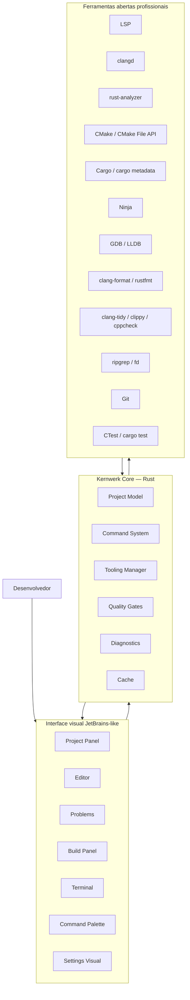
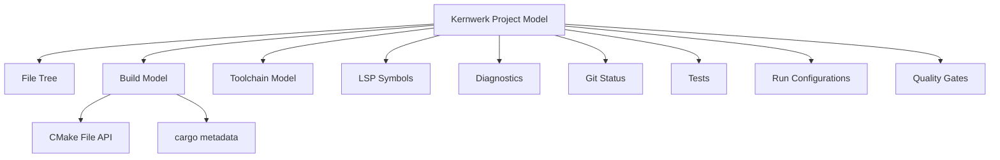

# Kernwerk Studio — Núcleo C/C++/Rust, Tooling Profissional e Suporte Nativo a Qt/GTK

> Documento estratégico e técnico para orientar o desenvolvimento inicial do **Kernwerk Studio** como uma IDE Linux-first, open source, rígida por padrão e focada inicialmente em **C, C++ e Rust**, com integração visual profunda sobre ferramentas livres profissionais.

---

## 1. Visão central

O Kernwerk Studio não deve começar como uma IDE universal.

A prioridade inicial deve ser:

```text
C
C++
Rust
CMake
Cargo
Qt
GTK
Linux
Toolchains locais
Debug nativo
Qualidade rígida
Interface visual JetBrains-like
```

Java e Python podem vir depois. O foco inicial precisa ser fazer **C/C++/Rust muito bem**.

---

## 2. Frase que define o projeto

```text
Kernwerk Studio = professional open tooling + JetBrains-like visual experience.
```

Em português:

```text
Kernwerk Studio = ferramentas abertas profissionais com uma experiência visual familiar ao estilo JetBrains.
```

A IDE deve entregar:

```text
LSP
Tree-sitter futuramente
formatadores
linters
debuggers
ripgrep
fd
git
test runners
build tools
snippets
plugins futuramente
terminal integrado
+
camada visual inteligente
+
configuração pragmática
+
strict mode
+
desempenho
+
zero telemetria obrigatória
```

---

## 3. Tecnologias-base que tornam a IDE poderosa

A força do Kernwerk deve vir da integração profunda com ferramentas abertas maduras.

### 3.1 Linguagem e análise

```text
LSP
clangd
rust-analyzer
Tree-sitter futuramente
```

### 3.2 Build systems

```text
CMake
CMakePresets
CMake File API
Ninja
Cargo
cargo metadata
Make opcional
Meson futuramente
```

### 3.3 Formatação

```text
clang-format
rustfmt
qmlformat futuramente
```

### 3.4 Linters e análise estática

```text
clang-tidy
clippy
cppcheck
include-what-you-use futuramente
cargo deny
cargo audit
```

### 3.5 Debuggers

```text
GDB
LLDB
DAP futuramente
```

### 3.6 Busca e navegação

```text
ripgrep
fd
símbolos via LSP
busca no projeto
recent files
search everywhere
```

### 3.7 Test runners

```text
CTest
Catch2
GoogleTest
cargo test
cargo nextest futuramente
```

### 3.8 Terminal e comandos

```text
terminal integrado
shell do usuário
command palette
run configurations
build configurations
```

### 3.9 Snippets e templates

```text
snippets C/C++
snippets Rust
templates CMake
templates Cargo
templates Qt
templates GTK
```

---

## 4. Diagrama da filosofia técnica



---

## 5. Arquitetura recomendada

```text
Qt/QML Frontend  ← IPC/JSON-RPC local →  Rust Core
```

### 5.1 Frontend Qt/QML

Responsável por:

```text
interface
painéis
menus
atalhos
editor visual
tema
command palette
notificações
settings
layout
```

### 5.2 Rust Core

Responsável por:

```text
workspace
project model
tooling manager
command system
build manager
LSP manager
debug manager
quality gates
diagnostics
settings
cache
logs
IA sob demanda
```

### 5.3 Ferramentas externas

Responsáveis por:

```text
compilação
análise de código
debug
formatação
lint
testes
busca
versionamento
```

---

## 6. Project Model

O Kernwerk precisa de um modelo próprio do projeto.

Ele não deve substituir clangd ou rust-analyzer, mas deve combinar informações de várias fontes.

```text
Kernwerk Project Model
├── File Tree
├── Build Model
│   ├── CMake Model
│   └── Cargo Model
├── Toolchain Model
├── LSP Symbols
├── Diagnostics
├── Git Status
├── Tests
├── Run Configurations
├── Quality Gates
└── UI State
```



---

## 7. Entendimento profundo de C/C++

Para C/C++, o Kernwerk deve se basear em:

```text
CMakePresets.json
CMake File API
compile_commands.json
clangd
clang-tidy
clang-format
CTest
```

### 7.1 Fluxo ideal

```text
CMakePresets.json
↓
CMake configure
↓
CMake File API
↓
compile_commands.json
↓
clangd
↓
diagnósticos / navegação / refatoração
↓
Kernwerk UI
```

### 7.2 O que a IDE deve entender

```text
targets
sources
headers
include directories
compile definitions
compiler flags
build directories
artifacts
test targets
install targets
toolchain files
```

---

## 8. Entendimento profundo de Rust

Para Rust, o Kernwerk deve se basear em:

```text
Cargo.toml
Cargo.lock
cargo metadata
rust-analyzer
cargo check
cargo test
cargo clippy
cargo fmt
cargo deny
cargo audit
```

### 8.1 Fluxo ideal

```text
Cargo.toml
↓
cargo metadata
↓
rust-analyzer
↓
cargo check / clippy / test
↓
diagnósticos / navegação / refatoração
↓
Kernwerk UI
```

### 8.2 O que a IDE deve entender

```text
workspace
crates
packages
features
targets
bins
libs
examples
tests
benches
dependencies
dev-dependencies
build scripts
```

---

## 9. Suporte nativo a Qt

O Kernwerk Studio deve ter suporte nativo a Qt porque o próprio frontend usa Qt/QML e porque projetos C++ modernos frequentemente usam Qt.

### 9.1 Qt deve ser tratado como ecossistema de primeira classe

Suporte esperado:

```text
Qt Widgets
Qt Quick
QML
CMake + Qt6
AUTOMOC
AUTOUIC
AUTORCC
resources .qrc
.ui files
.qml files
.qss styles
Qt Designer integration futura
QML preview futura
qmlls
qmlformat
```

### 9.2 Templates Qt

A IDE deve gerar templates:

```text
Qt Widgets App
Qt Quick App
Qt Console Tool
Qt Library
Qt Plugin
Qt + CMake Strict
Qt + Tests
```

### 9.3 Painel Qt

```text
Qt
├── Version
├── Modules
│   ├── Core
│   ├── Gui
│   ├── Widgets
│   └── Quick
├── QML Files
├── Resources
├── UI Files
└── Tools
    ├── qmlls
    ├── qmlformat
    └── designer futuro
```

---

## 10. Suporte nativo a GTK

O Kernwerk também deve tratar GTK como ecossistema nativo, principalmente para Linux desktop.

### 10.1 GTK em C/C++

Suporte esperado:

```text
GTK4
gtkmm
pkg-config
CMake
Meson futuramente
GResource
Blueprint UI futuramente
GObject introspection futuramente
```

### 10.2 GTK em Rust

Suporte esperado:

```text
gtk-rs
glib
gio
gdk
relm4 opcional futuramente
cargo
pkg-config
```

### 10.3 Templates GTK

```text
GTK4 C App
GTK4 C++/gtkmm App
GTK4 Rust/gtk-rs App
GTK Library
GTK + Tests
```

---

## 11. Refatorações prioritárias

### 11.1 Refatorações vindas do LSP

Para C/C++:

```text
rename symbol
go to definition
find references
hover
quick fixes
organize includes
semantic highlighting
```

Para Rust:

```text
rename
go to definition
find references
extract variable/function quando suportado
inline hints
module navigation
trait/impl navigation
```

### 11.2 Refatorações próprias do Kernwerk

#### C/C++

```text
criar par .hpp/.cpp
renomear arquivo e atualizar includes
mover arquivo e atualizar CMake
criar novo target CMake
adicionar arquivo ao target
criar teste para classe/função
converter projeto simples para CMakePresets
adicionar clang-format
adicionar clang-tidy
adicionar sanitizers
adicionar Catch2/GoogleTest
```

#### Rust

```text
criar módulo
renomear módulo e atualizar mod/use
criar crate em workspace
criar bin/lib/test/example
adicionar feature
adicionar teste
rodar cargo fmt/clippy/test
adicionar cargo deny
adicionar cargo audit
```

#### Qt

```text
adicionar módulo Qt
criar QML file
criar resource .qrc
adicionar arquivo ao qt_add_executable
criar tela básica
criar componente QML
```

#### GTK

```text
criar template GTK
adicionar pkg-config ao CMake
criar resource
criar janela básica
adicionar dependência gtk-rs
```

---

## 12. Performance obrigatória

A IDE deve rodar bem em máquinas modestas.

Meta para C/C++/Rust:

```text
CPU: 2 cores
RAM: 8 GB
GPU integrada
Tela: 1366x768
```

Regras:

```text
não iniciar LSP sem projeto/arquivo relevante
não iniciar Java/Python em projeto C/C++/Rust
não iniciar IA automaticamente
não indexar tudo agressivamente
não renderizar árvores enormes sem virtualização
não rodar Git status sem debounce
não guardar logs infinitos em memória
não abrir painel direito por padrão em tela pequena
```

---

## 13. Dogfooding

O Kernwerk deve ser desenvolvido dentro do próprio Kernwerk.

### Etapas

```text
1. Desenvolver no CLion
2. Abrir o repositório no Kernwerk
3. Editar arquivos simples no Kernwerk
4. Rodar cargo check/test pelo Kernwerk
5. Rodar CMake/Qt build pelo Kernwerk
6. Usar rust-analyzer/clangd pelo Kernwerk
7. Fazer commits pelo Kernwerk
8. Desenvolver o Kernwerk principalmente no Kernwerk
```

Marco principal:

```text
Kernwerk Studio can build Kernwerk Studio.
```
