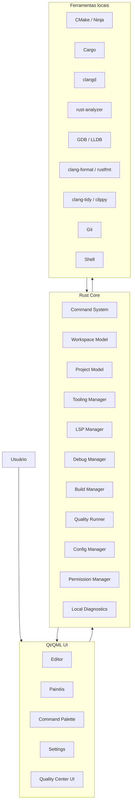

# Kernwerk Studio — Professional IDE Standards

> Este documento define os padrões profissionais que o **Kernwerk Studio** deve seguir para se comportar como uma IDE séria, previsível, segura, performática e adequada para projetos reais em C, C++ e Rust.

---

## 1. Objetivo deste documento

Este documento existe para remover ambiguidades.

O Kernwerk Studio deve seguir padrões usados por IDEs profissionais, mas sem copiar código, assets, marca, identidade visual ou comportamento proprietário de qualquer empresa.

A referência não é copiar uma IDE específica.

A referência é seguir princípios profissionais:

```text
projeto previsível;
toolchains locais;
configurações auditáveis;
editor confiável;
integração com LSP/DAP/build systems;
segurança local;
sem telemetria obrigatória;
performance medida;
arquivos gerados com confirmação;
testes fortes;
qualidade visual consistente;
dogfooding.
```

---

## 2. Decisão principal

O Kernwerk Studio deve ser tratado como uma IDE profissional desde o início.

Isso significa:

```text
Mesmo que o MVP seja pequeno, as regras arquiteturais devem ser profissionais.
```

O MVP pode ter poucos recursos, mas não deve nascer com decisões improvisadas.

---

## 3. Princípios obrigatórios

```text
1. A IDE não substitui toolchains.
2. A IDE usa ferramentas locais instaladas na máquina.
3. A IDE ativa ferramentas sob demanda.
4. A IDE nunca deve travar a UI por causa de build, LSP, Git, debug ou IA.
5. A IDE nunca deve sobrescrever arquivos sem confirmação.
6. A IDE deve gerar configurações reais e auditáveis.
7. A IDE deve explicar regras de qualidade.
8. A IDE deve ter zero telemetria obrigatória.
9. A IDE deve funcionar sem IA.
10. A IDE deve conseguir desenvolver o próprio Kernwerk no futuro.
```

---

## 4. O que significa “padrão profissional”

Para o Kernwerk, padrão profissional significa:

```text
não depender de magia escondida;
não depender de configuração invisível;
não depender de servidor externo;
não executar comandos perigosos sem confirmação;
não esconder erros;
não reescrever arquivos silenciosamente;
não carregar tudo na inicialização;
não misturar código do usuário com código gerado sem clareza;
não usar ferramenta experimental por padrão;
não tratar opinião como padrão técnico.
```

A IDE deve ser clara, auditável e previsível.

---

## 5. Arquitetura profissional mínima

A arquitetura oficial permanece:

```text
Qt/QML Frontend  ← IPC/JSON-RPC local →  Rust Core
```

Responsabilidades:

```text
Qt/QML UI:
- interface;
- painéis;
- menus;
- atalhos;
- editor visual;
- temas;
- command palette;
- status visual.

Rust Core:
- workspace;
- project model;
- command system;
- tool detection;
- build manager;
- LSP manager;
- debug manager;
- quality center;
- config manager;
- logs;
- permissões;
- IPC.

Ferramentas externas:
- compiladores;
- language servers;
- debuggers;
- formatadores;
- linters;
- test runners;
- build systems;
- Git;
- terminal;
- IA sob demanda.
```

---

## 6. Diagrama geral



---

## 7. Editor Engine

O editor é uma parte crítica da IDE e deve ser tratado como subsistema próprio.

### 7.1 Escopo do MVP

No MVP, o editor pode ser simples.

O objetivo inicial não é criar o editor perfeito, mas permitir:

```text
abrir arquivo;
editar texto;
salvar arquivo;
mostrar número de linha;
mostrar diagnostics básicos;
receber ações do LSP;
executar comandos principais;
não travar em uso comum.
```

### 7.2 Recursos essenciais

O editor deve evoluir para suportar:

```text
numeração de linhas;
syntax highlighting;
diagnostics inline;
autocomplete popup;
hover;
go to definition;
find references;
rename symbol;
quick fixes;
busca no arquivo;
undo/redo confiável;
line endings;
encoding;
tabs/spaces;
atalhos;
seleção;
scroll eficiente;
arquivos grandes com degradação controlada.
```

### 7.3 Arquivos grandes

A IDE deve detectar arquivos grandes.

Regra:

```text
Arquivos grandes não devem ativar todos os recursos pesados automaticamente.
```

Comportamento recomendado:

```text
desativar semantic highlighting pesado;
limitar diagnostics em tempo real;
avisar o usuário;
manter edição básica funcional;
não travar a UI.
```

### 7.4 Estrutura de texto

No futuro, o editor deve considerar uma estrutura de texto eficiente, como rope/piece table.

Regra:

```text
Não tratar editor profissional como uma única string gigante no longo prazo.
```

---

## 8. Workspace Model

O Kernwerk precisa de um modelo de workspace claro.

### 8.1 MVP

No MVP:

```text
uma janela abre um workspace;
um workspace possui um diretório raiz;
o workspace pode conter um projeto CMake, Cargo ou ambos;
o layout é salvo por workspace.
```

### 8.2 Futuro

Futuramente:

```text
multi-root workspace;
múltiplos projetos;
múltiplas toolchains;
múltiplos targets;
múltiplas run configurations.
```

### 8.3 Estado do workspace

A IDE deve salvar:

```text
arquivos abertos;
layout de painéis;
run configuration ativa;
toolchain escolhida;
perfil de qualidade;
última configuração de build;
histórico local de comandos recentes.
```

---

## 9. Project Model

O Kernwerk deve criar um modelo próprio do projeto, sem substituir as ferramentas especializadas.

```text
Project Model
├── File Tree
├── Build Model
│   ├── CMake File API
│   └── cargo metadata
├── Toolchain Model
├── LSP Symbols
├── Diagnostics
├── Git Status
├── Run Configurations
├── Tests
├── Quality Gates
└── UI State
```

O Project Model deve combinar informações de:

```text
CMakePresets.json;
CMake File API;
compile_commands.json;
Cargo.toml;
cargo metadata;
clangd;
rust-analyzer;
Git;
Quality Center;
settings do usuário.
```

---

## 10. Config Schema e migrações

Todo arquivo de configuração do Kernwerk deve ter versão de schema.

Exemplo:

```json
{
  "schemaVersion": 1,
  "profile": "strict-iso-pedantic"
}
```

Arquivos que devem ter versão:

```text
.kernwerk/quality-profile.json
.kernwerk/toolchains.json
.kernwerk/run-configs.json
.kernwerk/workspace.json
.kernwerk/ui-state.json
```

Regras:

```text
1. Configuração sem schemaVersion deve ser tratada com cuidado.
2. Configuração antiga deve passar por migração.
3. Configuração inválida deve gerar erro claro.
4. A IDE deve oferecer reset seguro.
5. A IDE nunca deve apagar configuração antiga sem backup.
```

---

## 11. Política de arquivos gerados

O Kernwerk pode gerar arquivos, mas deve fazer isso de forma profissional.

Arquivos possíveis:

```text
CMakeLists.txt
CMakePresets.json
cmake/ProjectOptions.cmake
cmake/Warnings.cmake
cmake/Sanitizers.cmake
.clang-format
.clang-tidy
Cargo.toml
rust-toolchain.toml
deny.toml
.kernwerk/quality-profile.json
.kernwerk/toolchains.json
.kernwerk/run-configs.json
```

### 11.1 Regra principal

```text
Kernwerk nunca deve sobrescrever arquivo manualmente alterado sem mostrar diff e pedir confirmação.
```

### 11.2 Antes de alterar arquivo

A IDE deve:

```text
mostrar quais arquivos serão criados/alterados;
mostrar diff;
explicar o motivo;
permitir aceitar tudo;
permitir aceitar parcialmente;
permitir cancelar.
```

### 11.3 Blocos gerenciados

Quando apropriado, a IDE pode usar blocos gerenciados:

```text
# BEGIN KERNWERK MANAGED
...
# END KERNWERK MANAGED
```

Mas isso deve ser usado com moderação.

Regra:

```text
Preferir arquivos separados em cmake/ ao invés de invadir CMakeLists.txt grande.
```

---

## 12. Command System

Tudo na IDE deve ser comando.

Exemplos:

```text
workspace.open
workspace.reload
project.create
editor.openFile
editor.saveFile
editor.formatFile
symbol.rename
symbol.findReferences
build.configure
build.run
build.clean
debug.start
debug.stop
git.status
git.commit
quality.runAll
tools.detect
lsp.restart
settings.open
ai.explainBuildError
```

Cada comando deve declarar:

```text
id;
nome;
descrição;
categoria;
atalho padrão opcional;
se exige workspace;
se exige confirmação;
se é destrutivo;
se pode ser chamado pela IA;
se roda em background;
como cancelar;
quais eventos emite.
```

---

## 13. Política de permissões de comandos

A IDE deve classificar comandos.

### 13.1 Safe

Comandos seguros:

```text
git.status
build.run
cargo.check
cargo.test
cmake.configure
editor.formatFile
quality.runFormatCheck
```

Podem rodar sem confirmação, desde que não alterem arquivos inesperadamente.

### 13.2 Modifies Files

Comandos que alteram arquivos:

```text
editor.saveFile
quality.applyProfile
project.generateTemplate
cmake.addTarget
rust.createModule
```

Precisam mostrar arquivos afetados se a alteração for automática.

### 13.3 Dangerous

Comandos perigosos:

```text
git.clean
git.resetHard
deleteFile
deleteDirectory
runExternalScript
applyAIFixAutomatically
```

Exigem confirmação explícita.

### 13.4 Forbidden by default

Comandos proibidos por padrão:

```text
rm -rf sem contexto;
execução automática de script baixado;
envio automático de projeto inteiro para IA;
alteração destrutiva sugerida por IA sem confirmação;
instalação de pacotes sem confirmação.
```

---

## 14. Debugging Architecture

O Kernwerk não deve implementar debugger próprio.

Ele deve integrar ferramentas consolidadas:

```text
GDB
LLDB
DAP futuramente
```

### 14.1 Recursos esperados

```text
breakpoints;
conditional breakpoints futuramente;
step over;
step into;
step out;
continue;
pause;
stop;
call stack;
threads;
variables;
watch expressions;
debug console;
program output.
```

### 14.2 Ativação

```text
Debugger só inicia quando o usuário clicar em Debug ou executar comando equivalente.
```

### 14.3 Run Configurations

Run/debug configs devem ser salvas em:

```text
.kernwerk/run-configs.json
```

Cada configuração deve conter:

```text
nome;
tipo;
target;
executável;
argumentos;
diretório de trabalho;
variáveis de ambiente;
debugger;
pré-build opcional;
perfil de qualidade opcional.
```

---

## 15. LSP Architecture

O Kernwerk deve usar LSP para inteligência de código.

LSPs iniciais:

```text
clangd
rust-analyzer
```

### 15.1 Ativação

```text
clangd inicia em projeto/arquivo C/C++.
rust-analyzer inicia em projeto/arquivo Rust.
```

Não iniciar LSP sem necessidade.

### 15.2 Recursos esperados

```text
autocomplete;
diagnostics;
hover;
go to definition;
find references;
rename;
code actions;
semantic highlighting;
inlay hints.
```

### 15.3 Falhas de LSP

Se o LSP falhar:

```text
mostrar erro claro;
mostrar logs locais;
permitir reiniciar;
não derrubar a IDE;
não travar editor.
```

---

## 16. Build System Integration

### 16.1 C/C++

Integração oficial:

```text
CMakePresets.json
CMake File API
compile_commands.json
Ninja
CTest
```

### 16.2 Rust

Integração oficial:

```text
Cargo.toml
cargo metadata
cargo check
cargo build
cargo test
cargo clippy
cargo fmt
```

### 16.3 Build não bloqueia UI

Regra:

```text
Build nunca pode rodar na thread da UI.
```

Build deve emitir eventos:

```text
build.started
build.output
build.warning
build.error
build.finished
```

---

## 17. Quality Center

O Quality Center é parte central da IDE.

Ele deve permitir:

```text
selecionar perfil;
ativar regras;
ver explicações;
gerar configurações;
rodar verificações;
ver relatório.
```

Perfis oficiais:

```text
Learning
Balanced
Strict / ISO Pedantic
Safety Hardened
Embedded Strict
Performance Analysis
```

Regra:

```text
Strict mode deve ser visual, auditável, explicável e gerador de configuração real.
```

---

## 18. Segurança e privacidade

O Kernwerk deve ser local-first e privacy-first.

### 18.1 Telemetria

```text
Telemetria obrigatória: proibida.
Coleta silenciosa: proibida.
Envio de logs sem consentimento: proibido.
```

### 18.2 IA

```text
IA deve ser sob demanda.
IA externa deve pedir confirmação antes de receber contexto.
A IDE deve mostrar quais arquivos/trechos serão enviados.
API keys nunca devem aparecer em logs.
A IDE deve funcionar sem IA.
IA nunca deve executar ação destrutiva automaticamente.
```

### 18.3 Logs

Logs devem ser locais:

```text
~/.cache/kernwerk-studio/logs/
```

Logs não devem conter:

```text
API keys;
tokens;
senhas;
conteúdo sensível desnecessário;
projeto inteiro.
```

---

## 19. Local Diagnostics

Não confundir diagnóstico local com telemetria.

A IDE deve ter um painel local de diagnóstico:

```text
status do core;
status do IPC;
status das ferramentas;
status do LSP;
últimos erros;
tempo de build;
tempo de indexação;
uso aproximado de memória;
logs locais;
crashes de ferramentas externas.
```

Regra:

```text
Tudo local. Nada enviado.
```

---

## 20. Performance Regression Policy

Toda feature nova deve declarar:

```text
inicia no boot ou sob demanda?
roda na UI thread?
pode ser cancelada?
consome muita memória?
quais arquivos lê?
quais processos inicia?
quais eventos emite?
quais logs gera?
como falha?
```

### 20.1 Regras obrigatórias

```text
UI nunca bloqueia por build.
UI nunca bloqueia por LSP.
UI nunca bloqueia por Git.
UI nunca bloqueia por IA.
Ferramentas pesadas iniciam sob demanda.
Git status usa debounce.
File watcher usa debounce.
Árvores grandes usam virtualização.
Logs não crescem infinitamente em memória.
```

### 20.2 Hardware alvo mínimo

```text
CPU: 2 cores
RAM: 8 GB
GPU integrada
Tela: 1366x768
Linux leve
```

---

## 21. Testing Strategy

O próprio Kernwerk deve ter testes fortes.

### 21.1 Testes necessários

```text
unit tests;
integration tests;
tests de IPC;
tests de command registry;
tests de config parsing;
tests de schema migration;
tests de tool detection;
tests de build command generation;
tests de Quality Center;
tests de Project Model;
tests de Generated Files Policy.
```

### 21.2 Golden tests

Templates devem ter golden tests.

Exemplo:

```text
Kernwerk gera projeto C++ Strict.
Teste compara arquivos gerados com saída esperada.
```

Isso evita regressões silenciosas.

---

## 22. CI e Quality Pipeline

Mesmo sendo pessoal, o Kernwerk deve ter pipeline local.

Para Rust:

```bash
cargo fmt --all --check
cargo check --workspace --all-targets --all-features
cargo clippy --workspace --all-targets --all-features -- -D warnings
cargo test --workspace --all-features
```

Futuramente:

```bash
cargo deny check
cargo audit
```

Para templates C++:

```bash
cmake --preset debug-strict
cmake --build --preset debug-strict
ctest --preset debug-strict
clang-format --dry-run --Werror
```

---

## 23. Dependency Management

O Kernwerk não deve criar um gerenciador de pacotes próprio no início.

### 23.1 C/C++

MVP:

```text
dependências do sistema;
find_package;
pkg-config;
FetchContent com cuidado;
```

Futuro:

```text
vcpkg;
Conan;
Meson;
```

### 23.2 Rust

```text
Cargo.toml
Cargo.lock
cargo add
cargo update
cargo deny
cargo audit
```

### 23.3 Qt

```text
find_package(Qt6)
Qt instalado no sistema
CMake oficial do Qt
```

### 23.4 GTK

```text
pkg-config
gtk4
gtkmm
gtk-rs
bibliotecas do sistema
```

---

## 24. Project Templates

Templates devem ser explícitos, testáveis e documentados.

Cada template deve declarar:

```text
nome;
descrição;
linguagem;
ferramentas exigidas;
perfil de qualidade;
arquivos gerados;
comandos iniciais;
testes incluídos;
dependências;
quando usar;
quando evitar.
```

Templates iniciais:

```text
C Console Strict
C++ Console Strict
C++ Library Strict
C++ CMake + Catch2
C++ Qt Widgets
C++ Qt Quick
C GTK4
C++ gtkmm
Rust CLI
Rust Library
Rust Workspace
Rust GTK/gtk-rs
```

---

## 25. Accessibility and Visual Comfort

A UI deve ser confortável para longas horas.

Regras:

```text
tema escuro confortável;
contraste suficiente;
não usar cores agressivas em áreas grandes;
não depender só de cor para indicar erro;
ícones com tooltip;
fonte ajustável;
densidade compacta e confortável;
redução de animações;
layout compacto para 1366x768;
painel direito fechado por padrão em telas pequenas.
```

---

## 26. Packaging and Distribution

Mesmo para uso pessoal, a IDE precisa ser instalável de forma limpa.

Opções futuras:

```text
binário local;
PKGBUILD/AUR;
AppImage;
Flatpak;
pacote .tar.zst;
```

Diretórios Linux recomendados:

```text
Config:
~/.config/kernwerk-studio/

Cache:
~/.cache/kernwerk-studio/

Data:
~/.local/share/kernwerk-studio/

Logs:
~/.cache/kernwerk-studio/logs/
```

---

## 27. Licensing Policy

O projeto deve evitar dependências legais confusas.

Regras:

```text
não copiar assets JetBrains;
não copiar ícones proprietários;
não copiar tema proprietário;
não usar marca parecida;
não embutir código sem licença compatível;
documentar licenças de dependências;
preferir dependências maduras e compatíveis.
```

Sugestão de licença para o Kernwerk:

```text
MIT OR Apache-2.0
```

---

## 28. Dogfooding

O objetivo final da primeira grande fase:

```text
Kernwerk Studio can build Kernwerk Studio.
```

Etapas:

```text
1. Desenvolver no CLion.
2. Abrir Kernwerk no Kernwerk.
3. Editar arquivos simples.
4. Rodar cargo check/test.
5. Rodar CMake/Qt build.
6. Usar rust-analyzer/clangd.
7. Rodar Quality Center.
8. Fazer commits.
9. Desenvolver o Kernwerk principalmente no Kernwerk.
```

---

## 29. Regras para agentes de IA

Para evitar confusão de agentes como Claude, Codex ou GPT:

```text
Não copiar JetBrains.
Não criar telemetria.
Não usar Electron.
Não implementar compilador próprio.
Não implementar debugger próprio.
Não iniciar ferramentas pesadas no boot.
Não sobrescrever arquivos sem diff.
Não executar comandos destrutivos.
Não enviar contexto para IA externa sem confirmação.
Não ativar ferramenta experimental por padrão.
Não transformar MVP em IDE universal.
```

O foco inicial é:

```text
C/C++/Rust.
Toolchains locais.
Qt/QML UI.
Rust Core.
Quality Center.
LSP.
CMake/Cargo.
Debug nativo.
Zero telemetria.
Performance.
Dogfooding.
```

---

## 30. Conclusão

O Kernwerk Studio deve seguir padrões profissionais de IDE desde o início.

Isso não significa fazer tudo no MVP.

Significa que o MVP deve nascer sobre regras corretas:

```text
arquitetura separada;
ferramentas sob demanda;
configurações versionadas;
arquivos gerados com confirmação;
editor tratado como subsistema;
debug via ferramentas consolidadas;
LSP bem integrado;
quality center visual;
segurança local;
testes;
performance medida;
zero telemetria.
```

O objetivo é criar uma IDE pessoal, livre e séria, capaz de evoluir com confiança e, no futuro, desenvolver a si própria.
