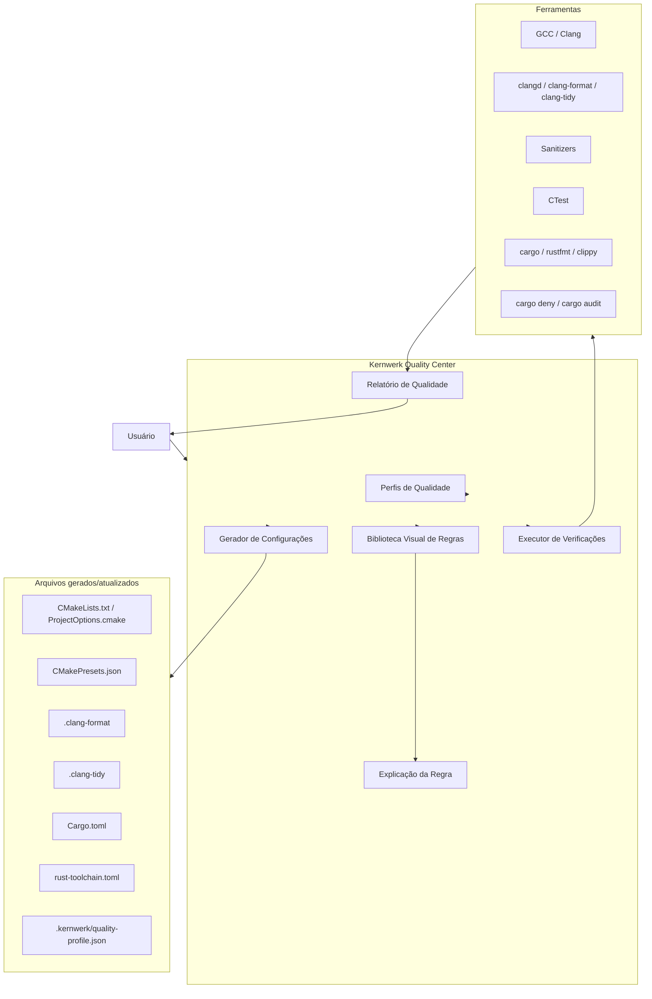
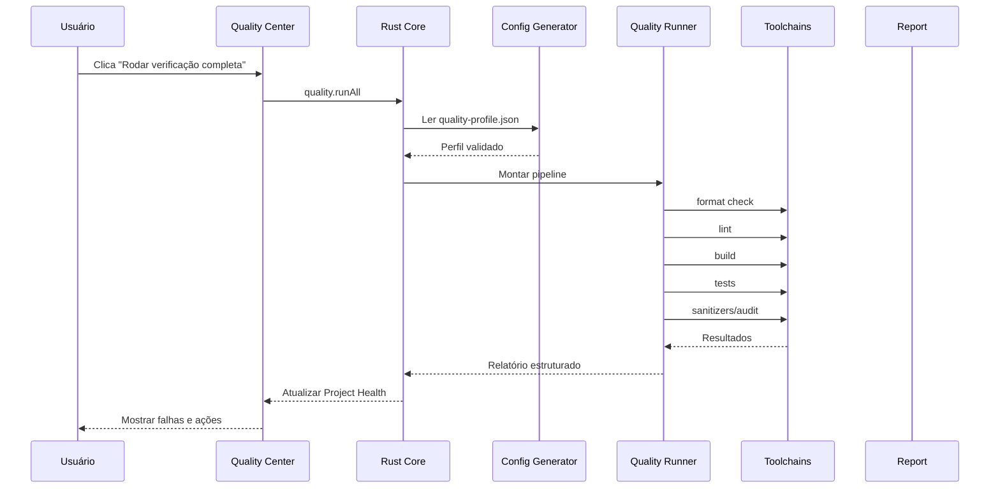

# Kernwerk Studio — Quality Center, Strict Modes e Biblioteca Visual de Regras

> Este documento define o **Kernwerk Quality Center**, a área visual da IDE responsável por ativar, explicar, gerar e executar regras de qualidade para C, C++ e Rust, com foco em máxima rigidez pragmática, previsibilidade, ferramentas confiáveis e baixa ambiguidade.

---

## 1. Objetivo

O **Kernwerk Quality Center** deve permitir que o usuário ative modos rígidos e regras de qualidade sem precisar editar manualmente dezenas de flags, arquivos CMake, configurações de linters ou comandos de terminal.

A ideia central é:

```text
Configuração rígida por botões visuais,
mas gerando arquivos reais, legíveis e auditáveis.
```

O usuário deve conseguir:

```text
ativar strict mode;
ver o que cada regra faz;
entender o impacto;
ver qual ferramenta aplica a regra;
saber se a regra é ISO, compilador oficial ou ferramenta madura;
gerar CMake/Cargo/configs automaticamente;
rodar verificações completas por botão;
desativar regras conscientemente quando necessário.
```

---

## 2. Filosofia

O Kernwerk não deve inventar regras obscuras.

O Quality Center deve usar apenas:

```text
padrões da linguagem;
ferramentas oficiais;
compiladores consolidados;
LLVM/Clang;
Rust toolchain oficial;
CMake/CTest;
ferramentas open source maduras.
```

Nada experimental deve ser ativado por padrão.

---

## 3. Separação entre ISO e ferramentas

É importante não confundir:

```text
ISO C++ define a linguagem.
Compiladores fornecem diagnósticos e flags.
Ferramentas como clang-tidy/cppcheck fazem análise adicional.
Sanitizers detectam problemas em tempo de execução.
```

Portanto, o Quality Center deve classificar regras em níveis de confiança.

---

## 4. Níveis de confiança

Cada regra deve ter um campo `Trust Level`.

```text
1. ISO / Standard
2. Compiler official
3. LLVM toolchain
4. Rust official
5. CMake official
6. Mature open source
7. Optional advanced
8. Experimental
```

Por padrão, o Kernwerk deve ativar apenas:

```text
ISO / Standard
Compiler official
LLVM toolchain
Rust official
CMake official
Mature open source
```

Nada `Experimental` deve ser ligado por padrão.

---

## 5. Diagrama geral do Quality Center



---

## 6. Perfis de qualidade

O Quality Center deve oferecer perfis prontos.

### 6.1 Learning

Para iniciante.

```text
warnings fortes
sem warnings como erro
formatador
build simples
diagnósticos explicativos
```

Uso:

```text
aprendizado
primeiros projetos
código experimental
```

---

### 6.2 Balanced

Para uso geral.

```text
-Wall
-Wextra
-Wpedantic
formatador
clangd
CMakePresets
CTest opcional
sem agressividade extrema
```

Uso:

```text
projetos pessoais comuns
projetos de estudo
usuários que não querem travar por todo warning
```

---

### 6.3 Strict / ISO Pedantic

Perfil principal para o autor do Kernwerk.

```text
C++ padrão explícito
sem extensões do compilador
pedantic errors
warnings como erro
conversion warnings
shadow warnings
format obrigatório
sanitizers no Debug
compile_commands.json obrigatório
CMakePresets obrigatório
```

Uso:

```text
projetos novos
código sério
desenvolvimento pessoal rígido
Kernwerk Studio
```

---

### 6.4 Safety Hardened

Perfil mais agressivo para encontrar bugs.

```text
Strict / ISO Pedantic
+ sanitizers fortes
+ clang-tidy bugprone
+ cppcheck
+ testes obrigatórios
+ análise estática mais profunda
```

Uso:

```text
código crítico
bibliotecas
módulos sensíveis
pré-release
```

---

### 6.5 Embedded Strict

Perfil para embarcados.

```text
toolchain explícita
target explícito
warnings fortes
map file
flags de tamanho
sem exceções opcional
sem RTTI opcional
sem alocação dinâmica opcional
```

Observação:

```text
-fno-exceptions e -fno-rtti não são ISO puro.
São decisões de ambiente/ABI e devem ser opcionais, bem explicadas.
```

---

### 6.6 Performance Analysis

Perfil para investigar performance.

```text
Release com símbolos
RelWithDebInfo
LTO opcional
perf
heaptrack
benchmark target
profiling
```

Uso:

```text
otimização
profiling
análise de gargalos
```

---

## 7. Biblioteca visual de regras

Cada regra deve conter:

```text
nome
descrição
categoria
ferramenta usada
arquivo/configuração gerada
flags/comandos gerados
nível de confiança
impacto
quando usar
quando evitar
ativada por padrão em quais perfis
```

---

## 8. Categorias de regras C/C++

### 8.1 ISO / Standard Compliance

Regras ligadas diretamente à intenção de seguir C++ padrão e evitar extensões específicas.

```text
C++ standard explícito
CMAKE_CXX_STANDARD_REQUIRED ON
CMAKE_CXX_EXTENSIONS OFF
-Wpedantic
-pedantic-errors
CMakePresets obrigatório
compile_commands.json obrigatório
```

#### Exemplo de regra

```text
Nome:
Desativar extensões do compilador

O que faz:
Força o projeto a usar C++ padrão, evitando extensões específicas de GCC, Clang ou MSVC.

Configuração gerada:
set(CMAKE_CXX_EXTENSIONS OFF)

Nível:
ISO / Standard

Recomendado:
Sim para projetos novos.

Quando evitar:
Quando o projeto depende conscientemente de extensões específicas do compilador.
```

---

### 8.2 Compiler Strictness

Regras de compilador para evitar código permissivo.

```text
-Wall
-Wextra
-Werror
-Wconversion
-Wsign-conversion
-Wshadow
-Wformat=2
-Wundef
-Wnull-dereference
-Wold-style-cast
-Wnon-virtual-dtor
-Woverloaded-virtual
-Wdouble-promotion
-Wimplicit-fallthrough
```

#### Exemplo de regra

```text
Nome:
-Wconversion

O que faz:
Avisa sobre conversões implícitas que podem alterar valor, sinal ou precisão.

Ferramenta:
GCC/Clang

Nível:
Compiler official

Impacto:
Pode gerar muitos avisos em código legado.

Recomendado:
Sim para projetos novos.

Quando evitar:
Ao importar código legado ou bibliotecas externas que não seguem esse padrão.
```

---

### 8.3 Runtime Safety

Regras para encontrar problemas em tempo de execução.

```text
AddressSanitizer
UndefinedBehaviorSanitizer
ThreadSanitizer
LeakSanitizer
Valgrind
```

#### Exemplo de regra

```text
Nome:
AddressSanitizer

O que faz:
Detecta erros de memória em tempo de execução, como use-after-free, buffer overflow e acessos inválidos.

Ferramenta:
Clang/GCC Sanitizers

Nível:
Compiler official / Mature open source

Impacto:
Aumenta consumo de memória e reduz performance durante execução.

Recomendado:
Sim em Debug.

Quando evitar:
Release final, ambientes muito limitados ou builds embarcados específicos.
```

---

### 8.4 Static Analysis

Análise estática adicional.

```text
clang-tidy recommended
clang-tidy bugprone
clang-tidy modernize
clang-tidy performance
clang-tidy readability
cppcheck
include-what-you-use
```

Por padrão:

```text
clang-tidy recommended pode ser sugerido.
cppcheck e IWYU devem ser opcionais.
```

---

### 8.5 Build Quality

```text
Ninja
CMakePresets
CMake File API
Debug Strict
Release Hardened
RelWithDebInfo
CTest
Export compile_commands.json
```

---

### 8.6 Testing

```text
CTest
Catch2
GoogleTest
Coverage
Test target obrigatório opcional
```

---

## 9. Categorias de regras Rust

### 9.1 Rust Official Strict

```text
rustfmt
clippy
deny warnings
forbid unsafe
cargo check
cargo test
```

### 9.2 Rust Security and Quality

```text
cargo deny
cargo audit
cargo nextest
cargo miri
cargo llvm-cov
cargo udeps
```

### 9.3 Exemplo de regra Rust

```text
Nome:
Forbid unsafe

O que faz:
Proíbe blocos unsafe no crate, salvo se a regra for explicitamente relaxada.

Configuração:
#![forbid(unsafe_code)]

Nível:
Rust official

Recomendado:
Sim para o Kernwerk Core.

Quando evitar:
Crates de baixo nível que precisam interagir com FFI, sistema operacional ou bibliotecas C.
```

---

## 10. Tela visual proposta

```text
Kernwerk Quality Center
────────────────────────────────────────────

Modo atual:
● Strict / ISO Pedantic

Perfis:
○ Learning
○ Balanced
● Strict / ISO Pedantic
○ Safety Hardened
○ Embedded Strict
○ Performance Analysis

Biblioteca de regras:
[✓] ISO C++ mode
[✓] Disable compiler extensions
[✓] Pedantic errors
[✓] Warnings as errors
[✓] Conversion warnings
[✓] Shadowing warnings
[✓] Format enforcement
[✓] Sanitizers in Debug
[ ] clang-tidy full analysis
[ ] cppcheck
[ ] include-what-you-use
[ ] Valgrind
[ ] Coverage
[ ] Performance profiler

Painel lateral:
- O que faz
- Por que usar
- Ferramenta usada
- Configuração gerada
- Impacto
- Quando evitar
- Nível de confiança
```

---

## 11. Botões principais

```text
[Ativar Strict ISO]
[Ativar Sanitizers]
[Rodar Quality Check]
[Formatar projeto]
[Analisar com clang-tidy]
[Rodar testes]
[Gerar relatório]
[Explicar falha]
```

Botão principal:

```text
[Rodar verificação completa]
```

Para C/C++:

```text
CMake configure
Build
clang-format check
clang-tidy
CTest
Sanitizers se aplicável
```

Para Rust:

```text
cargo fmt --check
cargo check
cargo clippy
cargo test
cargo deny
cargo audit
```

---

## 12. Arquivo de perfil do Kernwerk

A IDE deve salvar o perfil em:

```text
.kernwerk/quality-profile.json
```

Exemplo:

```json
{
  "profile": "strict-iso-pedantic",
  "language": "cpp",
  "standard": "c++23",
  "compilerExtensions": false,
  "warningsAsErrors": true,
  "pedanticErrors": true,
  "sanitizers": {
    "address": true,
    "undefinedBehavior": true,
    "thread": false,
    "leak": false
  },
  "staticAnalysis": {
    "clangTidy": "recommended",
    "cppcheck": false,
    "includeWhatYouUse": false
  },
  "formatting": {
    "clangFormat": true
  },
  "testing": {
    "ctest": true,
    "framework": "catch2"
  }
}
```

---

## 13. Arquivos que podem ser gerados

Para C/C++:

```text
CMakeLists.txt
CMakePresets.json
cmake/ProjectOptions.cmake
cmake/Warnings.cmake
cmake/Sanitizers.cmake
.clang-format
.clang-tidy
CTestTestfile.cmake
```

Para Rust:

```text
Cargo.toml
rust-toolchain.toml
deny.toml
.cargo/config.toml
```

Para Kernwerk:

```text
.kernwerk/quality-profile.json
.kernwerk/toolchains.json
.kernwerk/run-configs.json
```

---

## 14. Exemplo de CMake Strict gerado

```cmake
add_library(project_options INTERFACE)

target_compile_features(project_options INTERFACE cxx_std_23)

if(CMAKE_CXX_COMPILER_ID MATCHES "Clang|GNU")
    target_compile_options(project_options INTERFACE
        -Wall
        -Wextra
        -Wpedantic
        -pedantic-errors
        -Werror
        -Wconversion
        -Wsign-conversion
        -Wshadow
        -Wformat=2
        -Wundef
        -Wnull-dereference
        -Wold-style-cast
        -Wnon-virtual-dtor
        -Woverloaded-virtual
        -Wdouble-promotion
        -Wimplicit-fallthrough
    )
endif()
```

---

## 15. Regra importante sobre código de terceiros

O Kernwerk não deve aplicar `-Werror` agressivo em dependências externas.

Regra:

```text
Warnings as errors devem valer para o código do projeto, não para bibliotecas de terceiros.
```

Quando possível, includes de terceiros devem ser tratados como `SYSTEM`.

---

## 16. Diagrama de execução de Quality Check



---

## 17. Regra de clareza para IA

Para evitar confusão de agentes como Claude/Codex/GPT, este documento deve ser interpretado assim:

```text
Não inventar regras desconhecidas.
Não usar flags experimentais por padrão.
Não usar ferramentas obscuras.
Não tratar clang-tidy/cppcheck como se fossem ISO.
Não ativar tudo sem explicar impacto.
Não aplicar regras agressivas em dependências externas.
Não quebrar projeto legado sem confirmação.
```

---

## 18. Decisão final

O **Kernwerk Quality Center** deve ser um recurso central da IDE.

Ele existe para transformar configuração rígida em uma experiência visual clara:

```text
menos configuração manual;
mais qualidade;
mais explicação;
mais controle;
mais previsibilidade;
menos permissividade acidental.
```

A meta é permitir que o usuário use C/C++/Rust com rigor profissional, sem decorar todas as flags e sem depender de ferramentas obscuras.

```text
Strict mode deve ser visual, auditável, explicável e gerador de configuração real.
```
