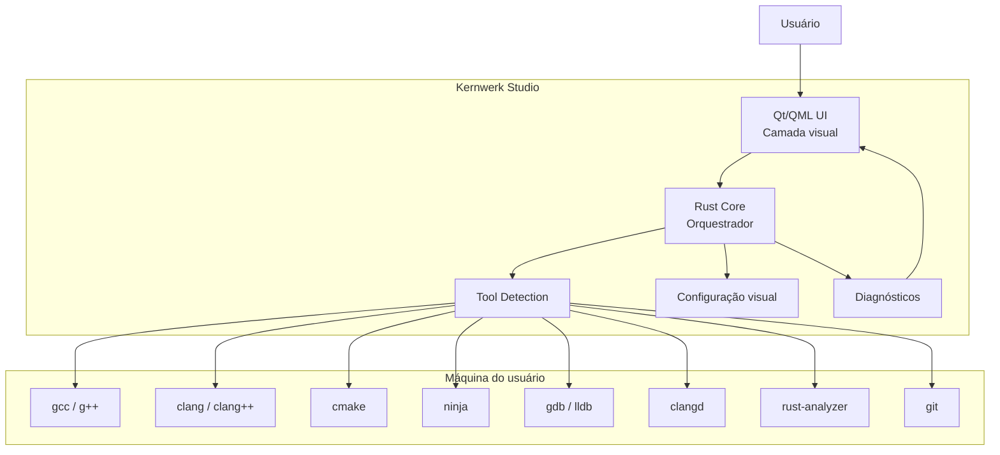
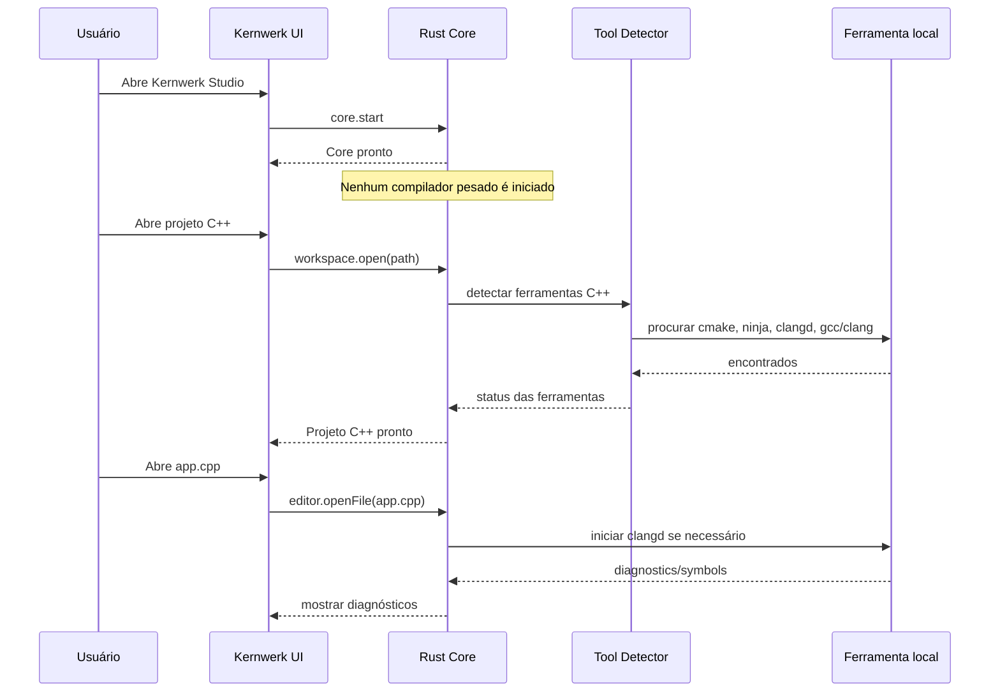

# Kernwerk Studio — Política de Toolchains e Camada Visual Inteligente

> Este documento define uma regra fundamental do Kernwerk Studio: a IDE não deve tentar ser o compilador, o debugger, o build system ou o servidor de linguagem. Ela deve ser uma **camada visual inteligente** sobre ferramentas reais instaladas na máquina do usuário.

---

## 1. Ideia central

O **Kernwerk Studio** deve funcionar como uma IDE profissional moderna:

```text
A IDE não compila por conta própria.
A IDE não substitui GCC, Clang, CMake, Ninja, GDB, LLDB, clangd, rust-analyzer, JDT LS ou Pyright.
A IDE detecta, configura, executa, monitora e apresenta essas ferramentas visualmente.
```

Em outras palavras:

```text
Kernwerk Studio = camada visual inteligente + orquestrador de ferramentas
```

A IDE deve facilitar o uso das ferramentas, não reimplementá-las.

---

## 2. Explicação simples

Quando o usuário instala uma IDE, ela **não precisa trazer todos os compiladores embutidos**.

O fluxo correto é:

```text
1. O usuário instala as ferramentas na própria máquina.
2. A IDE detecta essas ferramentas.
3. A IDE valida se elas funcionam.
4. A IDE cria ou lê configurações do projeto.
5. A IDE chama essas ferramentas quando necessário.
6. A IDE mostra o resultado de forma visual e compreensível.
```

Exemplo em C/C++:

```text
Usuário instala:
- gcc/g++
- clang/clang++
- cmake
- ninja
- gdb/lldb
- clangd

Kernwerk Studio:
- detecta essas ferramentas;
- cria/usa CMakePresets;
- chama CMake/Ninja para build;
- inicia clangd para inteligência de código;
- chama GDB/LLDB para debug;
- mostra erros, warnings, logs, símbolos e ações na interface.
```

Portanto, a IDE “pega emprestado” no sentido de **usar as ferramentas instaladas no sistema**, mas de forma controlada, visual e integrada.

O termo técnico correto é:

```text
toolchain local
```

Ou seja:

```text
A IDE usa a toolchain local instalada na máquina do usuário.
```

---

## 3. Diagrama geral



---

## 4. O que a IDE deve carregar ao iniciar

Ao abrir o Kernwerk Studio, ele deve carregar apenas o essencial:

```text
Kernwerk UI
Kernwerk Core
Tema
Settings
Command System
Lista de projetos recentes
Detecção leve de ambiente
```

A IDE **não deve iniciar automaticamente**:

```text
clangd
rust-analyzer
jdtls
pyright
cmake build
ninja
gdb
lldb
gradle
maven
docker
qemu
openocd
IA externa
IA local
```

Essas ferramentas só devem ser ativadas quando fizer sentido.

---

## 5. Ativação sob demanda

O Kernwerk Studio deve seguir a política:

```text
Lazy Tool Activation
```

Isso significa:

```text
Nenhuma ferramenta pesada deve iniciar apenas porque a IDE foi aberta.
Ferramentas são ativadas por projeto, arquivo ou ação explícita do usuário.
```

### Exemplos

| Situação | O que a IDE deve fazer |
|---|---|
| IDE aberta sem projeto | Não iniciar LSP, compilador ou debugger |
| Abrir projeto C++ | Detectar CMake, Ninja, clangd, gcc/clang |
| Abrir arquivo `.cpp` | Iniciar clangd se necessário |
| Abrir projeto Rust | Detectar Cargo, rust-analyzer, rustfmt, clippy |
| Abrir arquivo `.rs` | Iniciar rust-analyzer se necessário |
| Clicar em Build | Executar CMake/Ninja ou Cargo |
| Clicar em Debug | Iniciar GDB/LLDB |
| Usar IA | Chamar provider de IA sob demanda |

---

## 6. Diagrama de ativação sob demanda



---

## 7. O Kernwerk não deve embutir tudo

A IDE não deve ser distribuída como um pacote gigante contendo todos os compiladores, SDKs e ferramentas de todas as linguagens.

Isso seria pesado, difícil de manter e ruim para máquinas simples.

O comportamento correto é:

```text
Kernwerk Studio instala a IDE.
O usuário/sistema instala toolchains.
Kernwerk detecta e integra toolchains.
```

Exceção futura:

```text
A IDE pode oferecer assistentes para instalar ferramentas,
mas nunca deve instalar nada sem confirmação explícita.
```

---

## 8. Regra de ouro

```text
A IDE deve iniciar leve.
A IDE deve detectar o projeto.
A IDE deve ativar apenas o necessário.
A IDE deve usar as ferramentas da máquina.
A IDE deve mostrar tudo visualmente.
A IDE deve permitir configuração manual quando necessário.
```

---

## 9. Resumo técnico

O entendimento correto é:

```text
Kernwerk Studio não vem com todos os compiladores carregados.

O usuário instala ou já possui compiladores e ferramentas na máquina.

A IDE detecta essas ferramentas, valida se funcionam, cria ou lê configurações,
e passa a atuar como uma camada visual inteligente em tempo real.

Essa camada visual mostra build, erros, diagnósticos, Git, debug, terminal,
LSP, formatação, testes e IA sob demanda, sem carregar tudo desnecessariamente.
```

---

## 10. Decisão final do projeto

O Kernwerk Studio deve seguir oficialmente esta política:

```text
Kernwerk Studio is an intelligent visual orchestration layer over local toolchains.
```

Em português:

```text
Kernwerk Studio é uma camada visual inteligente de orquestração sobre toolchains locais.
```
