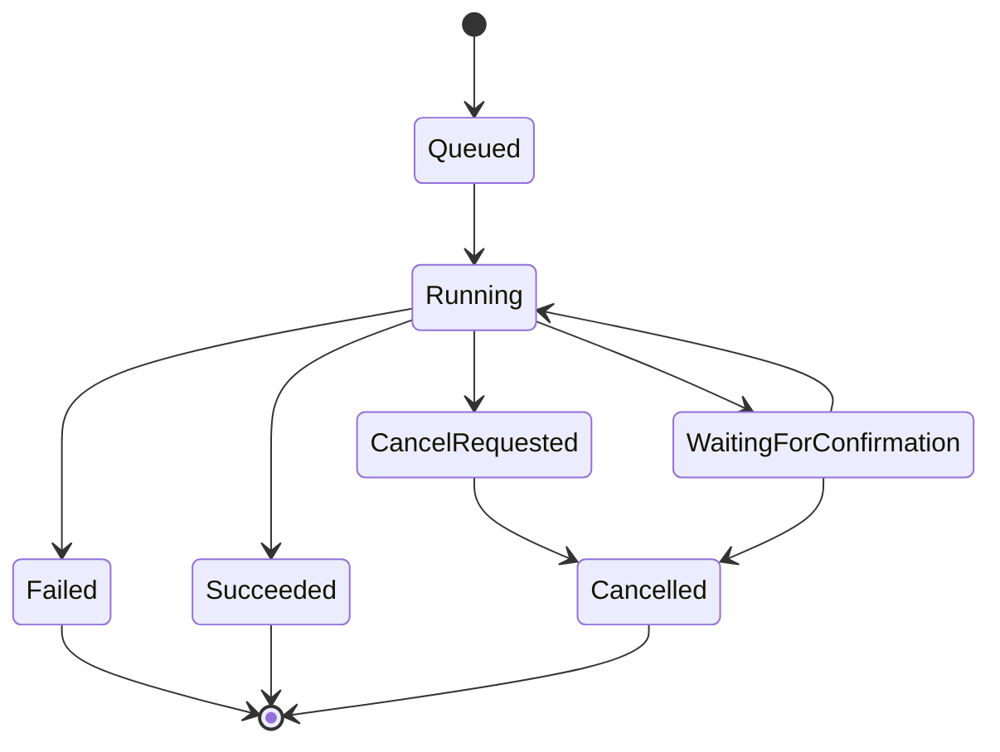

# Kernwerk Studio — Task Manager e Background Job System

> Este documento define o sistema de tarefas em background do Kernwerk Studio. Toda IDE profissional precisa de uma camada central para controlar build, testes, LSP, Git, busca, deploy, debug, QEMU, serial, quality checks e IA sob demanda.

---

## 1. Objetivo

O Kernwerk não deve permitir que cada módulo execute processos do seu próprio jeito.

Sem um Task Manager central, o projeto tende a virar:

```text
Build executa processo de um jeito.
Git executa processo de outro jeito.
LSP executa processo de outro jeito.
Remote SSH executa processo de outro jeito.
Quality Center executa processo de outro jeito.
```

O comportamento profissional deve ser:

```text
Command
↓
Task Manager
↓
Process Runner
↓
Logs
↓
Events
↓
UI
```

---

## 2. Responsabilidades

O Task Manager deve controlar:

```text
tarefas em execução;
tarefas pendentes;
progresso;
cancelamento;
prioridade;
dependência entre tarefas;
logs;
stdout/stderr;
status final;
erros;
tempo de execução;
limite de paralelismo;
notificações;
integração com UI.
```

Exemplos de tarefas:

```text
CMake Configure
CMake Build
Cargo Check
Cargo Test
clangd Indexing
rust-analyzer Startup
Git Status
Search in Files
Quality Check
Remote Deploy
Remote Run
QEMU Start
Serial Open
AI Explain Build Error
```

---

## 3. Tipos de tarefa

```text
Foreground Task:
Tarefa visível para o usuário, normalmente com barra de progresso ou painel aberto.

Background Task:
Tarefa silenciosa, mas visível no status bar/task list.

Long Running Task:
Tarefa que pode durar bastante, como build, test, indexação ou deploy.

Cancelable Task:
Tarefa que pode ser cancelada com segurança.

Critical Task:
Tarefa que não deve ser interrompida sem confirmação, como flash de firmware.

Dangerous Task:
Tarefa que pode modificar sistema remoto, apagar arquivos ou resetar target.
```

---

## 4. Modelo de estado



Estados:

```text
Queued
Running
WaitingForConfirmation
Succeeded
Failed
CancelRequested
Cancelled
Skipped
```

---

## 5. Estrutura de Task

Modelo conceitual:

```json
{
  "id": "task-2026-0001",
  "commandId": "build.run",
  "title": "CMake Build",
  "category": "Build",
  "status": "Running",
  "progress": {
    "kind": "indeterminate",
    "percent": null
  },
  "startedAt": "2026-07-03T18:00:00Z",
  "workspace": "/home/user/project",
  "canCancel": true,
  "safety": "Safe",
  "logsRef": "build/task-2026-0001.log"
}
```

---

## 6. Eventos

Toda tarefa deve emitir eventos.

```text
task.queued
task.started
task.progress
task.output
task.warning
task.error
task.confirmationRequired
task.cancelRequested
task.cancelled
task.failed
task.succeeded
task.finished
```

Esses eventos alimentam:

```text
status bar;
task list;
build panel;
problems panel;
notifications;
logs locais;
relatórios.
```

---

## 7. Limite de paralelismo

O Kernwerk deve evitar sobrecarga.

Regras iniciais:

```text
No máximo 1 build pesado por workspace.
No máximo 1 quality check por workspace.
No máximo 1 deploy por target.
Git status deve ter debounce.
Busca global deve ser cancelável.
LSP não deve ser reiniciado repetidamente.
IA nunca deve bloquear build/editor.
```

Configuração futura:

```json
{
  "maxConcurrentTasks": 4,
  "maxConcurrentBuilds": 1,
  "maxConcurrentRemoteTasks": 2,
  "maxConcurrentSearches": 1
}
```

---

## 8. Cancelamento

Tarefas canceláveis devem receber cancelamento de forma controlada.

Exemplos canceláveis:

```text
build;
test;
search;
quality check;
deploy;
AI request;
QEMU run;
remote command.
```

Exemplos com cuidado:

```text
flash firmware;
update remoto;
operação com sudo;
migração de arquivo.
```

Regra:

```text
Se cancelar uma tarefa pode deixar o sistema em estado inconsistente, exigir confirmação.
```

---

## 9. Integração com Process Runner

O Task Manager não deve executar processos diretamente de forma solta.

Deve existir um Process Runner responsável por:

```text
spawn de processo;
captura stdout/stderr;
working directory;
environment;
timeout;
exit code;
kill/cancel;
logs;
máscara de segredos;
normalização de erro.
```

Exemplo de comando estruturado:

```json
{
  "program": "cargo",
  "args": ["check", "--workspace", "--all-targets", "--all-features"],
  "workingDirectory": "/home/user/kernwerk-studio",
  "environment": {},
  "timeoutSeconds": 600
}
```

---

## 10. UI profissional de tarefas

A UI deve ter:

```text
Status Bar com tarefas ativas.
Task Popup com lista de tarefas.
Build Panel para tarefas de build.
Quality Panel para quality checks.
Remote Panel para deploy/run/debug.
Notifications para sucesso/falha.
Logs clicáveis.
Botão Cancel quando permitido.
```

Exemplo visual:

```text
Tasks
────────────────────────────────────
● CMake Build                43%
● clangd indexing            background
✓ Git status                 120 ms
✗ Quality Check              2 errors
○ Remote Deploy              waiting
```

---

## 11. Regras para IA

IA pode sugerir iniciar tarefa, mas não deve iniciar ação perigosa sozinha.

```text
IA pode sugerir: Rodar cargo test.
IA pode sugerir: Explicar erro de build.
IA pode sugerir: Rodar clang-format check.
IA não pode sozinha: git reset --hard.
IA não pode sozinha: rm -rf.
IA não pode sozinha: flash firmware.
IA não pode sozinha: reboot target.
```

---

## 12. Critérios de aceite

O Task Manager estará pronto para MVP quando:

```text
registrar tarefa;
executar processo externo;
capturar stdout/stderr;
emitir eventos;
mostrar status no CLI;
cancelar tarefa simples;
gerar log local;
não travar UI/Core;
tratar erro sem panic;
mascarar segredos básicos.
```

---

## 13. Decisão final

O Task Manager é obrigatório antes de UI avançada.

Sem ele, a IDE vira um conjunto de botões executando scripts.  
Com ele, o Kernwerk se comporta como uma IDE profissional.
