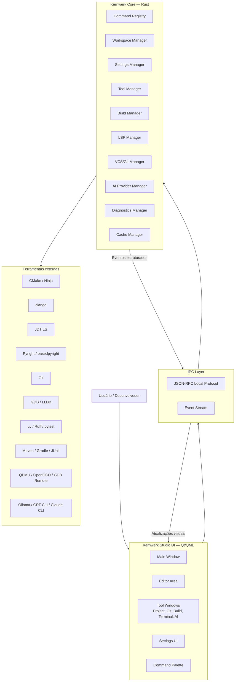
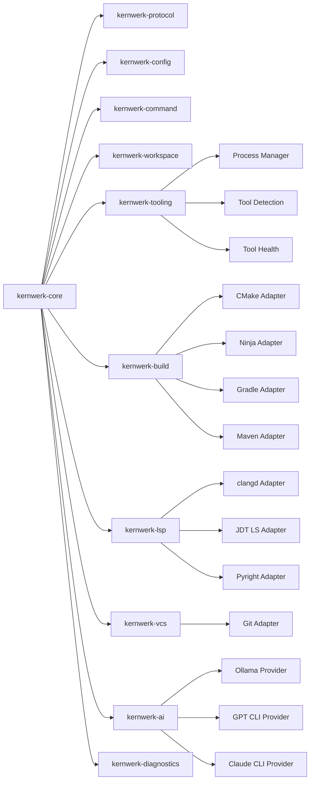
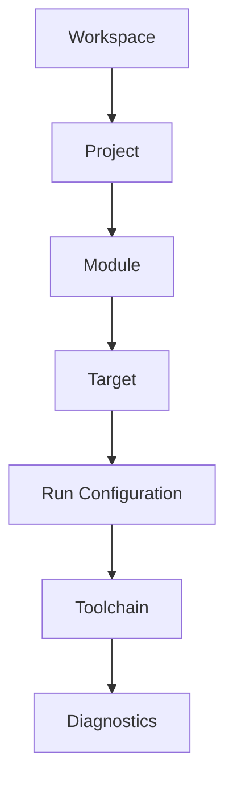
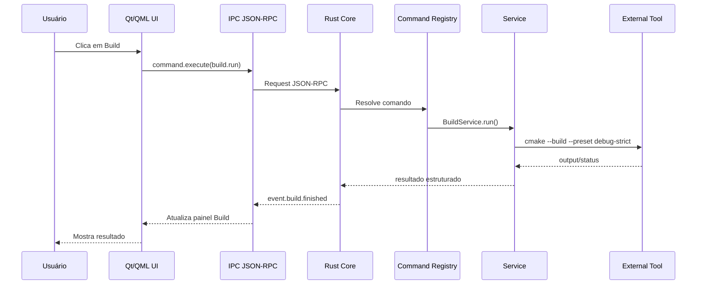
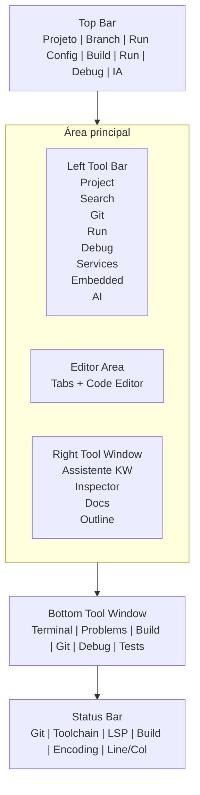
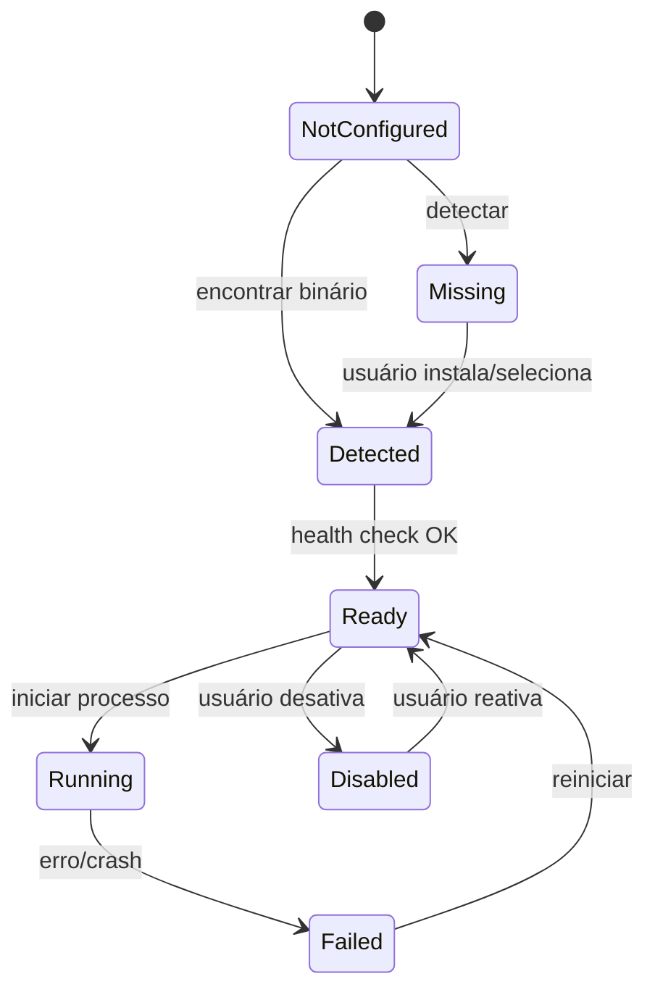
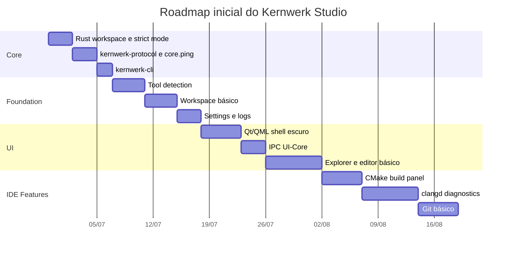

# Kernwerk Studio — Arquitetura Geral e Diretrizes Técnicas

> **Kernwerk Studio** é uma IDE open source, Linux-first, visualmente plug and play, rígida por padrão e focada em desenvolvimento moderno com C++, Java, Python, backend convencional e sistemas embarcados.

---

## 1. Identidade do projeto

| Item | Definição |
|---|---|
| Produto | **Kernwerk Studio** |
| Repositório | `kernwerk-studio` |
| Core | Rust |
| Frontend | Qt/QML |
| Comunicação | IPC local / JSON-RPC |
| Filosofia | Open source, Linux-first, strict by default, sem telemetria obrigatória |
| Usuário-alvo inicial | Desenvolvedor acostumado com JetBrains, Linux/KDE, C++, Java, Python, backend e embarcados |

---

## 2. Princípio central

O Kernwerk Studio **não deve reimplementar ferramentas maduras**.

A IDE deve atuar como uma camada visual, organizada, rigorosa e integrada sobre ferramentas open source consolidadas.

```text
A IDE não substitui clangd, CMake, Git, JDT LS, Pyright ou GDB.
A IDE orquestra essas ferramentas de forma visual, previsível e profissional.
```

---

## 3. Decisão arquitetural principal

A arquitetura do Kernwerk Studio deve separar claramente:

```text
Qt/QML Frontend  ← IPC/JSON-RPC local →  Rust Core
```

O frontend visual cuida da experiência de uso.  
O core Rust cuida da lógica, ferramentas, comandos, configurações, performance e integração.

---

## 4. Diagrama geral da arquitetura



---

## 5. Regra de dependência

Fluxo permitido:

```text
UI → IPC/Protocol → Core → Services → Adapters → External Tools
```

Fluxo proibido:

```text
UI → Git
UI → CMake
UI → clangd
UI → GDB
UI → GPT/Claude/Ollama
UI → lógica de strict mode
```

A UI não deve chamar ferramentas diretamente.

---

## 6. Responsabilidades por camada

### 6.1 Frontend Qt/QML

Responsável por:

- janela principal;
- menus;
- painéis;
- editor visual;
- command palette;
- atalhos;
- tema escuro;
- estados vazios;
- notificações;
- settings visual;
- interação com usuário.

Não deve ser responsável por:

- executar build;
- iniciar LSP;
- rodar Git;
- decidir toolchains;
- rodar IA;
- fazer parsing complexo;
- aplicar strict mode;
- manter regras de negócio.

---

### 6.2 IPC / Protocol

Responsável por:

- mensagens UI ↔ Core;
- JSON-RPC;
- eventos assíncronos;
- erros estruturados;
- versionamento de protocolo;
- schemas.

---

### 6.3 Rust Core

Responsável por:

- workspace;
- configurações;
- command system;
- integração com ferramentas externas;
- strict mode;
- build;
- LSP;
- Git;
- IA;
- diagnósticos;
- logs;
- cache;
- performance;
- validações.

---

### 6.4 Ferramentas externas

Ferramentas integradas, não reimplementadas:

| Área | Ferramentas |
|---|---|
| C++ | clangd, CMake, Ninja, clang-format, clang-tidy, GDB, LLDB |
| Java | Java 25 LTS, JDT LS, Maven, Gradle, JUnit, Checkstyle, SpotBugs, PMD |
| Python | uv, venv, Ruff, Pyright/basedpyright, pytest, mypy opcional |
| Backend | Docker/Podman Compose, OpenAPI, PostgreSQL, Redis, HTTP client |
| Embarcados | QEMU, OpenOCD, pyOCD, GDB remote, serial monitor, Yocto/Buildroot SDK |
| IA | Ollama, GPT CLI, Claude CLI, OpenAI/Anthropic/OpenRouter |

---

## 7. Diagrama de módulos do core



---

## 8. Estrutura inicial recomendada

```text
kernwerk-studio/
├── README.md
├── AGENTS.md
├── Cargo.toml
├── rust-toolchain.toml
├── deny.toml
├── .editorconfig
├── .gitignore
│
├── crates/
│   ├── kernwerk-core/
│   │   ├── Cargo.toml
│   │   └── src/
│   │       └── main.rs
│   │
│   ├── kernwerk-protocol/
│   │   ├── Cargo.toml
│   │   └── src/
│   │       └── lib.rs
│   │
│   ├── kernwerk-config/
│   │   ├── Cargo.toml
│   │   └── src/
│   │       └── lib.rs
│   │
│   └── kernwerk-cli/
│       ├── Cargo.toml
│       └── src/
│           └── main.rs
│
├── ui/
│   ├── README.md
│   └── qt-qml-placeholder.md
│
├── schemas/
│   ├── ipc.schema.json
│   ├── settings.schema.json
│   └── project.schema.json
│
├── templates/
│   ├── cpp-console-strict/
│   ├── cpp-qt-qml-strict/
│   ├── java-backend-strict/
│   ├── python-backend-strict/
│   └── embedded-linux-strict/
│
├── docs/
│   ├── ARCHITECTURE_OVERVIEW.md
│   ├── ENGINEERING_PRACTICES.md
│   ├── STRICT_TOOLCHAINS.md
│   ├── LAYOUT_AND_UX.md
│   ├── PERFORMANCE_RULES.md
│   ├── IPC_PROTOCOL.md
│   └── ROADMAP.md
│
└── prompts/
    └── GPT_TERMINAL_BOOTSTRAP.md
```

---

## 9. Modelo mental da IDE

Kernwerk Studio deve entender desenvolvimento como uma estrutura hierárquica:



Exemplo:

```text
Workspace: Trabalho
├── Projeto C++: firmware-simulator
│   ├── Target: app
│   ├── Target: tests
│   └── Config: Debug Strict
│
├── Projeto Java: api-industrial
│   ├── Module: backend
│   └── Config: Spring Dev
│
└── Projeto Python: tools
    ├── venv: .venv
    └── Config: pytest
```

---

## 10. Sistema de comandos

Tudo na IDE deve ser um comando.

Menus, atalhos, botões, command palette, plugins e IA devem chamar o mesmo sistema.

### Exemplos

```text
core.ping
workspace.open
workspace.reload
project.create
editor.openFile
editor.saveFile
editor.formatFile
symbol.rename
build.configure
build.run
debug.start
git.status
git.commit
ai.explainSelection
tools.detect
lsp.restart
settings.open
```

### Diagrama do fluxo de comando



---

## 11. Protocolo IPC

### Request

```json
{
  "jsonrpc": "2.0",
  "id": 1,
  "method": "core.ping",
  "params": {}
}
```

### Response

```json
{
  "jsonrpc": "2.0",
  "id": 1,
  "result": {
    "status": "ok",
    "message": "pong"
  }
}
```

### Event

```json
{
  "jsonrpc": "2.0",
  "method": "event.build.finished",
  "params": {
    "status": "failed",
    "errors": 1,
    "warnings": 0
  }
}
```

### Error

```json
{
  "jsonrpc": "2.0",
  "id": 2,
  "error": {
    "code": "TOOL_NOT_FOUND",
    "message": "clangd não foi encontrado",
    "details": {
      "tool": "clangd",
      "suggestedCommand": "sudo pacman -S clang"
    }
  }
}
```

---

## 12. Strict mode

O Kernwerk Studio deve ser rígido por padrão.

```text
Strict by default.
Relaxed only by explicit choice.
```

### Rust — Core da IDE

Obrigatório:

```bash
cargo fmt --all --check
cargo check --workspace --all-targets --all-features
cargo clippy --workspace --all-targets --all-features -- -D warnings
cargo test --workspace --all-features
```

Regras:

- `unsafe` proibido;
- warnings como erro;
- `unwrap` proibido fora de testes;
- `expect` proibido fora de testes;
- `panic!` proibido fora de testes;
- `todo!` proibido;
- `dbg!` proibido;
- erros explícitos;
- testes para módulos centrais.

---

### C++ Strict

Padrão para projetos gerados:

- C++23;
- CMakePresets;
- Ninja;
- `CMAKE_EXPORT_COMPILE_COMMANDS=ON`;
- clangd;
- clang-format;
- clang-tidy;
- warnings as errors;
- sanitizers em Debug;
- LTO em Release Hardened;
- CTest;
- Catch2/GoogleTest.

Warnings recomendados:

```text
-Wall
-Wextra
-Wpedantic
-Werror
-Wconversion
-Wsign-conversion
-Wshadow
-Wnon-virtual-dtor
-Wold-style-cast
-Wcast-align
-Wunused
-Woverloaded-virtual
-Wnull-dereference
-Wdouble-promotion
-Wformat=2
-Wimplicit-fallthrough
-Wundef
```

---

### Java Strict

Padrão:

- Java 25 LTS;
- Maven/Gradle;
- JDT LS;
- JUnit;
- Checkstyle;
- SpotBugs;
- PMD;
- Error Prone opcional;
- warnings fortes;
- testes por padrão.

---

### Python Strict

Padrão:

- uv;
- `.venv`;
- Ruff;
- Pyright/basedpyright strict;
- pytest;
- mypy opcional;
- `.env.example` para backend;
- sem instalação global por padrão.

---

## 13. Layout principal



### Atalhos JetBrains-like

```text
Shift Shift       Search Everywhere
Ctrl+Shift+A     Find Action
Alt+Enter        Quick Fix
Ctrl+B           Go to Definition
Ctrl+Alt+B       Go to Implementation
Ctrl+Alt+L       Format Code
Shift+F6         Rename
Ctrl+Shift+F     Search in Files
Ctrl+E           Recent Files
Alt+1            Project
Alt+4            Run/Build
Alt+5            Debug
Alt+9            Git
```

---

## 14. Regras de performance

Performance é requisito arquitetural, não etapa futura.

### Budgets iniciais

```text
Início do core:                  < 500 ms
Ping UI ↔ Core:                  < 50 ms
Abrir janela inicial:            < 1 s
Abrir projeto pequeno:           < 2 s
Resposta visual a clique:        imediata
Build bloquear UI:               proibido
IA bloquear editor:              proibido
LSP bloquear editor:             proibido
```

### Regra absoluta

A UI nunca executa trabalho pesado.

Trabalho pesado inclui:

- build;
- indexação;
- busca global;
- LSP;
- Git status grande;
- IA;
- análise estática;
- geração de documentação.

---

## 15. Ciclo de vida das ferramentas



Estados:

```text
NotConfigured
Missing
Detected
Ready
Running
Failed
Disabled
```

---

## 16. Política de IA

Padrão:

```text
IA local: permitida
IA externa: perguntar antes de enviar contexto
Telemetria: desligada
```

Regras:

1. nunca enviar projeto inteiro sem confirmação;
2. mostrar arquivos/trechos incluídos como contexto;
3. nunca logar API keys;
4. nunca executar comando destrutivo sugerido por IA sem confirmação;
5. permitir modo local-only;
6. permitir desativar IA completamente.

---

## 17. Roadmap inicial



> As datas são apenas um esqueleto para organização. O importante é a ordem técnica.

---

## 18. MVP 0.1

### Objetivo

Criar a base Rust do Kernwerk Studio com máximo rigor.

### Escopo

- `Cargo.toml` workspace;
- `rust-toolchain.toml`;
- `crates/kernwerk-core`;
- `crates/kernwerk-protocol`;
- `crates/kernwerk-config`;
- `crates/kernwerk-cli`;
- comando `core.ping`;
- testes unitários;
- fmt/clippy/check/test;
- logs básicos.

### Fora do escopo

- Qt/QML;
- editor;
- CMake;
- LSP;
- Git;
- IA;
- embarcados.

---

## 19. Prompt inicial para GPT/Claude no terminal

```text
Você está no projeto Kernwerk Studio.

Leia primeiro:

AGENTS.md
docs/ARCHITECTURE_OVERVIEW.md
docs/ENGINEERING_PRACTICES.md
docs/STRICT_TOOLCHAINS.md
docs/PERFORMANCE_RULES.md

Crie a base Rust workspace do projeto conforme a arquitetura definida.

Implemente apenas o MVP 0.1:
- kernwerk-core
- kernwerk-protocol
- kernwerk-config
- kernwerk-cli
- core.ping
- testes
- strict mode

Não implemente Qt ainda.
Não implemente LSP ainda.
Não implemente CMake ainda.
Não implemente Git ainda.
Não adicione dependências desnecessárias.
Não use unsafe.
Não use unwrap/expect/panic fora de testes.

Ao final, rode ou indique:

cargo fmt --all --check
cargo check --workspace --all-targets --all-features
cargo clippy --workspace --all-targets --all-features -- -D warnings
cargo test --workspace --all-features
```

---

## 20. Regra final

O Kernwerk Studio deve crescer por fundações sólidas:

```text
Core primeiro.
Protocolo segundo.
Comandos terceiro.
UI depois.
Ferramentas depois.
Recursos avançados por último.
```

A IDE deve ser bonita, mas a arquitetura deve ser mais importante que a aparência.

```text
Visual plug and play.
Core rígido.
Performance previsível.
Sem telemetria.
Sem acoplamento desnecessário.
Sem configuração manual excessiva.
```
