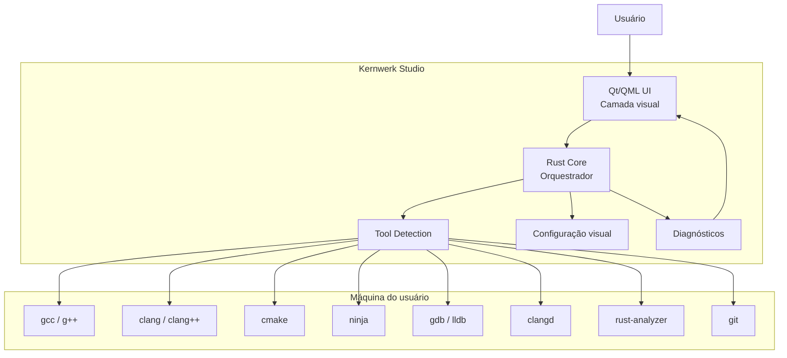
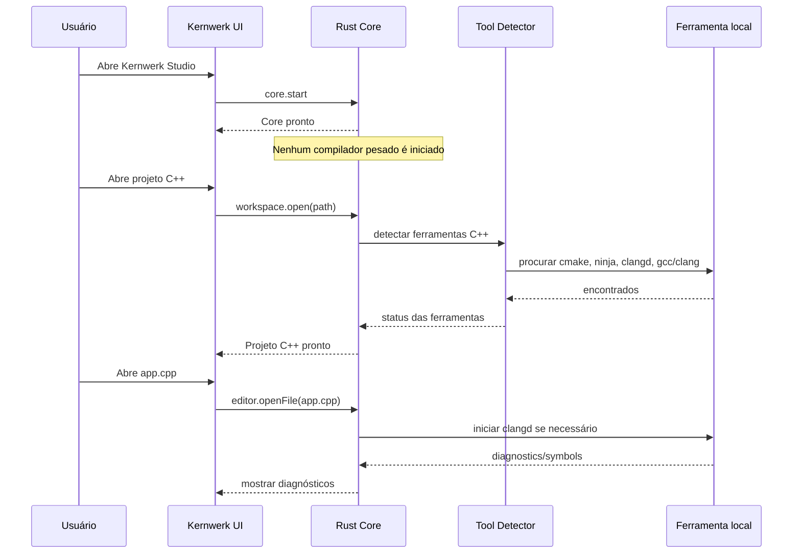
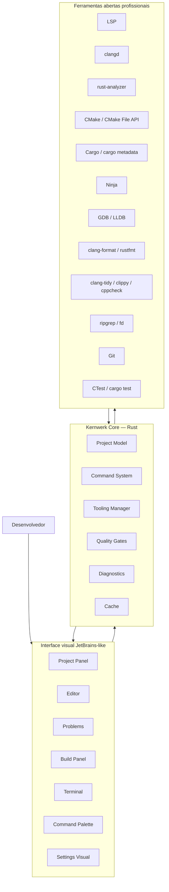
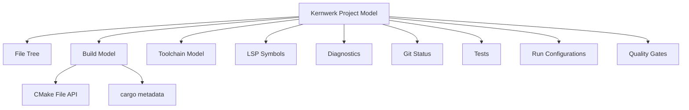
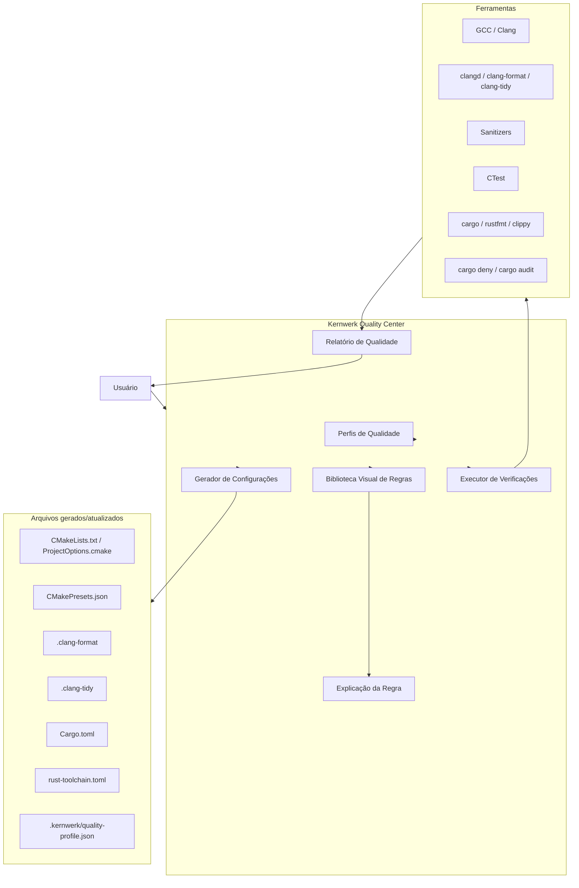
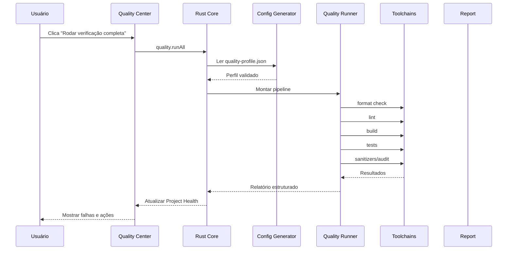

# Kernwerk Studio — Tooling, Toolchains e Quality Center

Este arquivo consolida três documentos centrais para o desenvolvimento inicial do Kernwerk Studio:

1. Política de toolchains e camada visual inteligente.
2. Núcleo C/C++/Rust com tooling profissional e suporte nativo a Qt/GTK.
3. Kernwerk Quality Center, Strict Modes e biblioteca visual de regras.

---

# Kernwerk Studio — Política de Toolchains e Camada Visual Inteligente

> Este documento define uma regra fundamental do Kernwerk Studio: a IDE não deve tentar ser o compilador, o debugger, o build system ou o servidor de linguagem. Ela deve ser uma **camada visual inteligente** sobre ferramentas reais instaladas na máquina do usuário.

---

## 1. Ideia central

O **Kernwerk Studio** deve funcionar como uma IDE profissional moderna:

```text
A IDE não compila por conta própria.
A IDE não substitui GCC, Clang, CMake, Ninja, GDB, LLDB, clangd, rust-analyzer, JDT LS ou Pyright.
A IDE detecta, configura, executa, monitora e apresenta essas ferramentas visualmente.
```

Em outras palavras:

```text
Kernwerk Studio = camada visual inteligente + orquestrador de ferramentas
```

A IDE deve facilitar o uso das ferramentas, não reimplementá-las.

---

## 2. Explicação simples

Quando o usuário instala uma IDE, ela **não precisa trazer todos os compiladores embutidos**.

O fluxo correto é:

```text
1. O usuário instala as ferramentas na própria máquina.
2. A IDE detecta essas ferramentas.
3. A IDE valida se elas funcionam.
4. A IDE cria ou lê configurações do projeto.
5. A IDE chama essas ferramentas quando necessário.
6. A IDE mostra o resultado de forma visual e compreensível.
```

Exemplo em C/C++:

```text
Usuário instala:
- gcc/g++
- clang/clang++
- cmake
- ninja
- gdb/lldb
- clangd

Kernwerk Studio:
- detecta essas ferramentas;
- cria/usa CMakePresets;
- chama CMake/Ninja para build;
- inicia clangd para inteligência de código;
- chama GDB/LLDB para debug;
- mostra erros, warnings, logs, símbolos e ações na interface.
```

Portanto, a IDE “pega emprestado” no sentido de **usar as ferramentas instaladas no sistema**, mas de forma controlada, visual e integrada.

O termo técnico correto é:

```text
toolchain local
```

Ou seja:

```text
A IDE usa a toolchain local instalada na máquina do usuário.
```

---

## 3. Diagrama geral



---

## 4. O que a IDE deve carregar ao iniciar

Ao abrir o Kernwerk Studio, ele deve carregar apenas o essencial:

```text
Kernwerk UI
Kernwerk Core
Tema
Settings
Command System
Lista de projetos recentes
Detecção leve de ambiente
```

A IDE **não deve iniciar automaticamente**:

```text
clangd
rust-analyzer
jdtls
pyright
cmake build
ninja
gdb
lldb
gradle
maven
docker
qemu
openocd
IA externa
IA local
```

Essas ferramentas só devem ser ativadas quando fizer sentido.

---

## 5. Ativação sob demanda

O Kernwerk Studio deve seguir a política:

```text
Lazy Tool Activation
```

Isso significa:

```text
Nenhuma ferramenta pesada deve iniciar apenas porque a IDE foi aberta.
Ferramentas são ativadas por projeto, arquivo ou ação explícita do usuário.
```

### Exemplos

| Situação | O que a IDE deve fazer |
|---|---|
| IDE aberta sem projeto | Não iniciar LSP, compilador ou debugger |
| Abrir projeto C++ | Detectar CMake, Ninja, clangd, gcc/clang |
| Abrir arquivo `.cpp` | Iniciar clangd se necessário |
| Abrir projeto Rust | Detectar Cargo, rust-analyzer, rustfmt, clippy |
| Abrir arquivo `.rs` | Iniciar rust-analyzer se necessário |
| Clicar em Build | Executar CMake/Ninja ou Cargo |
| Clicar em Debug | Iniciar GDB/LLDB |
| Usar IA | Chamar provider de IA sob demanda |

---

## 6. Diagrama de ativação sob demanda



---

## 7. O Kernwerk não deve embutir tudo

A IDE não deve ser distribuída como um pacote gigante contendo todos os compiladores, SDKs e ferramentas de todas as linguagens.

Isso seria pesado, difícil de manter e ruim para máquinas simples.

O comportamento correto é:

```text
Kernwerk Studio instala a IDE.
O usuário/sistema instala toolchains.
Kernwerk detecta e integra toolchains.
```

Exceção futura:

```text
A IDE pode oferecer assistentes para instalar ferramentas,
mas nunca deve instalar nada sem confirmação explícita.
```

---

## 8. Regra de ouro

```text
A IDE deve iniciar leve.
A IDE deve detectar o projeto.
A IDE deve ativar apenas o necessário.
A IDE deve usar as ferramentas da máquina.
A IDE deve mostrar tudo visualmente.
A IDE deve permitir configuração manual quando necessário.
```

---

## 9. Resumo técnico

O entendimento correto é:

```text
Kernwerk Studio não vem com todos os compiladores carregados.

O usuário instala ou já possui compiladores e ferramentas na máquina.

A IDE detecta essas ferramentas, valida se funcionam, cria ou lê configurações,
e passa a atuar como uma camada visual inteligente em tempo real.

Essa camada visual mostra build, erros, diagnósticos, Git, debug, terminal,
LSP, formatação, testes e IA sob demanda, sem carregar tudo desnecessariamente.
```

---

## 10. Decisão final do projeto

O Kernwerk Studio deve seguir oficialmente esta política:

```text
Kernwerk Studio is an intelligent visual orchestration layer over local toolchains.
```

Em português:

```text
Kernwerk Studio é uma camada visual inteligente de orquestração sobre toolchains locais.
```


---

# Kernwerk Studio — Núcleo C/C++/Rust, Tooling Profissional e Suporte Nativo a Qt/GTK

> Documento estratégico e técnico para orientar o desenvolvimento inicial do **Kernwerk Studio** como uma IDE Linux-first, open source, rígida por padrão e focada inicialmente em **C, C++ e Rust**, com integração visual profunda sobre ferramentas livres profissionais.

---

## 1. Visão central

O Kernwerk Studio não deve começar como uma IDE universal.

A prioridade inicial deve ser:

```text
C
C++
Rust
CMake
Cargo
Qt
GTK
Linux
Toolchains locais
Debug nativo
Qualidade rígida
Interface visual JetBrains-like
```

Java e Python podem vir depois. O foco inicial precisa ser fazer **C/C++/Rust muito bem**.

---

## 2. Frase que define o projeto

```text
Kernwerk Studio = professional open tooling + JetBrains-like visual experience.
```

Em português:

```text
Kernwerk Studio = ferramentas abertas profissionais com uma experiência visual familiar ao estilo JetBrains.
```

A IDE deve entregar:

```text
LSP
Tree-sitter futuramente
formatadores
linters
debuggers
ripgrep
fd
git
test runners
build tools
snippets
plugins futuramente
terminal integrado
+
camada visual inteligente
+
configuração pragmática
+
strict mode
+
desempenho
+
zero telemetria obrigatória
```

---

## 3. Tecnologias-base que tornam a IDE poderosa

A força do Kernwerk deve vir da integração profunda com ferramentas abertas maduras.

### 3.1 Linguagem e análise

```text
LSP
clangd
rust-analyzer
Tree-sitter futuramente
```

### 3.2 Build systems

```text
CMake
CMakePresets
CMake File API
Ninja
Cargo
cargo metadata
Make opcional
Meson futuramente
```

### 3.3 Formatação

```text
clang-format
rustfmt
qmlformat futuramente
```

### 3.4 Linters e análise estática

```text
clang-tidy
clippy
cppcheck
include-what-you-use futuramente
cargo deny
cargo audit
```

### 3.5 Debuggers

```text
GDB
LLDB
DAP futuramente
```

### 3.6 Busca e navegação

```text
ripgrep
fd
símbolos via LSP
busca no projeto
recent files
search everywhere
```

### 3.7 Test runners

```text
CTest
Catch2
GoogleTest
cargo test
cargo nextest futuramente
```

### 3.8 Terminal e comandos

```text
terminal integrado
shell do usuário
command palette
run configurations
build configurations
```

### 3.9 Snippets e templates

```text
snippets C/C++
snippets Rust
templates CMake
templates Cargo
templates Qt
templates GTK
```

---

## 4. Diagrama da filosofia técnica



---

## 5. Arquitetura recomendada

```text
Qt/QML Frontend  ← IPC/JSON-RPC local →  Rust Core
```

### 5.1 Frontend Qt/QML

Responsável por:

```text
interface
painéis
menus
atalhos
editor visual
tema
command palette
notificações
settings
layout
```

### 5.2 Rust Core

Responsável por:

```text
workspace
project model
tooling manager
command system
build manager
LSP manager
debug manager
quality gates
diagnostics
settings
cache
logs
IA sob demanda
```

### 5.3 Ferramentas externas

Responsáveis por:

```text
compilação
análise de código
debug
formatação
lint
testes
busca
versionamento
```

---

## 6. Project Model

O Kernwerk precisa de um modelo próprio do projeto.

Ele não deve substituir clangd ou rust-analyzer, mas deve combinar informações de várias fontes.

```text
Kernwerk Project Model
├── File Tree
├── Build Model
│   ├── CMake Model
│   └── Cargo Model
├── Toolchain Model
├── LSP Symbols
├── Diagnostics
├── Git Status
├── Tests
├── Run Configurations
├── Quality Gates
└── UI State
```



---

## 7. Entendimento profundo de C/C++

Para C/C++, o Kernwerk deve se basear em:

```text
CMakePresets.json
CMake File API
compile_commands.json
clangd
clang-tidy
clang-format
CTest
```

### 7.1 Fluxo ideal

```text
CMakePresets.json
↓
CMake configure
↓
CMake File API
↓
compile_commands.json
↓
clangd
↓
diagnósticos / navegação / refatoração
↓
Kernwerk UI
```

### 7.2 O que a IDE deve entender

```text
targets
sources
headers
include directories
compile definitions
compiler flags
build directories
artifacts
test targets
install targets
toolchain files
```

---

## 8. Entendimento profundo de Rust

Para Rust, o Kernwerk deve se basear em:

```text
Cargo.toml
Cargo.lock
cargo metadata
rust-analyzer
cargo check
cargo test
cargo clippy
cargo fmt
cargo deny
cargo audit
```

### 8.1 Fluxo ideal

```text
Cargo.toml
↓
cargo metadata
↓
rust-analyzer
↓
cargo check / clippy / test
↓
diagnósticos / navegação / refatoração
↓
Kernwerk UI
```

### 8.2 O que a IDE deve entender

```text
workspace
crates
packages
features
targets
bins
libs
examples
tests
benches
dependencies
dev-dependencies
build scripts
```

---

## 9. Suporte nativo a Qt

O Kernwerk Studio deve ter suporte nativo a Qt porque o próprio frontend usa Qt/QML e porque projetos C++ modernos frequentemente usam Qt.

### 9.1 Qt deve ser tratado como ecossistema de primeira classe

Suporte esperado:

```text
Qt Widgets
Qt Quick
QML
CMake + Qt6
AUTOMOC
AUTOUIC
AUTORCC
resources .qrc
.ui files
.qml files
.qss styles
Qt Designer integration futura
QML preview futura
qmlls
qmlformat
```

### 9.2 Templates Qt

A IDE deve gerar templates:

```text
Qt Widgets App
Qt Quick App
Qt Console Tool
Qt Library
Qt Plugin
Qt + CMake Strict
Qt + Tests
```

### 9.3 Painel Qt

```text
Qt
├── Version
├── Modules
│   ├── Core
│   ├── Gui
│   ├── Widgets
│   └── Quick
├── QML Files
├── Resources
├── UI Files
└── Tools
    ├── qmlls
    ├── qmlformat
    └── designer futuro
```

---

## 10. Suporte nativo a GTK

O Kernwerk também deve tratar GTK como ecossistema nativo, principalmente para Linux desktop.

### 10.1 GTK em C/C++

Suporte esperado:

```text
GTK4
gtkmm
pkg-config
CMake
Meson futuramente
GResource
Blueprint UI futuramente
GObject introspection futuramente
```

### 10.2 GTK em Rust

Suporte esperado:

```text
gtk-rs
glib
gio
gdk
relm4 opcional futuramente
cargo
pkg-config
```

### 10.3 Templates GTK

```text
GTK4 C App
GTK4 C++/gtkmm App
GTK4 Rust/gtk-rs App
GTK Library
GTK + Tests
```

---

## 11. Refatorações prioritárias

### 11.1 Refatorações vindas do LSP

Para C/C++:

```text
rename symbol
go to definition
find references
hover
quick fixes
organize includes
semantic highlighting
```

Para Rust:

```text
rename
go to definition
find references
extract variable/function quando suportado
inline hints
module navigation
trait/impl navigation
```

### 11.2 Refatorações próprias do Kernwerk

#### C/C++

```text
criar par .hpp/.cpp
renomear arquivo e atualizar includes
mover arquivo e atualizar CMake
criar novo target CMake
adicionar arquivo ao target
criar teste para classe/função
converter projeto simples para CMakePresets
adicionar clang-format
adicionar clang-tidy
adicionar sanitizers
adicionar Catch2/GoogleTest
```

#### Rust

```text
criar módulo
renomear módulo e atualizar mod/use
criar crate em workspace
criar bin/lib/test/example
adicionar feature
adicionar teste
rodar cargo fmt/clippy/test
adicionar cargo deny
adicionar cargo audit
```

#### Qt

```text
adicionar módulo Qt
criar QML file
criar resource .qrc
adicionar arquivo ao qt_add_executable
criar tela básica
criar componente QML
```

#### GTK

```text
criar template GTK
adicionar pkg-config ao CMake
criar resource
criar janela básica
adicionar dependência gtk-rs
```

---

## 12. Performance obrigatória

A IDE deve rodar bem em máquinas modestas.

Meta para C/C++/Rust:

```text
CPU: 2 cores
RAM: 8 GB
GPU integrada
Tela: 1366x768
```

Regras:

```text
não iniciar LSP sem projeto/arquivo relevante
não iniciar Java/Python em projeto C/C++/Rust
não iniciar IA automaticamente
não indexar tudo agressivamente
não renderizar árvores enormes sem virtualização
não rodar Git status sem debounce
não guardar logs infinitos em memória
não abrir painel direito por padrão em tela pequena
```

---

## 13. Dogfooding

O Kernwerk deve ser desenvolvido dentro do próprio Kernwerk.

### Etapas

```text
1. Desenvolver no CLion
2. Abrir o repositório no Kernwerk
3. Editar arquivos simples no Kernwerk
4. Rodar cargo check/test pelo Kernwerk
5. Rodar CMake/Qt build pelo Kernwerk
6. Usar rust-analyzer/clangd pelo Kernwerk
7. Fazer commits pelo Kernwerk
8. Desenvolver o Kernwerk principalmente no Kernwerk
```

Marco principal:

```text
Kernwerk Studio can build Kernwerk Studio.
```


---

# Kernwerk Studio — Quality Center, Strict Modes e Biblioteca Visual de Regras

> Este documento define o **Kernwerk Quality Center**, a área visual da IDE responsável por ativar, explicar, gerar e executar regras de qualidade para C, C++ e Rust, com foco em máxima rigidez pragmática, previsibilidade, ferramentas confiáveis e baixa ambiguidade.

---

## 1. Objetivo

O **Kernwerk Quality Center** deve permitir que o usuário ative modos rígidos e regras de qualidade sem precisar editar manualmente dezenas de flags, arquivos CMake, configurações de linters ou comandos de terminal.

A ideia central é:

```text
Configuração rígida por botões visuais,
mas gerando arquivos reais, legíveis e auditáveis.
```

O usuário deve conseguir:

```text
ativar strict mode;
ver o que cada regra faz;
entender o impacto;
ver qual ferramenta aplica a regra;
saber se a regra é ISO, compilador oficial ou ferramenta madura;
gerar CMake/Cargo/configs automaticamente;
rodar verificações completas por botão;
desativar regras conscientemente quando necessário.
```

---

## 2. Filosofia

O Kernwerk não deve inventar regras obscuras.

O Quality Center deve usar apenas:

```text
padrões da linguagem;
ferramentas oficiais;
compiladores consolidados;
LLVM/Clang;
Rust toolchain oficial;
CMake/CTest;
ferramentas open source maduras.
```

Nada experimental deve ser ativado por padrão.

---

## 3. Separação entre ISO e ferramentas

É importante não confundir:

```text
ISO C++ define a linguagem.
Compiladores fornecem diagnósticos e flags.
Ferramentas como clang-tidy/cppcheck fazem análise adicional.
Sanitizers detectam problemas em tempo de execução.
```

Portanto, o Quality Center deve classificar regras em níveis de confiança.

---

## 4. Níveis de confiança

Cada regra deve ter um campo `Trust Level`.

```text
1. ISO / Standard
2. Compiler official
3. LLVM toolchain
4. Rust official
5. CMake official
6. Mature open source
7. Optional advanced
8. Experimental
```

Por padrão, o Kernwerk deve ativar apenas:

```text
ISO / Standard
Compiler official
LLVM toolchain
Rust official
CMake official
Mature open source
```

Nada `Experimental` deve ser ligado por padrão.

---

## 5. Diagrama geral do Quality Center



---

## 6. Perfis de qualidade

O Quality Center deve oferecer perfis prontos.

### 6.1 Learning

Para iniciante.

```text
warnings fortes
sem warnings como erro
formatador
build simples
diagnósticos explicativos
```

Uso:

```text
aprendizado
primeiros projetos
código experimental
```

---

### 6.2 Balanced

Para uso geral.

```text
-Wall
-Wextra
-Wpedantic
formatador
clangd
CMakePresets
CTest opcional
sem agressividade extrema
```

Uso:

```text
projetos pessoais comuns
projetos de estudo
usuários que não querem travar por todo warning
```

---

### 6.3 Strict / ISO Pedantic

Perfil principal para o autor do Kernwerk.

```text
C++ padrão explícito
sem extensões do compilador
pedantic errors
warnings como erro
conversion warnings
shadow warnings
format obrigatório
sanitizers no Debug
compile_commands.json obrigatório
CMakePresets obrigatório
```

Uso:

```text
projetos novos
código sério
desenvolvimento pessoal rígido
Kernwerk Studio
```

---

### 6.4 Safety Hardened

Perfil mais agressivo para encontrar bugs.

```text
Strict / ISO Pedantic
+ sanitizers fortes
+ clang-tidy bugprone
+ cppcheck
+ testes obrigatórios
+ análise estática mais profunda
```

Uso:

```text
código crítico
bibliotecas
módulos sensíveis
pré-release
```

---

### 6.5 Embedded Strict

Perfil para embarcados.

```text
toolchain explícita
target explícito
warnings fortes
map file
flags de tamanho
sem exceções opcional
sem RTTI opcional
sem alocação dinâmica opcional
```

Observação:

```text
-fno-exceptions e -fno-rtti não são ISO puro.
São decisões de ambiente/ABI e devem ser opcionais, bem explicadas.
```

---

### 6.6 Performance Analysis

Perfil para investigar performance.

```text
Release com símbolos
RelWithDebInfo
LTO opcional
perf
heaptrack
benchmark target
profiling
```

Uso:

```text
otimização
profiling
análise de gargalos
```

---

## 7. Biblioteca visual de regras

Cada regra deve conter:

```text
nome
descrição
categoria
ferramenta usada
arquivo/configuração gerada
flags/comandos gerados
nível de confiança
impacto
quando usar
quando evitar
ativada por padrão em quais perfis
```

---

## 8. Categorias de regras C/C++

### 8.1 ISO / Standard Compliance

Regras ligadas diretamente à intenção de seguir C++ padrão e evitar extensões específicas.

```text
C++ standard explícito
CMAKE_CXX_STANDARD_REQUIRED ON
CMAKE_CXX_EXTENSIONS OFF
-Wpedantic
-pedantic-errors
CMakePresets obrigatório
compile_commands.json obrigatório
```

#### Exemplo de regra

```text
Nome:
Desativar extensões do compilador

O que faz:
Força o projeto a usar C++ padrão, evitando extensões específicas de GCC, Clang ou MSVC.

Configuração gerada:
set(CMAKE_CXX_EXTENSIONS OFF)

Nível:
ISO / Standard

Recomendado:
Sim para projetos novos.

Quando evitar:
Quando o projeto depende conscientemente de extensões específicas do compilador.
```

---

### 8.2 Compiler Strictness

Regras de compilador para evitar código permissivo.

```text
-Wall
-Wextra
-Werror
-Wconversion
-Wsign-conversion
-Wshadow
-Wformat=2
-Wundef
-Wnull-dereference
-Wold-style-cast
-Wnon-virtual-dtor
-Woverloaded-virtual
-Wdouble-promotion
-Wimplicit-fallthrough
```

#### Exemplo de regra

```text
Nome:
-Wconversion

O que faz:
Avisa sobre conversões implícitas que podem alterar valor, sinal ou precisão.

Ferramenta:
GCC/Clang

Nível:
Compiler official

Impacto:
Pode gerar muitos avisos em código legado.

Recomendado:
Sim para projetos novos.

Quando evitar:
Ao importar código legado ou bibliotecas externas que não seguem esse padrão.
```

---

### 8.3 Runtime Safety

Regras para encontrar problemas em tempo de execução.

```text
AddressSanitizer
UndefinedBehaviorSanitizer
ThreadSanitizer
LeakSanitizer
Valgrind
```

#### Exemplo de regra

```text
Nome:
AddressSanitizer

O que faz:
Detecta erros de memória em tempo de execução, como use-after-free, buffer overflow e acessos inválidos.

Ferramenta:
Clang/GCC Sanitizers

Nível:
Compiler official / Mature open source

Impacto:
Aumenta consumo de memória e reduz performance durante execução.

Recomendado:
Sim em Debug.

Quando evitar:
Release final, ambientes muito limitados ou builds embarcados específicos.
```

---

### 8.4 Static Analysis

Análise estática adicional.

```text
clang-tidy recommended
clang-tidy bugprone
clang-tidy modernize
clang-tidy performance
clang-tidy readability
cppcheck
include-what-you-use
```

Por padrão:

```text
clang-tidy recommended pode ser sugerido.
cppcheck e IWYU devem ser opcionais.
```

---

### 8.5 Build Quality

```text
Ninja
CMakePresets
CMake File API
Debug Strict
Release Hardened
RelWithDebInfo
CTest
Export compile_commands.json
```

---

### 8.6 Testing

```text
CTest
Catch2
GoogleTest
Coverage
Test target obrigatório opcional
```

---

## 9. Categorias de regras Rust

### 9.1 Rust Official Strict

```text
rustfmt
clippy
deny warnings
forbid unsafe
cargo check
cargo test
```

### 9.2 Rust Security and Quality

```text
cargo deny
cargo audit
cargo nextest
cargo miri
cargo llvm-cov
cargo udeps
```

### 9.3 Exemplo de regra Rust

```text
Nome:
Forbid unsafe

O que faz:
Proíbe blocos unsafe no crate, salvo se a regra for explicitamente relaxada.

Configuração:
#![forbid(unsafe_code)]

Nível:
Rust official

Recomendado:
Sim para o Kernwerk Core.

Quando evitar:
Crates de baixo nível que precisam interagir com FFI, sistema operacional ou bibliotecas C.
```

---

## 10. Tela visual proposta

```text
Kernwerk Quality Center
────────────────────────────────────────────

Modo atual:
● Strict / ISO Pedantic

Perfis:
○ Learning
○ Balanced
● Strict / ISO Pedantic
○ Safety Hardened
○ Embedded Strict
○ Performance Analysis

Biblioteca de regras:
[✓] ISO C++ mode
[✓] Disable compiler extensions
[✓] Pedantic errors
[✓] Warnings as errors
[✓] Conversion warnings
[✓] Shadowing warnings
[✓] Format enforcement
[✓] Sanitizers in Debug
[ ] clang-tidy full analysis
[ ] cppcheck
[ ] include-what-you-use
[ ] Valgrind
[ ] Coverage
[ ] Performance profiler

Painel lateral:
- O que faz
- Por que usar
- Ferramenta usada
- Configuração gerada
- Impacto
- Quando evitar
- Nível de confiança
```

---

## 11. Botões principais

```text
[Ativar Strict ISO]
[Ativar Sanitizers]
[Rodar Quality Check]
[Formatar projeto]
[Analisar com clang-tidy]
[Rodar testes]
[Gerar relatório]
[Explicar falha]
```

Botão principal:

```text
[Rodar verificação completa]
```

Para C/C++:

```text
CMake configure
Build
clang-format check
clang-tidy
CTest
Sanitizers se aplicável
```

Para Rust:

```text
cargo fmt --check
cargo check
cargo clippy
cargo test
cargo deny
cargo audit
```

---

## 12. Arquivo de perfil do Kernwerk

A IDE deve salvar o perfil em:

```text
.kernwerk/quality-profile.json
```

Exemplo:

```json
{
  "profile": "strict-iso-pedantic",
  "language": "cpp",
  "standard": "c++23",
  "compilerExtensions": false,
  "warningsAsErrors": true,
  "pedanticErrors": true,
  "sanitizers": {
    "address": true,
    "undefinedBehavior": true,
    "thread": false,
    "leak": false
  },
  "staticAnalysis": {
    "clangTidy": "recommended",
    "cppcheck": false,
    "includeWhatYouUse": false
  },
  "formatting": {
    "clangFormat": true
  },
  "testing": {
    "ctest": true,
    "framework": "catch2"
  }
}
```

---

## 13. Arquivos que podem ser gerados

Para C/C++:

```text
CMakeLists.txt
CMakePresets.json
cmake/ProjectOptions.cmake
cmake/Warnings.cmake
cmake/Sanitizers.cmake
.clang-format
.clang-tidy
CTestTestfile.cmake
```

Para Rust:

```text
Cargo.toml
rust-toolchain.toml
deny.toml
.cargo/config.toml
```

Para Kernwerk:

```text
.kernwerk/quality-profile.json
.kernwerk/toolchains.json
.kernwerk/run-configs.json
```

---

## 14. Exemplo de CMake Strict gerado

```cmake
add_library(project_options INTERFACE)

target_compile_features(project_options INTERFACE cxx_std_23)

if(CMAKE_CXX_COMPILER_ID MATCHES "Clang|GNU")
    target_compile_options(project_options INTERFACE
        -Wall
        -Wextra
        -Wpedantic
        -pedantic-errors
        -Werror
        -Wconversion
        -Wsign-conversion
        -Wshadow
        -Wformat=2
        -Wundef
        -Wnull-dereference
        -Wold-style-cast
        -Wnon-virtual-dtor
        -Woverloaded-virtual
        -Wdouble-promotion
        -Wimplicit-fallthrough
    )
endif()
```

---

## 15. Regra importante sobre código de terceiros

O Kernwerk não deve aplicar `-Werror` agressivo em dependências externas.

Regra:

```text
Warnings as errors devem valer para o código do projeto, não para bibliotecas de terceiros.
```

Quando possível, includes de terceiros devem ser tratados como `SYSTEM`.

---

## 16. Diagrama de execução de Quality Check



---

## 17. Regra de clareza para IA

Para evitar confusão de agentes como Claude/Codex/GPT, este documento deve ser interpretado assim:

```text
Não inventar regras desconhecidas.
Não usar flags experimentais por padrão.
Não usar ferramentas obscuras.
Não tratar clang-tidy/cppcheck como se fossem ISO.
Não ativar tudo sem explicar impacto.
Não aplicar regras agressivas em dependências externas.
Não quebrar projeto legado sem confirmação.
```

---

## 18. Decisão final

O **Kernwerk Quality Center** deve ser um recurso central da IDE.

Ele existe para transformar configuração rígida em uma experiência visual clara:

```text
menos configuração manual;
mais qualidade;
mais explicação;
mais controle;
mais previsibilidade;
menos permissividade acidental.
```

A meta é permitir que o usuário use C/C++/Rust com rigor profissional, sem decorar todas as flags e sem depender de ferramentas obscuras.

```text
Strict mode deve ser visual, auditável, explicável e gerador de configuração real.
```
