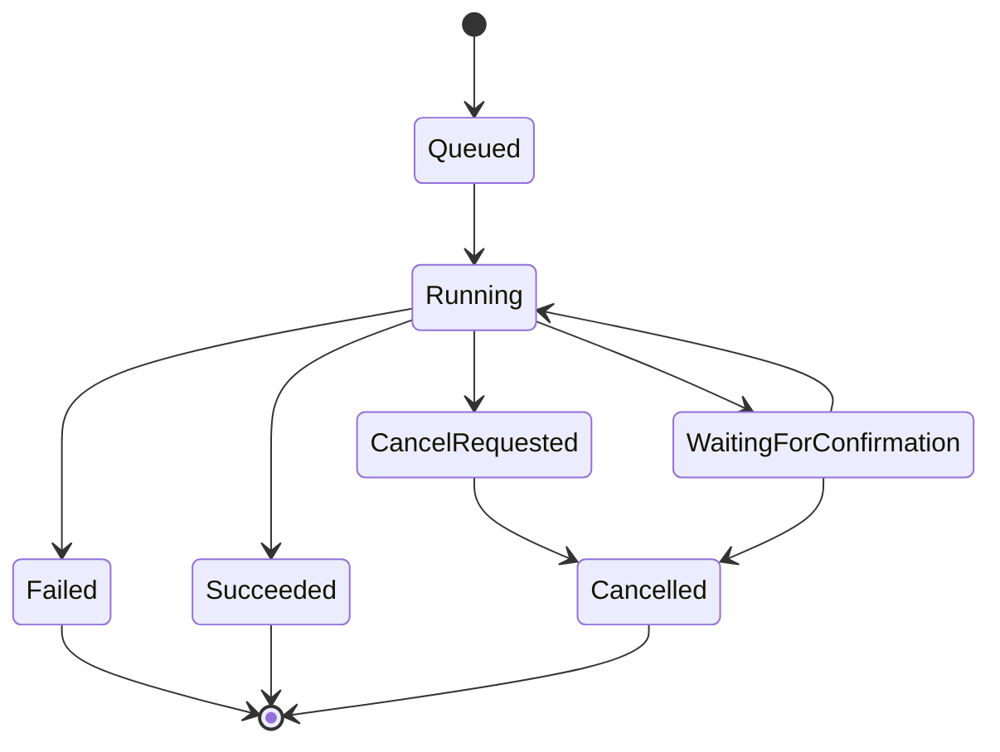

# Kernwerk Studio — Professional Subsystems Master

Este documento consolida os subsistemas profissionais adicionais do Kernwerk Studio.


---

# TASK_MANAGER.md


# Kernwerk Studio — Task Manager e Background Job System

> Este documento define o sistema de tarefas em background do Kernwerk Studio. Toda IDE profissional precisa de uma camada central para controlar build, testes, LSP, Git, busca, deploy, debug, QEMU, serial, quality checks e IA sob demanda.

---

## 1. Objetivo

O Kernwerk não deve permitir que cada módulo execute processos do seu próprio jeito.

Sem um Task Manager central, o projeto tende a virar:

```text
Build executa processo de um jeito.
Git executa processo de outro jeito.
LSP executa processo de outro jeito.
Remote SSH executa processo de outro jeito.
Quality Center executa processo de outro jeito.
```

O comportamento profissional deve ser:

```text
Command
↓
Task Manager
↓
Process Runner
↓
Logs
↓
Events
↓
UI
```

---

## 2. Responsabilidades

O Task Manager deve controlar:

```text
tarefas em execução;
tarefas pendentes;
progresso;
cancelamento;
prioridade;
dependência entre tarefas;
logs;
stdout/stderr;
status final;
erros;
tempo de execução;
limite de paralelismo;
notificações;
integração com UI.
```

Exemplos de tarefas:

```text
CMake Configure
CMake Build
Cargo Check
Cargo Test
clangd Indexing
rust-analyzer Startup
Git Status
Search in Files
Quality Check
Remote Deploy
Remote Run
QEMU Start
Serial Open
AI Explain Build Error
```

---

## 3. Tipos de tarefa

```text
Foreground Task:
Tarefa visível para o usuário, normalmente com barra de progresso ou painel aberto.

Background Task:
Tarefa silenciosa, mas visível no status bar/task list.

Long Running Task:
Tarefa que pode durar bastante, como build, test, indexação ou deploy.

Cancelable Task:
Tarefa que pode ser cancelada com segurança.

Critical Task:
Tarefa que não deve ser interrompida sem confirmação, como flash de firmware.

Dangerous Task:
Tarefa que pode modificar sistema remoto, apagar arquivos ou resetar target.
```

---

## 4. Modelo de estado



Estados:

```text
Queued
Running
WaitingForConfirmation
Succeeded
Failed
CancelRequested
Cancelled
Skipped
```

---

## 5. Estrutura de Task

Modelo conceitual:

```json
{
  "id": "task-2026-0001",
  "commandId": "build.run",
  "title": "CMake Build",
  "category": "Build",
  "status": "Running",
  "progress": {
    "kind": "indeterminate",
    "percent": null
  },
  "startedAt": "2026-07-03T18:00:00Z",
  "workspace": "/home/user/project",
  "canCancel": true,
  "safety": "Safe",
  "logsRef": "build/task-2026-0001.log"
}
```

---

## 6. Eventos

Toda tarefa deve emitir eventos.

```text
task.queued
task.started
task.progress
task.output
task.warning
task.error
task.confirmationRequired
task.cancelRequested
task.cancelled
task.failed
task.succeeded
task.finished
```

Esses eventos alimentam:

```text
status bar;
task list;
build panel;
problems panel;
notifications;
logs locais;
relatórios.
```

---

## 7. Limite de paralelismo

O Kernwerk deve evitar sobrecarga.

Regras iniciais:

```text
No máximo 1 build pesado por workspace.
No máximo 1 quality check por workspace.
No máximo 1 deploy por target.
Git status deve ter debounce.
Busca global deve ser cancelável.
LSP não deve ser reiniciado repetidamente.
IA nunca deve bloquear build/editor.
```

Configuração futura:

```json
{
  "maxConcurrentTasks": 4,
  "maxConcurrentBuilds": 1,
  "maxConcurrentRemoteTasks": 2,
  "maxConcurrentSearches": 1
}
```

---

## 8. Cancelamento

Tarefas canceláveis devem receber cancelamento de forma controlada.

Exemplos canceláveis:

```text
build;
test;
search;
quality check;
deploy;
AI request;
QEMU run;
remote command.
```

Exemplos com cuidado:

```text
flash firmware;
update remoto;
operação com sudo;
migração de arquivo.
```

Regra:

```text
Se cancelar uma tarefa pode deixar o sistema em estado inconsistente, exigir confirmação.
```

---

## 9. Integração com Process Runner

O Task Manager não deve executar processos diretamente de forma solta.

Deve existir um Process Runner responsável por:

```text
spawn de processo;
captura stdout/stderr;
working directory;
environment;
timeout;
exit code;
kill/cancel;
logs;
máscara de segredos;
normalização de erro.
```

Exemplo de comando estruturado:

```json
{
  "program": "cargo",
  "args": ["check", "--workspace", "--all-targets", "--all-features"],
  "workingDirectory": "/home/user/kernwerk-studio",
  "environment": {},
  "timeoutSeconds": 600
}
```

---

## 10. UI profissional de tarefas

A UI deve ter:

```text
Status Bar com tarefas ativas.
Task Popup com lista de tarefas.
Build Panel para tarefas de build.
Quality Panel para quality checks.
Remote Panel para deploy/run/debug.
Notifications para sucesso/falha.
Logs clicáveis.
Botão Cancel quando permitido.
```

Exemplo visual:

```text
Tasks
────────────────────────────────────
● CMake Build                43%
● clangd indexing            background
✓ Git status                 120 ms
✗ Quality Check              2 errors
○ Remote Deploy              waiting
```

---

## 11. Regras para IA

IA pode sugerir iniciar tarefa, mas não deve iniciar ação perigosa sozinha.

```text
IA pode sugerir: Rodar cargo test.
IA pode sugerir: Explicar erro de build.
IA pode sugerir: Rodar clang-format check.
IA não pode sozinha: git reset --hard.
IA não pode sozinha: rm -rf.
IA não pode sozinha: flash firmware.
IA não pode sozinha: reboot target.
```

---

## 12. Critérios de aceite

O Task Manager estará pronto para MVP quando:

```text
registrar tarefa;
executar processo externo;
capturar stdout/stderr;
emitir eventos;
mostrar status no CLI;
cancelar tarefa simples;
gerar log local;
não travar UI/Core;
tratar erro sem panic;
mascarar segredos básicos.
```

---

## 13. Decisão final

O Task Manager é obrigatório antes de UI avançada.

Sem ele, a IDE vira um conjunto de botões executando scripts.  
Com ele, o Kernwerk se comporta como uma IDE profissional.


---

# UI_DESIGN_SYSTEM.md


# Kernwerk Studio — UI Design System

> Este documento define o sistema visual do Kernwerk Studio. A interface deve ser rígida, previsível, confortável, JetBrains-like em memória muscular, mas sem copiar assets, marca, layout proprietário ou identidade visual de qualquer empresa.

---

## 1. Objetivo

O Kernwerk precisa de uma UI consistente.

Uma IDE profissional não deve ter telas improvisadas. Todos os painéis, botões, badges, menus, toolbars e diálogos devem seguir um Design System.

Regra:

```text
Nenhuma tela deve criar componente visual improvisado fora do Design System.
```

---

## 2. Princípios visuais

```text
consistência;
baixa fadiga visual;
alta previsibilidade;
densidade ajustável;
atalhos fortes;
painéis estáveis;
pouca animação;
sem layout mágico;
tema escuro confortável;
suporte a tela pequena;
sem telemetria visual/distrações.
```

O usuário deve sentir:

```text
"Eu sei onde as coisas ficam."
"Eu consigo usar por horas."
"Eu consigo operar por teclado."
"Eu entendo o que a IDE está fazendo."
```

---

## 3. Tokens visuais

Tokens são valores oficiais do design.

### 3.1 Cores

A paleta deve ser definida por tokens, não valores soltos.

```text
kw.bg.0          fundo principal
kw.bg.1          painéis
kw.bg.2          superfície elevada
kw.border.0      borda suave
kw.text.0        texto principal
kw.text.1        texto secundário
kw.text.disabled texto desabilitado
kw.accent        cor de destaque
kw.warning       aviso
kw.error         erro
kw.success       sucesso
kw.info          informação
```

Nenhuma tela deve usar cor direta sem passar por token.

---

## 4. Tipografia

Definir:

```text
fonte da UI;
fonte do editor;
tamanho padrão;
tamanho compacto;
altura de linha;
peso de fonte;
tamanho mínimo.
```

Sugestões:

```text
UI: Inter, Noto Sans ou system font.
Editor: JetBrains Mono, Fira Code, Cascadia Code ou monospace do sistema.
```

Regra:

```text
A fonte do editor deve ser configurável.
```

---

## 5. Espaçamento

Tokens:

```text
space.1 = 4px
space.2 = 8px
space.3 = 12px
space.4 = 16px
space.5 = 24px
```

Tamanhos importantes:

```text
top bar: 40px
status bar: 24px
sidebar compacta: 44px
painel mínimo: 240px
altura de item em lista compacta: 28px
altura de item confortável: 34px
```

---

## 6. Componentes oficiais

Componentes básicos:

```text
KButton
KIconButton
KToggle
KCheckbox
KRadio
KTextField
KSelect
KTooltip
KDialog
KMenu
KContextMenu
KNotification
KBadge
KStatusBadge
KProgressBar
KSpinner
```

Componentes de IDE:

```text
KToolWindow
KPanel
KPanelHeader
KTabBar
KEditorTab
KProjectTree
KProblemItem
KBuildOutput
KTerminalPanel
KCommandPalette
KSettingsRow
KToolStatusCard
KTaskItem
KRunConfigSelector
KQualityRuleCard
```

---

## 7. Estados dos componentes

Todo componente interativo deve ter estados:

```text
default
hover
active
focused
disabled
loading
danger
selected
error
warning
success
```

Regra:

```text
Estado de foco deve ser visível para navegação por teclado.
```

---

## 8. Layout base

Layout desktop:

```text
┌──────────────────────────────────────────────────────────────┐
│ Top Bar                                                      │
├────┬───────────────────────────────┬─────────────────────────┤
│    │ Editor Tabs                   │ Right Panel             │
│Bar │ Editor                        │ Inspector / AI / Docs   │
│    │                               │                         │
├────┴───────────────────────────────┴─────────────────────────┤
│ Terminal | Problems | Build | Git | Debug | Tasks | Tests     │
├──────────────────────────────────────────────────────────────┤
│ Status Bar                                                   │
└──────────────────────────────────────────────────────────────┘
```

Tela pequena:

```text
Right Panel fechado por padrão.
Bottom panel com altura reduzida.
Sidebar compacta.
Command Palette como acesso principal.
```

---

## 9. Painéis fixos

Painéis principais:

```text
Project
Search
Git
Run
Debug
Embedded & Remote
Quality
Tasks
Settings
```

Regra:

```text
A IDE não deve mover painéis automaticamente sem confirmação.
```

Ela pode sugerir:

```text
Detectamos tela pequena. Deseja ativar layout compacto?
```

---

## 10. Atalhos e memória muscular

Atalhos padrão:

```text
Shift Shift       Search Everywhere
Ctrl+Shift+A     Find Action
Alt+Enter        Quick Fix
Ctrl+B           Go to Definition
Ctrl+Alt+B       Go to Implementation
Ctrl+Alt+L       Format Code
Shift+F6         Rename
Ctrl+Shift+F     Search in Files
Ctrl+E           Recent Files
Alt+1            Project
Alt+4            Run/Build
Alt+5            Debug
Alt+9            Git
```

Regra:

```text
Todos os atalhos devem chamar comandos registrados no Command System.
```

---

## 11. Tema escuro confortável

Regras:

```text
não usar preto puro em tudo;
não usar branco puro em texto longo;
evitar amarelo forte em grandes áreas;
usar contraste suficiente;
não depender só de cor para erro;
usar ícone + texto + cor;
permitir ajuste de fonte;
permitir reduzir animações.
```

---

## 12. Animações

Animações devem ser discretas.

Permitido:

```text
fade suave;
expansão de painel curta;
hover leve.
```

Evitar:

```text
animações longas;
efeitos chamativos;
movimento constante;
transições que atrasam trabalho.
```

Configuração:

```text
Reduce Motion: on/off
```

---

## 13. Quality Center visual

Regras visuais:

```text
cada regra tem card;
cada regra mostra Trust Level;
cada regra tem explicação;
cada regra mostra impacto;
cada regra mostra arquivos gerados;
cada regra mostra quando evitar.
```

Exemplo:

```text
[✓] Pedantic errors
Trust: Compiler official
Impact: High strictness
Generated: -Wpedantic -pedantic-errors
```

---

## 14. Embedded & Remote visual

Painel deve separar:

```text
Targets
Toolchains
Deploy
Debug
Serial
QEMU
SDKs
Logs
```

Ações perigosas devem usar estilo danger e confirmação.

---

## 15. Critérios de aceite

O Design System está pronto para MVP quando:

```text
tokens existem;
componentes básicos existem;
layout base existe;
tema escuro existe;
status bar existe;
task item existe;
problem item existe;
settings row existe;
nenhuma tela usa cor hardcoded sem token;
atalhos passam pelo command system.
```

---

## 16. Decisão final

A UI do Kernwerk deve ser rígida como o Core.

Uma interface bonita sem sistema vira bagunça.  
Uma interface com Design System consegue crescer com consistência.


---

# EDITOR_ENGINE.md


# Kernwerk Studio — Editor Engine

> Este documento define como o editor de texto/código do Kernwerk deve ser tratado. O editor é o coração visual da IDE e deve evoluir com cuidado, sem tentar ser perfeito antes do Core estar sólido.

---

## 1. Objetivo

O editor do Kernwerk deve permitir editar código com segurança, integrar LSP, mostrar diagnósticos, oferecer ações de código e manter performance.

Regra inicial:

```text
No MVP, editor simples.
No futuro, editor robusto.
Não tentar criar um editor perfeito antes do Core, Commands, Tooling e Quality funcionarem.
```

---

## 2. Escopo do MVP

O editor inicial deve suportar:

```text
abrir arquivo;
editar texto;
salvar arquivo;
salvar como;
número de linha;
posição linha/coluna;
abas de arquivo;
detecção de alteração externa básica;
diagnóstico visual simples;
atalhos principais;
integração mínima com comandos.
```

Fora do MVP:

```text
multi-cursor;
minimap;
semantic highlighting completo;
folding avançado;
refatoração avançada;
editor de diff avançado;
renderização otimizada para arquivos gigantes.
```

---

## 3. Modelo de documento

Todo arquivo aberto deve virar um `EditorDocument`.

Campos conceituais:

```json
{
  "id": "doc-1",
  "path": "src/main.cpp",
  "language": "cpp",
  "encoding": "utf-8",
  "lineEnding": "LF",
  "isDirty": true,
  "isReadOnly": false,
  "version": 12,
  "lastSavedVersion": 10
}
```

Regra:

```text
Todo documento deve ter versão incremental para integração com LSP.
```

---

## 4. Encoding e line endings

A IDE deve lidar com:

```text
UTF-8;
UTF-8 com BOM;
line endings LF;
line endings CRLF;
arquivo sem newline final;
arquivo read-only.
```

Comportamento profissional:

```text
não converter line endings silenciosamente;
mostrar status na barra;
permitir converter explicitamente;
preservar padrão existente quando possível.
```

---

## 5. Arquivos grandes

A IDE deve detectar arquivos grandes.

Exemplos de limites iniciais:

```text
> 1 MB: avisar sobre recursos pesados.
> 5 MB: desativar semantic highlighting.
> 10 MB: abrir em Large File Mode.
```

Large File Mode:

```text
sem semantic highlighting;
sem diagnostics em tempo real;
sem minimap;
busca simples;
edição básica;
salvar seguro.
```

Regra:

```text
Arquivo grande nunca deve travar a UI.
```

---

## 6. Undo/Redo

Undo/redo deve ser confiável.

Regras:

```text
cada documento tem sua própria stack;
salvar não deve limpar undo;
ações automáticas devem ser agrupadas;
refatoração deve ser uma transação reversível quando possível.
```

---

## 7. Integração com LSP

LSPs iniciais:

```text
clangd
rust-analyzer
```

Recursos via LSP:

```text
diagnostics;
completion;
hover;
go to definition;
find references;
rename;
code actions;
semantic tokens;
inlay hints.
```

Regra:

```text
O editor não deve implementar inteligência semântica própria de C++/Rust no início.
Ele deve consumir LSP.
```

---

## 8. Diagnostics inline

Diagnósticos devem aparecer de forma clara:

```text
sublinhado no código;
ícone na gutter;
mensagem no hover;
entrada no Problems panel;
atalho para próximo erro;
ação de quick fix quando disponível.
```

Severidades:

```text
Error
Warning
Info
Hint
```

---

## 9. Autocomplete

Autocomplete deve:

```text
ser acionado por LSP;
não bloquear digitação;
mostrar origem da sugestão;
ter navegação por teclado;
aceitar com Enter/Tab configurável;
fechar com Escape;
não abrir agressivamente em arquivo grande.
```

---

## 10. Hover

Hover deve mostrar:

```text
tipo;
documentação;
mensagem de diagnóstico;
origem da ferramenta;
ações disponíveis.
```

Regra:

```text
Hover deve ser útil, não intrusivo.
```

---

## 11. Code Actions

Code actions podem vir de:

```text
LSP;
Quality Center;
Kernwerk refactoring;
IA sob demanda.
```

Toda action que modifica arquivos deve passar pelo sistema de refatoração/diff.

---

## 12. Syntax Highlighting

MVP:

```text
highlight básico por linguagem;
fallback para plain text.
```

Futuro:

```text
Tree-sitter;
semantic tokens via LSP;
temas configuráveis;
injeção de linguagem;
QML/CMake/TOML/JSON/YAML.
```

---

## 13. Salvamento

Regras:

```text
salvar deve ser atômico quando possível;
não sobrescrever alteração externa sem avisar;
mostrar conflito de arquivo alterado fora da IDE;
permitir reload from disk;
permitir compare before overwrite.
```

---

## 14. Autosave

Autosave deve ser opcional.

Modos:

```text
off;
on focus lost;
after delay;
before build/run.
```

Regra:

```text
Autosave nunca deve esconder alterações críticas sem indicação visual.
```

---

## 15. Crash Recovery

O editor deve salvar estado de recuperação:

```text
arquivos abertos;
conteúdo não salvo;
posição do cursor;
abas;
layout.
```

Ao reiniciar após crash:

```text
Kernwerk detectou sessão não finalizada.
[Restaurar] [Descartar] [Comparar]
```

---

## 16. Diff Editor

Futuro necessário para:

```text
preview de refatoração;
generated files policy;
AI patches;
Git diff;
format changes;
Quality Center apply profile.
```

MVP pode começar com diff textual simples.

---

## 17. Critérios de aceite

Editor MVP pronto quando:

```text
abre/salva arquivo;
mostra abas;
marca dirty;
mostra linha/coluna;
preserva encoding/line ending básico;
integra diagnostics simples;
não trava em arquivo comum;
detecta alteração externa básica;
passa por command system.
```

---

## 18. Decisão final

O editor deve crescer por etapas.

Não sacrificar arquitetura do Kernwerk tentando criar editor perfeito cedo demais.


---

# SEARCH_AND_INDEXING.md


# Kernwerk Studio — Search, Navigation e Indexing Model

> Este documento define busca, navegação e indexação leve do Kernwerk Studio. A IDE deve ser rápida e útil sem criar um indexador pesado cedo demais.

---

## 1. Objetivo

O Kernwerk deve permitir encontrar rapidamente:

```text
arquivos;
texto;
símbolos;
comandos;
ações;
settings;
targets;
run configs;
quality rules;
documentação local.
```

O recurso central deve ser:

```text
Search Everywhere
```

---

## 2. Princípio

Usar ferramentas abertas maduras:

```text
ripgrep para texto;
fd para arquivos;
LSP para símbolos;
CMake File API para targets;
cargo metadata para crates;
Command Registry para ações;
Settings Registry para configurações.
```

Regra:

```text
Não criar indexador semântico próprio no MVP.
```

---

## 3. Tipos de busca

```text
File Search:
buscar arquivo por nome.

Text Search:
buscar texto no projeto.

Symbol Search:
buscar funções/classes/structs via LSP.

Command Search:
buscar comandos da IDE.

Settings Search:
buscar configurações.

Target Search:
buscar targets CMake/Cargo.

Recent Search:
arquivos recentes, comandos recentes, símbolos recentes.
```

---

## 4. Search Everywhere

A UI deve permitir:

```text
Shift Shift
```

Fontes:

```text
arquivos;
comandos;
símbolos;
targets;
settings;
recentes.
```

Resultado deve mostrar:

```text
ícone;
nome;
tipo;
caminho/contexto;
atalho;
ação.
```

Exemplo:

```text
main.cpp                       File       src/main.cpp
build.run                      Command    Build
KernwerkCore                   Symbol     crates/kernwerk-core
debug-strict                   CMake      Preset
Quality Center                 Setting    Tools > Quality
```

---

## 5. Respeitar ignores

Busca deve respeitar:

```text
.gitignore;
.ignore;
.kernwerkignore futuro;
configurações do usuário.
```

Ignorar por padrão:

```text
.git/
target/
build/
cmake-build-*/
node_modules/
.cache/
.idea/
.vscode/
dist/
out/
```

---

## 6. ripgrep

Text search deve usar `rg`.

Comandos conceituais:

```bash
rg "pattern" --json --hidden --glob '!target' --glob '!build'
```

Vantagens:

```text
rápido;
maduro;
respeita .gitignore;
saída estruturável;
funciona em projetos grandes.
```

---

## 7. fd

File search deve usar `fd`.

Comandos conceituais:

```bash
fd "main" .
```

A IDE pode também manter cache leve de file tree.

---

## 8. Símbolos via LSP

Para C/C++:

```text
clangd workspace/symbol
```

Para Rust:

```text
rust-analyzer workspace/symbol
```

Regra:

```text
Se LSP não estiver pronto, mostrar resultados parciais.
```

---

## 9. Cache leve

Cache permitido:

```text
lista de arquivos;
recent files;
recent commands;
últimos resultados de símbolos;
targets CMake/Cargo;
settings index.
```

Cache proibido no MVP:

```text
index semântico próprio profundo;
banco gigante;
indexação contínua agressiva.
```

---

## 10. File watcher

Mudanças no filesystem devem usar debounce.

Errado:

```text
arquivo mudou → reindexa tudo imediatamente
```

Certo:

```text
arquivo mudou
↓
agrupar eventos
↓
atualizar cache afetado
↓
notificar UI
```

---

## 11. Performance

Regras:

```text
busca cancelável;
não bloquear UI;
limite de resultados;
streaming de resultados;
não carregar arquivo inteiro gigante;
mostrar progresso em busca longa.
```

---

## 12. Interface de busca

Painel Search:

```text
campo de busca;
escopo;
case sensitive;
regex;
whole word;
include globs;
exclude globs;
resultados agrupados por arquivo;
preview;
replace futuro.
```

---

## 13. Replace in Files

Futuro, não MVP.

Regra obrigatória:

```text
Replace em múltiplos arquivos deve mostrar preview/diff antes de aplicar.
```

---

## 14. Critérios de aceite

Busca MVP pronta quando:

```text
busca arquivos;
busca texto com ripgrep;
respeita .gitignore;
ignora target/build;
cancela busca;
mostra resultados com arquivo/linha;
Search Everywhere lista comandos e arquivos;
não bloqueia UI.
```

---

## 15. Decisão final

Busca profissional não precisa começar com indexador próprio.

Ela deve orquestrar bem `ripgrep`, `fd`, LSP e caches leves.


---

# REFACTORING_AND_CODE_ACTIONS.md


# Kernwerk Studio — Refactoring e Code Actions

> Este documento define como o Kernwerk deve tratar refatorações, quick fixes e ações de código. A regra principal é segurança: qualquer alteração em arquivos deve ser previsível, revisável e reversível quando possível.

---

## 1. Objetivo

O Kernwerk deve oferecer refatoração e code actions de forma profissional, usando:

```text
LSP;
ferramentas oficiais;
ações próprias do Kernwerk;
preview/diff;
transações;
confirmação;
testes.
```

---

## 2. Fontes de ações

Ações podem vir de:

```text
clangd;
rust-analyzer;
Quality Center;
CMake integration;
Cargo integration;
Qt/GTK templates;
Embedded tooling;
IA sob demanda;
ações próprias do Kernwerk.
```

---

## 3. Tipos de ação

```text
Navigation Action:
go to definition, find references.

Quick Fix:
corrigir include, aplicar sugestão do LSP.

Refactoring:
rename, move file, extract, create module.

Project Action:
adicionar target CMake, criar crate, atualizar Cargo.

Generated Change:
aplicar profile strict, gerar .clang-tidy.

AI Suggested Action:
patch sugerido por IA, sempre com preview.
```

---

## 4. Regra principal

```text
Toda ação que altera arquivos deve mostrar preview/diff antes de aplicar,
exceto edições explícitas feitas diretamente pelo usuário no editor.
```

---

## 5. Code Actions via LSP

C/C++ via clangd:

```text
rename symbol;
organize includes;
fix include;
apply quick fix;
go to definition;
find references;
hover;
code action.
```

Rust via rust-analyzer:

```text
rename;
extract variable/function quando disponível;
add missing import;
qualify path;
generate impl;
module actions;
go to definition;
find references.
```

---

## 6. Refatorações próprias do Kernwerk

### 6.1 C/C++

```text
criar par .hpp/.cpp;
mover arquivo e atualizar includes;
renomear arquivo e atualizar includes;
adicionar arquivo ao target CMake;
criar novo target CMake;
criar teste Catch2/GoogleTest;
adicionar clang-format;
adicionar clang-tidy;
adicionar sanitizers;
converter projeto para CMakePresets.
```

### 6.2 Rust

```text
criar módulo;
renomear módulo e atualizar mod/use;
criar crate no workspace;
criar bin/lib/test/example;
adicionar feature;
adicionar teste;
adicionar cargo deny;
adicionar cargo audit;
```

### 6.3 Qt/GTK

```text
criar QML component;
criar .qrc;
adicionar Qt module;
criar janela Qt Widgets;
criar GTK window;
adicionar pkg-config ao CMake;
adicionar gtk-rs ao Cargo.
```

---

## 7. Refactoring Transaction

Toda refatoração deve virar uma transação.

Modelo:

```json
{
  "id": "refactor-001",
  "title": "Move C++ file",
  "files": [
    {
      "path": "src/old.cpp",
      "operation": "rename",
      "newPath": "src/core/new.cpp"
    },
    {
      "path": "CMakeLists.txt",
      "operation": "modify"
    }
  ],
  "requiresConfirmation": true
}
```

Transação deve permitir:

```text
preview;
apply;
cancel;
rollback quando possível;
log.
```

---

## 8. Preview/Diff

Diff deve mostrar:

```text
arquivo;
linhas removidas;
linhas adicionadas;
motivo da alteração;
ferramenta que sugeriu;
risco;
ações alternativas.
```

Para múltiplos arquivos:

```text
árvore de arquivos afetados;
checkbox por arquivo;
aplicar tudo;
aplicar parcialmente;
cancelar.
```

---

## 9. IA e refatoração

IA pode sugerir patches, mas não aplicar sozinha.

Regras:

```text
mostrar contexto enviado;
mostrar patch;
mostrar arquivos afetados;
exigir confirmação;
permitir aplicar parcialmente;
nunca executar comando destrutivo automaticamente.
```

---

## 10. Segurança

Ações perigosas:

```text
delete file;
delete directory;
git reset;
git clean;
overwrite generated files;
mass replace;
move many files;
remote changes.
```

Exigem confirmação explícita.

---

## 11. Testes

Refatorações devem ter testes.

Tipos:

```text
unit tests;
golden tests;
fixture projects;
diff expected;
rollback tests quando possível.
```

Exemplo:

```text
move header/source pair
↓
atualiza include
↓
atualiza CMake
↓
resultado comparado com expected
```

---

## 12. Critérios de aceite

Refactoring MVP pronto quando:

```text
executa rename via LSP;
aplica quick fix via LSP;
mostra preview para alterações multi-file;
tem transação básica;
não sobrescreve sem confirmação;
tem golden test para pelo menos uma refatoração própria.
```

---

## 13. Decisão final

Refatoração no Kernwerk deve ser conservadora, explícita e auditável.

Melhor ter poucas refatorações confiáveis do que muitas ações perigosas.


---

# ERROR_AND_DIAGNOSTICS_UX.md


# Kernwerk Studio — Error UX e Diagnostics UX

> Este documento define como erros, falhas, warnings, diagnósticos e mensagens de ferramentas devem aparecer na IDE. Uma IDE profissional não apenas mostra erro: ela explica contexto, origem, impacto e ações possíveis.

---

## 1. Objetivo

O Kernwerk deve transformar erros brutos de ferramentas em mensagens úteis.

Exemplo ruim:

```text
Process exited with code 1
```

Exemplo bom:

```text
CMake configure falhou.

Comando:
cmake --preset debug-strict

Causa provável:
Preset "debug-strict" não existe em CMakePresets.json.

Ações:
[Gerar preset] [Abrir CMakePresets.json] [Ver log completo]
```

---

## 2. Tipos de diagnóstico

```text
Tool Diagnostic:
erro de ferramenta ausente ou falha externa.

Build Diagnostic:
erro/warning de compilação.

LSP Diagnostic:
erro vindo do clangd/rust-analyzer.

Quality Diagnostic:
falha em fmt, clippy, clang-tidy, tests.

Config Diagnostic:
erro em JSON/schema/config.

Remote Diagnostic:
falha SSH/deploy/debug remoto.

Editor Diagnostic:
arquivo alterado fora, encoding, conflito.

System Diagnostic:
permissão, falta de pacote, path inválido.
```

---

## 3. Modelo de diagnóstico

```json
{
  "id": "diag-001",
  "severity": "Error",
  "source": "cmake",
  "category": "Build",
  "message": "Preset debug-strict não encontrado",
  "file": "CMakePresets.json",
  "line": 12,
  "column": 5,
  "command": "cmake --preset debug-strict",
  "actions": [
    "open.file",
    "cmake.generatePreset",
    "logs.open"
  ]
}
```

---

## 4. Severidades

```text
Fatal:
impede operação principal.

Error:
falha que precisa correção.

Warning:
problema importante, mas não bloqueia tudo.

Info:
mensagem útil.

Hint:
sugestão leve.
```

---

## 5. Origem do erro

Sempre mostrar origem:

```text
clangd
rust-analyzer
cargo
cmake
ninja
gdb
ssh
rsync
qemu
OpenOCD
Kernwerk Core
Quality Center
```

Regra:

```text
Usuário deve saber se o erro é da IDE, da ferramenta ou do projeto.
```

---

## 6. Problems Panel

Deve mostrar:

```text
severidade;
mensagem;
arquivo;
linha;
origem;
ação rápida;
filtro.
```

Agrupamentos:

```text
por arquivo;
por ferramenta;
por severidade;
por target;
por quality check.
```

---

## 7. Build Output

Build output deve preservar log bruto, mas também extrair problemas estruturados.

Regra:

```text
Nunca esconder log bruto.
Sempre oferecer interpretação visual quando possível.
```

---

## 8. Mensagens úteis

Toda mensagem importante deve tentar responder:

```text
O que aconteceu?
Qual ferramenta falhou?
Qual comando foi executado?
Qual arquivo/linha?
Qual impacto?
Como corrigir?
Onde está o log completo?
```

---

## 9. Ações rápidas

Exemplos:

```text
[Instalar ferramenta]
[Selecionar binário]
[Gerar CMake configure]
[Abrir arquivo]
[Abrir settings]
[Reiniciar LSP]
[Rodar cargo fmt]
[Rodar cargo clippy]
[Abrir log]
[Explicar com IA]
```

IA é opcional e sob demanda.

---

## 10. Erro de ferramenta ausente

Exemplo:

```text
clangd não encontrado.

Impacto:
Autocomplete, diagnostics e refatorações C/C++ ficarão limitados.

Ações:
[Selecionar clangd manualmente]
[Continuar sem clangd]
[Abrir Toolchain Setup]
```

---

## 11. Erro de compile_commands.json

```text
compile_commands.json não encontrado.

Impacto:
clangd pode não entender includes, defines e flags do projeto.

Ações:
[Rodar CMake Configure]
[Selecionar compile_commands.json]
[Continuar com suporte limitado]
```

---

## 12. Erro remoto

```text
Falha ao conectar via SSH.

Host:
edge@192.168.0.50

Causa possível:
host offline, chave inválida ou known_hosts recusou conexão.

Ações:
[Testar novamente]
[Abrir terminal]
[Editar Target Profile]
[Ver log]
```

---

## 13. Logs

Todo erro deve ter link para log local.

```text
~/.cache/kernwerk-studio/logs/
```

Regra:

```text
Logs completos ficam locais.
Nada é enviado.
```

---

## 14. Critérios de aceite

Diagnostics UX MVP pronto quando:

```text
erros têm origem;
erros têm severidade;
build errors aparecem no Problems;
tool missing tem mensagem clara;
logs são acessíveis;
ações rápidas existem;
erro não vira panic.
```

---

## 15. Decisão final

Erro bom é erro que ensina o usuário a resolver.

Kernwerk deve ser rígido, mas não obscuro.


---

# FIRST_RUN_AND_TOOLCHAIN_SETUP.md


# Kernwerk Studio — First Run e Toolchain Setup Wizard

> Este documento define a experiência de primeira execução e configuração de toolchains. Uma IDE profissional deve orientar o usuário sem instalar coisas silenciosamente ou esconder dependências.

---

## 1. Objetivo

Na primeira execução, o Kernwerk deve detectar ferramentas e explicar o estado do ambiente.

Ele deve responder:

```text
O que está instalado?
O que está faltando?
O que é necessário para C/C++?
O que é necessário para Rust?
O que é opcional?
Como corrigir?
```

---

## 2. Princípios

```text
não instalar nada sem confirmação;
não exigir tudo de uma vez;
explicar impacto de ferramenta ausente;
permitir continuar com suporte limitado;
permitir seleção manual de binário;
salvar toolchain profile;
não salvar segredos em texto puro.
```

---

## 3. Tela inicial

```text
Bem-vindo ao Kernwerk Studio

Ambiente detectado:
✓ Git
✓ Cargo
✓ Rustc
✓ Rust Analyzer
✓ CMake
✗ Ninja
✗ clangd
✗ clang-format
✗ GDB

Perfis disponíveis:
[Configurar C/C++]
[Configurar Rust]
[Configurar Embedded/Remote]
[Continuar]
```

---

## 4. Detecção de ferramentas

Ferramentas C/C++:

```text
gcc
g++
clang
clang++
cmake
ninja
clangd
clang-format
clang-tidy
gdb
lldb
pkg-config
```

Ferramentas Rust:

```text
rustup
cargo
rustc
rustfmt
clippy
rust-analyzer
cargo-deny
cargo-audit
```

Ferramentas Embedded/Remote:

```text
ssh
scp
rsync
qemu-system-*
gdbserver
gdb-multiarch
openocd
pyocd
probe-rs
west
```

---

## 5. Status

Estados:

```text
Ready
Detected
Missing
Invalid
Disabled
Optional
```

Exemplo:

```text
clangd
Status: Missing
Impacto: C/C++ terá autocomplete e diagnostics limitados.
Ação: instalar pacote clang ou selecionar binário.
```

---

## 6. Toolchain Profile

Ao final, gerar:

```text
.kernwerk/toolchains.json
```

Exemplo:

```json
{
  "schemaVersion": 1,
  "active": "system-clang",
  "toolchains": [
    {
      "id": "system-clang",
      "name": "System Clang",
      "type": "cpp",
      "cCompiler": "/usr/bin/clang",
      "cppCompiler": "/usr/bin/clang++",
      "cmake": "/usr/bin/cmake",
      "ninja": "/usr/bin/ninja",
      "debugger": "/usr/bin/lldb",
      "languageServer": "/usr/bin/clangd"
    }
  ]
}
```

---

## 7. Instalação sugerida

A IDE pode mostrar comandos, mas não executar sem confirmação.

Exemplo Arch/CachyOS:

```bash
sudo pacman -S cmake ninja clang lldb gdb git rustup
```

Exemplo Debian/Ubuntu:

```bash
sudo apt install cmake ninja-build clang clangd clang-format clang-tidy gdb lldb git
```

Regra:

```text
Comandos de instalação devem ser sugestões visuais.
Execução exige confirmação.
```

---

## 8. Seleção manual

Usuário deve poder selecionar binários:

```text
C Compiler
C++ Compiler
CMake
Ninja
Debugger
Language Server
Formatter
Linter
```

A IDE deve validar:

```text
arquivo existe;
é executável;
--version funciona;
tipo parece correto.
```

---

## 9. Setup por perfil

Perfis:

```text
C/C++ Local
Rust Local
C/C++ Qt
C/C++ GTK
Remote Linux
Cross Linux
Bare Metal Futuro
```

Cada perfil mostra ferramentas necessárias e opcionais.

---

## 10. Não bloquear uso

Se uma ferramenta opcional faltar, permitir continuar.

Exemplo:

```text
clang-tidy ausente:
C++ ainda funciona, mas análise estática avançada ficará indisponível.
```

---

## 11. Critérios de aceite

Wizard MVP pronto quando:

```text
detecta ferramentas principais;
mostra missing/ready;
gera toolchains.json;
permite continuar;
não instala nada sozinho;
explica impacto;
funciona via CLI antes da UI.
```

---

## 12. Decisão final

A primeira execução deve reduzir ansiedade e confusão.

O usuário deve saber exatamente o que a IDE encontrou e o que ela precisa.


---

# SECRETS_AND_KEYRING.md


# Kernwerk Studio — Secrets, Keyring e Dados Sensíveis

> Este documento define como o Kernwerk deve tratar senhas, tokens, chaves, credenciais e informações sensíveis.

---

## 1. Objetivo

O Kernwerk vai lidar com:

```text
SSH;
Remote targets;
Git;
API keys de IA;
tokens;
possíveis senhas;
ambientes de SDK;
comandos remotos.
```

Regra máxima:

```text
Nunca salvar segredo em JSON local simples.
```

---

## 2. O que é segredo

```text
senha SSH;
senha sudo;
API key OpenAI/Anthropic/OpenRouter;
tokens Git;
private keys;
passphrases;
credenciais de registry;
credenciais de target remoto;
cookies;
certificados privados.
```

---

## 3. Onde não salvar

Proibido salvar segredos em:

```text
.kernwerk/*.json;
logs;
quality reports;
workspace.json;
toolchains.json;
run-configs.json;
history;
crash reports;
prompt de IA;
stdout/stderr persistente sem máscara.
```

---

## 4. Onde guardar

Preferências:

```text
SSH agent para SSH;
system keyring para tokens;
environment variables para API keys;
KWallet em KDE;
GNOME Keyring/libsecret;
secret-tool;
1Password/Bitwarden CLI futuramente se configurado pelo usuário.
```

No MVP:

```text
não implementar storage próprio de segredo;
usar SSH agent e variáveis de ambiente.
```

---

## 5. API keys

Configuração recomendada:

```text
OPENAI_API_KEY
ANTHROPIC_API_KEY
OPENROUTER_API_KEY
```

A IDE pode detectar se existe, mas não deve mostrar valor.

Mostrar:

```text
OPENAI_API_KEY: configured
ANTHROPIC_API_KEY: missing
```

Nunca mostrar:

```text
sk-...
```

---

## 6. Logs com máscara

Antes de logar comando/env, mascarar:

```text
*_TOKEN
*_KEY
*_SECRET
PASSWORD
PASS
AUTH
```

Exemplo:

```text
OPENAI_API_KEY=***
```

---

## 7. Remote SSH

Regras:

```text
preferir SSH key;
não salvar senha;
não salvar passphrase;
usar ssh-agent;
respeitar known_hosts;
não autoaceitar host desconhecido sem confirmação.
```

---

## 8. IA

Antes de enviar contexto para IA externa:

```text
mostrar arquivos/trechos;
permitir remover arquivos;
avisar se contém .env, secrets ou keys;
nunca enviar .env por padrão;
nunca enviar private key;
nunca enviar projeto inteiro sem confirmação.
```

---

## 9. Arquivos sensíveis ignorados

Nunca incluir automaticamente:

```text
.env
.env.*
id_rsa
id_ed25519
*.pem
*.key
*.p12
*.pfx
secrets.*
credentials.*
.kube/config
```

---

## 10. Comandos perigosos

Se um comando contém segredo, não persistir comando completo.

Exemplo:

```text
curl -H "Authorization: Bearer TOKEN"
```

Log:

```text
curl -H "Authorization: Bearer ***"
```

---

## 11. Critérios de aceite

MVP pronto quando:

```text
nenhum segredo salvo em .kernwerk;
logs mascaram variáveis sensíveis;
IA externa pede confirmação;
SSH usa agente externo;
API keys vêm de env;
settings mostram configured/missing, não valores.
```

---

## 12. Decisão final

Kernwerk deve ser privacy-first.

Segredo nunca deve virar conveniência perigosa.


---

# CPP_DEPENDENCY_MANAGEMENT.md


# Kernwerk Studio — C++ Dependency Management

> Este documento define como o Kernwerk deve tratar dependências C/C++ de forma profissional e pragmática.

---

## 1. Objetivo

C++ possui múltiplas formas de dependência. O Kernwerk deve suportar as mais comuns sem criar um gerenciador próprio cedo demais.

---

## 2. Estratégia inicial

MVP:

```text
system packages;
find_package;
pkg-config;
FetchContent com cautela;
submodules apenas se usuário escolher.
```

Futuro:

```text
vcpkg;
Conan;
Meson;
CPM.cmake opcional;
package manager visual.
```

Regra:

```text
Não criar gerenciador de pacotes próprio.
```

---

## 3. find_package

Para bibliotecas CMake modernas:

```cmake
find_package(Qt6 REQUIRED COMPONENTS Core Widgets)
target_link_libraries(app PRIVATE Qt6::Core Qt6::Widgets)
```

Kernwerk deve detectar:

```text
pacote encontrado;
pacote ausente;
versão;
componentes;
targets importados.
```

---

## 4. pkg-config

Importante para GTK, GLib, system libs.

Exemplo:

```bash
pkg-config --modversion gtk4
pkg-config --cflags gtk4
pkg-config --libs gtk4
```

CMake:

```cmake
find_package(PkgConfig REQUIRED)
pkg_check_modules(GTK4 REQUIRED IMPORTED_TARGET gtk4)
target_link_libraries(app PRIVATE PkgConfig::GTK4)
```

---

## 5. FetchContent

Pode ser útil, mas exige cuidado.

Permitido:

```text
bibliotecas pequenas;
dependências fixadas por tag/commit;
uso explícito;
sem baixar coisa oculta sem confirmação.
```

Exigir:

```text
URL visível;
versão/tag;
licença;
cache;
confirmação.
```

---

## 6. vcpkg futuro

Vantagens:

```text
pacotes C++ populares;
integração CMake;
manifest mode.
```

Não MVP porque adiciona complexidade.

---

## 7. Conan futuro

Vantagens:

```text
controle de toolchain;
build profiles;
binários;
projetos C++ maiores.
```

Não MVP.

---

## 8. UI de dependências

Painel futuro:

```text
Dependencies
├── System
│   ├── Qt6 found
│   └── GTK4 missing
├── CMake Packages
├── pkg-config
├── FetchContent
├── vcpkg futuro
└── Conan futuro
```

---

## 9. Licenças

Toda dependência deve mostrar licença quando possível.

Campos:

```text
nome;
versão;
origem;
licença;
método;
link;
status.
```

---

## 10. Segurança

A IDE não deve baixar dependências automaticamente sem confirmação.

Ações que exigem confirmação:

```text
adicionar FetchContent;
rodar package manager;
alterar CMakeLists;
baixar código externo;
executar script de build externo.
```

---

## 11. Cross-compilation

Em cross, dependências devem respeitar:

```text
sysroot;
CMAKE_FIND_ROOT_PATH;
pkg-config sysroot;
toolchain file;
target architecture.
```

Regra:

```text
Não misturar biblioteca do host com target em cross-compilation.
```

---

## 12. Critérios de aceite

MVP pronto quando:

```text
detecta find_package básico;
detecta pkg-config básico;
explica pacote ausente;
gera snippet CMake com confirmação;
não baixa dependência sem confirmar.
```

---

## 13. Decisão final

Para MVP, C++ dependencies devem ser simples e auditáveis.

Primeiro: system packages + find_package + pkg-config.  
Depois: vcpkg/Conan.


---

# CRASH_RECOVERY_AND_AUTOSAVE.md


# Kernwerk Studio — Crash Recovery e Autosave

> Este documento define como o Kernwerk deve proteger o trabalho do usuário contra crash, fechamento inesperado, perda de energia e conflitos de arquivo.

---

## 1. Objetivo

Uma IDE profissional deve evitar perda de trabalho.

O Kernwerk deve proteger:

```text
arquivos editados;
layout;
abas abertas;
estado do workspace;
tarefas recentes;
logs;
relatórios.
```

---

## 2. Sessão

Salvar sessão local:

```text
arquivos abertos;
cursor;
scroll;
layout;
painéis;
workspace ativo;
run config ativa.
```

Arquivo:

```text
.kernwerk/ui-state.json
```

ou cache local:

```text
~/.local/share/kernwerk-studio/sessions/
```

---

## 3. Autosave

Modos:

```text
off;
on focus lost;
after delay;
before build/run/debug;
manual only.
```

Padrão recomendado:

```text
off ou before build/run/debug
```

Para uso profissional:

```text
salvar antes de build/run deve ser configurável.
```

---

## 4. Recovery buffer

Para arquivos não salvos, manter cópia temporária.

Diretório:

```text
~/.local/share/kernwerk-studio/recovery/
```

Regra:

```text
Recovery não substitui arquivo original sem confirmação.
```

---

## 5. Ao reiniciar após crash

Mostrar:

```text
Sessão anterior não foi encerrada corretamente.

Arquivos recuperáveis:
- src/main.cpp
- crates/core/src/lib.rs

Ações:
[Restaurar todos]
[Comparar]
[Descartar]
```

---

## 6. Alteração externa

Se arquivo mudou no disco enquanto estava aberto:

```text
Arquivo alterado fora do Kernwerk.

Ações:
[Recarregar do disco]
[Comparar]
[Manter minha versão]
[Salvar como]
```

Nunca sobrescrever silenciosamente.

---

## 7. Salvamento atômico

Quando possível:

```text
escrever arquivo temporário;
fsync opcional;
renomear atomicamente;
preservar permissões.
```

---

## 8. Tarefas em andamento

Se IDE fechar com tarefas rodando:

```text
Build em execução.
[Cancelar e sair]
[Esperar finalizar]
[Forçar saída]
```

Para operações perigosas:

```text
flash firmware;
deploy remoto;
migração;
escrita de arquivos;
```

exigir confirmação extra.

---

## 9. Logs de crash

Logs locais:

```text
~/.cache/kernwerk-studio/logs/crash/
```

Não enviar automaticamente.

---

## 10. Critérios de aceite

MVP pronto quando:

```text
restaura abas;
detecta dirty files;
não perde conteúdo não salvo em fechamento normal;
detecta alteração externa;
não sobrescreve conflito sem aviso.
```

---

## 11. Decisão final

O Kernwerk deve ser conservador com dados do usuário.

É melhor perguntar demais em caso de conflito do que perder trabalho.
